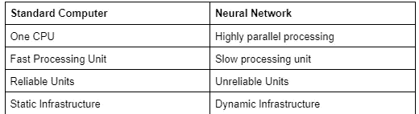
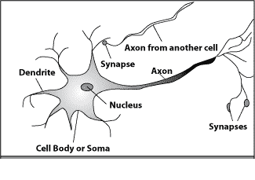
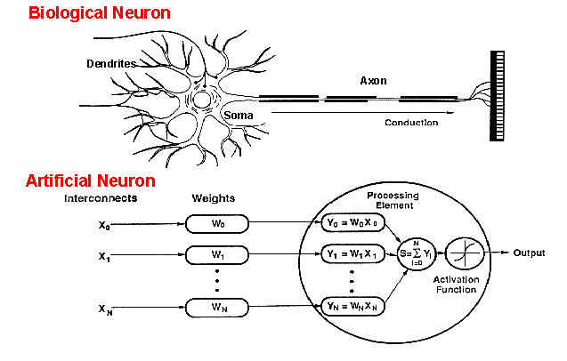
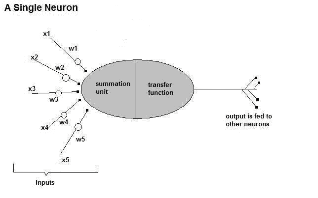
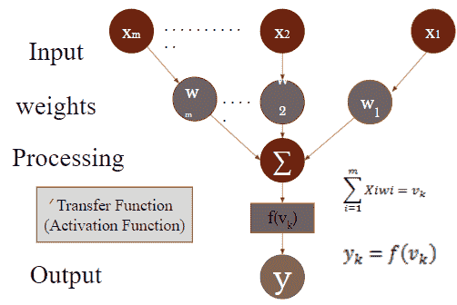
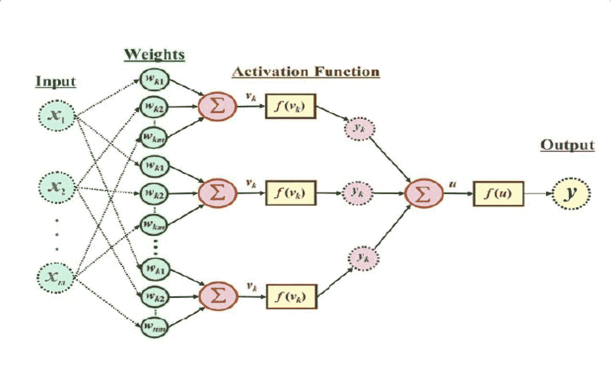

# 深度学习入门:1

> 原文：<https://blog.devgenius.io/getting-started-with-deep-learning-1-91ee5b0498c0?source=collection_archive---------20----------------------->

在本文中，我们将学习神经元&人工神经网络。

# 人工神经网络

这是一种通过构建软件来解决问题的技术，该软件使用大型人工神经元网络像人脑一样工作。它是一组简单的处理单元，通过大量加权连接相互发送信号进行通信。安包括:

*   ***细胞*** *—组加工单位*
*   ***输出*** *—每个单元的激活状态*
*   ***每个单元格之间的加权连接***
*   ****传播法则*** *—从一个单元的外部输入中确定其有效输入**
*   ****激活功能*** *—根据有效输入和当前激活确定新的激活级别**
*   **一个* ***外部输入*** *为每个单元**
*   ****学习规则*** *—收集信息的方法**
*   ****环境*** *—系统必须运行的地方，提供输入信号和误差信号**

## *我们为什么需要安？*

*   ***技术** : *我们需要在字符识别或预测系统的未来状态时，需要大规模的并行和自适应处理**
*   ***生物** : *可以用来复制和模拟人脑。因此有助于理解自然决策。**

**

*标准计算机与神经网络的比较*

## *神经元结构*

*   **树突:输入**

**

*生物神经元的结构*

*   **单元体:处理器**
*   **突触:链接**
*   **轴突:输出**

## *我们的大脑是如何工作的？*

*神经元/节点/单元(神经网络的构建模块)接收来自其他神经元的输入，基于当前输入改变它们的内部状态(激活),并将一个输出信号发送给其他神经元(也可能是它的输入神经元:递归)。尖峰是用来传递信息的电脉冲。尖峰信号的频率和相位对信息进行编码。感受野是一个神经元从另一个神经元接收信息的区域。*

*   *神经元通过突触与 10K 神经元建立联系。当达到最佳输入量时，它超过了临界水平，神经元释放一个尖峰:一个电脉冲穿过身体，沿着轴突，到达下一个神经元，并通过树突传递给下一个神经元。*
*   *神经递质是从第一个神经元释放出来并与第二个神经元结合的化学物质。它们被用来将电信号从一个神经元传递到下一个神经元。链接被称为突触。信号的强度取决于多种因素，如:神经递质的数量，*

**

## *安是如何工作的？*

*人工神经元是对人类神经元的模仿*

******

*多个神经元一起工作*

*通过适当选择网络拓扑和权值，人工神经网络可以计算任何可计算的函数。他们从经验中学习。*