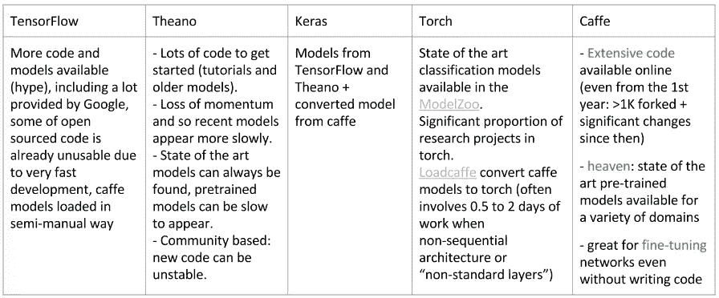
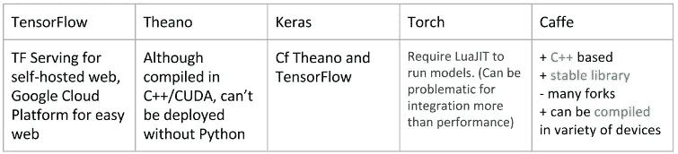

# 深度学习入门:3

> 原文：<https://blog.devgenius.io/getting-started-with-deep-learning-3-c5cffe10eb94?source=collection_archive---------10----------------------->

在这里，我们将讨论深度学习框架

## 1.Tensorflow:谷歌大脑，2015

张量(数据结构)+流(运算/变换)= Tensorflow。张量可以是任何数据数组。

张量流架构

Tensorflow 提供了从预处理到数据建模的各种 API(应用程序编程语言)。是用 Python，C++和 CUDA 写的。几乎可以在所有平台上运行——Linux、Windows、macOS、iOS 和 Android。针对 Android 和 iOS，Tensorflow 提供了 TensorflowLite 版本。对于部署，Tensorflow 有强大的集群支持。Tensorflow 可以与 CPU、GPU 和 TPU 一起使用。Tensorflow 在其官方网站上有包含所有模块的优秀文档。Tensorflow 2.0 最新版本经历了重大改进。

Tensorflow API 在 Python 中被广泛使用，完全处于稳定版本之下。其他语言 API 正在开发中，没有稳定的版本；他们使用它没有 API 向后兼容——c++、Javascript、Java、Go。一些语言甚至把它作为第三方包——Haskell，C#，R，Julia，Scala，Ruby，MATLAB。

## 计算图形

在 TensorFlow 中，机器学习算法被表示为计算图。计算图是一种有向图，其中**节点描述操作，**边表示在这些操作之间流动的数据(张量)。

以下是使用计算图的一些优势:

*   **依赖驱动调度:**即数据依赖，指定执行的顺序。相互不依赖的操作可以并行调度。
*   **图优化:**如*公共子图消除*。
*   **自动微分:**用图形来描述我们的计算可以让我们很容易地计算梯度。如果我们知道每一个运算的输出相对于它的直接输入的梯度，链式法则为我们提供了任何张量相对于任何其他张量的梯度。这个过程被称为**反向模式自动微分**，它允许在一次扫描中计算图中一个节点相对于所有其他节点的梯度。

**应用***Google Teachable Machine(无代码 ML 训练平台)、RankBrain(SEO)、Deep Speech(语音翻译)、Nsynth(用于制作音乐)、优步、Delivery Hero、Ruangguru、Hepsiburada、9GAG、Channel.io.*

## 2.蒙特利尔学习算法研究所

是用 Python 和 CUDA 写的。该算法用于多维数组的优化。Theano 提供了更快的计算速度。Theano 建在 Numpy 上面。它被设计用于执行神经网络的高维数值计算。它可以在 Linux、Windows 和 macOS 等操作系统上运行。它在 GPU 驱动的系统上表现更好。它率先使用了卷积图。

API — Python

## Theano 的灵活性

*   自动微分。
*   千层面的构思非常好，在尝试新事物时节省了大量代码，同时又不影响灵活性。
*   大多数新想法可以通过对现有“层”的简单修改而快速实现。

## Theano 中的问题

*   大型模型的编译时间可能是一个巨大的痛苦。
*   错误信息可能很隐晦，而且会突然出现在某个地方。

## 解决方案:

*   使用简化的模型(批量为 1，每层单位更少，层数更少)。
*   编写带有防御检查和单元测试的模块化代码
*   提供了一些调试工具
*   没有指纹

**应用:** *WellsFargo，SparkCognition，Data Economy，诺斯罗普·格鲁曼，HOPE Technik Pte LTD*

## 3.克拉斯:弗朗西斯·乔莱

跨平台神经网络库是用 Python 写的。Keras 是构建在 Tensorflow 和 Theano 之上的高级 API。Keras 是 Kaggle 中使用最多的深度学习框架。Keras 最好运行在 GPU 和 TPU 上。Keras 模型可以轻松部署到 web、iOS 和 Android 上。Keras 以其快速计算、用户友好、易于访问、模块化、极简主义、可扩展性和 Python 原生性而闻名。Keras 有一个活跃的社区，因此处于不断发展之中。它获得了谷歌的官方支持。

## 克拉斯弱点

1.  不太灵活
2.  没有 RBM 的例子%工作

API — Python

应用——由科学组织使用，如 NASA、CERN、NIH 和 LHC、洛克希德·马丁、福特汽车公司

## 4.PyTorch:脸书人工智能研究实验室

它是另一个广泛使用的深度学习框架，主要是因为它的 Python 接口。PyTorch 是建立在 Torch 库之上的。PyTorch 与 Tensorflow 有相似之处，因此与其存在重大竞争。PyTorch 主要用于研究和生产部署目的。兼容 Linux、Windows、macOS、Android 和 iOS。使用 TorchServe，PyTorch 可以更快的速度和方便的访问部署模型。TorchScript 提供了图形模式功能转换的灵活性。分布式培训允许 PyTorch 提供模型优化。计算机视觉和 NLP 强化学习技术的活跃开发社区。PyTorch 的一些里程碑-拥抱脸变压器，PyTorch 照明，特斯拉自动驾驶仪，优步烟火，催化剂。

## 火炬的优势

1.  灵活性:易于扩展(由于易于与 C 集成)。势在必行。它最常用于通过 GPU 实现来编写新层。
2.  可读性:中级代码和高级代码都在 Lua 中
3.  模块化:很容易提取某人的代码并使用 luarocks 安装所需的包
4.  速度
5.  非常方便研究

## 火炬的弱点

1.  项目比例尚可，但低于咖啡
2.  LuaJIT 不是主流，确实会导致集成问题
3.  人们讨厌 Lua

API——主要用于 Python，但也有一个 C++接口。

应用—英伟达、苹果、罗宾汉、Lyft、福特汽车公司

## 5.咖啡:加州大学伯克利分校

Caffe 支持图像分割和分类的各种架构。Caffe 是用 C++写的。兼容 Linux，Windows，macOS。在 CPU 上工作，但 GPU 加速性能更好。Caffe 因其速度和行业部署而成为首选。使用 NVIDIA GPU 可以处理多达 6000 万张图像。有适当的文档和活跃的开发人员社区来支持创业和研究工作的原型。用于 ML、视觉、语音、多媒体；它不适用于文本、声音或时间序列数据等应用程序。适用于前馈网络和图像处理。

**缺点:**没有自动分化。例子，实现和源代码模板的需要。

API — Python 和 Matlab

应用— CaffeOnSpark(雅虎的一个项目，集成了 Apache Spark)、Caffe2(脸书)、Snap Inc .、Cadence Design Systems、高通

# 比较

代码+模型

性能比较

模型部署

额外功能

## 何时选择哪个框架..？

1.**你是 DL 本身的博士生** : TensorFlow，Theano，Torch
2。**你想用 DL 只得到特性** : Keras，Caffe
3。**你从事的行业** : TensorFlow，Caffe
4。你开始了为期两个月的实习。你想给你的学生练习作业。**你对深度学习很好奇** : Caffe
7。你甚至不知道 python : Keras，Torch