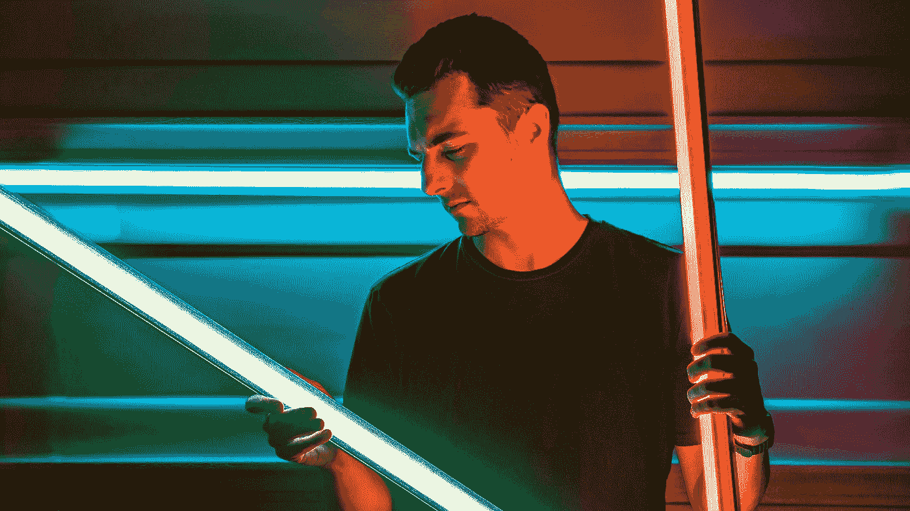

# 开始使用 Quasar 库开发 Vue 应用程序

> 原文：<https://blog.devgenius.io/getting-started-with-developing-vue-apps-with-the-quasar-library-2331f5c901d?source=collection_archive---------5----------------------->



泰勒·凯西在 [Unsplash](https://unsplash.com?utm_source=medium&utm_medium=referral) 上的照片

Quasar 是一个流行的 Vue UI 库，用于开发好看的 Vue 应用程序。

在本文中，我们将了解如何使用 Quasar UI 库创建 Vue 应用程序。

# 入门指南

最简单的开始方式是从框架的 UMD 版本开始。

我们可以只用一个脚本标签来使用它。

为此，我们写道:

```
<!DOCTYPE html>
<html>
  <head>
    <link
      href="https://fonts.googleapis.com/css?family=Roboto:100,300,400,500,700,900|Material+Icons"
      rel="stylesheet"
      type="text/css"
    />
    <link
      href="https://cdn.jsdelivr.net/npm/quasar@1.12.13/dist/quasar.min.css"
      rel="stylesheet"
      type="text/css"
    />
  </head> <body>
    <script src="https://cdn.jsdelivr.net/npm/vue@^2.0.0/dist/vue.min.js"></script>
    <script src="https://cdn.jsdelivr.net/npm/quasar@1.12.13/dist/quasar.umd.min.js"></script> <script>
      new Vue({
        el: "#q-app",
        data() {
          return {};
        },
        methods: {}
      });
    </script>
  </body>
</html>
```

创建一个空的 Quasar 应用程序。

我们在`head`标签中添加了 Google 字体和 Quasar 的 CSS。

然后我们在`body`中加入 Vue 和类星体。

第三个`script`标签是 Vue 应用实例。

# 颜色；色彩；色调

类星体自带颜色。

例如，我们可以写:

```
<!DOCTYPE html>
<html>
  <head>
    <link
      href="https://fonts.googleapis.com/css?family=Roboto:100,300,400,500,700,900|Material+Icons"
      rel="stylesheet"
      type="text/css"
    />
    <link
      href="https://cdn.jsdelivr.net/npm/quasar@1.12.13/dist/quasar.min.css"
      rel="stylesheet"
      type="text/css"
    />
  </head> <body>
    <script src="https://cdn.jsdelivr.net/npm/vue@^2.0.0/dist/vue.min.js"></script>
    <script src="https://cdn.jsdelivr.net/npm/quasar@1.12.13/dist/quasar.umd.min.js"></script>
    <div id="q-app">
      <q-btn color="red">button</q-btn>
    </div> <script>
      new Vue({
        el: "#q-app",
        data() {
          return {};
        },
        methods: {}
      });
    </script>
  </body>
</html>
```

我们将`color`道具设置为`red`的`q-btn`添加到背景色为红色。

它有许多其他颜色。

# 间隔

类星体有间距助手类。

例如，我们可以写:

```
<!DOCTYPE html>
<html>
  <head>
    <link
      href="https://fonts.googleapis.com/css?family=Roboto:100,300,400,500,700,900|Material+Icons"
      rel="stylesheet"
      type="text/css"
    />
    <link
      href="https://cdn.jsdelivr.net/npm/quasar@1.12.13/dist/quasar.min.css"
      rel="stylesheet"
      type="text/css"
    />
  </head> <body class="body--dark">
    <script src="https://cdn.jsdelivr.net/npm/vue@^2.0.0/dist/vue.min.js"></script>
    <script src="https://cdn.jsdelivr.net/npm/quasar@1.12.13/dist/quasar.umd.min.js"></script>
    <div id="q-app">
      <q-card class="q-mt-md q-mr-sm">hello world</q-card>
    </div> <script>
      new Vue({
        el: "#q-app",
        data() {
          return {};
        },
        methods: {}
      });
    </script>
  </body>
</html>
```

`q-mt-md`和`q-mr-sm`分别是添加上边距和右边距的类。

`md`是中等屏幕尺寸，`sm`是小屏幕断点。

# CSS 阴影

我们可以用提供的类对组件应用阴影。

例如，我们可以写:

```
<!DOCTYPE html>
<html>
  <head>
    <link
      href="https://fonts.googleapis.com/css?family=Roboto:100,300,400,500,700,900|Material+Icons"
      rel="stylesheet"
      type="text/css"
    />
    <link
      href="https://cdn.jsdelivr.net/npm/quasar@1.12.13/dist/quasar.min.css"
      rel="stylesheet"
      type="text/css"
    />
  </head> <body class="body--dark">
    <script src="https://cdn.jsdelivr.net/npm/vue@^2.0.0/dist/vue.min.js"></script>
    <script src="https://cdn.jsdelivr.net/npm/quasar@1.12.13/dist/quasar.umd.min.js"></script>
    <div id="q-app">
      <q-card class="shadow-2">hello world</q-card>
    </div> <script>
      new Vue({
        el: "#q-app",
        data() {
          return {};
        },
        methods: {}
      });
    </script>
  </body>
</html>
```

我们设置`shadow-2`类在卡片周围添加深度为 2 的阴影。

其他类别包括:

*   `no-shadow` —去除任何阴影
*   `inset-shadow` —设置嵌入阴影
*   `shadow-N` —其中`N`是从 1 到 24 的整数。
*   `shadow-transition` —在阴影上应用 CSS 过渡

我们也可以让阴影朝上:

*   `shadow-up-1` —设置深度为 1
*   `shadow-up-2` —设置深度为 2
*   `shadow-up-N` —其中`N`是从 1 到 24 的整数。

他们将在组件顶部应用阴影。

# 结论

我们可以从 UMD 模块开始使用 Quasar，它可以包含在一个脚本标签中。