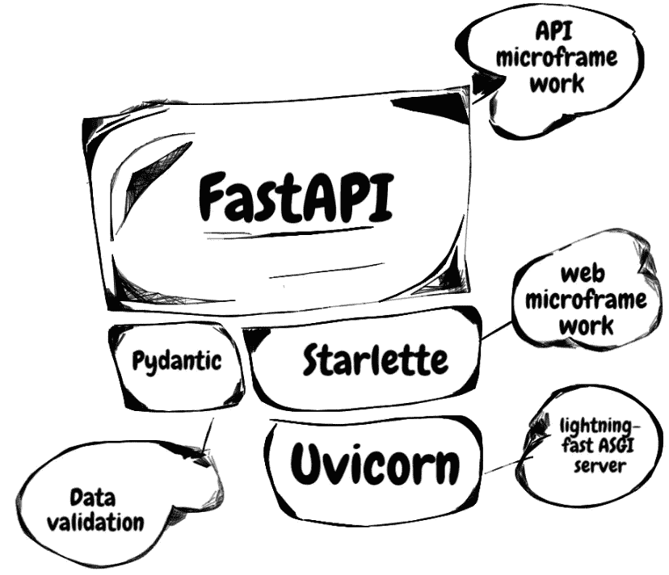

# 快速 API 入门

> 原文：<https://blog.devgenius.io/getting-started-with-fast-api-c7e52e68685f?source=collection_archive---------5----------------------->


FastAPI 是一个现代化的快速 web 框架，用于使用 Python 构建 API。这个 Python web 框架最近很受欢迎。FAST API 中的软件开发类似于 Flask，这是大多数用 Python 开始 web 开发的人的默认选项。Fast API 易于使用，其文档简单易懂。顾名思义，FastAPI 速度快；与 Go 和 NodeJs 并驾齐驱；多亏了 Starlette 和 Pydantic，FastAPI 框架才得以建立。FastAPI 比 Flask web framework 更快，因为它是建立在 ASGI(异步服务器网关接口)上，而不是 Flask 使用的 SGI (Web 服务器网关接口)。简单地说，当使用 ASGI 时，不同的请求在完成它们的任务之前不必等待另一个请求。各种请求可以不按特定顺序处理。而在 WSGI 中，请求只被顺序处理。

# FAST API 的功能



除了 FastAPI 真的很快这一事实之外，FAST API 中还有一些值得注意的特性，其中一些是；

*   **自动文档** : FastAPI 提供交互式 API 文档和 exploration web 用户界面。这些接口基于 OpenAPI 框架，有多个选项，其中默认为 SwaggerUI 和 ReDoc。
*   **验证** : FastAPI 为大多数 python 数据类型和其他数据类型(如 UUID、电子邮件等)提供验证，因为它利用 Pydantic 进行验证。
*   **安全和认证** : FastAPI 附带了 OpenAPI 中定义的所有安全方案，以及 Starlette 中的安全特性(包括会话 cookies)。
*   依赖注入:你可能听说过坚实的原则；FAST API 通过强大的依赖注入系统认真对待坚实原则中的“D”。依赖注入由系统自动处理，这使得编写干净的代码成为可能，并减少了整个系统中的耦合。

# FAST API 的使用

为了深入了解如何使用 FAST API 构建应用程序，我们将构建一个最小的应用程序来展示 FAST API 如何工作以及如何在 FAST API 中构建项目。随着我们的继续，假设您对 python 有很好的了解。

# 装置

首先，我们必须使用 pip python 包管理器或诗歌安装快速 API。

使用 pip，我们运行下面的命令`pip install fast-api`

使用诗歌后，我们可以运行`poetry add fast-api` ***我们必须使用*** `***poetry init***` ***初始化诗歌。我们将在另一篇文章中讨论更多关于诗歌的内容，以及诗歌如何用于依赖性管理。***

如前所述，FAST API 构建在 ASGI 之上；因此，我们需要安装一个 ASGI 服务器。对于本教程，我们将安装 uvicorn。我们可以使用`poetry add uvicorn`或`pip install uvicorn`来安装它。在安装 FAST API 时，会安装其他包，如 pydantic 和 Starlette。

# 构建迷你应用程序

成功安装了上面的包之后，我们就可以开始构建我们最小的快速 API 应用程序了。这个应用程序将是一个待办事项列表，我们应该能够创建，更新和删除待办事项。

首先，我们创建一个名为`**main.py**` **，**的文件，作为应用程序的入口点。

```
"""Entry point to the application"""
import uvicorn
from fastapi import FastAPI
from fastapi.middleware.cors import CORSMiddlewaredef start_application():
    """Setting up necessary stuff during application start up"""
    app = FastAPI(title="Test Project", version="1.0")
    origins = [
        '<http://localhost>',
        '<http://localhost:8080>'
    ] app.add_middleware(
        CORSMiddleware,
        allow_origins=origins,
        allow_credentials=True,
        allow_methods=['*'],
        allow_headers=['*'],
    ) return appapp = start_application()if __name__ == '__main__':
    uvicorn.run("main:app", host="0.0.0.0", port=8000, reload=True)
```

函数`start_application`设置了我们应用程序所需的所有重要实体，比如添加路由器(我们稍后会看到)、设置 CORS 等等。我们在`start_application`中添加了 CORSMiddleware，这样我们就可以进行跨来源请求；这些请求来自不同的 IP 地址、不同的协议、端口等。FAST API 还让您能够添加定制的中间件。

在上面代码片段的最后一部分，我们使用 uvicorn ASGI 服务器运行应用程序，指定端口号和主机等。注意，`***main:app***`指向应用程序在`main.py`中初始化的位置，由于`main.py`在根文件夹中，我们简单地将其写成

`***main:app***` ***。***

要启动应用程序，可以运行`python3 main.py`，服务器在端口`8000`上运行，如最后一行代码中所定义的。运行`[http://localhost:8000](http://localhost:8000/)`应显示

`{"detail": "Not Found"}`。您可以使用`[http://localhost:8000/docs](http://localhost:8000/docs)`访问 swagger 文档 UI，使用`[http://localhost:8000/redoc](http://localhost:8000/redoc)`访问 redoc UI

# 创建 API

创建一个 API 文件夹，创建一个 todo 文件夹并创建`[todo.py](http://todo.py/)`文件。在这个文件中，我们会有下面这段代码。

```
"""Todo Endpoints"""
import uuid
from typing import Dictfrom fastapi import APIRouter, status, HTTPException
from api.todo.schemas import Todo, TodoResponserouter = APIRouter(
    tags=['todo'],
    prefix='/v1/todo',
    responses={404: {'description': 'Not found'}},
)todo_db: Dict = {}
```

在上面的代码片段中，我们为 todo API 创建了一个路由器。我们还创建了一个内存数据库来存储我们的 todo，主要用于我们的 todo 的 CRUD(创建、更新和删除)功能。

同样需要注意的是，虽然在本教程中我们没有连接到数据库，但是我们可以使用 Sqlalchemy、Pymongo 等库将任何数据库连接到我们的应用程序。

您会注意到有些模式是在 todo 文件中导入的；在没有这些模式的情况下运行代码会导致错误。因此，我们在 todos 文件夹中创建了`[schemas.py](<http://schemas.py>)`文件。模式由我们在创建 API 时用于数据验证的 Pydantic 模型组成。模式详细信息如下所示。

```
from pydantic import BaseModel, Fieldclass Todo(BaseModel):
    name: str = Field(..., description='Name of the todo')
    complete: bool = Field(False, description='Checks if the todo has finished')
    creator_name: str = Field(..., max_length=20, description='Name of the creator')class TodoResponse(Todo):
    id: str = Field(..., description='Unique identifier of the todo')
```

每个字段中的描述使 FAST API 能够开发详细的文档。creator_name 的最大长度为 20 个字符；如果数字超过 20 个字符，Pydantic 将抛出一个验证错误异常。有了定义良好的 Pydantic 模型，我们就可以得到正确的数据。建议浏览一下 [Pydantic 文档](https://pydantic-docs.helpmanual.io/),因为使用 Pydantic 可以做更多令人兴奋的事情。

让我们开始创建一些 API。

```
@router.post(
	'/', 
	description='Create a new todo', 
	response_model=TodoResponse, 
	status_code=status.HTTP_200_OK
)
async def create_todo(data: Todo):
    new_data = data.dict()
    unique_id = str(uuid.uuid4())
    new_data['id'] = unique_id
    todo_db[unique_id] = new_data return TodoResponse(**new_data)@router.get(
	'/{todo_id}', 
	description='Get a todo', 
	response_model=TodoResponse, 
	status_code=status.HTTP_200_OK
)
async def get_a_todo(todo_id: str) -> Todo:
    todo = todo_db.get(todo_id)
    if not todo:
        raise HTTPException(
						status_code=status.HTTP_404_NOT_FOUND, detail='Todo not found') return Todo.parse_obj(todo)
```

我们用之前创建的路由器来修饰函数`create_todo`和`get_a_todo`，并使用 POST HTTP 动词来创建一个带有默认路由`'/'`的新 todo。函数`create_todo`接受一个 Todo 类型的参数数据(我们创建的 pydantic 模式)；这样，Pydantic 可以根据模式定义验证数据。在`create_todo`函数的最后一行中，我们将刚刚创建的新 todo 传递给根据 ***模式呈现数据的 to dore response***。

为了获得一个 todo，路由改变以适应我们想要获得的 todo_id。因此，我们在 URL 中传递 todo_id，并将 todo_id 作为参数添加到`get_a_todo`函数中。

我们已经有了一个简单的 API 功能，所以我们可以将路由器添加到我们最初创建的`**main.py**`文件中的`start_application`函数中。

```
from api.todo import tododef start_application():
    """Setting up necessary stuff during application start up"""
    app = FastAPI(title="Test Project", version="1.0")
    origins = [
        '<http://localhost>',
        '<http://localhost:8080>'
    ] app.add_middleware(
        CORSMiddleware,
        allow_origins=origins,
        allow_credentials=True,
        allow_methods=['*'],
        allow_headers=['*'],
    ) app.include_router(todo.router) return app
```

在上面代码片段的开始，我们从 API 文件夹导入 todo 来访问文件和路由器中的所有函数，这在本例中很重要。我们通过调用应用程序上的`include_router`函数并将 todo 路由器作为参数传递，将我们的路由器包含在`start_application`函数中。

通过以上更改，我们可以运行我们的应用程序并导航到 swagger UI 文档来运行代码并使用该接口测试 API。您也可以根据需要决定添加更多端点。

上面的教程是理解 FAST API 的一个非常简单的方法；这仅仅触及了使用 FAST API 可以构建的应用程序的表面。FAST API 是一个非常简单但功能强大且灵活的框架，可用于构建大规模应用程序。

# 异步/等待


在上面的教程中，你一定见过教程中 **async** 在定义各种路由的函数时的用法。现代 python 应用程序支持异步代码，即使用 async/await。

异步代码意味着告诉计算机，在代码执行的某个时刻，它必须等待“其他事情”完成。在“其他事情”完成的过程中，代码可以继续执行代码的其他部分，同时等待结果。

大多数时候，异步代码等待的进程通常是 I/O 操作，例如，通过网络从客户端发送的数据、返回结果的数据库查询等等。

# 结论

虽然我们已经开发了一个非常简单的应用程序来演示如何使用 FAST API 构建 API，但是您还可以使用 FAST API 构建许多其他令人兴奋的东西。本文应该已经为您提供了一些关于在应用程序中使用 FAST API 的基本知识。