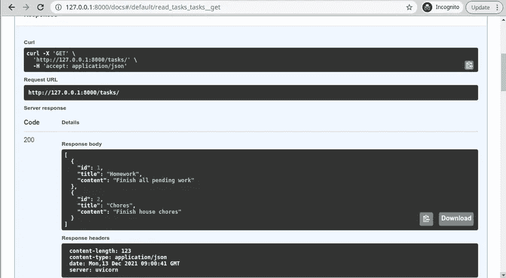

# 快速 API 框架入门

> 原文：<https://blog.devgenius.io/getting-started-with-fastapi-framework-60a045a44e7b?source=collection_archive---------8----------------------->

构建高性能应用的第一步


照片由[思想目录](https://unsplash.com/@thoughtcatalog?utm_source=unsplash&utm_medium=referral&utm_content=creditCopyText)在 [Unsplash](https://unsplash.com/s/photos/performance-computer?utm_source=unsplash&utm_medium=referral&utm_content=creditCopyText) 上拍摄

FastAPI 是开发 python 应用程序最快的框架之一。它也很容易学习和快速编码。FastAPI 的一些优势包括:

主要特点是:

*   **Fast** : Fast API 是最快的 Python 框架之一，这要归功于 Starlette 和 Pydantic
*   **代码快**和**bug 少**:
*   **简单**和**直观** — FastAPI 旨在易于使用和学习。它还拥有最好的编辑器支持
*   **健壮的** : FastAPI 被设计用来生成生产就绪的代码。
*   **基于标准的** : FastAPI 完全兼容 API 的开放标准，比如 [OpenAPI](https://github.com/OAI/OpenAPI-Specification) 和 [JSON Schema](https://json-schema.org/) 。

# 我们将建造什么。

首先，我们将构建一个应用程序，您可以在其中添加和检索数据。

# 装置

要安装 FastAPI，发出以下命令；

```
pip install fastapi
```

# 使用 FastAPI 创建您的第一个应用程序。

创建一个文件`main.py`并将下面的代码添加到您选择的目录中。

```
from fastapi import FastAPIapp = FastAPI()@app.get('/')def main(): return({"message":"Welcome to FastAPI"})
```

在第 1 行，我们导入 FastAPI。在第 2 行，我们创建了一个 FastAPI 应用程序实例。
`@app.get()` 是指定 GET 方法的路径操作。在路径中，我们定义了一个返回字典的 main 方法。

# 运行应用程序

FastAPI 自带 uvicorn 用于运行 FastAPI 应用程序的快如闪电的 ASGI 服务器。用 pip 安装 uvicorn。

```
pip install uvicorn
```

要运行该应用程序，发出以下命令，

```
uvicorn main:app --reload
```

您应该会看到以下响应。

```
uvicorn main:app --reload
INFO:     Will watch for changes in these directories: ['/home/vaatiesther/Desktop/MEDIUMPROJECTS/FASTAPI']
INFO:     Uvicorn running on [http://127.0.0.1:8000](http://127.0.0.1:8000) (Press CTRL+C to quit)
INFO:     Started reloader process [12575] using statreload
INFO:     Started server process [12577]
INFO:     Waiting for application startup.
INFO:     Application startup complete.
```

`main:`是指 app 所在的`main.py`文件。
`app:`是指 app 实例`app = FastAPI()`。
`--reload:` —这是可选的，每次我们更改代码时都会重启服务器。这样做只是为了发展

# 交互式 API 文档

现在导航到您的浏览器 http://127.0.0.1:8000/docs ，您应该会看到由 [Swagger UI](https://github.com/swagger-api/swagger-ui) 提供的交互式 API 文档。


# 路径参数

让我们创建另一个在路径中包含参数的端点。

```
@app.get("/items/{item_id}")def read_item(item_id: int, message: str = 'Hello'): return {"item_id": item_id, "message": message}
```

# FastAPI 中的异步

还可以在 FastApi 中创建异步方法，如下所示。如果您有一个与外部 API 通信的应用程序，则使用异步。

```
@app.get("/")async def home(): return {"message": "Welcome to FastAPI"}
```

# 用 FastAPI 构建 API

正如我们之前在教程中提到的，我们将设计一个微型任务 API，它将包含以下字段:

*   身份证明（identification）
*   标题
*   内容

创建项目目录。

```
mkdir fastapi_blog
cd fastapi_blog
```

创建并激活虚拟环境。

```
python3.8 -m venv env
source env/bin/activate
```

创建一个 app.py 文件，导入 FastAPI 并在该文件中创建一个 app 实例。

```
from fastapi import FastAPIapp = FastAPI()
```

# 数据库配置

我们将使用关系数据库 SQLite 和 [encode/databases](https://github.com/encode/databases) 来执行我们的查询，databases 是一个为一系列关系数据库提供异步支持的包，例如

*   PostgreSQL，
*   MySQL，以及
*   SQLite。

[](https://betterprogramming.pub/design-your-own-login-and-registration-system-in-django-b34a2fa8334d) [## 在 Django 中设计自己的登录和注册系统

### 更好地了解 Django 认证

better 编程. pub](https://betterprogramming.pub/design-your-own-login-and-registration-system-in-django-b34a2fa8334d) 

为了执行 CRUD 操作查询，我们将使用数据库包。要安装用于 PostgreSQL 的数据库，发出以下命令:

```
pip install databases[sqlite]
```

在`app.py`中，导入数据库并创建一个`database`对象。

```
import databases
database = databases.Database(DATABASE_URL)
```

接下来，从 SQLAlchemy 导入元数据包并创建元数据对象

```
from sqlalchemy import metadata
metadata = sqlalchemy.MetaData()
```

然后使用元数据对象创建具有以下字段的表任务:

*   身份证明（identification）
*   标题
*   描述

```
from sqlalchemy import MetaData,create_engine, Table, Column,Integer,Stringtasks = Table( "tasks", metadata,Column("id", Integer, primary_key=True),Column("title", String),Column("content", String),)
```

创造一个`engine`。

```
from sqlalchemy import MetaData,create_engine,engine = sqlalchemy.create_engine(
    DATABASE_URL, connect_args={"check_same_thread": False}
)
```

要在数据库中创建实际的表，使用`.create_all`命令，并将引擎作为参数传递。这将从`metadata`对象创建表格。

```
 metadata.create_all(engine)
```

# Pydantic 模型

FastAPI 使用 [Pydantic](https://pydantic-docs.helpmanual.io/) 包来创建模型。Pydantic 是一个快速、可扩展的数据验证和管理系统，它强制执行运行时类型提示。此外，当数据无效时，它提供用户友好的错误。

第一件事是在文件的顶部添加必要的导入。

```
 from typing import List, Optional
from pydantic import BaseModel
```

然后创建两个继承自`BaseModel`类的模型类

`TaskCreate`类将用于插入数据，而`Task`类将向数据库中插入记录。

*   id——许多数据库中的标准唯一键，它被定义为 int
*   任务的标题，用 str 定义
*   描述——任务条目的描述，它是用 str 定义的

# 终点后

POST 端点将使用 POST 方法向数据库添加任务条目。

这里我们创建路由任务，并创建一个函数`create_task`来获取任务标题和内容，然后我们使用 insert 方法插入任务。创建条目后，我们使用`database.fetch_all`将查询作为字典返回。


# 获取端点

GET 端点检索数据库中的所有任务条目。

```
@app.get("/tasks/", response_model=List[Task])async def read_tasks(): query = tasks.select() return await database.fetch_all(query)
```



获取端点

# 结论

本教程介绍了如何开始使用 FastAPI 框架来创建高性能的应用程序。

*更多内容尽在*[*blog . dev genius . io*](http://blog.devgenius.io)*。*