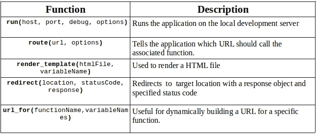
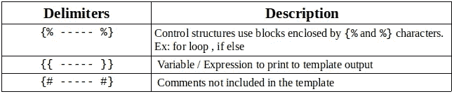
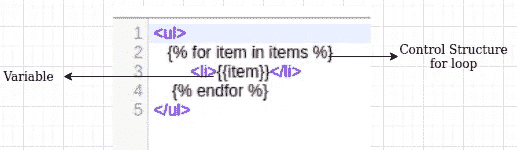
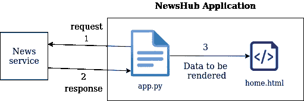
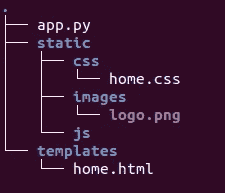
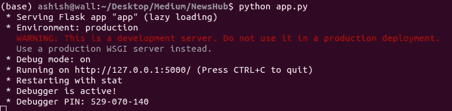
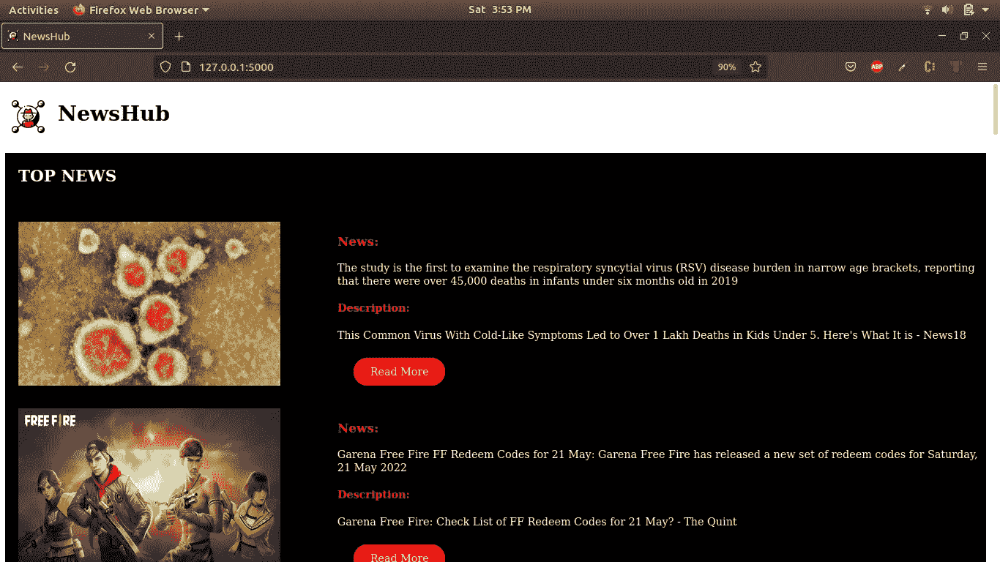

# Flask-Python 入门

> 原文：<https://blog.devgenius.io/getting-started-with-flask-python-cbdeca3dcfe?source=collection_archive---------0----------------------->


本文旨在概述 flask 的基础知识，并创建一个简单的 web 应用程序。

## 烧瓶是什么？

Flask 是一个微型 web 框架，它提供了构建和部署 web 应用程序的必要工具。模板是包含静态数据和动态数据占位符的文件。用特定数据呈现模板以产生最终文档。Flask 使用 [Jinja](https://jinja.palletsprojects.com/templates/) 模板库来渲染模板。

## 烧瓶功能



烧瓶功能

## 金贾分隔符

分隔符用于括住变量和定义过滤器表达式



金贾分隔符



例子

# 入门指南



新闻中心应用程序

我们将创建一个简单的新闻聚合器 web 应用程序。我们的应用程序的入口点 *app.py* 对外部服务进行 API 调用并处理响应。这个经过处理的响应被呈现在模板中(*home.html*)。

## 项目结构



项目结构

*   *app.py* —我们应用程序的入口点
*   *模板* —该文件夹仅包含模板，扩展名为`.html`。
*   *静态* —该文件夹包含模板使用的资产，包括 CSS 文件、JavaScript 文件和图像

**注意**:如果该文件夹结构与上述不完全相同，模板将无法工作。必须如上所示命名和组织**静态**和**模板**文件夹。*静态*文件夹可以包含多个文件夹和文件。文件的名称由您决定。

## 1.装置

*   安装库[烧瓶](https://flask.palletsprojects.com/en/2.1.x/installation/)
*   安装库 [newsapi](https://newsapi.org/docs/client-libraries/python) 并生成 api 密钥

## 2.密码

*   app.py

*   home.html

# 3.奔跑

*   打开终端并执行命令

```
python app.py
```



运行应用程序

*   打开任意浏览器，输入[http:://127 . 0 . 0 . 1:5000/](http://127.0.0.1:5000)



新闻中心

# 结论

在这个故事中，我们已经了解了 flask 的基本知识，并通过三个简单的步骤创建了一个简单的新闻聚合器 web 应用程序。希望你已经了解了烧瓶的基本知识。

感谢阅读！

[Github](https://github.com/ashish-mj/News_Hub) 网站 [Linkedin](https://www.linkedin.com/in/ashish-mj/)

## 烧瓶项目

*   [SnapLab](https://github.com/ashish-mj/SnapLab)
*   [AnA 互联网服务提供商](https://github.com/ashish-mj/AnA-Internet-service-provider)
*   [沙布德科什](https://github.com/ashish-mj/ShabdKosh)