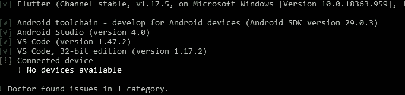
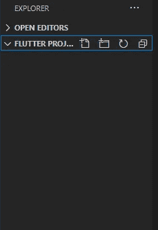
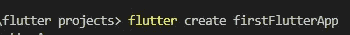
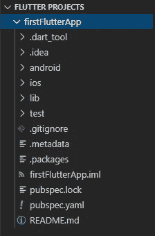
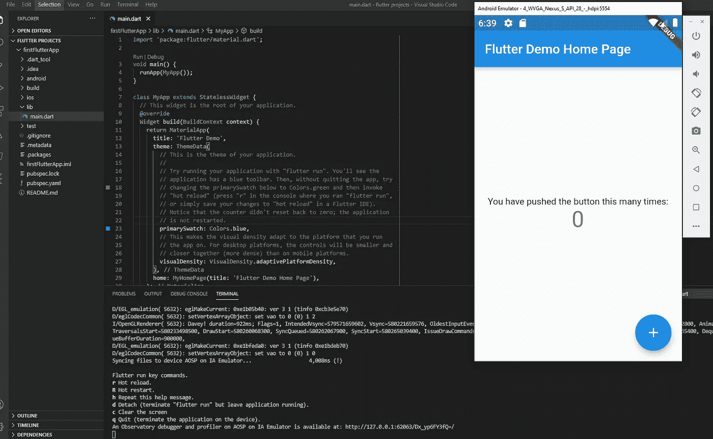

# 颤振开发入门—设置

> 原文：<https://blog.devgenius.io/getting-started-with-flutter-development-setup-afd5d5e197f0?source=collection_archive---------18----------------------->

马库斯·斯皮斯克在 [Unsplash](https://unsplash.com/) 上的照片

## ***所以，我猜你也和我一样开始学旋舞了吧？厉害！我期待着了解能够为 Android 和 iOS 开发一个代码库！***

# **背景**

> *只是简单的过一遍 Flutter 的背景…它是 Google 在 2017 年首先开发的开源 UI SDK 框架。它可以用于开发多种平台，包括 Windows，Mac，Linux，Android，iOS，Google Fuchsia 和 Web！Dart 是用于编写 Flutter 应用程序的编程语言。Flutter 使用了一个现代的反应框架来实现一个本地的 UX。*

# **逐步设置过程**

**注:本文将重点介绍使用* ***VS 代码*** *在****Windows****上使用一个* ***Android 模拟器*** *设置和运行 Flutter 演示项目。不会在 Android Studio、Xcode 中编写任何抖动代码，也不会使用 iOS 模拟器(因为我没有 Mac)。也就是说，我假设 Mac 上的设置与这里提供的非常相似。**

导航至:[https://flutter.dev/docs/get-started/install](https://flutter.dev/docs/get-started/install)并选择您的电脑正在运行的操作系统。

您可以按照各自操作系统的说明进行操作。我将在 Windows 上安装它，因此我将创建一个如何安装它的逐步过程:

*   通过上面的 flutter.dev 链接下载了 Flutter SDK
*   将其提取到(C:/src)，创建一个名为“src”的新文件夹
*   通过在开始菜单搜索框中键入“env”导航到“编辑系统环境变量”菜单
*   在“系统属性”菜单上，单击“环境变量”按钮
*   选择“路径”用户变量(如果你没有“路径”用户变量，你可以创建一个…虽然它应该已经在那里了)并点击“编辑”
*   应该会出现“编辑环境变量”窗口。点击“New ”,将解压 Flutter 下载文件的路径(如 C:/src/flutter/bin)包括目录添加到“bin”文件夹中
*   要检查系统现在识别颤振，导航到命令提示符并输入“颤振”…这应该显示一个颤振命令列表
*   如果你的颤振安装一切正常，在命令提示符下，键入“颤振医生”

> ***“颤振医生”检查所需的依赖关系以创建颤振应用***

# **颤振医生:检查清单**

*   **清单应包括以下信息:**
*   ***颤振、Android 工具链、Android Studio、VS 代码和连接设备***
*   *可能会出现一些警告或错误信息。如果是，浏览它们并相应地修复它们*
*   *警告/错误消息可能包括:[Android Studio] Flutter 插件未安装，Dart 插件未安装，[VS Code] Flutter 扩展未安装…*
*   在 ***Android Studio 错误*** 的情况下，很可能需要你去 Android Studio(假设你已经安装了)，点“SDK 管理器”→“插件”，搜索插件市场，安装 Flutter 和 Dart
*   在 ***Visual Studio 代码错误*** 的情况下，很可能需要你去 VS Code(假设你已经安装了)，去左边的“扩展”图标，搜索“Flutter”和“Dart”并安装这两个。Dart 在我安装 Flutter 扩展时自动安装。
*   不要担心 ***“连接设备”警告*** ，你可以在一分钟内设置一个仿真器，或者使用一个实际的设备。
*   重新运行“颤振医生”,检查问题是否已经解决

希望这就是您的命令提示符中显示的内容

如果您的命令提示符看起来像上面的图像，那么…

[马丁·w·柯斯特](https://unsplash.com/@nitram509)在 [Unsplash](https://unsplash.com/) 上的照片

(希望你没有被最后一部分的 then…弄糊涂，并且正在阅读这篇文章)。

# **VS 代码**

*   为您的 Flutter 项目创建一个新文件夹来存储。
*   转到 VS 代码，点击“文件”→“打开文件夹”，导航到你刚刚创建的文件夹，点击“选择文件夹”
*   您应该看到 VS 代码 UI 更新，文件夹的名称应该出现在 VS 代码的左窗格中

我创建了一个名为“颤动项目”的文件夹

*   现在，点击“终端”→“新建终端”，打开一个新的终端窗口。
*   您应该看到这出现在 VS 代码的中下部，列出了文件夹所在的目录。
*   这是比较酷的部分。要创建您的 flutter 应用程序，请键入命令:***flutter create { project _ name }***

我把我的项目命名为“firstFlutterApp”

该项目现在应该创建和显示如上(好东西！)

写你代码的地方在 ***main.dart*** 里面，位于“lib”下面。

> Dart 是用于编写 Flutter 应用程序的编程语言。如果你习惯于用一种使用面向对象编程范例的语言进行开发，你应该没问题。

# **运行你的颤振代码**

现在你有两个选择:

1.  使用实际的 Android/iOS 设备运行 Flutter 演示应用*
2.  使用 Android/iOS 模拟器运行 Flutter 演示应用程序

* **本文将介绍第二个选项**，使用 Android 模拟器运行 Flutter 演示应用程序。

**由于我使用的是 Windows 系统，无法访问 Mac 电脑，所以我无法使用 iOS 模拟器进行演示。这个过程应该与使用 Android 模拟器非常相似，但不是导航到 Android Studio，而是使用 Xcode 访问现有的 iOS 模拟器或设置一个新的模拟器。**

*   导航到 Android Studio，然后转到 AVD 管理器。
*   如果你还没有安装 Android 模拟器，点击“创建虚拟设备”按钮，按照步骤安装一个新的模拟器。
*   如果你已经配置了一个 Android 模拟器，点击“运行”图标启动它。
*   一旦你的 Android 模拟器启动，在 VS 代码中运行“ *flutter run* ”命令。

厉害！成功了！

# 如果你看到的和上面截图一样，恭喜你！您已经成功设置了 Flutter，现在可以开始使用 Flutter/Dart 开发跨平台应用程序了！

我在下面放了一张庆祝的图片，因为设置开发环境可能会出错，如果你已经到了这一步，为什么不找个方式庆祝一下呢！:)

# 如果你发现这篇文章有助于在你的电脑上设置 Flutter，请随时关注我的 Medium…为我们的成功鼓掌！非常感谢，下一篇文章再见。

尼古拉斯·天梭在 [Unsplash](https://unsplash.com/) 上拍摄的照片