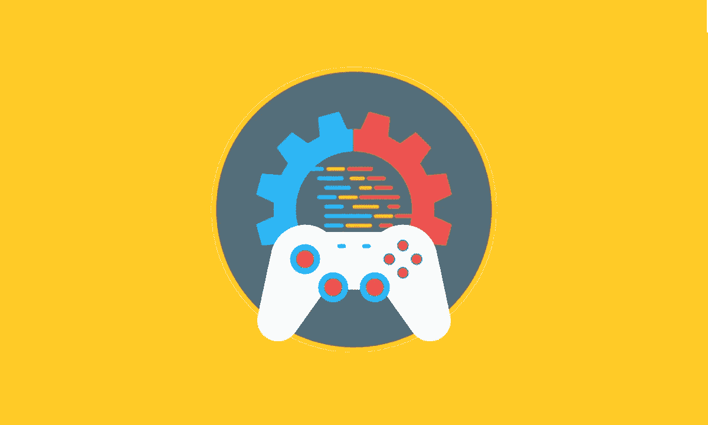

# 游戏开发入门

> 原文：<https://blog.devgenius.io/getting-started-with-game-development-23ba3846aa33?source=collection_archive---------24----------------------->

寻求进入游戏开发的世界又想不出从哪里入手？嗯，这是我写这篇博客前 6 个月的情况。我从小就对游戏着迷，真的很想进入游戏开发的世界。

在撰写本文时，我是一名大二学生，在印度最著名的工程学院之一攻读计算机科学和工程专业。

我做的第一个游戏是一个课程项目，包括制作一个扑克游戏。我用 Javascript 处理逻辑，用 HTML 和 CSS 处理视觉效果。这个游戏离我个人玩几天还很远，但它还不错，至少让我接触到了一些新的方法和技术。

在那之后，我开始进一步探索这个领域，并开始了解我在 [MDN](https://developer.mozilla.org/en-US/) 上读到的 HTML Canvas 和 phase rjs(Javascript 和 HTML 相关信息的一个非常好的来源)。

我对 Unity 的第一次体验来自 Coursera 的一门课程[游戏开发入门](https://www.coursera.org/learn/game-development)。课程很好，主要向我介绍了 Unity 编辑器以及如何使用资源和游戏对象。本课程根本没有涉及 C#，而是包含了只需拖放的预定义脚本。这门课没有满足我对真正编程的渴望。

为了探索 C#中的脚本，我去了 Unity Premium，看了一个视频教程系列 [Unity C#生存指南](https://learn.unity.com/course/unity-c-survival-guide)(由于疫情，它当时是免费的)。这个教程系列有点长，但是如果你以前有一些编程经验，你可以跳过最初的讲座，直接跳到新的或不熟悉的主题。

我做的第一个真正的游戏是一个俄罗斯方块游戏，这是我通过 Wilmer Lin 的 Udemy 课程完成的。课程很棒，老师会尽一切努力让你熟悉编码。这个课程的特色是 UI 部分，我花了一些时间来适应它。我一直对游戏开发的编程方面感兴趣，所以制作 UI 让我很容易疲倦。

在完成第一个游戏后感觉很好，我接着做了另一个由 Wilmer Lin 教授的课程。这个游戏是基于一个经典的棋盘游戏，“围棋”。这款游戏让我做了很多编程，不那么专注于 UI 部分(自然我更喜欢这款游戏)。这两个游戏都给了我很好的学习体验，现在我更愿意考虑游戏的技术方面。虽然这两个课程都需要一些 C#的基础知识，但我觉得即使有人是 Unity 的新手，只要有新的东西出现，这个人通过在这里或那里付出一些额外的努力就可以很容易地跟上。

如果有人问我，如果只能选一门，我会选哪门课，我会选“Go”。这个游戏需要更多的编程，使用相对较新的方法，玩起来也更有趣。

最后，我要感谢我的导师罗比·约翰，他总是激励我更加努力地工作，并指导我完成所有的工作。目前，我在超级游戏公司实习，开发一款免费的 PvP 游戏。

那都是我这边的。我祝你旅途顺利。

请留下您对这个博客的反馈(这是我第一次尝试写博客)。

感谢阅读！