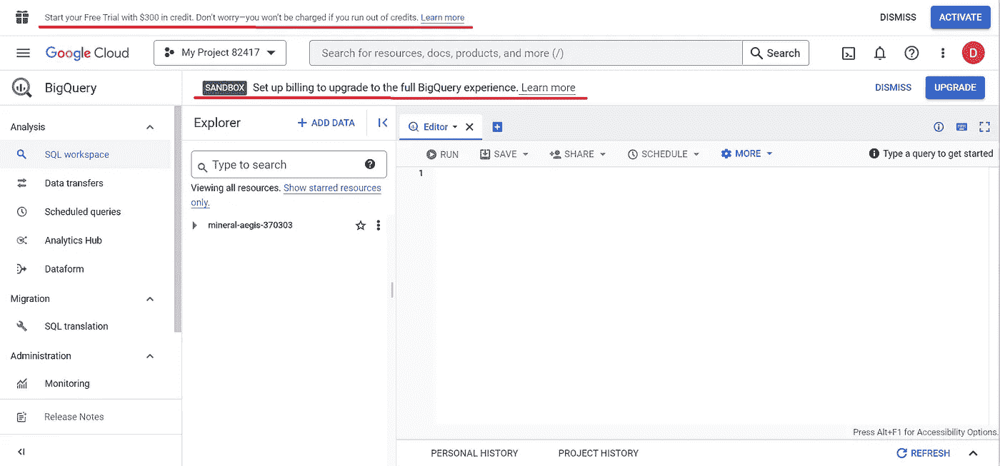

# Google BigQuery 入门

> 原文：<https://blog.devgenius.io/getting-started-with-google-bigquery-5e076e77d43c?source=collection_archive---------11----------------------->

# 介绍

Google BigQuery 是 Google 云平台用于分析的企业数据仓库。BigQuery 使您能够在几秒钟内查询大量数据。它是一个软件即服务(SaaS)应用程序，支持使用 SQL 进行查询，并拥有机器学习功能

Google BigQuery 入门

# 第一步

进入[谷歌云平台](https://console.cloud.google.com/bigquery)。使用您的 Google 帐户登录，如果您还没有，请创建一个。

如果这是您第一次访问，您需要选择您的国家并同意服务条款。

# 第二步

之后，点击左侧面板上的**大查询**。

# 第三步

这是您第一次访问 BigQuery 时的样子。

# 第四步

在 SQL 工作区点击**创建项目**。

# **第五步**

输入项目名称并选择您的位置。点击**创建。**

# 第六步

现在您在 BigQuery 中。

# 注意

有两个横幅可能引起了您的注意。

沙盒意味着你正在使用沙盒帐户。此选项每月授予您 10 GB 的活动存储和 1 TB 的已处理查询数据。

另一个横幅允许您激活免费试用。与沙盒帐户的不同之处在于，如果您激活试用，您需要输入您的账单详情。这是一个免费的试用帐户，前 12 个月有 300 美元的信用，此外每月还有 10 GB 的活动存储和 1 TB 的已处理查询数据。

您可以选择继续使用沙盒帐户或激活您的免费试用。

接下来，我们将使用 BigQuery 控制台[查询加密货币公共数据集。](https://medium.com/@vivbellavita/explore-cryptocurrency-public-datasets-with-bigquery-1d9562691580)

***感谢阅读！***

如果您喜欢这篇文章并想了解更多，请考虑关注我。我定期发布与链上分析、机器学习和 BigQuery 相关的主题。我尽量让我的文章简单而精确，尽可能提供代码、例子和模拟。