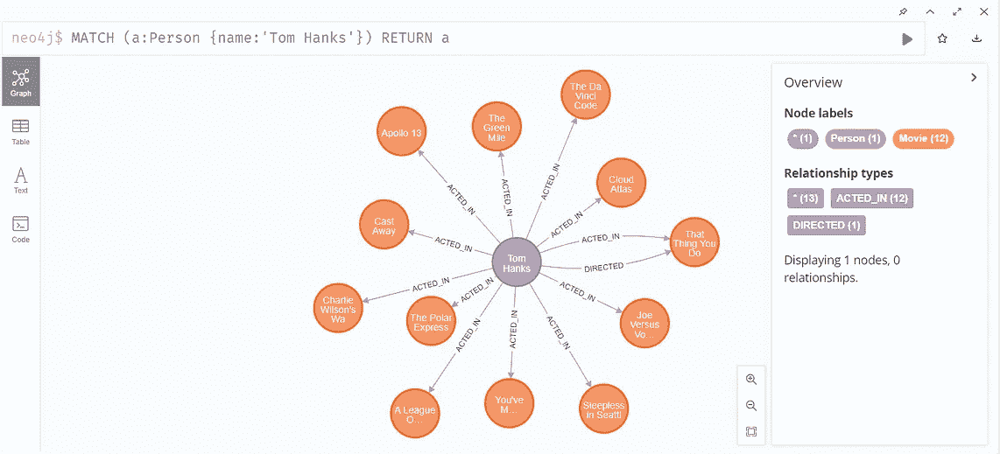
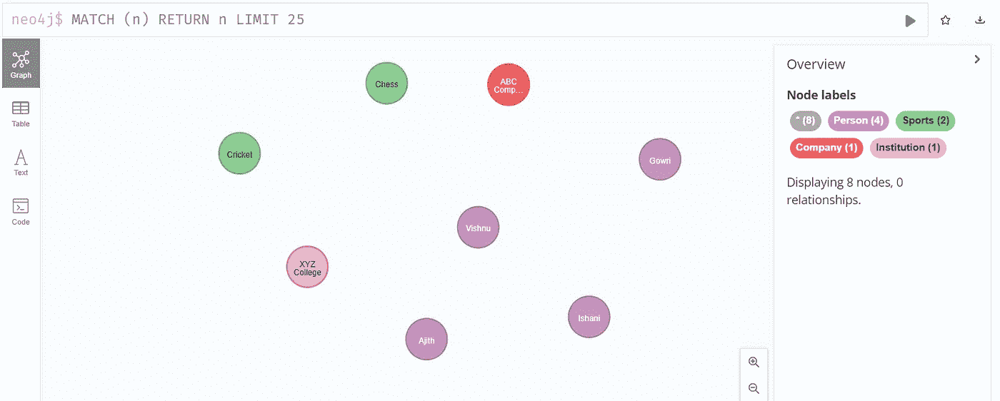

# 使用 Neo4j 开始使用图形数据库

> 原文：<https://blog.devgenius.io/getting-started-with-graph-database-using-neo4j-d549d74cc94b?source=collection_archive---------6----------------------->


图形数据库将信息存储为实体之间的关系，并使用节点和边来表示这些数据。它允许您轻松地存储数据并分析它们之间的关系。

Neo4j 是一个高度可伸缩的、无模式的图形数据库管理系统。它以图形的形式存储和显示数据，并使用节点、边和关系来表示数据。Neo4j 的一个主要特性是创建各种实体(节点)之间的互连。它提供了一种称为 Cypher (CQL)的声明式查询语言来查询数据。

在这节课中，我们将学习 Neo4j 的基础知识，并尝试一些基本的子句，如 CREATE、MATCH、WHERE、RETURN、SET、DELETE 等。

# 入门指南

## 目录

*   [图形数据库](#2ba7)
*   [Neo4j](#5b5c)
*   [特色](#41f4)
*   [安装](#1e7c)
*   [了解 IDE](#150d)
*   [探索范例项目](#c695)
*   [了解 Neo4j CQL 条款](#d006)
*   [创建您的第一个 Neo4j 项目](#12f6)
*   [创建新项目](#1378)
*   [写 CQL 命令](#3b20)
*   [有用链接](#0eab)

# 图形数据库

关系数据库以行和列的形式存储数据，并使用外键约束来描述关系。当涉及到数据之间的大量间接关系时，这就变得复杂了。数据之间的联系变得和数据本身一样重要。


图片来源:[neo4j.com](https://neo4j.com/developer/graph-database/)

图形数据库使用带有节点、关系和属性的图形结构来存储和可视化数据。

图形数据库的基本组件包括:

*   **节点**——图形中的实体。
*   **关系** —实体之间的连接，类似于关系数据库中的外键。
*   **标签** —将相似节点组合在一起的属性。
*   **属性** —存储在节点或关系中的键/值对。


图片来源:neo4j.com

在关系数据库中，我们可以将关系存储为表，并使用连接操作或交叉查找来导航它们，这是一种耗时且不经济的方法。而在图形数据库中，关系以更加灵活的格式存储为数据元素(节点)。这使得用户能够导航深层次结构，找到远处节点之间的隐藏连接，并发现节点之间的相互关系。


# Neo4j

Neo4j 是一个无模式的图形数据库管理系统。这是一个位于 NoSQL 的 ACID 投诉事务数据库。它使用密码查询语言(CQL)来创建、修改、互连和删除数据(节点)。

## 特征

*   **灵活的数据模型**—Neo4j 提供了一个灵活、简单、功能强大的数据模型，可以根据需求轻松地进行更改。
*   **ACID 属性**—与其他数据库不同，Neo4j 支持 ACID(原子性、一致性、隔离性和持久性)规则。
*   **可扩展性和可靠性**—您可以通过增加读写次数和容量来扩展数据库，而不会影响查询处理速度或数据完整性。
*   **Cypher 查询语言**—Neo4j 提供了一种称为 Cypher 的声明式查询语言。它可以用来创建和检索数据之间的关系，而不需要使用复杂的查询，如连接。
*   **内置网络应用**—Neo4j 提供内置的 Neo4j 浏览器网络应用，用于创建和查询您的图形数据。
*   **驱动**—Neo4j 支持 REST API 配合编程语言，支持 Java Script 配合 UI MVC 框架。

## 装置

使用以下步骤在您的机器中安装 Neo4j:

*   从[官方网站](https://www.oracle.com/in/java/technologies/javase/javase8-archive-downloads.html)下载并安装 Java JDK 1.8。
*   从[官方网站](https://neo4j.com/download-center/)下载安装程序。为此，打开 [Neo4j 下载中心— Neo4j 图形数据平台](https://neo4j.com/download-center/)链接，点击下载 Neo4j 桌面按钮。


*   在下一页中提供必要的信息，然后单击下载桌面按钮。


*   从最后一页复制 Neo4j 激活密钥，这是软件注册步骤中需要的。


*   双击安装程序并从窗口中选择所有用户选项。提供目标文件夹路径，然后单击安装按钮开始安装过程。


*   运行 Neo4j 桌面应用程序。接受条款和条件，提供数据路径(保留默认值)，在下一个窗口中提供名称、电子邮件和软件密钥(neo4j 激活密钥)，以完成 neo4j 初始配置。


*   成功配置后，您可以看到以下窗口。


## 了解 IDE

以下是 Neo4j 桌面第一次使用时的截图。它在 about-movies . neo4j-browser-guide 文件中提供了一个示例项目和基本的 CQL 命令来介绍 CQL 命令。


让我们了解一下基本的 Neo4j 桌面组件，

1.  **项目层级窗口—** 显示项目名称，用户可以通过点击项目文件夹名称切换到另一个项目。如果需要，用户可以删除该项目。
2.  **激活的数据库管理系统** —显示当前运行的数据库管理系统名称、打开 Neo4j 浏览器的选项和终止数据库管理系统的停止按钮。
3.  **项目信息窗口** —显示项目相关信息，如项目名称和 DBMS 信息。它提供了一个添加按钮，用于通过远程连接和一个文件在本地添加新的 DBMS，停止按钮可用于终止数据库，打开按钮用于打开 CQL 窗口，刷新按钮用于刷新数据库。
4.  **详细窗口** —提供 DBMS 名称、版本、HTTP 端口、Bolt 端口等信息。
5.  **文件窗口** —显示包含项目相关文件的文件列表。

## 探索示例项目

作为新用户，您将获得一个包含电影和演员详细信息的电影 DBMS 示例项目。如果数据库没有自动启动，您可以单击 Start 按钮来启动它。


单击文件窗口中浏览器指南文件旁边的打开按钮。它将打开一个新的 neo4j 浏览器，如下所示，


单击下一个箭头按钮查看电影数据库的更多信息。您还可以执行描述中列出的 CQL 命令。为此，单击命令。它会将命令粘贴到输入框中。


单击播放按钮执行命令。您可以使用[http://localhost:7474/browser/](http://localhost:7474/browser/)链接在浏览器中打开 neo4j 浏览器来执行命令。


您可以单击节点展开并查看属性。您可以将 CQL 查询结果可视化为图形、表格、文本和代码。



# 理解新 CQL 条款

Cypher 是 Neo4j 中使用的图形查询语言(CQL ),使您能够创建、修改、互连、删除和检索图形中的数据。它提供了一种以节点和关系的形式可视化数据的方法。它使用 ASCII-art 类型的语法，其中`(nodes)-[:ARE_CONNECTED_TO]->(otherNodes)`使用圆括号表示循环`(nodes)`，使用`-[:ARROWS]->`表示关系。

## 阅读条款:


## 编写子句:


## 一般条款:


# 创建您的第一个 Neo4j 项目

在本节中，我们将创建一个 Neo4j 项目来管理个人相关信息。让我们使用 Neo4j 创建下图。


## 创建新项目

按照步骤在 Neo4j 中创建新项目。

*   单击“新建”按钮，并从“项目”窗口中选择“创建项目”选项。


*   单击编辑图标以提供有效的项目名称。


*   单击添加按钮并选择本地 DBMS 选项。


*   提供 DBMS 的名称、密码和版本。单击“创建”按钮创建项目。


*   单击 DBMS 列表中的 Start 按钮启动项目。


*   单击打开按钮切换到 Neo4j 浏览器窗口。


## 编写 CQL 命令

让我们从创建人员节点开始。

*   执行以下语句创建 4 个人节点。

```
CREATE (a:Person {name:'Ajith', born: 'Apr 10, 1996', linkedin:'[@ajith](http://twitter.com/ajith)'}) RETURN a
CREATE (a:Person {name:'Ishani', born: 'Mar 8, 1998', linkedin:'[@ishani](http://twitter.com/ishani)'}) RETURN a
CREATE (a:Person {name:'Gowri', born: 'Oct 16, 1997', linkedin:'[@gowri](http://twitter.com/gowri)'}) RETURN a
CREATE (a:Person {name:'Vishnu', born: 'Dec 12, 1994', linkedin:'[@codemaker2015](http://twitter.com/codemaker2015)'}) RETURN a
```


*   执行以下语句创建 2 个游戏节点。

```
CREATE (a:Sports {name:'Chess'}) RETURN a
CREATE (a:Sports {name:'Cricket'}) RETURN a
```


*   执行以下语句创建一个公司节点。

```
CREATE (a:Company {name:'ABC Company', location: "Ernakulam"}) RETURN a
```


*   执行以下语句创建一个机构节点。

```
CREATE (a:Institution {name:'XYZ College', location: "Kochi"}) RETURN a
```


让我们使用 MATCH 子句列出节点细节。

```
MATCH (n) RETURN n LIMIT 25
```



*   通过单击节点，获得 person 节点“Vishnu”的节点细节。

```
MATCH (a {name: 'Vishnu'}) RETURN a
```


现在，我们可以创建如图所示的节点之间的关系(图:人员管理)。

*   执行以下语句，在人员节点和游戏节点之间创建一个游戏关系。

```
MATCH (a:Person), (b:Sports) WHERE (a.name = 'Vishnu' OR a.name = 'Ajith') AND b.name = 'Cricket' CREATE (a)-[r:PLAYS]->(b)
MATCH (a:Person), (b:Sports) WHERE (a.name = 'Vishnu' OR a.name = 'Gowri' OR a.name = 'Ishani') AND b.name = 'Chess' CREATE (a)-[r:PLAYS]->(b)
```


*   使用以下语句在机构和人员节点之间创建关系。

```
MATCH (a:Person), (b:Institution) WHERE (a.name = 'Vishnu' OR a.name = 'Ishani') AND b.name = 'XYZ College' CREATE (a)-[r:ACADEMICS]->(b)
```


*   使用下面的语句在 company 和 person 节点之间创建关系。

```
MATCH (a:Person), (b:Company) WHERE (a.name = 'Vishnu' OR a.name = 'Gowri') AND b.name = 'ABC Company' CREATE (a)-[r:WORKS]->(b)
```


*   使用以下语句查看节点和关系。

```
MATCH (n) RETURN n
```


*   使用以下命令删除阿吉特·库玛尔和板球之间的比赛关系。

```
MATCH (n {name: 'Ajith'})-[r:PLAYS]->() DELETE r
```


*   删除属性名为阿吉特·库玛尔的节点。

```
MATCH (n {name: 'Ajith'}) DELETE n
```


感谢阅读这篇文章。

感谢 Gowri M Bhatt 审阅内容。

如果你喜欢这篇文章，请点击拍手按钮👏并且分享出来帮别人找！

这篇文章也可以在 [Dev](https://dev.to/codemaker2015/getting-started-with-graph-database-using-neo4j-38im) 上找到。

本教程的完整源代码可以在这里找到，

[](https://github.com/codemaker2015/neo4j-examples) [## GitHub-codemaker 2015/neo4j-示例:Neo4j 示例项目代码

### 此时您不能执行该操作。您已使用另一个标签页或窗口登录。您已在另一个选项卡中注销，或者…

github.com](https://github.com/codemaker2015/neo4j-examples) 

有用的链接:

[](https://www.oracle.com/in/autonomous-database/what-is-graph-database/) [## 什么是图形数据库？

### 图形数据库被定义为用于创建和操作图形的专用平台。图表…

www.oracle.com](https://www.oracle.com/in/autonomous-database/what-is-graph-database/) [](https://neo4j.com/developer/get-started/) [## Neo4j 入门-开发人员指南

### 通过这些涵盖整个开发过程的介绍性教程和指南，成为 Neo4j 开发专家…

neo4j.com](https://neo4j.com/developer/get-started/) [](https://neo4j.com/developer/neo4j-desktop/) [## Neo4j 桌面用户界面指南-开发人员指南

### 本文演示了如何使用 Neo4j 桌面 GUI 在本地管理 Neo4j 实例以进行开发…

neo4j.com](https://neo4j.com/developer/neo4j-desktop/) [](https://github.com/neo4j-examples) [## Neo4j 示例

### Neo4j 和库使用示例。Neo4j Examples 有 90 个可用的存储库。在 GitHub 上关注他们的代码。

github.com](https://github.com/neo4j-examples) [](https://github.com/neo4j-graph-examples/recommendations) [## GitHub-Neo4j-Graph-示例/推荐:Neo4j Graph 示例电影推荐

### Neo4j 图形示例电影推荐。通过创建…为 neo4j-graph-示例/建议的开发做出贡献

github.com](https://github.com/neo4j-graph-examples/recommendations)