# GraphQL 入门

> 原文：<https://blog.devgenius.io/getting-started-with-graphql-c2a5642472ea?source=collection_archive---------8----------------------->

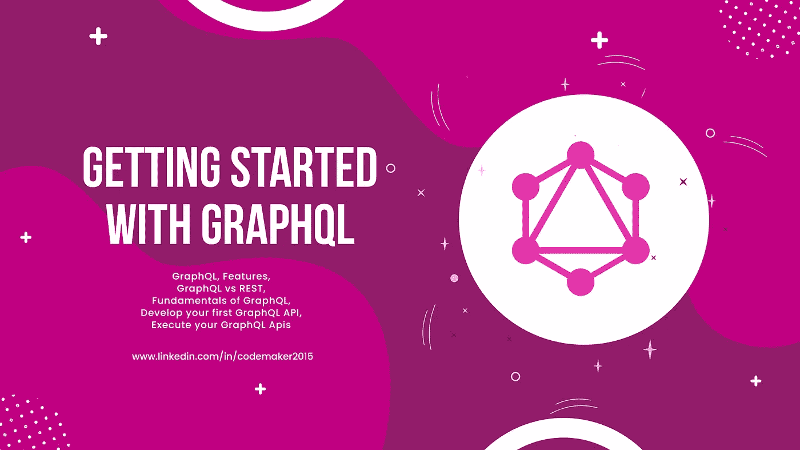

在 RESTful 世界中，我们应该意识到 API 版本控制、预取、瀑布请求等等。GraphQL 是一种开源的查询语言和服务器端运行时。它旨在创建快速、灵活且对开发人员友好的 API。它使用查询来读取数据，使用变异来开发、更新和删除数据。

# 入门指南

## 目录

*   [图表 QL](#ebf1)
*   [特色](#980c)
*   [GraphQL vs REST](#4dc2)
*   [graph QL 的基础知识](#998a)
*   [开发您的第一个 GraphQL API](#9e0e)
*   [执行您的 graph QL API](#7208)
*   [有用链接](#d0d6)

我们使用 REST 构建 API 已经有很长时间了。在一个宁静的世界里，你可能会面临一些挑战，比如:

*   API 版本控制
*   很多端点
*   信息提取过量和不足
*   瀑布请求等。

GraphQL 是应对上述挑战的最简单的解决方案。GraphQL 已经成为 API 开发的新标准。它是一种用于 API 的查询语言，使用户能够指定他们的需求，不多也不少。

# GraphQL

GraphQL 是一种用于 API 的查询语言和服务器端运行时。作为 REST 的替代方案，它允许开发人员创建请求，在单个 API 调用中从多个数据源提取数据。它对于构建现代移动和 web 应用程序非常有效。它比 REST 需要更少的分支。它确保应用程序只加载相关的数据，即使它来自多个数据源。

# 特征

## 强类型架构

我们可以在 GraphQL 模式定义语言(SDL)的模式中指定 API 支持的所有数据类型(比如 Boolean、String、Int、Float、ID、Scalar)。它使 GraphQL 不容易出错，更有效，并为支持的 ide 提供自动完成功能。

## 没有过度抓取或抓取不足

当响应获取的数据超过要求时，就会发生过量获取。当响应没有在单个 API 请求中获取足够的数据，而需要额外的 API 请求来获取相关或引用的数据时，就会发生提取不足。

在 GraphQL 中，您可以指定想要获取的确切字段。它在单个请求中获取所需的字段，并解决了过量获取和不足获取的问题。

## 节省时间和带宽

GraphQL 允许我们在单个查询调用中发出多个资源请求。通过减少对服务器的请求数量，它节省了大量的时间和带宽。它还有助于减少瀑布式网络请求。

## 用于组合模式的模式拼接

模式拼接用于将多个模式组合成一个模式。在微服务架构中，每个微服务都可以定义自己的 GraphQL 模式，并组合成由客户端访问的单个单元。

## 无版本控制

在 REST 架构中，维护版本是一种常见的做法，因为开发人员会由于资源变化或请求/响应中的结构变化而创建新版本。而在 GraphQL 中，没有这样的要求，您可以添加或删除字段，但是资源 URL 保持不变。

# GraphQL 与 REST

在 REST APIs 中，通常有一个特定的端点将整个数据块作为 JSON 响应返回，这需要进行解析。而在 GraphQL 中，您使用模式、查询和解析器来请求特定数据，而不仅仅是整个块。它不需要解析数据，也不需要向多个资源发送多个请求。

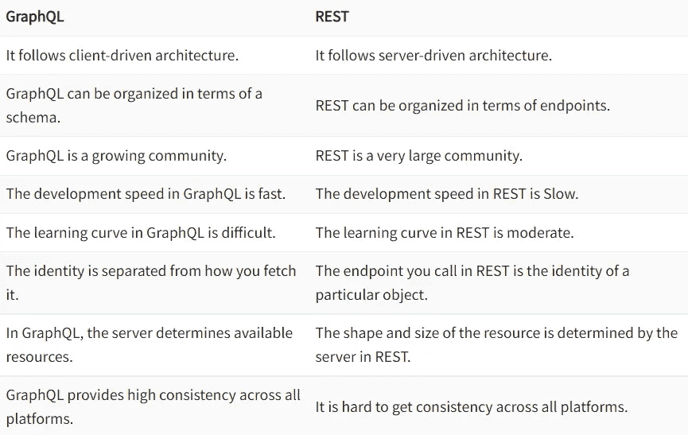

# GraphQL 基础

让我们讨论一下 GraphQL 的一些基础知识，比如模式、类型、查询、变异和订阅。

## (计划或理论的)纲要

模式定义了客户端可以访问的 GraphQL API 的类型，例如对象、字段、关系。来自客户端的每个请求都根据模式进行验证和执行。您可以使用`buildSchema`函数在 GraphQL 中构建一个模式对象。

在 GraphQL 中，带有`id`、`name`、`age`的`user`可以表示如下:

```
type User {
  id: ID!
  name: String!
  age: Int
}
```

## 类型

你可以在`buildSchema`内部定义不同的类型，比如`type Query {...}`和`type Mutation {...}`。`type Query {...}`保存映射到 GraphQL 查询的函数，用于获取数据(相当于 GET in REST)。`type Mutation {...}`保存映射到突变的函数，用于创建、更新或删除数据(相当于 REST 中的 POST、update 和 delete)。

可以返回一个`user`和一个`Person`类型的`users`数组，后者有一个`id`、`name`、`age`如下:

```
// Initialize a GraphQL schema
var schema = buildSchema(`
  type Query {
    user(id: Int!): Person
    users(age: Int): Person
  },
  type Person {
    id: Int
    name: String
    age: Int
  }
`);
```

## 问题

查询描述了如何获取数据。它只返回您指定的数据。

你可以用下面的`id`和`age`得到一个`Person`类型的`user`:

```
type Query {
    user(id: Int!): Person
    users(age: Int): Person
}
```

## 下决心者

解析器被设计成将操作映射到实际函数。

例如，在`type Query`中有一个`user`对象，将它映射到`root`中一个同名的函数，如下所示，

```
// Sample users
var users = [
  {
    id: 1,
    name: 'Vishnu',
    age: '27'
  },
  {
    id: 2,
    name: 'Amal',
    age: '26'
  },
];
// Return a single user
var getUser = function(args) {
  // ...
}
// Return a list of users
var retrieveUsers = function(args) { 
  // ...
}
// Root resolver
var root = { 
  user: getUser,  // Resolver function to return user with specific id
  users: retrieveUsers
};
```

## 别名

别名使我们能够重命名查询结果中返回的数据。它不改变原始模式，而是根据规范显示它。当在同一个查询中有多个具有不同参数的顶级字段时，这很有用。

```
query getUsers {
  male: users(gender: "MALE") {
    id
    name
    age
  }
  female: users(gender: "FEMALE") {
    id
    name
    age
  }
}
```

## 碎片

片段是可重用的单元，它能够构造字段集，并在需要时将它们包含在查询中。

要创建一个`user`片段，使用下面的代码片段，

```
query getUsersWithFragments($userAID: Int!, $userBID: Int!) {
  userA: user(id: $userAID) {
    ...userFields
  },
  userB: user(id: $userBID) {
    ...userFields
  }
}
fragment userFields on Person {
  name
  age
}
```

在上面的代码中，创建了一个名为`userFields`的片段来检索用户信息。运行上述代码时，您将收到以下输出:

```
{
  "data": {
    "userA": {
      "name": "Vishnu",
      "age": 27
    },
    "userB": {
      "name": "Amal",
      "age": 26
    }
  }
}
```

## 指令

指令使您能够使用变量动态地更改查询的结构。有时，您可能会跳过或包含一些字段，而不改变查询中的模式。为此，您可以使用以下指令。

*   `@include(if: Boolean)` -如果为真，则包括该字段。
*   `@skip(if: Boolean)` -如果为真，则跳过该字段。

例如，如果您想要检索拥有 id 的用户是`Vishnu`的粉丝，但是您不需要他们的`age`字段，请遵循下面的代码片段。

```
query getUsers($age: Boolean!, $id: Boolean!) {
  users(age: $age){
    ...userFields
  }
}
fragment userFields on Person {
  id @include(if: $id)  
  name
  age @skip(if: $age)
}
```

在 web 界面的变量面板中提供以下内容:

```
{
  "shark": "Vishnu",
  "age": true,
  "id": true
}
```

您将获得以下输出:

```
{
  "data": {
    "users": [
      {
        "name": "Vishnu",
        "id": 1
      },
      {
        "name": "Amal",
        "id": 2
      }
    ]
  }
}
```

## 突变

突变是一个 GraphQL 操作，它处理数据的创建、删除和更新。

例如，您需要用`id == 1`更新一个用户，并更改他们的`age`和`name`。用如下的突变类型更新用户模式，

```
// Initialize a GraphQL schema
var schema = buildSchema(`
  type Query {
    user(id: Int!): Person
  },
  type Person {
    id: Int
    name: String
    age: Int
  }
  # newly added code
  type Mutation {
    updateUser(id: Int!, name: String!, age: String): Person
  }
`);
```

添加一个`updateUser`函数来更新用户详细信息:

```
// Update the user details
var updateUser = function({id, name, age}) {
  users.map(user => {
    if (user.id === id) {
      user.name = name;
      user.age = age;
      return user;
    }
  });
  return users.filter(user => user.id === id)[0];
}
```

使用相关解析器函数更新根解析器，如下所示:

```
// Root resolver
var root = { 
  user: getUser,
  users: retrieveUsers,
  updateUser: updateUser 
};
```

假设这些是初始用户详细信息:

```
{
  "data": {
    "user": {
      "name": "Vishnu",
      "age": 27,
    }
  }
}
```

将以下查询添加到 web 界面上的输入面板中:

```
mutation updateUser($id: Int!, $name: String!, $age: String) {
  updateUser(id: $id, name:$name, age: $age){
    ...userFields
  }
}
fragment userFields on Person {
  name
  age
}
```

在 web 界面的变量面板中提供以下内容:

```
{
  "id": 1,
  "name": "Codemaker",
  "age": "27"
}
```

您将获得以下输出:

```
{
  "data": {
    "updateUser": {
      "name": "Codemaker",
      "age": 27
    }
  }
}
```

带有`id == 1`的用户已从`Vishnu` ( `age 27`)更新为`Codemaker` ( `age 27`)。

# 开发您的第一个 GraphQL API

到目前为止，我们已经讨论了 GraphQL 的基础知识。是时候用 node.js 和 express 创建我们的第一个 GraphQL api 了。

## 安装依赖项

我们需要在机器上安装 node.js 来启动 GraphQL。

*   [从官方网站下载](https://nodejs.org/en/download/) Node.js。
*   按照[安装步骤](https://www.digitalocean.com/community/tutorial_series/how-to-install-node-js-and-create-a-local-development-environment)将其安装在机器上。

## 设置环境

*   创建一个目录来存放我们的 API。

```
mkdir first-graphql-api
cd first-graphql-api
```

*   使用以下命令初始化新的 npm 项目，

```
npm init -y
```

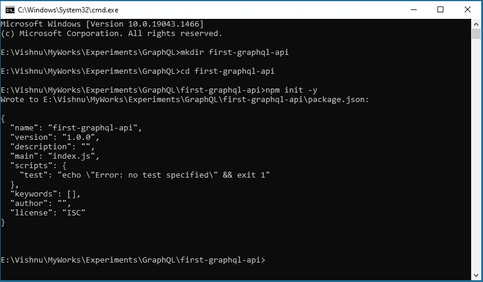

*   创建一个包含服务器代码的`index.js`文件。
*   使用以下命令将所需的包`graphql`、`express`和`express-graphql`安装到项目中。

```
npm install graphql express express-graphql
```


*   打开`index.js`文件，添加以下代码，

```
var express = require('express');
var { graphqlHTTP } = require('express-graphql');
var { buildSchema } = require('graphql');
const port = process.env.PORT || 4000
// Initialize a GraphQL schema
var schema = buildSchema(`
  type Query {
    hello: String
  }
`);
// Root resolver
var root = { 
  hello: () => 'Hello world!'
};
// Create an express server and a GraphQL endpoint
var app = express();
app.use('/graphql', graphqlHTTP({
  schema: schema,  // Must be provided
  rootValue: root,
  graphiql: true,  // Enable GraphiQL when server endpoint is accessed in browser
}));
app.listen(port, () => {
  console.log(`App running on port ${port}.`)
})
```

*   在`package.json`中的脚本上添加一个`start`命令，如下所示:

```
"start": "node index.js"
```

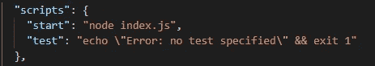

最终的项目结构应该如下所示，

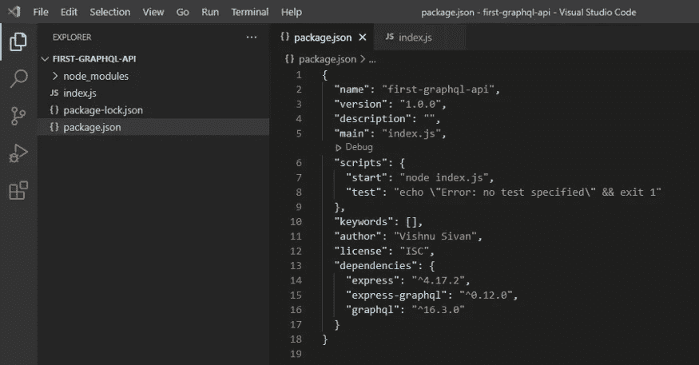

*   使用以下命令启动节点服务器，

```
npm start
```

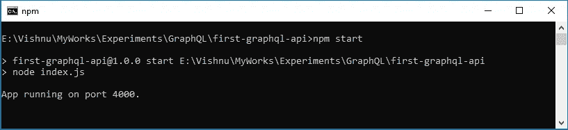

*   在网络浏览器上打开链接`localhost:4000/graphql`。你会看到一个**欢迎来到 GraphiQL** 网络界面。

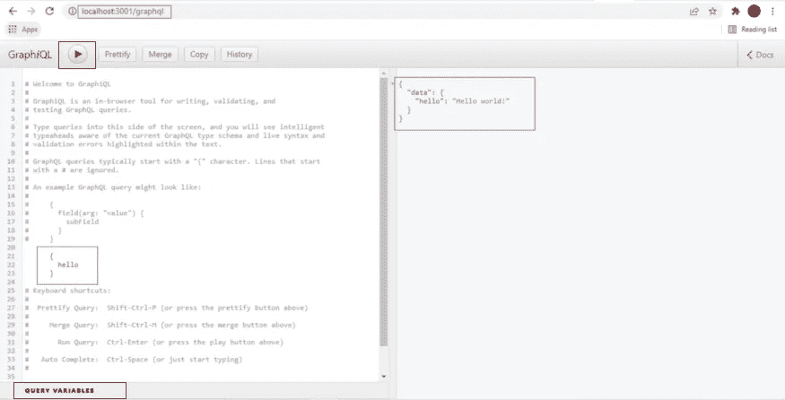

GraphiQL 接口主要分为两个。左侧面板用于输入查询和查询变量。右侧面板用于显示执行的查询结果。位于左上角的播放按钮用于执行查询。

## 执行您的 GraphQL Apis

## **1。GraphiQL 网络界面**

让我们在左侧面板中添加一个查询`{ hello }`，然后单击 play 按钮。您将在右侧面板中获得结果`hello world!`(如上图所示)。

到目前为止，我们已经尝试了 GraphiQL web 界面。现在，我们可以通过 api 调用获得结果，而无需 GraphiQL 接口。为此，在`index.js`文件中设置`graphiql` 值为`false`。

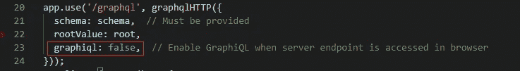

如果您再次运行服务器并点击`graphql` api 端点，您将得到以下错误，

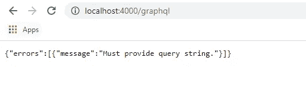

这是因为我们还没有在 api 中提供查询字符串。

## **2。使用卷曲**

要使用`express-graphql`向端点发送 HTTP POST 请求，请将 GraphQL 查询作为 JSON 有效负载中的查询字段进行传递。

例如，如果代码运行在 Express GraphQL 服务器上，端点是`[http://localhost:4000/graphql](http://localhost:4000/graphql)`，我们可以在 curl 命令中添加`query { hello }`查询作为有效负载，如下所示:

```
curl -X POST -H "Content-Type: application/json" -d "{\"query\": \"{ hello }\"}" [http://localhost:3001/graphql](http://localhost:3001/graphql)
```

如果在终端上执行上述命令，输出将作为 JSON 返回，如下所示:

```
{"data":{"hello":"Hello world!"}}
```

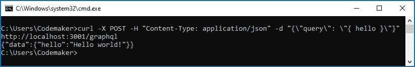

如果您喜欢使用 GUI 来测试您的查询，请使用 GraphiQL 和失眠症等客户端。

## **3。从网络浏览器控制台**

从浏览器发送 GraphQL 查询。

*   在浏览器上打开网址[http://localhost:4000/graph QL](http://localhost:4000/graphql)。
*   打开开发者控制台(在谷歌浏览器中按 F12)。
*   将以下代码粘贴到控制台窗口中，

```
fetch('/graphql', {
  method: 'POST',
  headers: {
    'Content-Type': 'application/json',
    'Accept': 'application/json',
  },
  body: JSON.stringify({query: "{ hello }"})
})
  .then(r => r.json())
  .then(data => console.log('data returned:', data));
```

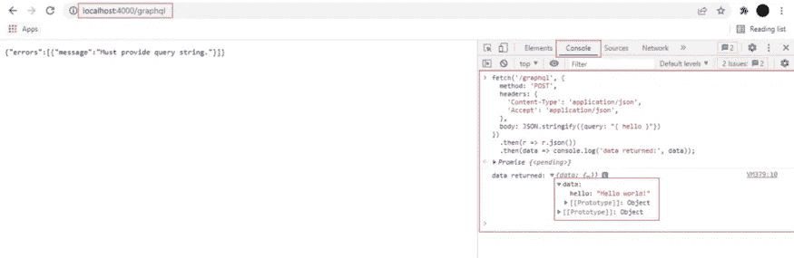

## 4.邮递员

*   要使用 Postman 执行 GraphQL 查询，请在输入字段中键入 URL，并在正文中提供查询。

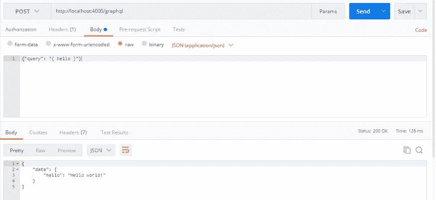

## 5.从 HTML 文件

要使用 fetch api 在前端获得响应，创建一个名为`fetch_demo.html`的文件，并向其中添加以下代码。

```
<!DOCTYPE html>
<html>
    <body>
        <h2>GraphQL fetch demo</h2>
        <p>This example returns the response from the server using GraphQL API</p>        
        <p id="demo"></p>        
        <script>
            function fetchData() {
                fetch('[http://localhost:4000/graphql'](http://localhost:4000/graphql'), {
                    method: 'POST',
                    headers: {
                    'Content-Type': 'application/json',
                    'Accept': 'application/json',
                    },
                    body: JSON.stringify({query: "{ hello }"})
                })
                    .then(r => r.json())
                    .then(data => { document.getElementById("demo").innerHTML = "Response: " + JSON.stringify(data); console.log('data returned:', data) });
                return res
            }
            fetchData()
        </script> 
    </body>
</html>
```

*   您可以将文件放在一个服务器中，或者将文件绑定到我们用来创建 GraphQL apis 的同一个 express 服务器中。
*   在`index.js`文件中添加一个 Api 来渲染 HTML 文件，如下所示，

```
app.get('/graphql-fetch', function(request, response){
    response.sendFile("fetch_demo.html", { root: '.' });
});
```

*   点击浏览器上的`graphql-fetch` api 来查看下面的响应，

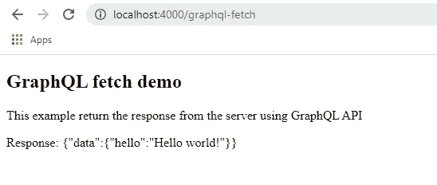

感谢阅读这篇文章。

感谢 [Gowri M Bhatt](https://www.linkedin.com/in/gowri-m-bhatt-85b31814b/) 审阅内容。

如果你喜欢这篇文章，请点击拍手按钮👏并且分享出来帮别人找！

演示和本教程的完整源代码可以在

[codemaker 2015/first-graph QL-API:graph QL 入门。第一个包含 node.js 和 express 的 graph QL API(github.com)](https://github.com/codemaker2015/first-graphql-api)

这里有一些有用的链接，

[](https://graphql.org/learn/) [## GraphQL 简介

### 一种用于 API 的查询语言——graph QL 提供了 API 中数据的完整描述，为客户提供了…

graphql.org](https://graphql.org/learn/) [](https://graphql.org/graphql-js/running-an-express-graphql-server/) [## 运行 Express GraphQL 服务器

### 一种用于 API 的查询语言——graph QL 提供了 API 中数据的完整描述，为客户提供了…

graphql.org](https://graphql.org/graphql-js/running-an-express-graphql-server/) [](https://graphql.org/graphql-js/graphql-clients/) [## GraphQL 客户端

### 一种用于 API 的查询语言——graph QL 提供了 API 中数据的完整描述，为客户提供了…

graphql.org](https://graphql.org/graphql-js/graphql-clients/)