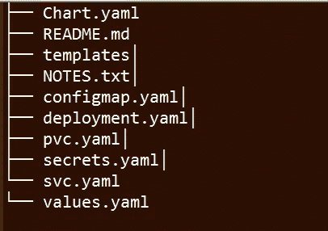

# Helm 入门—第一部分

> 原文：<https://blog.devgenius.io/getting-started-with-helm-part-i-91a5f7c79ad6?source=collection_archive---------2----------------------->

> 当我第一次开始将应用程序部署到目标位置时，这都是手动的，有时需要花费几个小时来复制巨大的 tar 文件，如果必须在应用程序中进行任何更改，tar 文件会重新生成并重新复制到目标位置。有了 [Helm](https://helm.sh/) 作为软件包经理和 [kubernetes](https://kubernetes.io/) 作为部署引擎，这就像从马里奥视频游戏时代转移到最新的 PS5 主机游戏时代

照片由[赛义德·胡赛尼](https://unsplash.com/@syhussaini?utm_source=unsplash&utm_medium=referral&utm_content=creditCopyText)在 [Unsplash](https://unsplash.com/s/photos/helm?utm_source=unsplash&utm_medium=referral&utm_content=creditCopyText) 上拍摄

# **为什么要掌舵？**

***使用图表管理 kubernetes 应用*** :您可能希望使用 kubernetes 作为云编排引擎部署的任何应用都可以使用 helm 图表来创建和维护。

***提供存放打包图表的图表存储库:*** 为了存放应用图表，helm 在这里公开提供一个集中的位置[，并且还提供在](https://artifacthub.io/packages/search?kind=0) [JFrog](https://www.jfrog.com/confluence/display/JFROG/Kubernetes+Helm+Chart+Repositories) 或 GCP 上私下存放存储库的设施。

***提供 cli 以安装升级或删除任何版本:*** 供最终用户与 **Helm 交互，**提供命令行客户端，负责本地图表开发、将图表上传到存储库、管理存储库以及管理现有版本的升级和卸载。

# 什么是头盔？

在了解了我们为什么需要 helm 以及传统应用程序部署的历史之后，可以肯定地说 helm 是 kubernetes 的一个包管理器，用于从零开始安装应用程序或使用 Helm 图表升级现有的应用程序。

它还通过与存储图表的图表库交互来管理应用程序生命周期，以便在集群中安装和卸载图表。Helm 还管理已安装图表的发布周期。

Helm 提供了一种通过在 Go 中模板化来**定制应用程序的方法，更多使用 Go 模板函数开发 helm 图表的技巧和诀窍可以在[这里](https://helm.sh/docs/howto/charts_tips_and_tricks/)找到。**

# **舵的关键部件**

1. **Helm chart —** Helm chart 是一种将应用程序打包成名为 *charts* 的格式的方法，该格式是一组文件的集合，这些文件描述了在 kubernetes 集群中成功部署应用程序所需的一组相关的 Kubernetes 资源。图表是作为特定目录树中的文件创建的。它们可以打包到版本化的归档文件中进行部署。

2. **Helm 库** — Helm 库使用 Kubernetes 客户端库与 Kubernetes 通信。目前，该库使用 REST+JSON。它将信息储存在位于 Kubernetes 内部的秘密中。它不需要自己的数据库。

3. **Helm 客户端(CLI)**—Helm 客户端和库都是用 Go 编程语言编写的。Helm cli 负责本地图表开发、将图表上传到存储库、管理存储库以及管理现有版本的升级和卸载。我将在下一篇关于头盔的文章中详细介绍所有这些操作的头盔命令。

4.**舵库** —在这一点上，Github 中的官方[舵图表库](https://github.com/helm/charts)已经过时，这是因为随着图表数量的增加，对其进行维护是维护者的一项重大任务。他们更倾向于通过 GitHub 版本提供工具和用于托管工件的页面来托管自己的图表报告。

# **舵图结构**

舵图被组织成一个目录中的文件集合。目录名是没有版本信息的图表的名称。

在这个目录中，Helm 将期望一个如下匹配的结构:

舵图结构

1. **C *hart.yaml***

2.***values . yaml****:*这个 YAML 文件包含用于在集群中生成 release 的键和值。这些值在资源清单中被替换。

3.***【config map . yaml***:这个 YAML 文件是用来存储一个应用所需要的配置数据，比如数据库用户名，URL 等。

4. ***secrets.yaml*** :这个 yaml 文件以加密格式存储数据库密码。所有应用程序的敏感信息都可以存储在机密文件中。

5. ***deployment.yaml*** :这个 yaml 文件用于创建或修改应用程序的窗格实例。部署文件是一个重要的 kubernetes 资源，它可以扩展副本单元的数量，以可控的方式部署更新的代码，或者在必要时回滚到早期的部署版本。

***结论*** :在这部分 1 中，我已经分享了 ***什么*、*为什么*** 的基础知识以及对掌舵图结构的见解。在下一篇文章第 2 部分中，我将讨论*部分，我将分享 kubernetes 生态系统中 helm 的架构，以及用于创建、管理、删除、升级和运行应用程序的 helm 图表的命令，从而涵盖应用程序从准备部署到整个生命周期的所有阶段。请务必阅读下一篇文章，并在下面的评论中让我知道对这篇文章的反馈。感谢你阅读这篇文章。希望对你有帮助。*