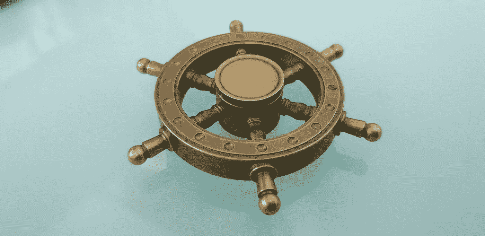

# Helm 入门–第二部分

> 原文：<https://blog.devgenius.io/getting-started-with-helm-part-ii-35534a291baa?source=collection_archive---------3----------------------->

> 这是 HELM 系列两篇文章中的第二篇。如果你是赫尔姆的新手，我会推荐你阅读这个系列的第一部分 的 [**，然后开始阅读这篇博文。这篇文章深入探讨了 helm 的架构，试图强调其在 kubernetes 生态系统中的地位，以及部署应用程序 Helm 图表并维持其在集群中的发布周期的实用命令列表。**](https://vidhitakher.medium.com/getting-started-with-helm-part-i-91a5f7c79ad6)



照片由 [Syed Hussaini](https://unsplash.com/@syhussaini?utm_source=unsplash&utm_medium=referral&utm_content=creditCopyText) 在 [Unsplash](https://unsplash.com/s/photos/helm?utm_source=unsplash&utm_medium=referral&utm_content=creditCopyText) 上拍摄

在这两篇系列文章的第一部分中，我谈到了什么是 helm chart 以及为什么我们在 kubernetes 生态系统中需要它，然后解释了 Helm 的关键组件以及应用程序中 Helm chart 的结构。在这篇文章中，我将继续深入 helm 的架构，以及使用 helm 图表在 kubernetes 集群中安装和运行应用程序生命周期所需的重要命令列表。

# 舵的建筑

说到 Helm 3 的架构，它有一个客户端专用的架构，客户端叫`helm`。客户端是一个 CLI，用户可以与之交互来执行不同的操作，如安装、升级和删除。该客户端与图表存储库交互，如下图所示，并从 repo 本地安装图表，还打包和升级现有图表

头盔 2 中的服务器端组件`Tiller`现在已经从头盔 3 中移除了。

移除 Tiller 的主要好处是安全性现在被委托给 Kubernetes 用户集群安全性。使用 Helm 3 访问集群类似于`kubectl`，例如 kubeconfig 文件。

如下图所示，Helm 客户端通过删除 tiller 直接与 Kubernetes API 服务器交互，并将 HELM 模板文件呈现到 Kubernetes 清单文件中，它通过 Kubernetes API 在 Kubernetes 集群上使用这些文件进行操作。


头盔 3 的架构

# 舵命令

到目前为止，必须了解 Helm 使用图表管理 kubernetes 集群中应用程序的生命周期。为了与终端用户进行交互，它提供了一个 CLI，该 CLI 可以与一组命令一起使用，以便在群集内部署和维护应用程序时安装、卸载甚至升级应用程序。它还管理应用程序的发布生命周期。一个**版本**是一个部署在 Kubernetes 集群中的图表的单个实例。

下面是一些按顺序排列的舵命令，这些命令对于部署舵图表非常重要。

***helm repo add*** 用于将图表库添加到您的本地

```
helm repo add [repository-name] [url]
eg -> helm repo add **repo1** **artifactory.jfrog.com**
```

***helm repo list*** 用于列出所有添加到本地的海图资源库。此命令可用于验证从第一个命令开始添加的 repo 是否正确

```
helm repo list
eg -> helm repo list when run will show names of repo added
```

***helm install*** 命令用于在一个特定的命名空间中安装一个带有— namespace 标志的 app:

```
helm install [app-name] [chart] --namespace [namespace]
eg -> helm install **webapp** **webapp-chart** --namespace **dev**
```

***helm list*** 命令用于列出当前命名空间中所有可用的版本，是检查您的应用程序是否在上一步安装的好方法。

```
helm list (will list in the current namespace)helm list --all-namespaces ( will list across all namespaces)helm list --namespace [namespace]
eg -> helm list --namespace **dev
      -- webapp**
```

***舵升级*** 命令用于 ***升级现有 app，或者安装一个新的*** (如果没有该名称的话)。如果使用**原子标志**，升级失败时会自动回滚。

```
helm upgrade [release] [chart] --atomic --install --version [version-number]
eg -> helm upgrade webapp webapp-chart --atomic --install --version 1.0
```

*命令用来通过在本地指定路径将一个图表打包成一个图表存档*

```
*helm package [chart-path]
eg -> helm package ./webapp-chart
 -- will add an archive of this chart **webapp-chart.tgz in current location***
```

****helm uninstall***命令用于 ***从当前命名空间中删除一个已有的 app*** 或者可以用命名空间标志指定命名空间。 ***舵删除*** 命令也可以用来产生同样的输出。*

```
*helm uninstall [release]
eg -> helm uninstall webapp* 
```

*这些是使用 helm charts 在 kubernetes 集群中运行和管理应用生命周期所需的一些关键命令。还有一些更广泛的命令非常有用，比如**头盔搜索**、**头盔绒毛**、**头盔拉力、头盔状态**等，这些命令可以通过更多地使用头盔来掌握。*

***结论:**总的来说，我认为 Helm 通过提供一种集中的方式来管理 k8s 系统中的应用程序，是一种不断发展的思想，通过库图表和 helm3 版本，它正朝着正确的方向前进。甚至 CNCF 基金会最近也在 2021 年 9 月开始的 [CKAD 认证](https://github.com/cncf/curriculum/blob/master/CKAD_Curriculum_v1.22.pdf)考试中增加了关于赫尔姆的话题，并在这次实际操作认证考试中提出了与赫尔姆海图相关的问题。*

**

*CKAD 课程 2021 年 9 月与头盔相关的变化*

*请和我分享你对这两篇关于 Helm 的文章的看法，以及你在这些文章中发现了什么有用的东西。谢谢你一直读到最后。*