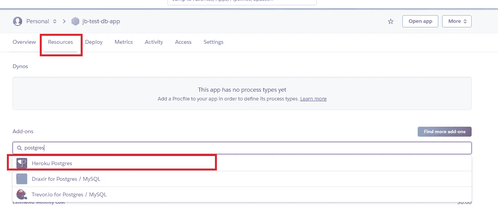
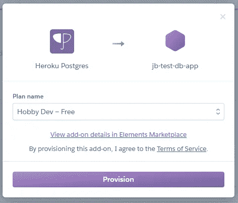
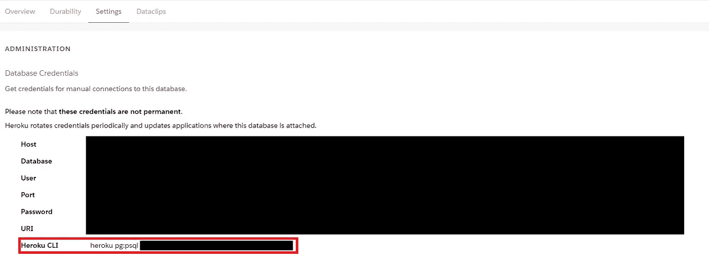

# Node 中的 Heroku Postgres 入门

> 原文：<https://blog.devgenius.io/getting-started-with-heroku-postgres-in-node-53f88c72429d?source=collection_archive---------2----------------------->


如果您对 Postgres/DBs 或 Heroku 的经验有限，那么从头开始尝试和配置它似乎有点令人畏惧。这篇文章将解释使用 Heroku Postgres 的绝对基础。代码示例将使用 Node.js 编写，但是无论您选择哪种语言，设置原则都是一样的。

**1 —为什么使用 Heroku Postgres？
2 —所需工具
3 —提供新的 Postgres 数据库
4 —运行 SQL 命令/查询**

# 1 —为什么使用 Heroku Postgres？

Heroku 是一个托管各种不同应用程序的好地方，这些应用程序需要持续运行并能够对事件做出反应，例如 Twitter 机器人。然而，Heroku 拥有*短暂存储*，这意味着对你应用程序中文件的任何更改**都不会在 dyno 重启时持久化——**简而言之，每当你的应用程序停止运行并重启(这种情况经常发生)，当应用程序再次运行时，任何更改都不会存在。

暂时存储绝不是一个坏系统，但它确实有一定的局限性。如果你用本地的。csv 或。txt 作为一个简单的模拟“数据库”写入，那么任何新添加或修改的数据将不会在重新启动时保留。在我看来，这是塞翁失马，焉知非福，因为这是抛弃粗糙的数据存储方法并开始使用适当的数据库架构的绝佳借口。

Heroku Postgres 是临时存储的完美解决方案，因为对数据库所做的任何更改都会在 dyno 重启后保持不变。Postgres 是一个行业标准的 SQL 对象关系数据库，具有开源的优势。如果你有一些写 SQL 的经验，那么 Postgres 会感觉很熟悉，但是即使你没有，也很容易掌握。Heroku Postgres 插件有许多不同的价格等级，但*爱好开发*等级是完全免费的！

# 2 —所需工具

要在 Heroku Postgres 上开始开发，我们需要 [**Heroku CLI**](https://devcenter.heroku.com/articles/heroku-cli) 。这允许我们连接到我们的 Heroku 应用程序并运行命令，比如提交新文件，或者在我们的情况下**连接到我们的 Postgres DB** 。
虽然您不需要 Node 来实现这一点，但是如果您的项目使用 Node.js，那么您可以简单地从控制台运行`npm install -g heroku`。

我们还需要下载并安装 [**PostgreSQL**](https://www.enterprisedb.com/downloads/postgres-postgresql-downloads) 。这使我们实际上能够将我们的控制台链接到在线托管数据库并执行我们的命令。PostgreSQL 有很多安装选项，如果有疑问，就保持默认设置。

> 如果您计划使用 Node 来读/写 PostgreSQL 数据库，那么您还应该安装带有`npm i pg`的‘pg’包。

要验证安装，您可以运行这些命令，应该会得到类似的结果


psql 用了一个大写的 V，就是为了难。

# 3 —提供新的 Postgres 数据库

现在我们已经安装了所有的工具，我们准备为 Heroku 项目创建一个新的 Postgres DB。我将假设您已经有了一个 Heroku 项目设置，并且您的部署已经排序。
在项目的顶部工具栏中，选择“资源”选项卡，然后搜索“Postgres”附加组件。你应该能找到 Heroku Postgres 插件。



单击 Heroku Postgres 附加组件并提供该附加组件的新实例。值得一看元素市场链接，以确保您选择正确的计划。额外的功能，如回滚和高性能，不是免费层的一部分，所以如果你计划将它用于一个业余爱好项目之外，你可能更适合使用付费计划。

既然我们已经配置了数据库，我们可以通过在附加组件部分单击它来查看有关它的更多详细信息。这会将我们带到一个包含以下选项卡的页面；

> ***。*-**概述，关于版本、数据大小和可用性的基本信息不言自明。
> 
> ***。*-**耐久性备份、数据库回滚和保护信息。对业余爱好级数据库来说不太重要。
> 
> ***。Settings -*** 大量数据库凭证(稍后需要)以及重置或破坏数据库的选项(如果您的数据获得感知并试图接管，这很有用)。
> 
> ***。Dataclips -*** 一种在浏览器中对您的数据进行设置查询，并与其他人/系统共享响应的方式。类似于 SQL 的存储过程。

# **4 —运行 SQL 命令/查询**

现在我们已经设置并运行了 Postgres DB，是时候真正开始编写 SQL 命令了🎉

首先让我们从 PC 连接到数据库。进入 Heroku Postgres 插件的设置选项卡，复制 Heroku CLI 文本。



不要在互联网上发布你的数据库证书——最好现在就了解它，而不是苦苦挣扎。

使用这个命令，将它粘贴到您选择的 CLI 工具中——当我通过 Bash 连接时遇到错误时，我使用了 Windows 命令提示符，但是您的收获可能会有所不同。希望您现在已经直接连接到数据库了！(忽略任何听起来不重要的警告)。


黑客声音:“我进去了”。

从这里，您可以向任何方向前进，并编写满足您的数据需求的命令。换句话说，如果你知道自己在做什么，就不要读了。

如果您想了解这个数据库的简单用例及示例代码，请继续阅读。

## 创建新表

让我们创建一个用户表，我认为它基本上是‘Hello World’的数据库版本。这个表有一个 Id 列、一个名字和一个姓氏列。
这个对应的 SQL 代码是；
`CREATE TABLE Users(id SERIAL PRIMARY KEY, FirstName VARCHAR, LastName VARCHAR);`


成功创建表。

## 填充表格

现在是时候向表中添加一些基本数据了。这可以这样做；
`INSERT INTO Users(FirstName,LastName) Values('James','Brightman');`


成功创建记录。

## 在节点中执行查询

因此，我们现在有了一个托管的 PostgreSQL 数据库，并向其中添加了一些数据。这很好，但我们需要知道如何在我们的应用程序中实际读取或写入数据。

最初我们需要运行`npm i pg`来安装节点 PostgreSQL 包。现在我们需要创建一个“池”,我们可以通过它连接到我们的数据库。与之前不同的是，我们不再使用通过 CLI 连接的相同命令，而是需要从 Heroku Postgres->Settings->Database credentials 页面获取 **URI** 。使用它，我们可以创建一个新池。

```
const {Pool} = require(‘pg’);
const pool = new Pool({
 connectionString: “YOUR_URI_HERE”,
 ssl: {
 rejectUnauthorized: false
 }
});
```

现在我们有了一个连接到数据库的 pool 对象，我们可以对它调用`Pool.query`，这允许我们运行我们的 SQL 命令。
例如，如果我们想查看我们表中的所有数据；

```
pool.query(`SELECT * FROM Users;`, (err, res) => {
    if (err) {
        ***console***.log("Error - Failed to select all from Users");
        ***console***.log(err);
    }
    else{
        ***console***.log(res.rows);
    }
});
```


在我们的数据库上调用上述代码的结果。

并写入数据库；

```
pool.query(`INSERT INTO Users(FirstName,LastName)VALUES($1,$2)`, ['FirstNameValue','LastNameValue'], (err, res) => {
    if (err) {
        ***console***.log("Error - Failed to insert data into Users");
        ***console***.log(err);
    }
});
```

这个样本代码和节点项目可以在我的 [Github 上找到。](https://github.com/JamesBrightman/HerokuPostgreSQLNodeDemo)

有关在 Node 中使用 Postgres 数据库的更多信息，请查看[文档。](https://node-postgres.com/)

## 概括起来🎉🎉🎉

如果您已经阅读了本文，那么现在(希望)您已经拥有了一个 Heroku 托管的 PostgreSQL 数据库，您现在可以使用 CLI 在本地与它进行交互，也可以在您的节点应用程序中远程与它进行交互👏

如果您喜欢这篇文章或觉得它有用，请随意。或者，你可以在 Medium [*这里*](https://jamesmbrightman.medium.com/membership) *支持我或者给我买一杯* [*咖啡*](https://ko-fi.com/jamesbrightman) *！非常感谢所有的支持。*