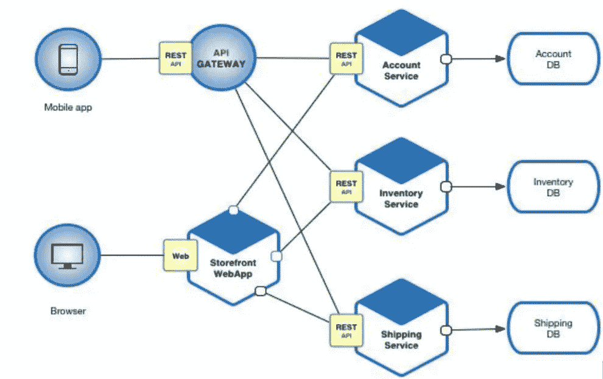
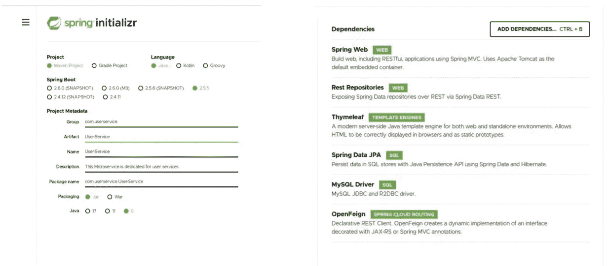
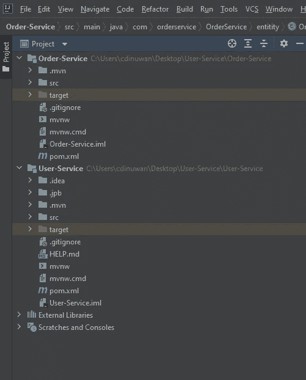
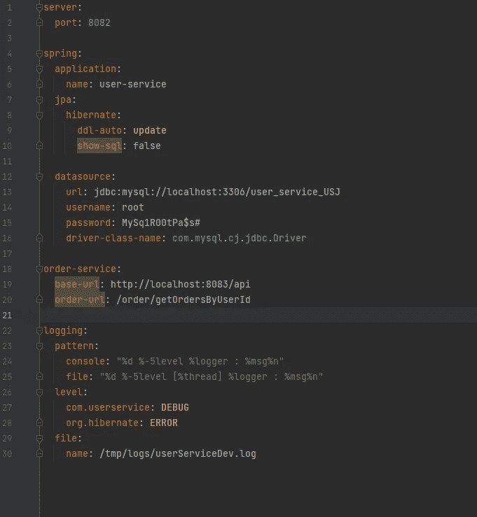
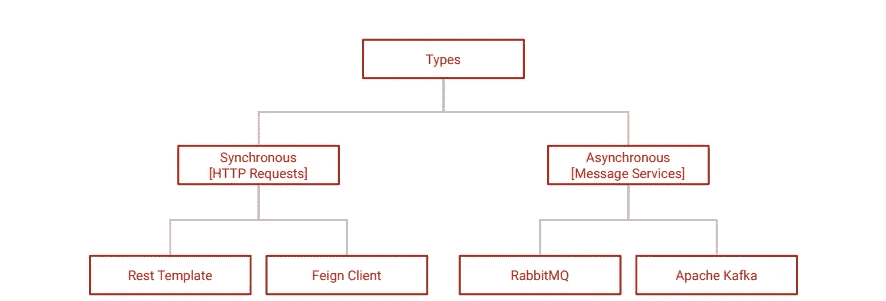
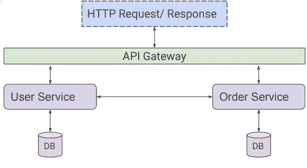
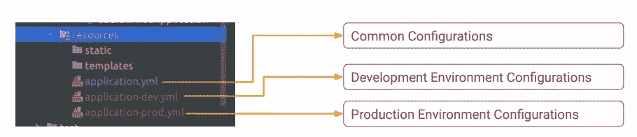
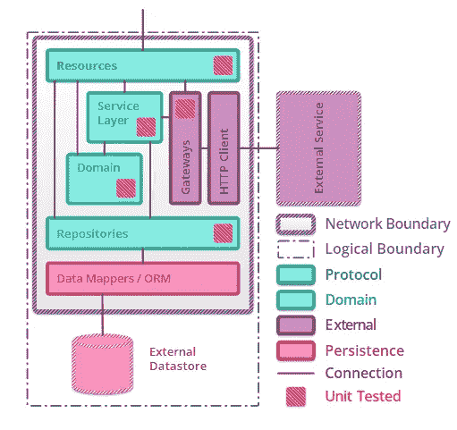
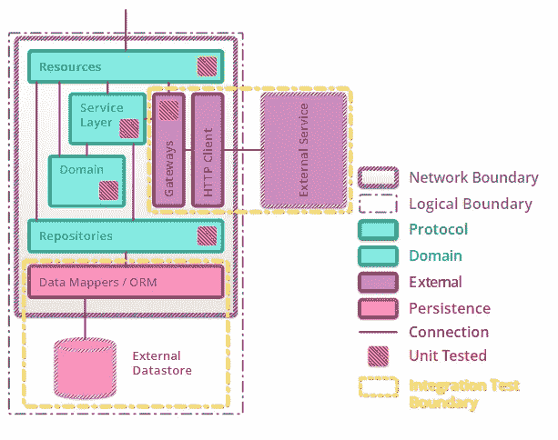
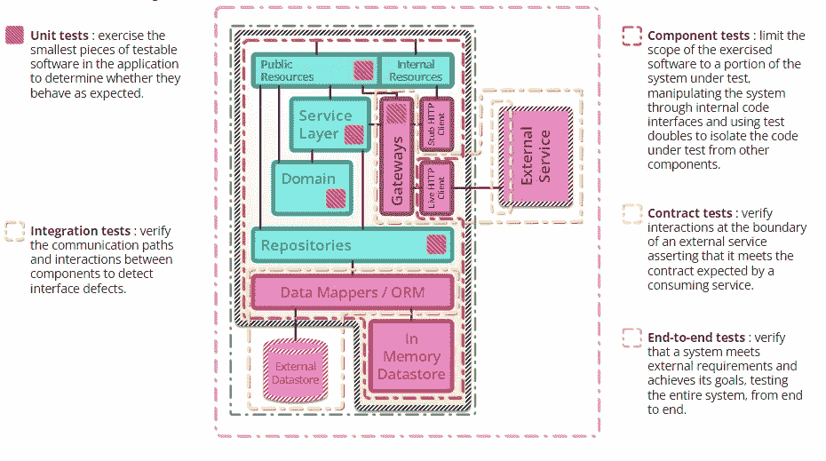

# 微服务架构入门

> 原文：<https://blog.devgenius.io/getting-started-with-microservices-architecture-203172390928?source=collection_archive---------8----------------------->

## 微服务实现和微服务测试的基础


在本文中，我们将讨论微服务架构和微服务架构的测试策略。微服务架构是一种架构风格，它将应用程序构建为围绕业务领域建模的小型自治服务的集合。下面你可以看到一个微服务架构设计的例子。



## 微服务设计原则

在设计微服务时，没有一套预定义的标准规则可以遵循。然而，微服务被设计成小型的、无状态的、独立的和全栈的应用程序，以便它们可以被单独实现和运行。

1.  高内聚低耦合
2.  独立/自主
3.  故障设计
4.  可部署性

## 微服务的核心概念

1.  服务
2.  通信
3.  分配
4.  数据库和交易
5.  API 层

## 微服务应用启动

让我们创建一个基本的微服务来了解一下微服务架构。在这里，我启动一个 java spring boot 应用程序来阐明微服务。



之后，将生成 Zip 文件。然后解压，用 IntelliJ idea 打开。



yml 文件是配置应用程序配置(如自定义端口和数据源等)的地方。



文件夹结构:

1.  所有的。类文件驻留在— src -> main -> java 中
2.  所有的。js 和。css 文件保存在—src -> main -> resources -> static 中
3.  所有的。html 文件位于—src-> main-> resource-> templates 中

## 微服务之间的相互通信

在整体方法中，所有进程都在同一个应用程序中。因此，组件通过函数或方法调用相互调用。但是当使用微服务方法时，几个小的应用程序一起工作形成最终的应用程序。那么微服务之间就需要互通。

相互通信的类型:



同步——客户端发送请求并等待服务的响应。

异步——客户端代码或消息发送方通常不等待响应。

互通实现方法:

1.  RestTemplate 是 Spring 框架中的核心类，用于在客户端执行同步 HTTP 请求。
2.  是一个声明性的 web 服务客户端。它使得编写 web 服务客户端更加容易。使用 Feign 创建一个接口并对其进行注释。
3.  RabbitMQ-RabbitMQ 是一个消息队列实现，它在通信过程中的两个应用程序之间以低级 AMQP 协议执行。
4.  Apache Kafka-Apache Kafka 是一个社区分布式事件流平台，每天能够处理数万亿个事件。

编码示例:

我发起了两个微服务；用户服务和订单服务。在下面的示例中，用户和订单服务分别管理与用户和订单相关的所有数据。



然后使用 postman 你可以测试 API 调用。

## 微服务部署流程

微服务可以手动或自动部署。但是，手动部署过程在生产环境中并不实用。因此，自动化过程可通过 CI/CD 管道与远程源代码管理系统一起应用。

因为微服务是复杂的，所以应该有一种机制来识别微服务在运行时的潜在问题。启用日志记录是解决这一问题的有效方法之一。

例如:

```
public boolean saveUser(UserDTO user) {
    try {
        if (Validations.*validateUser*(user)) {
            UserEntity userEntity = new UserEntity(user.getName(), user.getAge());
            repository.save(userEntity);
            return true;
        } else {
            LOGGER.info("--ERROR in Validation ---");
            return false;
        }
    } catch (Exception e) {
        LOGGER.info("--ERROR in User Save--" + e.getMessage());
        return false;
    }
}
```

维护多个 application.yml 文件有助于为每个部署环境指定自定义配置。



## 创建本地部署的生成

有一个 maven 命令可以在运行或不运行测试用例的情况下构建应用程序。

```
mvn clean installmvn clean install -Dmaven.test.skip=true
```

然后可以在目标文件夹中找到 output.jar 文件。然后，您可以使用以下命令在本地运行它。

```
java -jar {jar_file_name}.jar
```

## 微服务的测试策略

通常，微服务会显示由部分或全部显示图层组成的类似内部结构。

所采用的任何测试策略都应该旨在覆盖服务的每一层和层间，同时保持轻量级。

## 单元测试

单元测试是一种测试类型，其中对软件的单个单元或功能进行测试。它的主要目的是测试每个单元或功能。我们可以使用单元测试来测试微服务的以下部分。



1.  资源和服务层:
    资源和服务层分为两部分，协作者和网关。对于驻留在另一个服务器上的网关(几乎总是这样)，使用测试替身作为模拟对象应该更好。你可以为合作者做单独的测试，这样会减慢过程。
2.  域:
    域逻辑包含计算和状态转换，所以对象是基于状态的，因此不能被隔离，但是最好的选择是进行社交单元测试。
3.  存储库:
    存储库代表查询的执行，并且像执行一样与数据库相关。在这种情况下，如果集成测试不值得执行，那么使用单独测试将会有效。
4.  网关:
    网关碰巧与外部服务连接，建议进行单独的单元测试，以避免影响网络。

但是单元测试本身并不能保证系统的行为。

## 集成测试

通过单元和集成测试，我们可以对组成微服务的各个模块中包含的逻辑的正确性有信心。下图描述了如何对微服务进行集成测试。



1.  网关集成测试:这种类型的测试允许以尽可能精细的测试粒度清除任何协议级错误，比如丢失 HTTP 头、不正确的 SSL 处理或请求/响应体不匹配。
2.  持久性集成测试:这保证了代码假设的模式与数据存储中可用的模式相匹配。对象关系映射(ORM)是一种编程技术，其中元数据描述符用于将对象代码连接到关系数据库。在微服务中，我们使用 ORM 来映射对象代码和关系数据库。由于大多数数据存储存在于一个网络分区中，因此它们也会受到超时和网络故障的影响。集成测试应该尝试验证集成模块能够处理这些故障。

## 端到端测试

因为目标是测试整个系统的行为，所以端到端测试以尽可能粗的粒度进行交互。我们可以使用 selenium web 驱动程序或任何其他 UI 自动化工具在微服务中进行端到端测试。使用端到端测试，我们可以一次测试整个微服务。但是片状剥落、过长的测试运行时间和维护测试套件的额外成本是端到端测试的缺点。

但是当你开始给微服务架构写自动化测试的时候。如果能坚持测试金字塔就更好了。除了这三种主要测试策略，我们还可以使用组件测试和契约测试来进行微服务测试。

下图简要描述了微服务测试流程。



更多详情:[https://martinfowler.com/articles/microservice-testing/](https://martinfowler.com/articles/microservice-testing/)

特别感谢:Iroshan Abeyrathne 先生