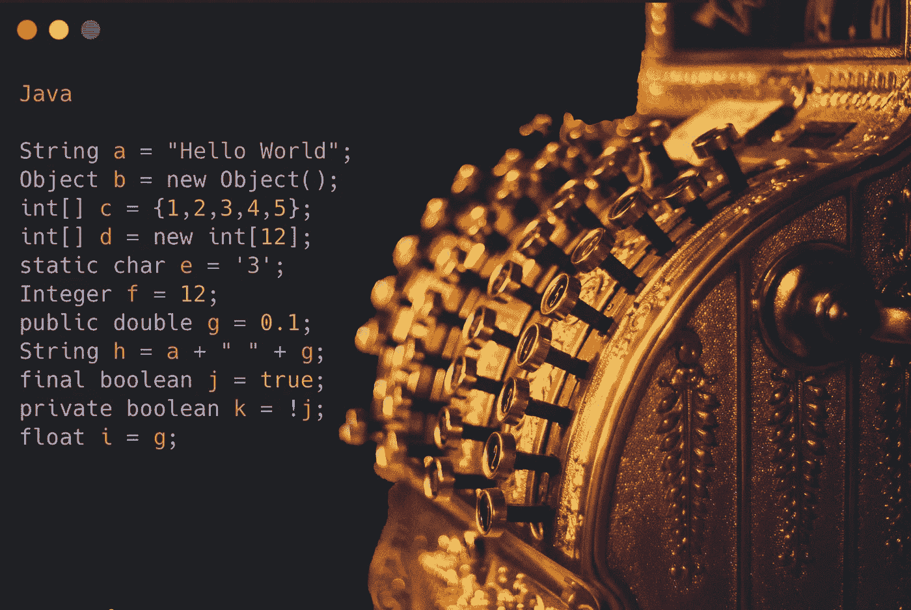

# MIPS 入门

> 原文：<https://blog.devgenius.io/getting-started-with-mips-8dcce04925d4?source=collection_archive---------9----------------------->

使用 MIPS 汇编语言释放低级编程的威力！


丹尼尔·科岗摄影

> 这篇文章是针对那些对低级编程有所了解并且熟悉循环、条件等编程概念的人的。它不会深入钻研诸如 RISC 体系结构或以二进制补码形式存储二进制数的概念。

MIPS ( *无互锁流水线级*微处理器)是一种精简指令集计算( *RISC* )架构，在许多现代计算机处理器中使用。由于其简单高效，它是嵌入式系统和其他低功耗设备的流行选择。

如果你不熟悉 MIPS 汇编语言，你可能不知道从哪里开始。在本文中，我将简要介绍 MIPS 架构及其基本组件。此外，我们还将介绍一些重要的思想和方法，您需要了解这些思想和方法才能创建和执行您自己的 MIPS 汇编程序，并将它们与它们在高级语言中的工作方式进行比较。到本文结束时，您将有一个理解 MIPS 汇编语言的坚实基础，并且您将准备好进一步研究更复杂的问题。

在本文中，我们将使用 Java 作为高级语言的例子。

# 我们怎么运行 MIPS？

尽管有专门设计来运行 MIPS 的处理器可供购买，但用 MIPS 编码的一个很好的免费选择是使用用 Java 编写的 Mars 仿真器。你可以在这里找到下载[！](http://courses.missouristate.edu/kenvollmar/mars/)

[](http://courses.missouristate.edu/kenvollmar/mars/) [## 火星 MIPS 模拟器-密苏里州立大学

### 一个用于 MIPS 汇编语言编程的 IDE MARS 是一个轻量级的交互式开发环境(IDE)

courses.missouristate.edu](http://courses.missouristate.edu/kenvollmar/mars/) 

这是一个免费的工具，你可以用它来运行和调试你的 MIPS 代码。

# 变量与寄存器

MIPS 和高级语言存储数据的方式有一个重要的区别。Java 将数据存储在开发人员可以定义的变量中。例如，`String a = "12"`定义了对指定值“12”的引用。MIPS 不是这样工作的——我们使用预定义的“寄存器”来存储数据。我们将在本文中使用的寄存器是“s”和“t”寄存器，也称为特殊寄存器和临时寄存器。我们也可以使用“a”和“v”寄存器，它们分别作为函数的输入和输出。根据您用来运行 MIPS 的处理器/仿真器，有一定数量的寄存器。这些寄存器可以存储 32 位带符号二进制补码值。

这是因为这些寄存器专门绑定到处理器(或仿真器)上的位置，而变量通常存储在堆中。



原始照片由 [Ramiro Mendes](https://unsplash.com/@thisisramiro?utm_source=medium&utm_medium=referral) 在 [Unsplash](https://unsplash.com?utm_source=medium&utm_medium=referral) 上拍摄

# 数据类型

在上一节中，存储一个字符串被比作存储一个“32 位有符号二进制补码值”，但是这是如何工作的呢？MIPS 不像 Java 那样存储特定的数据类型。它存储所有的整数，我们定义如何处理它。那么我们如何在 MIPS 中存储一个字符串呢？我将展示一个例子:

```
.data
################# .data means necessary data is stored here
a: .asciiz "12" # define an ascii string in label a
################# labels will be discussed later in the article

.text
########### .text means executable code is stored here
la $t0, a # la = load address. We are loading the address stored in label a
########### t0 now contains an reference to where each character of "12" is stored
```

这意味着我们的代码通常不如 java 这样的语言可读，因为我们的寄存器不能为特定的目的使用唯一的名称，并且在读取代码时，特定寄存器的预期数据类型并不明显。

# 标签、分支和执行顺序

MIPS 中我们必须理解的一个重要元素是执行顺序。像许多编程语言一样，MIPS 代码按照编写的顺序执行:例如第 1 行->第 2 行->第 3 行…等等。然而，在像 Java 这样的语言中，你可以在类中的任何位置定义函数，并从其他函数中调用它们。这在 MIPS 中的工作方式略有不同。我们必须定义`Labels`来“跳转”到，而不是调用函数。这类似于为 X 行定义一个名称，然后跳转到标签就是跳转到 X 行。这是循环中最常用的。例如，MIPS 中的一个`while true`循环(无限)看起来像这样:

```
this_is_a_label:
  # some code
  j this_is_a_label
```

这将被视为 while 循环。现在我们可以添加一些额外的代码来退出这个循环。我们可以用`beq`或 branch_if_equal 指令来实现。该指令有多种变体如`beqz blt bgt bltz etc...`或 *branch_if_equal_zero、branch_if_less_than、branch_if_greater_than、branch_if_less_than_zero 等*。这也是我们在 MIPS 中编写 if 语句的方式。让我们编辑前面的函数来退出循环

```
li $t0, 0                     # load 0 into register t0
# li stands for load immediate. An immediate is a 16 bit integer. 
# Therefore, li sets t0 to the immediate we provide
this_is_a_label:              # define label
  beqz $t0, exit_loop_label   # branch_if(t0)_equal_zero will be true, jumps to label in second arg
  j this_is_a_label           # loop
exit_loop_label:              # exit loop label
  # ... end of program ...
```

这条指令突然变得复杂了很多，但它展示了分支指令的基本思想。它验证条件是否为真，然后跳转到指定的标签。现在我们的 while 循环更像是`while false`而不是`while true`！

让我们展示一个 if 语句

```
li $t0, 1
bltz $t0, true_label
# where false is stored. will be ignored if branch condition is true
# ... do false stuff ....
j end_statement # skip true label
true_label:
# ...do true stuff...
end_statement:
# end if statement
```

这涵盖了分支和跳转的基础，以及如何应用它来创建循环和条件。


[余思敏燕雀](https://unsplash.com/@sammiechaffin?utm_source=medium&utm_medium=referral)在 [Unsplash](https://unsplash.com?utm_source=medium&utm_medium=referral) 上的原始照片

# 系统调用

除了我们在 MIPS 中的传统功能之外，我们还可以通过系统调用或 syscalls 进行一些操作。你可以在这里找到 MIPS 系统调用的完整列表。这些系统调用允许我们访问特殊的功能，如文件输入/输出、打印、生成随机数、获取当前时间，甚至终止程序。让我们使用一个系统调用来打印一个整数:

```
li $v0, 1    # load syscall number into v0\. syscall 1 = print int
li $a0, 45   # a0 is the input for syscall 1\. It will print the int in a0
syscall
```

另一个用来终止程序！

```
end_of_program:
  li $v0, 10 # load syscall number into v0\. syscall 10 = terminate program
  syscall
```

[电话与 1980 年苹果电脑通话的 img

总的来说，系统调用提供了一种增强 MIPS 代码功能的便捷方式。


[Elena Koycheva](https://unsplash.com/@lenneek?utm_source=medium&utm_medium=referral) 在 [Unsplash](https://unsplash.com?utm_source=medium&utm_medium=referral) 上的原始照片

# 加载和保存数据

我们可以将目前所学的一切应用到 MIPS 中加载和保存数据。让我们以字符串数据类型为例。我们如何循环遍历每个字符并打印出来？MIPS 中的井字符串是空终止的，这意味着我们应该能够加载字符串的单个字节，然后从循环中取出`beqz`。让我们现在试一下

```
.data ########### .data means necessary data is stored here
hello_str: .asciiz "hello world" # define an ascii string in label hello_str

.text ########### .text means executable code is stored here
la $t0, hello_str
read_char_loop:
  lbu $t1, 0($t0)         # load byte unsigned (non-negative) from address in t0 into t1
  beqz $t1, end_char_loop # if t1 is 0, string is over. exit loop
  move $a0, $t1           # copy value from t1 to a0 (we always print from a0)
  li $v0, 11              # syscall for printing chars
  syscall                 # print char in a0
  addi $t0, $t0, 1        # move to next byte in t0 (next char)
  j read_char_loop        # loop
end_char_loop:
  li $v0, 10
  syscall                 # syscall 10 terminates program 
```

正如你所看到的，我们已经通过结合之前讨论的主题，在 MIPS 中快速跳转到更复杂的功能！

# 功能

MIPS 有一个特殊的语法来声明函数，它在函数调用后保存指令的位置，并在函数完成时返回给它。它使用`jal`或跳转链接关键字来实现。让我们定义一个函数，并探索代码实际上在做什么！

```
.data ########### .data means necessary data is stored here
hello_str: .asciiz "hello function!" # define an ascii string in label hello_str

.text ########### .text means executable code is stored here
main:
  la $a0, hello_str  # load a0 with string address
  jal print_chars    # run function
  li $v0,10          # load syscall 10
  syscall            # run syscall 10

.globl print_chars
print_chars:
  # inputs: a0 = string address
  move $t0, $a0             # copy value of a0 to t0
  read_char_loop:
    lbu $t1, 0($t0)         # load byte unsigned (non-negative) from address in t0 into t1
    beqz $t1, end_char_loop # if t1 is 0, string is over. exit loop
    move $a0, $t1           # copy value from t1 to a0 (we always print from a0)
    li $v0, 11              # syscall for printing chars
    syscall                 # print char in a0
    addi $t0, $t0, 1        # move to next byte in t0 (next char)
    j read_char_loop        # loop
  end_char_loop:
    jr $ra                  # exit function 
```

在上面的代码中，我们有一个主标签，它将输入加载到我们的函数中，调用我们的函数，然后在程序运行后终止程序。函数是用。globl decorator，这使得它可以全局访问。`jal`关键字跳转到 print_chars 标签，同时在寄存器$ra 中存储下一行的地址:`li $v0, 10`。在我们函数的结尾，我们`jr`或者跳转寄存器回到$ra 中存储的值，继续我们的程序。这允许我们定义更复杂的程序，包括使用像高级编程语言这样的函数。

# 堆栈

堆栈是计算机内存的一部分，用于在程序运行时保存临时数据。函数参数、局部变量和返回地址只是保存在 MIPS 体系结构中的堆栈上的数据类型的几个例子。

随着更多的数据加载到堆栈中，堆栈指针$ sp(MIPS 处理器中对应于堆栈顶部的寄存器)递减，以指向堆栈上的下一个可用位置。MIPS 中的堆栈向下攀升，这意味着堆栈的顶部位于最高的内存地址。当数据弹出堆栈时，堆栈指针递增以释放不必要的数据。

这里有一个在 mips 中如何做到这一点的例子

```
addi $sp, $sp, -4      # allocate 4 bytes in the stack
li $t0, 1              # set t0 to value we want to preserve
sw $t0, 0($sp)         # save this value in allocated space
                       # sw = save word, saves 4 bytes to stack
# do something to overwrite t0
lw $t0, 0($sp)         # load value from allocated space
addi $sp, $sp, 4       # deallocate space in the stack
```

在这个例子中，一个字(4 个字节)被分配到堆栈中，我们在堆栈中存储一个我们需要的字，运行一个可能会覆盖保存我们重要信息的寄存器的操作，然后将值恢复到寄存器中并释放堆栈。

让我们将这一课应用到前面的 print_chars 函数中:

```
.data ########### .data means necessary data is stored here
hello_str: .asciiz "hello function!" # define an ascii string in label hello_str

.text ########### .text means executable code is stored here
main:
  la $a0, hello_str         # load a0 with string address
  jal print_chars           # run function
  li $v0,10                 # load syscall 10
  syscall                   # run syscall 10

.globl print_chars
print_chars:
  # inputs: a0 = string address
  move $t0, $a0             # copy value of a0 to t0
  read_char_loop:
    addi $sp, $sp, -4       # allocate 4 bytes in the stack
    sw $ra, 0($sp)          # save value of $ra to stack
    jal print_one_char      # call function
    lw $ra, 0($sp)          # load $ra from stack
    addi $sp, $sp, 4        # deallocate stac
    beqz $v0, end_char_loop # if v0=0, exit function else continue
    addi $t0, $t0, 1        # move to next byte in t0 (next char)
    j read_char_loop        # loop
  end_char_loop:
    jr $ra                  # exit function

.globl print_one_char
print_one_char:
  # inputs: a0 = address of one char
  # outputs: v0 = end or continue
  lbu $t1, 0($t0)           # load byte unsigned (non-negative) from address in t0 into t1
  beqz $t1, end_char_funct  # if t1 is 0, string is over. exit loop
  move $a0, $t1             # copy value from t1 to a0 (we always print from a0)
  li $v0, 11                # syscall for printing chars
  syscall                   # print char in a0
  li $v0, 1                 # continue
  jr $ra
  end_char_funct:
    li $v0, 0               # char is 0\. Do not continue
    jr $ra
```

这个程序不必要的复杂，但是它说明了本文中显示的概念以及如何使用堆栈和嵌套函数。堆栈的另一个用途是保存 s 寄存器——因为它们是特殊的，在程序运行之前和之后必须是相同的，如果我们需要这些寄存器，我们可以将它们以前的值存储在堆栈中并恢复它们！

# 结论

总之，学习 MIPS 最初可能看起来令人生畏，但是通过一些指导和练习，它是作为一名计算机程序员所具有的有用能力。编写高效和成功的 MIPS 程序需要理解 MIPS 体系结构和汇编语言背后的基本思想，如寄存器、指令和堆栈。熟悉可用于构建和调试 MIPS 代码的工具和资源，包括模拟器和调试器，在学习过程中也会非常有益。只要有一点毅力和承诺，任何人都可以钻研低级编程的世界！

如果您想继续学习 MIPS 并学习如何对您的低级代码应用单元测试，请查看我的文章！

[](/introduction-to-unit-testing-in-munit-4ce7e24ff3f4) [## MUnit 中的单元测试介绍

### 低级代码不一定是未经测试的代码

blog.devgenius.io](/introduction-to-unit-testing-in-munit-4ce7e24ff3f4) 

你也可以看看我的 MIPS 内容阅读列表，如下所示！


丹尼尔·科岗

## MIPS 和 MUnit 测试

[View list](https://medium.com/@danielkoganx/list/mips-and-munit-testing-77aed8ce48dc?source=post_page-----8dcce04925d4--------------------------------)4 stories