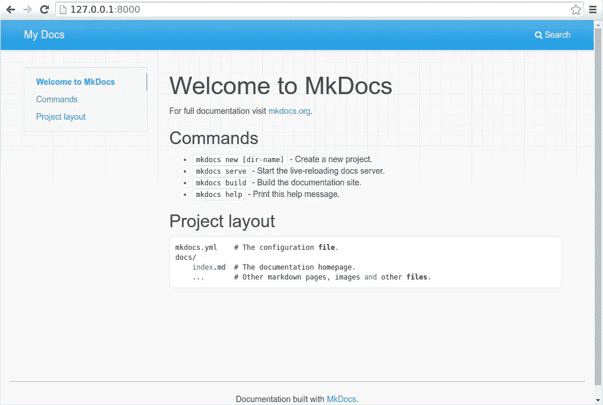

# MkDocs 入门

> 原文：<https://blog.devgenius.io/getting-started-with-mkdocs-643182fd6c69?source=collection_archive---------7----------------------->

## 安装、配置和定制


照片由 [Fabian Grohs](https://unsplash.com/@grohsfabian?utm_source=medium&utm_medium=referral) 在 [Unsplash](https://unsplash.com?utm_source=medium&utm_medium=referral) 上拍摄

好的文档是项目成功的关键。我最近被介绍了一种创建文档的新方法，MkDocs，并且已经为我的开源项目 [pyTigerGraph](https://parkererickson.github.io/pyTigerGraph/) 创建了一个文档站点，并且更新了我的个人作品集页面。MkDocs 是创建漂亮文档的一个非常简单的方法，只需要使用 markdown 和一些配置文件。更好的是，您可以轻松地将这些文档的托管部署到 GitHub 页面。

# 安装和入门

首先，确保您安装了 Python 和 pip。简单来说:`pip install mkdocs`。一旦完成，就该创建新的 MkDocs 项目了。对于记录项目，您可能希望所有文档都位于项目的主目录中。为此，打开该目录的终端，然后运行`mkdocs new my-project`,其中 my-project 是您想要的项目名称。这将创建一个以项目名称命名的新文件夹。然后，您希望从该文件夹中取出内容，并将它们移动到您的项目文件夹中。因此，项目文件结构应该如下所示:

```
project - 
         |- docs - 
         |        |- index.md 
         |        |- anyothermarkdownfiles.md 
         |        |_ stylesheets - (this has to be created) 
         |                        |_ extra.css 
         | 
         |-mkdocs.yml 
         | 
         |- other project files
```

为了确保这一点，只需在你的终端上运行`mkdocs serve`，并在你的网络浏览器上打开`127.0.0.1:8000`。它应该显示如下内容:



MkDocs 文档截图

然后你可以编辑由你的主页内容自动生成的`index.md`页面。保存 MkDocs 跟踪的 markdown 文件会自动刷新本地托管的预览服务器。

# 添加页面

编辑完主页后，您可能想在文档中添加其他页面。为此，我们打开`mkdocs.yml`文件。最初，它可能看起来像这样:

```
site_name: MkLorum 
nav: 
  - Home: index.md
```

您可以通过简单地更改文件中的`site_name`参数来更改站点名称。要添加另一个页面，创建一个新的 markdown 文件，比如`gettingStarted.md`。然后，我们将把它添加到 YAML 文件中，如下所示:

```
site_name: MkLorum 
nav: 
  - Home: index.md 
  - Getting Started: gettingStarted.md
```

对于您想要包含在网页上的任何其他文件，请遵循此过程。

# 选择你的主题

我个人不喜欢 MkDocs 提供的默认网站主题。对于我的个人和项目页面，我选择了[材料](https://squidfunk.github.io/mkdocs-material/)主题。要使用这个主题，运行`pip install mkdocs-material`，并将其添加到您的`mkdocs.yml`文件中:

```
theme: name: material
```

其他主题可以看[这里](https://github.com/mkdocs/mkdocs/wiki/MkDocs-Themes)。下面的定制步骤可能适用于不同的主题，但尚未经过测试。

# 定制

为了改变主题的颜色，我们将创建一个 CSS 文件。在 YAML 文件中，我们需要声明我们想要使用这个文件，通过:

```
extra_css: - stylesheets/extra.css
```

然后我们需要在`docs`文件夹中创建`stylesheets`文件夹。然后我们将创建`extra.css`文件。该文件将如下所示:

```
:root { 
  /* Primary color shades */ 
  --md-primary-fg-color: #7A0019; 
  --md-primary-fg-color--light: #ffffff; 
  --md-primary-fg-color--dark: #7A0019; 
  --md-primary-bg-color: #ffffff; 
  --md-primary-bg-color--light: #ffffff; 
  --md-text-link-color: #7A0019;   /* Accent color shades */ 
  --md-accent-fg-color: #7A0019; 
  --md-accent-fg-color--transparent: #7A0019; 
  --md-accent-bg-color: #7A0019; 
  --md-accent-bg-color--light: #7A0019; 
}
```

您可以在该文件中定义任何类型的自定义配色方案。在上面的例子中，它是褐红色和白色的。

使用 material 主题，我们还可以在我们的网站上添加一个 logo 和 favicon。这可以通过在`mkdocs.yml`的主题区域下添加:

```
theme: 
  name: material 
  logo: [https://avatars1.githubusercontent.com/u/9616171?s=460&v=4](https://avatars1.githubusercontent.com/u/9616171?s=460&v=4)
  favicon: [https://avatars1.githubusercontent.com/u/9616171?s=460&v=4](https://avatars1.githubusercontent.com/u/9616171?s=460&v=4)
```

这将我的 GitHub 个人资料图片添加到站点中，但它也可能是在存储库中找到的图片。

我们还可以添加所需存储库的状态。为此，只需将`repo_url: REPO_NAME_HERE`添加到`mkdocs.yml`中。

我的个人作品集网站底部还包含了各种社交媒体平台的链接。将此添加到您的`mkdocs.yml`:

```
extra: 
  social: 
    - icon: fontawesome/brands/github 
      link: https://github.com/parkererickson 
    - icon: fontawesome/brands/twitter 
      link: https://twitter.com/p_erickson30 
    - icon: fontawesome/brands/linkedin 
      link: https://linkedin.com/in/parker-erickson 
    - icon: fontawesome/brands/medium 
      link: [https://medium.com/@parker.erickson](https://medium.com/@parker.erickson)
```

总的来说，您的`mkdocs.yml`应该是这样的:

```
site_name: Parker Ericksonnav: - 'Home': index.md - 'Projects': projects.md - 'Blog': - 'Getting Started with MkDocs': blog/gettingStartedWithMkdocs.md - 'IPO Prediction Using Graph Convolutional Neural Networks': blog/ipoGCN.md - 'Do You Really Need Trash Cans?': blog/doYouReallyNeedTrashCans.mdtheme: name: material logo: [https://avatars1.githubusercontent.com/u/9616171?s=460&v=4](https://avatars1.githubusercontent.com/u/9616171?s=460&v=4)favicon: [https://avatars1.githubusercontent.com/u/9616171?s=460&v=4](https://avatars1.githubusercontent.com/u/9616171?s=460&v=4) extra: social: - icon: fontawesome/brands/github link: https://github.com/parkererickson - icon: fontawesome/brands/twitter link: https://twitter.com/p_erickson30 - icon: fontawesome/brands/linkedin link: https://linkedin.com/in/parker-erickson - icon: fontawesome/brands/medium link: https://medium.com/@parker.ericksonextra_css:- stylesheets/extra.css
```

# 部署

要部署到 GitHub 页面，请确保已经初始化并正确设置了 GitHub 存储库。然后，确保将`site/`添加到您的`.gitignore`中。然后，简单地运行`mkdocs gh-deploy`。这应该会在您的存储库中创建一个新的分支，将您的 Markdown 和其他文件编译成 HTML 和 CSS，并使 GitHub 页面能够托管它。过一会儿，您应该可以转到`YOUR-ORGANIZATION-NAME.github.io/YOUR-REPO-NAME`查看完成的文档。

*原载于*[*https://Parker Erickson . github . io*](https://parkererickson.github.io/portfolio/blog/gettingStartedWithMkdocs/)*。*