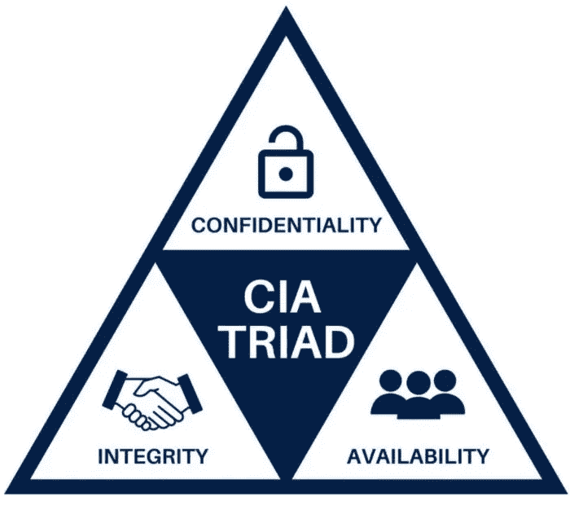
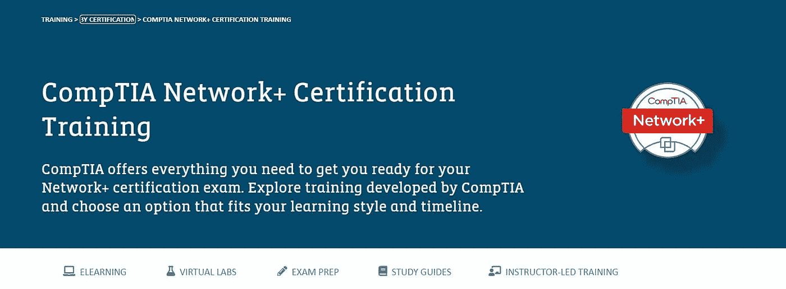

# 网络安全基础入门

> 原文：<https://blog.devgenius.io/getting-started-with-network-security-fundamentals-1a9d458293e0?source=collection_archive---------15----------------------->

[照片](https://unsplash.com/photos/9SoCnyQmkzI)由[杰佛森·桑多斯](https://unsplash.com/@jefflssantos)在 Unsplash 上拍摄

疫情导致人们和企业严重依赖互联网，在家办公，并转向云技术。然而，随着云和其他新技术的使用，在线生成和存储的数据显著增加。随着世界走向数字化，网络犯罪的数量也在增加。

网络犯罪对这个世界来说并不新鲜，但它一直呈指数级增长。每天，我们都会听到网络攻击的消息。甚至像谷歌和微软这样的大型科技巨头也未能幸免。

大多数网络攻击，如 DDoS(分布式拒绝服务)攻击、中间人攻击和 SQL 注入，都发生在网络上，给所有利益相关者造成巨大的经济损失。根据[福布斯报道](https://www.forbes.com/sites/chuckbrooks/2021/10/24/more-alarming-cybersecurity-stats-for-2021-/?sh=57c197cf4a36)，到 2031 年，勒索软件的成本预计将达到 2650 亿美元。因此，科技巨头和小型企业都在寻找安全专业人员，这种需求在未来十年只会增加。

一些基本的网络安全术语解释如下。

# 网络安全性

网络安全是指遵循或改进系统设置的协议，以防止系统遭受任何类型的网络攻击。简而言之，它意味着在网上浏览或通过网络交换数据时保护网络安全。它使用软件和硬件工具来防止各种恶意软件和威胁进入或传播到网络中。

# 网络安全原理

网络安全的三个主要目标是机密性、完整性和可用性。这三者共同组成了 [**中情局三人组**](https://www.fortinet.com/resources/cyberglossary/cia-triad) 。只有同时实现这三个目标，网络才被认为是安全的。

[来源](https://www.securitymadesimple.org/cybersecurity-blog/what-are-the-3-principles-of-information-security)

**保密性，**简单来说，就是指隐私。这意味着用户的数据应该只属于他们，应该受到保护，免受各种恶意软件和黑客的攻击。**完整性**意味着数据应该准确。它应该来自可靠的来源，以便利益相关者可以依赖其准确性和真实性。完整性可以定义为保护任何系统或数据免受任何类型的意外、故意或未经授权的访问或更改。**，**另一方面，可用性意味着系统或数据应该可以被授权用户在任何时候访问，没有任何延迟。

其他比较[混乱](https://auth0.com/docs/get-started/authentication-and-authorization)的重要术语还有**认证**和**授权**。简而言之，身份验证对用户进行确认和验证，授权决定特定用户是否有权访问该系统。

例如，每当用户登录特定网站或应用程序时，都会要求用户输入密码。这就是身份验证，也就是验证用户。但同一个用户没有权限更改网站或应用程序的名称——这是一种授权。

# 不同类型的网络安全

# 防火墙

它是最基本的网络安全类型之一。防火墙充当网络和外部系统或未授权用户之间的屏障。它根据某些预定义的规则阻止不受信任的用户。防火墙可以是软件、硬件或两者兼有。

## 软件防火墙

软件防火墙是一种运行在计算机或服务器上的软件，用于保护计算机或服务器免受外部、未经授权或可疑的访问请求。

## 硬件防火墙

它是安装在计算机外部的物理设备。它一般安装在路由器中，保护整个网络。

# 防病毒和反恶意软件

恶意软件是最常见的网络攻击类型。它是一种被设计用来破坏计算机系统的软件。安装一些防病毒软件有助于监控此类恶意活动的存在，并建议一些快速修复方法。

# 访问控制

顾名思义，访问控制意味着只允许有限的用户访问网络或计算机，这样可以保护网络，因为只有少数人有权访问网络。

# 应用程序安全性

每个设备都有某种类型的应用程序。这些应用是黑客进入系统最简单的方式。因此，运行应用程序安全程序可以保护应用程序免受潜在黑客的攻击，从而保护系统。

这些是保护网络和计算机系统的一些基本工具。甚至个人也可以用它们来保护自己的系统免受黑客攻击。但在组织层面上，情况有所不同。组织或其他公司需要保护成千上万用户和客户的数据以及他们自己的系统。因此，他们寻找专业人士来保护他们的系统和网络。所以，拥有网络安全的专业知识是这类组织的首选。

如果你的职业生涯正在向计算机和网络安全领域过渡，这里有一些有价值的认证供你选择。

# SASE 专家认证

SASE 是一个安全框架，它规定了将安全性和网络连接转换为云平台。作为第一个 SASE 平台，CATO Networks 提供 [SASE 专家认证培训](https://www.catonetworks.com/sase/sase-expert-level-1/)。该课程的主要特点是它对初学者友好，提供自定进度的学习，提供最少 3 到 5 个小时的学习时间，并提供 SASE 迁移的实用指南。

本课程的先决条件是具备网络、安全和云的基本知识。要通过考试，一个需要 85%。拥有该认证证明了您的网络安全性、云计算技能以及适应不断变化的技术的能力。

# CompTIA 网络+认证培训

CompTIA 是世界上提供 IT 认证的领导者。CompTIA [Network+](https://www.comptia.org/training/by-certification/network) 认证确保个人具备联网、管理现有网络设备和创建强大高效网络的知识。CompTIA 提供了一个灵活的培训平台，以适应不同的学习风格、时间表和购买选择。

认证考试包括网络概念、基础设施、网络运行和安全性，以及网络故障排除和工具。因此，该认证涵盖了广泛的主题，并确保很好地掌握网络安全的基础知识。

# 认证网络卫士

认证网络卫士( [CND](https://www.eccouncil.org/programs/certified-network-security-course/) )认证是针对具备网络概念基础知识的个人。CND 课程旨在教授专业人员创建和部署网络防御系统。培训计划由 20 个模块组成，包括网络攻击、管理和防御策略，以及实际应用。

培训计划包括超过 50%的实验室强化培训，侧重于现实世界的技能。这个认证对于那些想在网络安全和维护网络系统方面发展自己职业生涯的人来说是非常好的。

# 结论

网络安全是一个不断发展的领域，需要专业人员来保护网络免受各种威胁。由于缺乏安全领域的熟练人员，这种培训认证在处理现实问题的同时提供了该主题的深刻知识和信心。拥有一个证书将证明有利于个人考虑在这一领域的职业生涯。