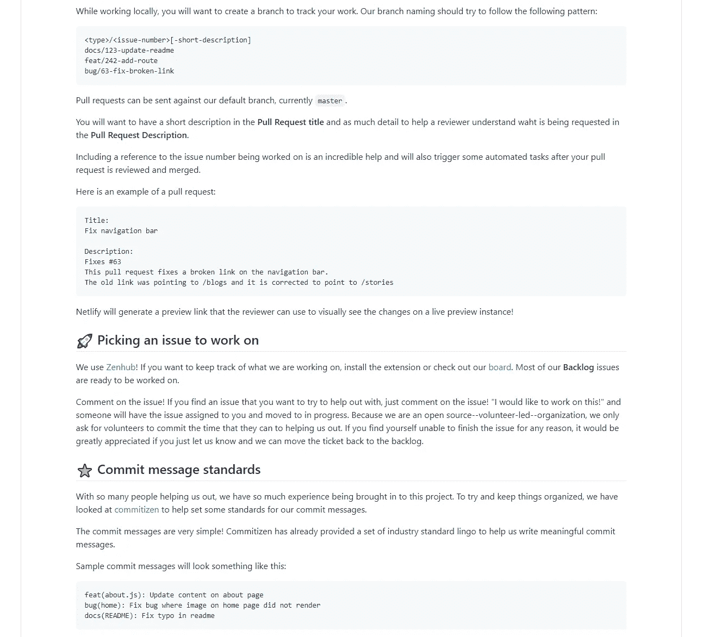

# 开源入门

> 原文：<https://blog.devgenius.io/getting-started-with-open-source-ce5231b23de8?source=collection_archive---------41----------------------->

为什么你应该尽快开始为开源项目做贡献，以及你如何从今天开始。

制造者在 [Unsplash](https://unsplash.com?utm_source=medium&utm_medium=referral) 上 [NESA 的照片](https://unsplash.com/@nesabymakers?utm_source=medium&utm_medium=referral)

# 为什么要开源？

因为，这是为每个人准备的。玩笑归玩笑，开源软件和应用程序正以惊人的速度增长，参与开源项目是一种让你接触代码的惊人方式。

也许你是一名计算机科学专业的学生，在下学期和实习之间有一点额外的时间，也许你是一名训练营的毕业生，希望在合作的环境中继续完善你的技能，或者也许你是完全自学的，希望掌握版本控制并更多地接触大型代码库。无论你是否符合这些模式，开源项目都是继续开发你的编码和协作技能的好方法。

一个快速的[维基](https://en.wikipedia.org/wiki/Open-source_software)搜索显示…

> “开放源代码软件(OSS)是一种计算机软件，其中源代码根据许可证发布，版权所有者授予用户使用、研究、更改和向任何人出于任何目的分发软件的权利。”

通俗地说，这允许私营企业、公共实体、个人等之间的大规模协作，尽管有些[开源项目是绝对大规模的，如 Flutter、TensorFlow 和 React-Native，但其他较小的项目通常提供重大价值，是开始时的好去处。](https://insights.dice.com/2019/11/08/10-popular-open-source-projects-github/)

开源就在我们身边，我们作为开发者不断地使用它，这是为开发者社区做贡献的一个很好的方式，这就是为什么你应该尽快开始为这些项目做贡献。

# 我该如何开始？

当您第一次进入开发领域时，想到为一个庞大的项目做贡献可能会令人畏惧，这个项目是成千上万甚至上万的开发人员开发他们自己的应用程序所依赖的，但是开源并不一定是其他人使用的包，尽管它可以是，开源也可以是简单的应用程序，在危机期间或通过社区行动帮助人们。事实上，新冠肺炎已经催生了大量新的开源项目，这些都是可以立竿见影的好项目。

开始可以很简单，只需转到谷歌寻找开源项目(用一个有趣的术语搜索)，你也可以更具体地搜索，比如你确实想帮助一个与 COVID 相关的项目(点击[此处](https://helpwithcovid.com/projects))或者也许你喜欢 NPM 上的一个包，你认为你可以调整，所有这些以及更多都可以成为选择你想为之做出贡献的项目的重要途径。你甚至可以访问 GitHub，找到“探索资源库”,找到一些有趣的开源项目。当你在寻找潜在的项目时，只需仔细检查以确认它确实是开源的。

# 为项目做贡献

你已经找到了你想参与的项目，现在是时候投入进去了。这可能是最令人生畏的方面，当开始参与这类项目时，你可能会发现自己迷失在需要完成的工作中，但不要担心，当开始一个新项目时，有一些关键领域需要关注，这将有助于指导你找到可以开始的工作。

首先，查看初始自述文件，它可能会为您提供让应用程序在本地运行的必要步骤，根据我的经验，通常是这样完成的:分叉，然后创建一个新的分支在本地工作，然后在您完成本地问题的工作并与核心分支重新合并后，创建一个拉请求。查看[这一附加信息](https://docs.github.com/en/github/collaborating-with-issues-and-pull-requests/working-with-forks)关于处理分叉、同步分叉和合并上游，这些都很重要。

更常见的是，最初的自述文件可能还包括一个专门关注贡献的附加文档。如果之前没有涉及到，那么本文档可能会澄清任何悬而未决的问题，例如首选的提交方法、在请求开始之前必须进行的任何测试或格式化，以及应该如何配置提交或分支。

我一直在做的一个开源项目的 CONTRIBUTING.md 文档([弹性](https://github.com/factn/resilience-landing-page))

这些文档也可能是阐明项目的角色和需求的地方，但是你几乎总是可以找到关于设计、开发、质量保证、项目管理、治理、文档等等的额外工作，在你感觉最舒服的地方潜水。

通常情况下，根据上面列表中您最感兴趣的工作，您还可以找到“良好的第一个问题”或具有类似语言的问题或标签(取决于项目管理设置)。如果你犹豫要不要承担更大的角色，这种类型的问题可以很好地接受，并慢慢地学习代码库，除了你在周围挖掘的巨大曝光度之外，当你继续进行项目时，你还会经常从其他人那里得到很好的反馈。

一旦您添加了新的登录页面元素或清理了一些文档或为应用程序功能创建了一些测试，就该提交您的 pull 请求并进入下一期了，就这样，您开始为一个开源项目做贡献了，真棒。

# 好处是巨大的

在整篇文章中，我回避了从事开源项目的一些好处，但是要重申，这些好处是巨大的。您将获得在学术环境之外的各种规模的代码库上工作的真实经验，您将与其他开发人员一起工作，并在使用版本控制的同时获得协作经验，您将接触到网络，您将接触到可以在未来应用于其他项目的新工具、技术和方法，这实际上是冰山的一角。

作为一名开发人员，参与这些项目将有助于你的全面发展。

# 最后的想法

虽然开始可能有点吓人，但让您的第一个拉请求被接受并与开源项目合并是一种很棒的感觉，会让您成为更好的开发人员。

开源和它的重要性正在我们的眼前发展，只要有一点指导，一些关于版本控制的澄清和清晰的贡献指南，你就可以对这种发展产生直接的影响。

编码快乐！