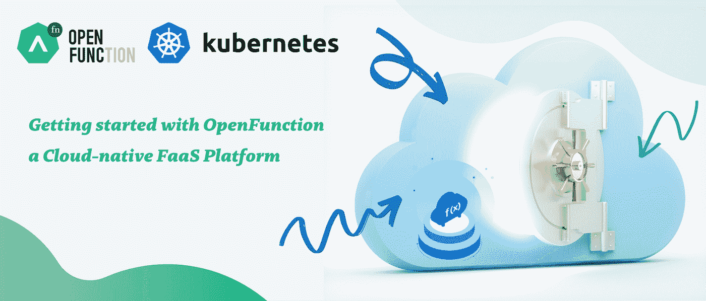
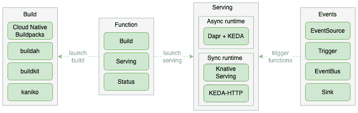

# OpenFunction 入门:云原生 FaaS 平台

> 原文：<https://blog.devgenius.io/getting-started-with-openfunction-896e7b27b690?source=collection_archive---------2----------------------->

Minikube 上 OpenFunction 的 5 分钟设置，以便在 Kubernetes 上运行功能



经过三年多的开发，Knative 最近宣布[推出 Knative 1.0](https://knative.dev/blog/articles/announcing-knative-1.0/) ，标志着其核心组件(发球、赛事)已经全面上市。这表明 Kubernetes 无服务器框架生态系统的成熟，包括 OpenFaaS、OpenWhisk、Kubeless、Fn 等等。然而，所有这些框架都只专注于服务打包成容器的功能，而没有提供功能齐全的功能即服务(FaaS)平台。

[OpenFunction](https://github.com/OpenFunction/OpenFunction) 是由 [KubeSphere](https://kubesphere.io/) 团队支持的开源项目，于 2021 年 5 月首次发布。它旨在增强现有框架，并提供一个端到端的 FaaS 平台，以在 Kubernetes 上构建和服务事件驱动的功能。

# OpenFunction 组件

目前，OpenFunction 分为四个自定义资源定义(CRD):

*   **功能:**通过与构建者和服务组件协调来控制功能的生命周期
*   **构建器:**编译、构建并发布函数到容器注册表
*   **服务:**运行功能并控制缩放事件
*   **域:**为函数提供一个入口点



在幕后，OpenFunction 利用几个开源项目来实现每个 CRD:

*   Builder 使用 [Shipwright](https://shipwright.io/) 和 [Cloud Native Build Packs](https://buildpacks.io/) 将功能代码编译并构建到容器中。
*   Serving 支持 [Knative](https://knative.dev/docs/) 和 OpenFuncAsync，是基于 [KEDA](https://keda.sh/) 和 [Dapr](https://dapr.io/) 的运行时。
*   默认情况下，域使用 nginx-ingress。
*   此外，[证书管理器](https://cert-manager.io/)和 [Tekton 管道](https://tekton.dev/)用于将所有部分粘合在一起。

OpenFunction 提供了一个方便的 [cli](https://github.com/OpenFunction/cli) 来安装所有的组件，但是在这个演示中，我们将使用原始的安装脚本来控制我们的安装，并在 Minikube 上运行一些示例函数。

# 启动 Minikube

OpenFunction 应该可以在 Kubernetes 的任何发行版上工作，但是对于这个演示，我们将使用 Minikube。由于 OpenFunction 所依赖的组件，Minikube 至少需要 2 个 CPU 和 4 GB 才能运行:

```
$ minikube start –cpus 2 –memory 4096
```

*注意:确保 minikube 运行的是 Kubernetes 1.19 或更高版本*

接下来，我们需要为构建器组件提供图像注册凭证，以便将图像推入其中。我将使用 Docker，但任何图像注册表都应该工作:

```
$ kubectl create secret docker-registry regcred — docker-server=https://index.docker.io/v1/ — docker-username=<myUsername> — docker-password=<myPassWord>
```

# 安装 OpenFunction

现在我们准备安装 OpenFunction。克隆 [OpenFunction repo](https://github.com/OpenFunction/OpenFunction) 并检查`hack/deploy.sh`脚本。

对于一个基本的演示，我们只需要 Shipwright、Knative 和 cert-manager 作为先决条件:

```
$ sh hack/deploy.sh --with-shipwright --with-knative --with-cert-manager
```

接下来，安装 OpenFunction:

```
$ kubectl create -f [https://github.com/OpenFunction/OpenFunction/releases/download/v0.4.0/bundle.yaml](https://github.com/OpenFunction/OpenFunction/releases/download/v0.4.0/bundle.yaml)
```

等待控制器管理器运行正常:

```
$ kubectl get pods — namespace openfunction -wNAME READY STATUS RESTARTS AGEopenfunction-controller-manager-6955498c9b-hjql7 2/2 Running 0 2m2s
```

# 部署功能

所有的示例应用程序都托管在[示例](https://github.com/OpenFunction/samples)部分，但是目前只有 golang 文档有完整的说明。我也使用 golang 示例，但是选择任何支持的语言，并根据需要修改下面的 YAML 文件(openfunction.yaml):

```
apiVersion: core.openfunction.io/v1alpha2
kind: Function
metadata:
  name: function-sample
spec:
  version: "v1.0.0"
  image: "<your-docker-registry>/sample-go-func:latest"
  imageCredentials:
    name: regcred
  port: 8080 # default to 8080
  build:
    builder: openfunction/builder:v1
    env:
      FUNC_NAME: "HelloWorld"
      FUNC_TYPE: "http"
    srcRepo:
      url: "[https://github.com/OpenFunction/samples.git](https://github.com/OpenFunction/samples.git)"
      sourceSubPath: "latest/functions/Knative/hello-world-go"
  serving:
    runtime: "Knative" # default to Knative
    template:
      containers:
        - name: function
          imagePullPolicy: Always
```

创建函数:

```
$ kubectl create -f openfunction.yaml
```

检查正在创建的 pod，并检查这些 pod 的日志，以防遇到错误(例如，错误的 Docker 凭证):

```
$ kubectl get functions.core.openfunction.io$ kubectl get servings.core.openfunction.io
```

# 测试样本功能

一旦功能工作负载正常运行，我们就可以公开服务来触发事件。

在单独的终端上，创建一个到 minikube 端点的隧道:

```
$ minikube tunnel
```

通过运行以下命令获取我们函数的 URL:

```
$ kubectl get ksvc
```

点击端点(用您的端点替换 url):

```
$ curl [http://serving-rjgqg-ksvc-zf8j2.default.127.0.0.1.sslip.io](http://serving-rjgqg-ksvc-zf8j2.default.127.0.0.1.sslip.io)
```

我们应该看到我们的“你好，世界！”消息。

# 后续步骤

因为 OpenFunction 实现 Knative 作为其运行时组件，所以所有的 [Knative 示例](https://knative.dev/docs/serving/samples/)将是兼容的。从个人经验来看，对于已经在运行 Kubernetes 集群的团队来说，无服务器框架往往最适合允许开发人员快速运行任意业务功能(例如，当事件 X 发生时发送电子邮件，当 webhook 被触发时运行数据转换作业)。我们将在这篇文章的第二部分探讨一个更现实的无服务器场景。

*更多内容尽在*[*blog . dev genius . io*](http://blog.devgenius.io)*。*