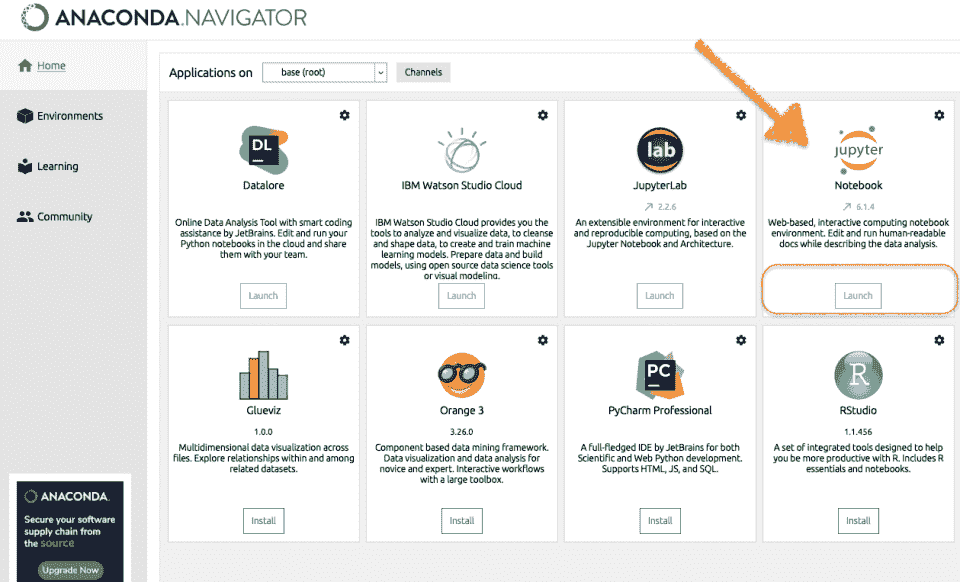

# 开始 Python 数据处理

> 原文：<https://blog.devgenius.io/getting-started-with-python-data-processing-8cebf195e472?source=collection_archive---------15----------------------->


Python 数据处理:环境和主要解剖结构。

```
· [1\. Run Anaconda](#6e4d)
· [2\. Create a Jupyter Notebook](#64d9) 
· [3\. Begin Python data analysis](#9387)
· [4\. Anatomy of Python data analysis scripts](#0ab1)
· [5\. Your turn..](#1017)
```

在本文中，我想引导您完成一些基本步骤，以便使用 Python 快速启动和运行，进行数据分析和处理。

我们将使用 Anaconda 提供的 Python 发行版，这个平台有很多免费的数据科学工具和库，我是它们的超级粉丝。如果你还没有安装，你可以从[这里](https://www.anaconda.com/products/distribution)下载，点击几下就可以安装了。

一旦安装完毕，我们就去看看您如何快速开始使用 Python 及其最佳的数据分析库。

# 1.运行蟒蛇


您将看到 Anaconda 界面，其中包含大量数据科学工具。让我们推出 **Jupyter 笔记本**。



# 2.创建 Jupyter 笔记本

Jupyter 笔记本是一个开源网络应用程序，允许您创建包含实时代码、公式、可视化和叙述性文本的文档。

我们就快到了，准备开始编写 Python 了。在弹出的网页中，点击**新建**并选择 **Python 3** 。


请注意，在左侧的同一页上，有一个小文件夹符号:这是 Anaconda 读取的主文件夹和默认文件夹，位于您在安装过程中选择的位置。这是保存所有 Python 项目、源文件、脚本等的方便地方。

# 3.开始每日数据分析

您已经准备好了:您已经创建了一个新的 Jupyter 笔记本，现在您应该重命名(编辑顶部的标题)并保存。

您可以在中标记为**的单元格上编写 Python 代码，并运行它们以立即查看执行结果。**


我意识到，在这篇文章中，我讲得非常快，我没有解释什么是 Jupyter 笔记本，也没有解释它无穷的可能性。这是因为本文的目的只是描述如何快速创建一个练习和学习 Python 的环境。

# 4.Python 数据分析脚本剖析

无论您的目标有多复杂，您为数据分析、操作和处理而运行的所有 Python 代码都将始终由几个概念部分组成:

*   **导入必要的库，**为您提供正确的数据操作功能(例如熊猫、努皮、海马等)。)
*   **数据采集**，从外部文件、数据库表等导入您要处理的原始数据..
*   **数据探索**，了解您的数据，并计划您将如何处理它们(例如，需要清理吗？转变？增强？等等。)
*   **构建您的特定交付成果**，即专门实现您的主要目标的代码(例如，可以是数据分析、机器学习模型、NLP 应用程序等)。)

让我们来看看这四个主要部分的一个非常综合的例子，每个部分只用了一行代码！


要下载这个笔记本，只要点击[这里](https://datatelier.com/download/1118/)，源文件就是[这里](https://datatelier.com/download/832/)。

# 5.轮到你了..

我们刚刚看到了如何快速开始使用合适的 Python 环境，以及典型的数据处理 Python 脚本是如何由四个主要部分组成的。这些是我们 Python 数据处理之旅的起点。

感谢阅读。

[随时订阅我的**【分享数据知识】**简讯**。**](http://eepurl.com/humfIH)


如果你想订阅《灵媒》,请随意使用我的推荐链接[https://medium.com/@maw-ferrari/membership](https://medium.com/@maw-ferrari/membership):对你来说，费用是一样的，但它间接有助于我的故事。

*原载于 2022 年 7 月 16 日 https://datatelier.com*[](https://datatelier.com/getting-started-with-python-data-processing/)**。**