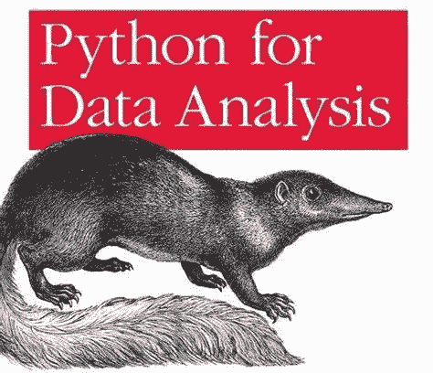

# 面向初学者的 Python 入门。

> 原文：<https://blog.devgenius.io/getting-started-with-python-in-your-domain-for-beginners-a2218bf6db2a?source=collection_archive---------4----------------------->

## 权威指南

## 在 Python 中出类拔萃的特定领域书籍。

Python 入门或想在您的领域中了解更多 Python 知识？那么这个博客是给你的。

杰西卡·鲁斯切洛在 [Unsplash](https://unsplash.com/s/photos/books?utm_source=unsplash&utm_medium=referral&utm_content=creditCopyText) 上的照片

书籍是获取信息的一种很好的形式，因为它们可以帮助你在自己的时间掌握概念，并且你可以在方便的时候阅读它们。本文为你带来了关于 Python 的最好的书籍，从初级到特定领域的书籍，无论是初学者还是专家。

# **这篇博文分为以下几个部分** s:

1.  为什么要选择 Python？
2.  Python 的应用？
3.  初级 Python 书籍。
4.  特定领域的 Python 书籍。

# 1.为什么要选择 Python？

存在许多编程语言，但从中选择最好和最简单的一种非常重要。Python 就是这样一种语言。这是一种容易掌握的语言。这主要是因为它类似于英语。Python 的语法的特点是很少有规则和特例。

**以下是选择 Python 的 5 个主要原因→**

*   Python 灵活而健壮
*   广泛可用的资源
*   Python 很容易学习和使用
*   被业界高度使用
*   强大的图书馆和许多职业机会。

# 2.Python 的应用？

python 有许多应用，下面是一些常用的应用:

1.  Web 开发
2.  机器学习和人工智能。
3.  科学和数字计算
4.  桌面图形界面
5.  数据科学和数据可视化
6.  软件开发
7.  游戏开发

# 3.初级 Python 书籍

## 1. [**学 Python 3 敬酒不吃吃罚酒**](https://www.amazon.in/Learn-Python-Hard-Way-Introduction/dp/0134692888/ref=sr_1_1?dchild=1&hvadid=72292967183676&hvbmt=be&hvdev=c&hvqmt=e&keywords=learn+python+the+hard+way&qid=1596708760&sr=8-1&tag=msndeskstdin-21)

泽德·a·肖著

**这本简单的书旨在给你编程的第一个开始。**标题说这是学习写代码的最难的方法，但实际上不是。这是“难”的方法，只是因为这是人们过去用来教东西的方法。在这本书里，你将会做一些非常简单的事情，所有程序员在学习一门语言时都会做的事情:完成每个练习，准确地输入每个示例，让它运行。就是这样。这一开始会很困难，但要坚持下去。如果你通读这本书，每晚做 1-2 个小时的练习，你可能不会真的从这本书中学到“编程”,但你会学到开始学习语言所需的基础技能。****

**阅读该书的详细评论→[https://blog . soshace . com/learn-python-the-hard-way-a-detailed-book-review/](https://blog.soshace.com/learn-python-the-hard-way-a-detailed-book-review/)**

## **[2**。Python 速成班第二版**](https://www.amazon.com/Python-Crash-Course-2nd-Edition/dp/1593279280/ref=tmm_pap_swatch_0?_encoding=UTF8&tag=journaldev-20)**

****

**对于初学者来说，看到最初几个成功的项目将有助于提高继续学习这种强大的编程语言的动力。这本书充满了实际的例子和项目，你可以工作，并看到你的第一个成功的项目。一旦你掌握了这里的一些东西，你就可以去阅读一些更高级的书籍或者钻研一下 [Python 文档](https://docs.python.org/3/)。**

## **[3。自学成才的程序员](https://www.amazon.com/gp/product/B01M01YDQA/ref=x_gr_w_bb_glide_sout?ie=UTF8&tag=x_gr_w_bb_glide_sout-20&linkCode=as2&camp=1789&creative=9325&creativeASIN=B01M01YDQA&SubscriptionId=1MGPYB6YW3HWK55XCGG2)**

****

**这本书不仅仅是关于学习用 python 编程，尽管你将学习编码。如果你想专业编程，仅仅学会编程是不够的，这就是为什么，除了帮助你学习编程，这本书还涵盖了你需要知道的专业编程的其余内容和实现它的路线图。《自学成才的程序员》是一个路线图，一个引导你从编写第一个 Python 程序到通过第一次技术面试的指南。**

# **4.特定领域的 Python 书籍。**

**一旦我们掌握了 python 的基础知识，为什么不根据我们的兴趣和需求继续学习不同领域的书籍呢？这些书籍可以帮助你建立自己的事业，实现你的目标。**

## **Web 开发书籍→ [DJANGO for 初学者](https://amzn.to/2HvPXlx)**

****

**[https://amzn.to/2HvPXlx](https://amzn.to/2HvPXlx)**

**Python 可以用来快速开发 web 应用程序，这本书可以帮助你学习如何构建它们。它讲述了 Django 的基础知识，包括结构、视图、模板和测试。此外，它还拥有一些项目，如带有评论区的报纸应用程序、消息应用程序等等。如果你想用 Python 开发 web 应用程序，这是一本非常好的书**

## **2.机器学习→ [使用 SkLearn、Keras 和 TensorFlow 进行动手机器学习](https://www.amazon.com/Hands-Machine-Learning-Scikit-Learn-TensorFlow-ebook/dp/B07XGF2G87/ref=sr_1_1?dchild=1&tag=journaldev-20)**

****

**深度学习推动了整个机器学习领域。实现能够从数据中学习的程序的有效工具。如果你看看 Python 的受欢迎程度，你也会注意到 Python 在机器学习时开始变得受欢迎。所以，完成你的 Python 学习，成为一个拥有抢手编程技能的完整的 Python 程序员——机器学习。**

## **3.物理学→ [**物理学中的有效计算**](https://www.amazon.in/Effective-Computation-Physics-Anthony-Scopatz/dp/1491901535)**

****

**这本书对于任何科学家或想成为科学家的人以及数据分析师或任何处理大量数据的人来说都是一个完美的指南，因为它从 Python 的基础开始，然后深入到数据教学以及科学家如何使用 Python 快速有效地执行他们的操作。因此，如果你想学习如何使用 Python 进行科学计算和数据处理，这本书是最好的开始。**

## **4.数据分析师→ [用于数据分析的 python](https://www.amazon.com/Python-Data-Analysis-Wrangling-IPython-ebook/dp/B075X4LT6K/ref=sr_1_1?crid=GIZITO2UQE8Q&dchild=1&keywords=python+for+data+analysis&qid=1596713176&s=digital-text&sprefix=python+for+data+ana%2Cdigital-text%2C415&sr=1-1)**

****

**这本书关注的是 Python 中操作、处理、清理和处理数据的核心解释。本书的目标是提供 Python 编程语言及其面向数据的库生态系统和工具的部分指南，帮助您成为一名有效的数据分析师。虽然“数据分析”是这本书的标题，但重点是 Python 编程、库和工具，而不是数据分析方法。这是你进行数据分析所需要的 Python 编程。**

## **5.面向对象编程→ [掌握面向对象 Python](https://www.amazon.com/Mastering-Object-Oriented-Python-powerful-applications-ebook/dp/B07T8XF5HH/ref=sr_1_9?dchild=1&tag=journaldev-20) 。**

****

**一旦你对 Python 语言有了扎实的理解，这将是最好的 Python 编程书籍之一。与函数式编程相比，OOPs 是一种完全不同的思考和编码方式。因此，如果你来自像 C 这样的函数式编程语言，你将需要一些时间来适应对象，但是，这本书在介绍和解释 Python 中面向对象编程的概念方面做得很好。**

****为了让初学者对面向对象编程有一个简单的了解，你甚至可以参考我以前的博客。****

** [## 为什么要学习 Python 中的面向对象编程？

### 面向对象意味着直接面向对象。准确地说，这意味着在功能上直接面向建模…

levelup.gitconnected.com](https://levelup.gitconnected.com/why-learn-objects-oriented-programming-in-python-794cdccc4caa) 

## 6.网络→ [掌握 Python 网络——网络自动化一站式解决方案](https://www.amazon.com/Mastering-Python-Networking-solution-automation/dp/1784397008/ref=as_li_ss_tl?ie=UTF8&linkCode=sl1&tag=pytonbooks-20&linkId=362dda1814abd30622d7a5d5800c260c)。

这本书是为有网络背景的人编写的，目的是成为用 Python 实现高级网络相关任务的专家。这本 446 页的书从回顾 TCP/IP 协议和 Python 语言的核心元素开始。稍后，你会遇到不同的库文件来计算机化任务。

## 7.网络安全→ [暴力 Python:黑客、法医分析师、渗透测试员和安全工程师的食谱](https://www.amazon.in/Violent-Python-Cookbook-Penetration-Engineers-ebook/dp/B00ABY67JS)

暴力 Python 为你提供网络安全的基础知识。它教你法医分析和其他组成部分需要恢复使用各种技术和方法。它还向您介绍了渗透测试，在渗透测试中，红队安全工程师试图破坏客户端的服务器，蓝队安全工程师试图找到突破点并加以解决，以进一步提高安全性并维护系统的完整性。** 

# **结论:**

**我们在上面讨论了许多书，我们有一个对它的描述，这将帮助你根据你的兴趣和要求找出最好的书。根据我的研究和知识，以上书籍是我的个人选择。希望这篇博客能帮助你平静地寻找 Python 的最佳书籍。坚持阅读，坚持学习，坚持分享。**

> **如果你仍然很难为自己选择最好的书，你可以通过下面的链接联系我。我会尽我最大的努力帮你选出最好的一本书，如果我错过了什么书，请告诉我。**

## **伸出手来！**

## **https://pythonmanin.wordpress.com/contact/**

# **参考资料:**

1.  **【https://www.python.org/ **
2.  **https://www.amazon.in/只需点击上面任何一本书的名字就可以得到一本。**
3.  **[https://www.goodreads.com/](https://www.goodreads.com/)→查看上述书籍的不同读者的评分和评论。**
4.  **[https://blog . soshace . com/Learn-python-The-Hard-Way-a-detailed-book-review/](https://blog.soshace.com/learn-python-the-hard-way-a-detailed-book-review/)→详细回顾《艰难地学习 Python》一书。**