# Python、Pandas 和 Jupyter 笔记本入门

> 原文：<https://blog.devgenius.io/getting-started-with-python-pandas-and-jupyter-notebooks-bd08c963914?source=collection_archive---------0----------------------->


## 为您设置 Jupyter 笔记本电脑和开始使用 Python、Pandas 和其他令人兴奋的数据分析包编程所需的一切提供文档。

在 Jupyter 笔记本上使用 Python 是——至少对我来说——开始编程的最快和最有回报的方式。Python、Pandas 和 Jupyter 的结合将为数据分析、可视化以及探索数据和编程的广阔世界开辟一个新的天地。

在我看来——作为一个仍然从后视镜中看到自己初学者历史的人——这对编程新手来说是一个完美的入门斜坡。

如果你是通过 Excel 的方式进入 Pandas/Python/Jupyter 编程，那就更完美了。你将会很好地理解这些熊猫的概念。

事不宜迟，我们开始吧！


注意:你在用什么样的机器？

*所有这些文档都是为在 Mac 上工作的人编写的。这是我拥有的机器，因此我缺乏帮助其他机器/操作系统所需的观点。这个文档可能对你还是有用的，但是我现在不能确认。*

# 目录

1.  [命令行/终端导航](#2bdc)
2.  [Anaconda Navigator 和设置 Python 3.7 环境](#7531)
3.  [推出您的第一台 Jupyter 笔记本](#6450)
4.  [进口熊猫等套餐](#4dab)

# 步骤 1:命令行/终端导航

我们要做的第一件事就是下载 iTerm。

对于这一点，iTerm 并不是必需的——您可以只使用终端。

这只是一个终端替换。我只是喜欢使用它。请点击下载[。](https://iterm2.com)

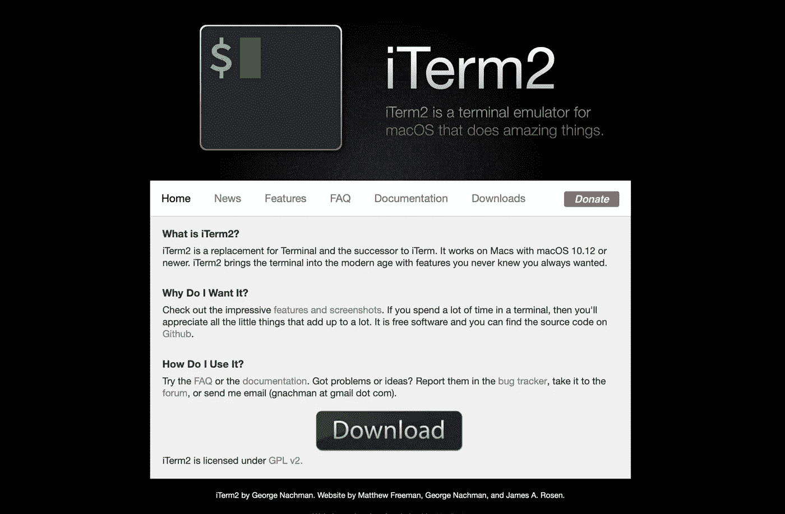

下面是我们将要习惯的一些终端命令:

```
ls = "list" // show a list of files in current directorycd = "change directory" // move down into a new directorycd .. // move backwards out of current directorymkdir = "make directory" // make a folderrm = "remove" // remove file or folderclear // clear terminal
```

这是你开始学习所需要知道的一切。需要更多的命令行知识，但是如果您从未使用过命令行，这将是一个很好的起点。我认为最好在命令行中只学习你需要知道的东西，并在你需要的时候学习新概念。

我总是发现没有可视化队列的文档对我来说很难理解，所以我将为您提供一些我在命令行或 Jupyter 笔记本中工作的有用的 gif，如下所示:

```
ls = list the files in the current directory
```

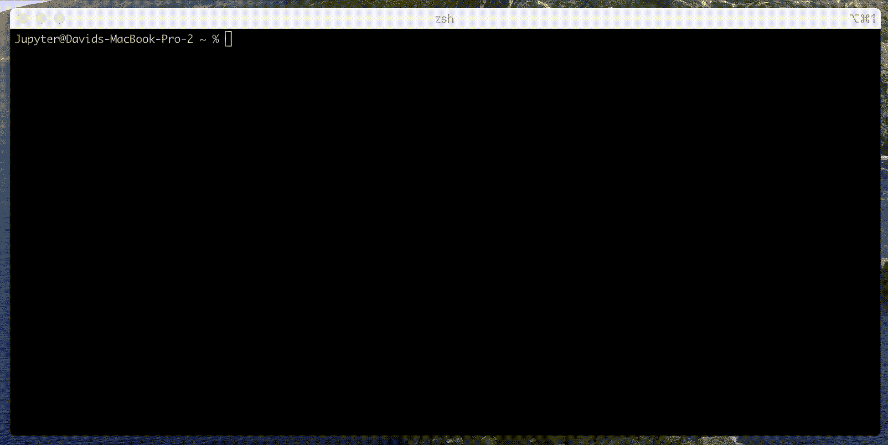

```
cd Desktop = change directory into "Desktop" directory
```

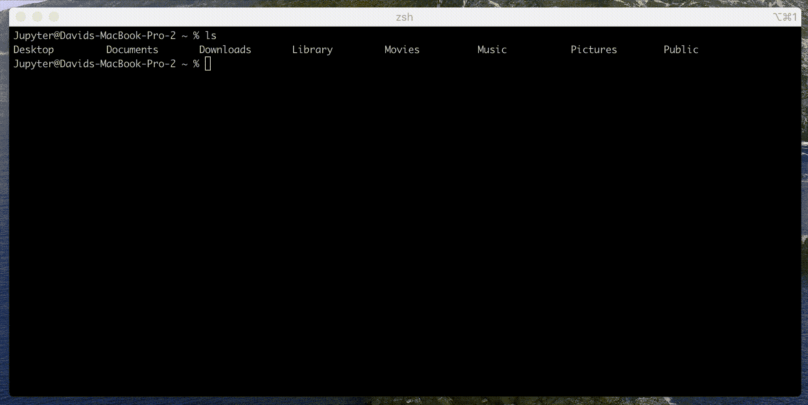

```
mkdir jupyter_notebooks = make a new directory called "jupyter_notebooks"ls = list everything in currenty directory (now you see the new directory that you just created)
```

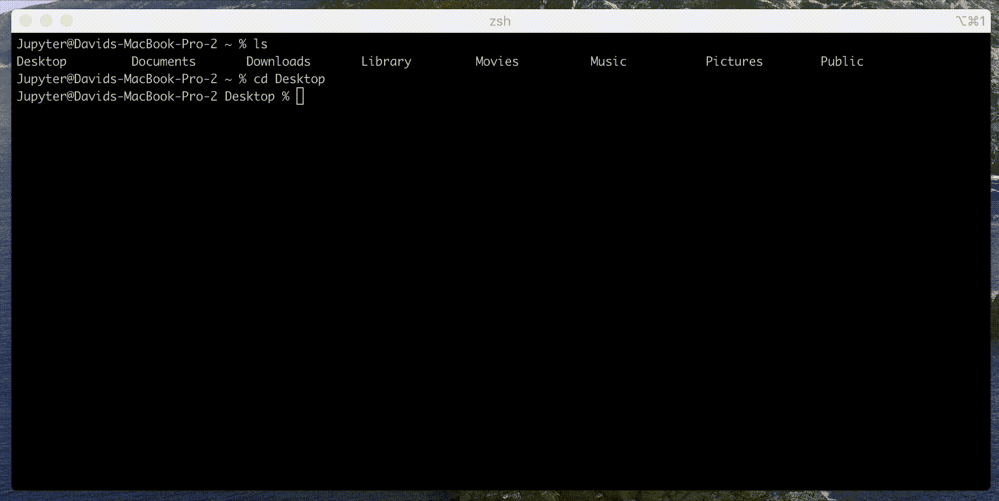

```
cd jupyter_projects = change directory into the new directory we just created. Notice I use "tab" after typing the first few letters. Terminal is smart enough to guess what path you are trying to finish.ls = list files in the directory. Notice nothing returns because there are no files in this directory yet.
```

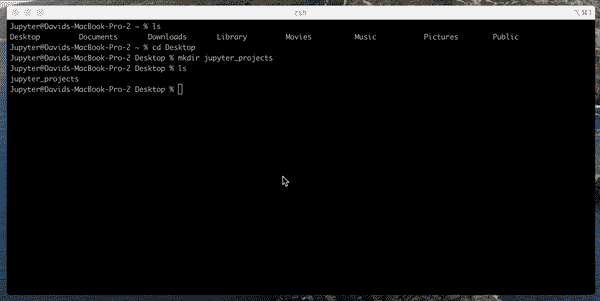

```
cd .. = change directory into previous directory in the hierachyls = list files
```

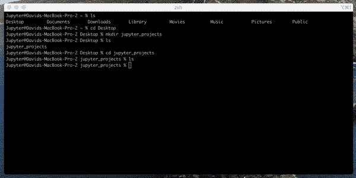

```
cd Desktop = you know what this does by now
```

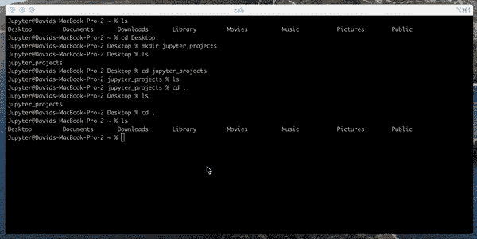

```
rmdir jupyter_projects = remove directory jupyter_projectsthis is how to delete a directory
```

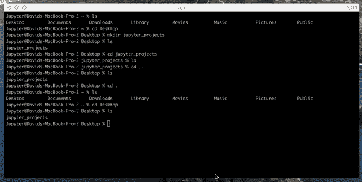

```
cd .. = you know what this means by nowls = you know what this means by nowclear = clear the terminal window
```

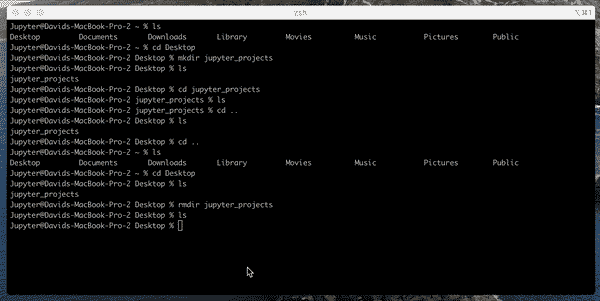

就是这样！练习这东西几天，它会成为第二天性。如果你一开始绊倒了，不要担心。开始时磕磕绊绊是正常的。保持动力。

# 步骤 2:下载和软件要求

让我们首先在终端中检查我们的 Python 版本。如果你用的是 Mac，Python 应该已经在你的电脑上了。

“Mac OS X 10.8 附带苹果预装的 Python 2.7。如果你愿意，我们邀请你从 Python 网站([https://www.python.org](https://www.python.org/))安装最新版本的 Python 3。”

```
python --version
```

在终端中运行这个命令应该会得到如下结果:

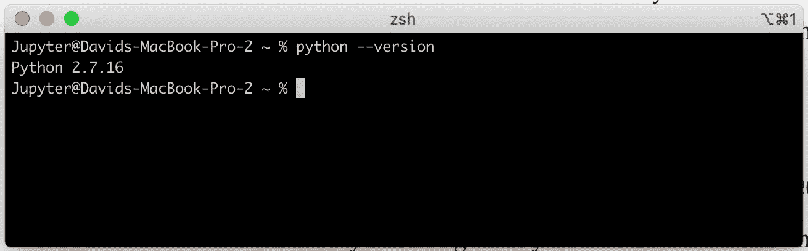

我们运行的是 2.7.16。

接下来，让[下载 Anaconda Navigator](https://docs.anaconda.com/anaconda/install/mac-os/) 。这是一个工具，我们将使用它来管理我们的编程环境和我们需要安装在我们的编程环境中的不同的包，这些包将允许我们运行 Jupyter 笔记本、Pandas 等。

点击这里，进入苹果电脑[的下载页面。](https://www.anaconda.com/products/individual#macos)

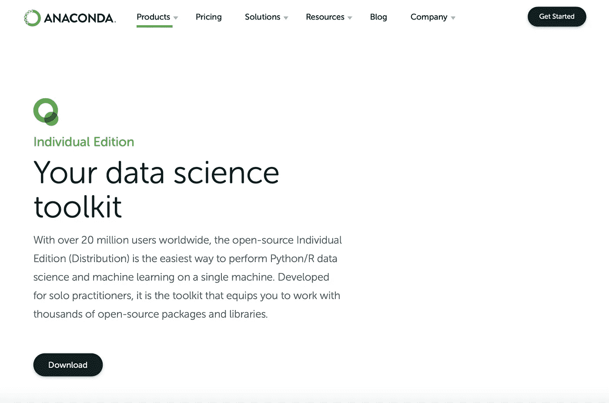

我准备选择 Python 3.7 下的 64 位图形安装程序。我们将使用 Python 3.7 运行我们的 Jupyter 笔记本

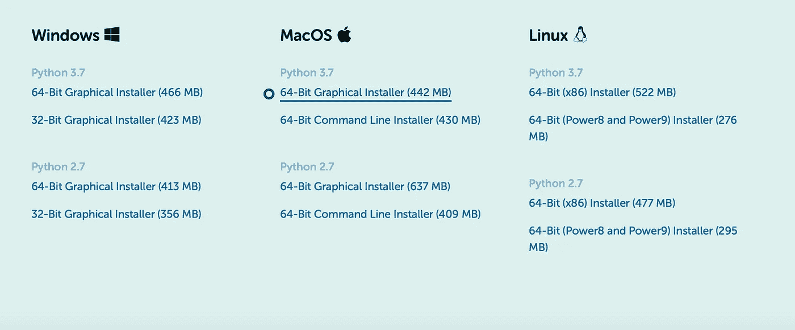

运行安装程序。你知道该怎么做。

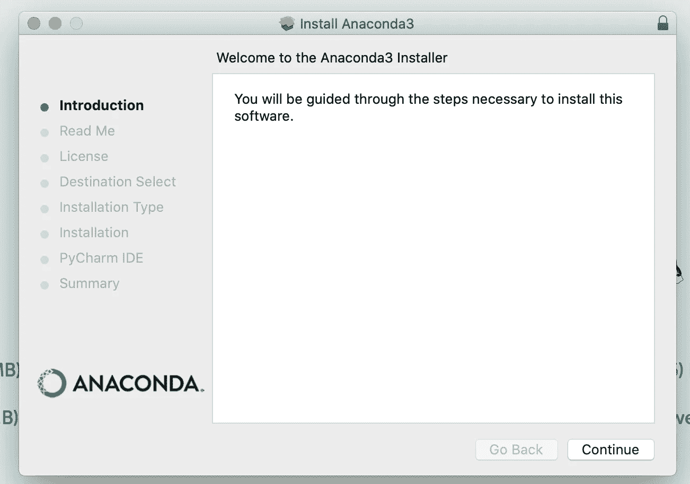

接下来，打开 Anaconda Navigator。您可能会被要求更新 Anaconda。可以更新，也可以直接忽略。

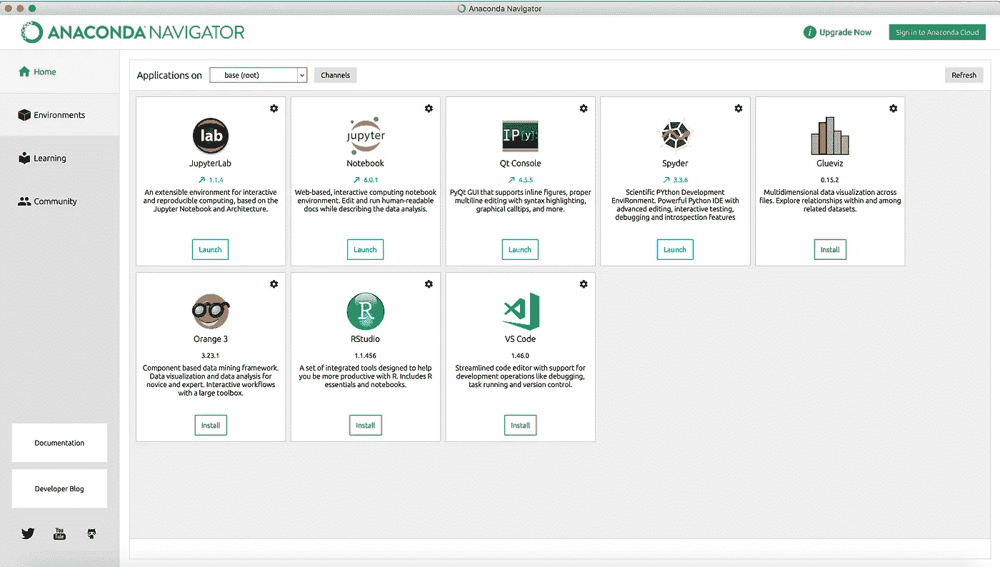

单击“环境”选项卡。我们将使用 Python 3.7 创建一个新环境。这是您的环境选项卡应该看起来的样子。您将只有一个“基础”环境。

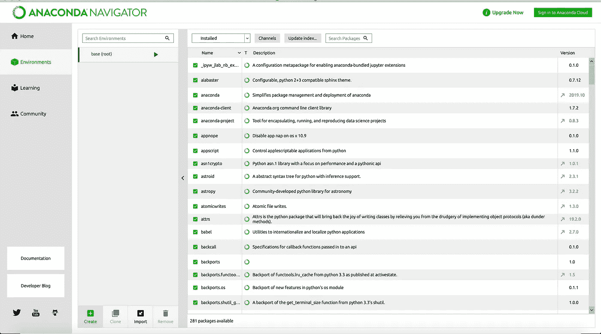

点击底部靠近社交媒体图标的“创建”。你可以给你的环境起任何你喜欢的名字。我推荐一些短小有意义的东西。比如运行 python3.7 的环境中的“Python 3”:

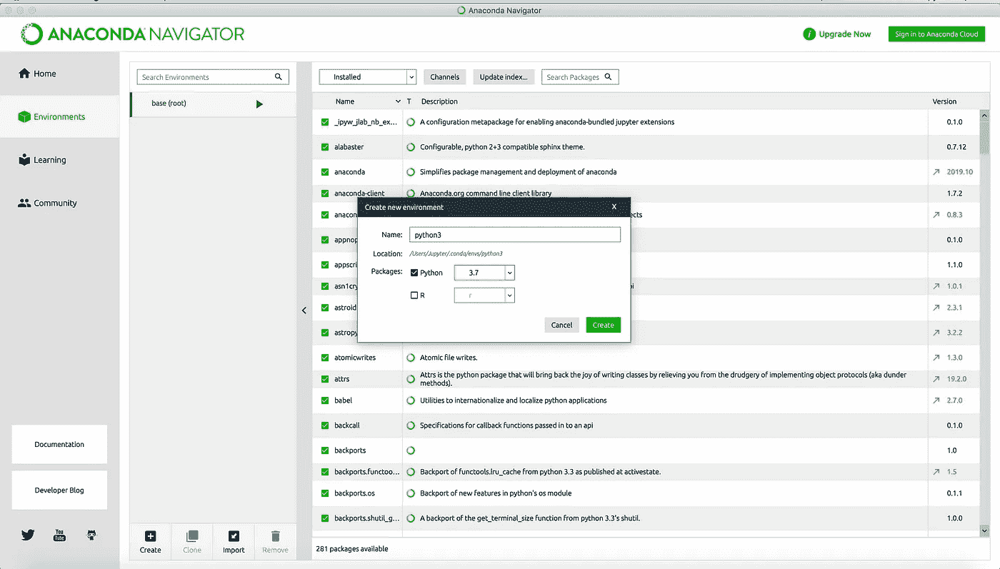

现在，我们有了一个运行 Python 3.7 的环境。我们还将在这里安装我们的 Jupyter 笔记本软件包。

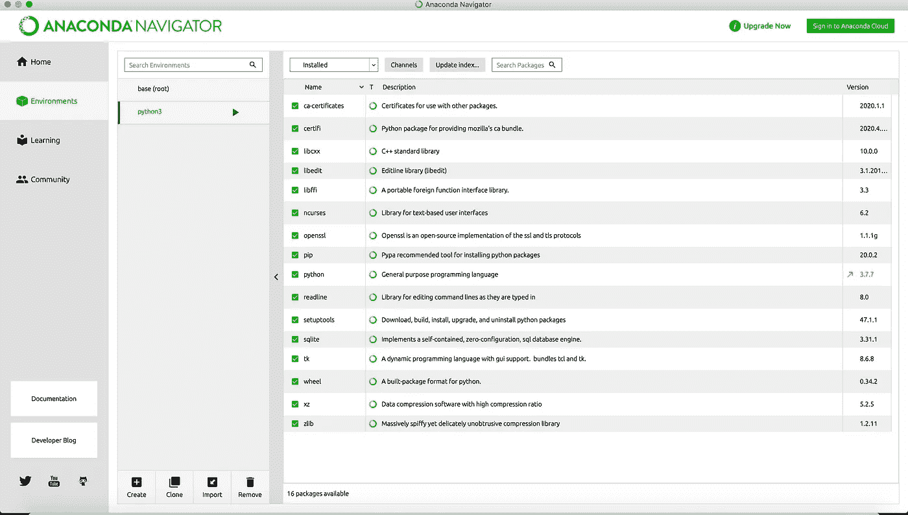

点击“已安装”下拉菜单，然后选择“未安装”。

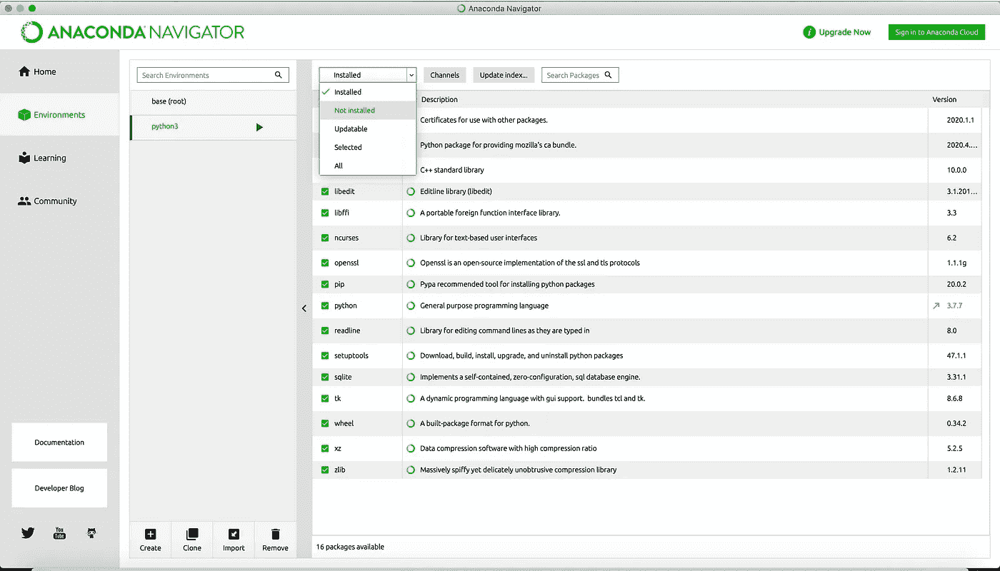

然后，我们将搜索我们需要的包，并将它们添加到我们的环境中。

我们将需要:

*   朱皮特
*   熊猫
*   要求
*   Numpy

只需使用搜索栏搜索软件包。然后选择您想要安装的软件包:

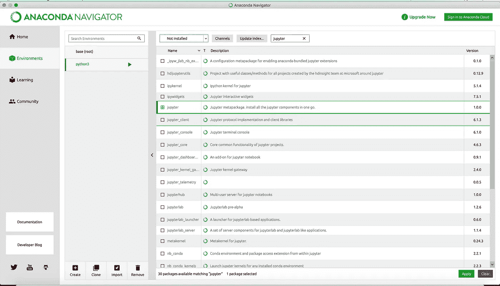

然后，点击“应用”。你的屏幕会显示如下信息:

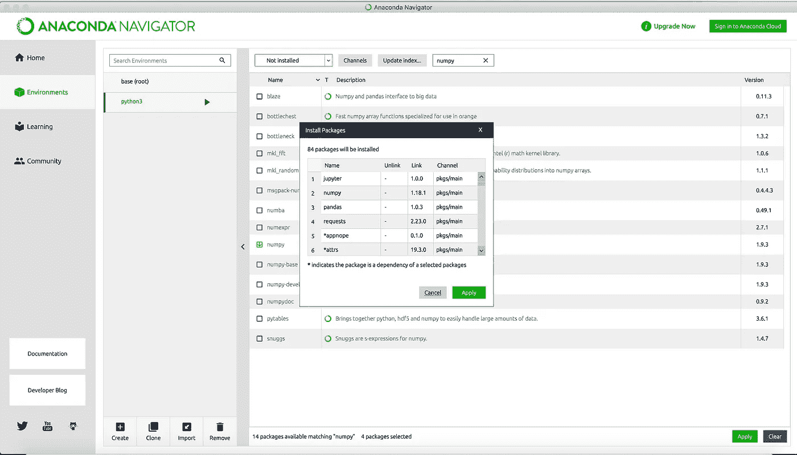

再次点击“应用”，安装自动完成。

现在我们应该准备好推出我们的第一款 Jupyter 笔记本了。

# 第三步:推出你的第一台 Jupyter 笔记本

首先，在我们做任何其他事情之前——这非常重要——我们需要重新启动我们的终端，以便我们在 Anaconda Navigator 中所做的更改能够被识别。

现在，回到“终端”,导航到您选择的目录——我要将我的项目存储在桌面上——并为您的 jupyter 文件创建一个新目录:

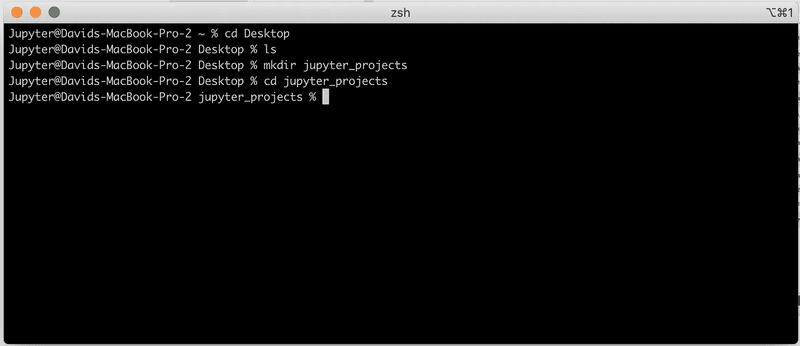

现在，我们将首次使用我们的环境名称激活我们的 Python 3.7 环境。

像这样:

```
conda activate python3
```

然后，检查您的 python 版本:

```
python --version
```

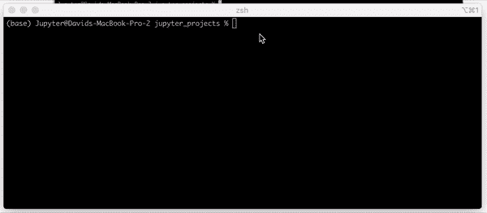

很好。我们在做生意。

接下来，让我们使用以下命令启动我们的第一个 Jupyter 笔记本:

```
jupyter notebook
```

您的浏览器现在应该看起来像这样:

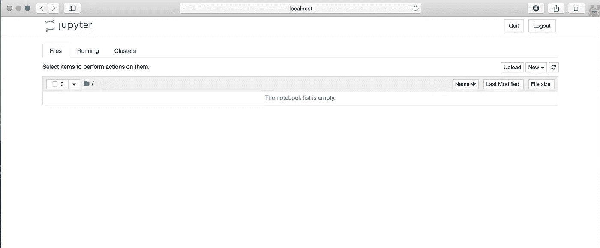

现在，让我们创建一个新的 Python 3 文件:

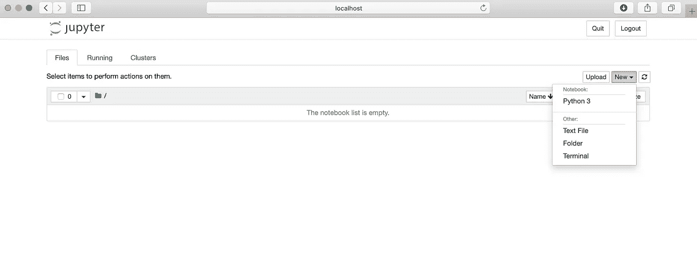

点击 Python 3 后，你的页面应该是这样的:

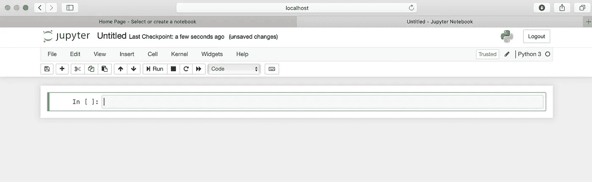

# 第四步:进口熊猫和其他包裹

现在让我们把我们的文件名更新为有意义的名称，也许是“第一个笔记本”，然后导入几个在以后的教程中会很常见的包。

就像这样导入包。Pandas 通常以`pd`的形式输入，numpy 通常以`np`的形式输入:

```
import pandas as pd
import requests
import numpy as np
```

*   [**熊猫**](https://pandas.pydata.org)**是一款快速、强大、灵活且易于使用的开源数据分析和操纵工具，构建在 [Python](https://www.python.org/) 编程语言之上。”**
*   **[**请求**](https://requests.readthedocs.io/en/master/) “是一个优雅简单的 Python 的 HTTP 库，为人类而建。”它用于向 API 发出请求。我们将做大量的工作来获取数据，并与熊猫和 Numpy 一起进行分析。**
*   **[**NumPy**](https://numpy.org) 是“用 Python 进行科学计算的基础包”**

**然后按 shift+return 执行单元格:**

**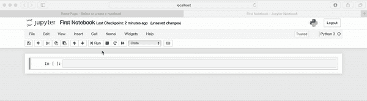**

**当单元格执行完毕时，您将看到一个整数出现在方括号之间[此处]。像这样:**

**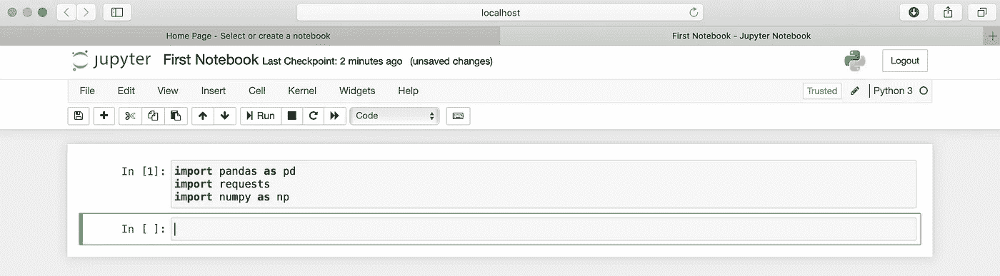**

**看到了吗？这意味着我们已经正确地设置了我们的环境，并且我们已经准备好进入问题的实质。**

**好了，暂时就这样吧！干得好。坚持下去。**

****

**我们将在未来的教程中继续一些更令人兴奋的事情，但即使是 10，000 英里的旅程也是从一步开始的。这是我们迈向数据分析和 Python 编程的广阔开放世界的第一步。**

**如果你准备学习一些新的材料，下面这些教程是一个很好的下一步:**

**[](https://medium.com/@deallen7/how-to-create-a-pandas-dataframe-from-an-api-endpoint-in-a-jupyter-notebook-f2561f766ca3) [## 如何在 Jupyter 笔记本中从 API 端点创建熊猫数据帧

### 从 API 创建熊猫数据帧的文档

medium.com](https://medium.com/@deallen7/how-to-create-a-pandas-dataframe-from-an-api-endpoint-in-a-jupyter-notebook-f2561f766ca3) [](https://medium.com/@deallen7/how-to-create-a-pivot-table-in-python-pandas-11c93ab13351) [## 如何在 Python/Pandas 中创建数据透视表

### 将 Excel 最有用的工具之一转换成 Python/Pandas

medium.com](https://medium.com/@deallen7/how-to-create-a-pivot-table-in-python-pandas-11c93ab13351) [](https://medium.com/python-in-plain-english/vlookups-in-pythons-pandas-package-119a565140df) [## Python 的熊猫包中的 Vlookups

### 如果你要通过 Excel 进行数据分析，那么你肯定熟悉 v-lookups。垂直查找—或者…

medium.com](https://medium.com/python-in-plain-english/vlookups-in-pythons-pandas-package-119a565140df) 

下次见…干杯。


如果你喜欢阅读这样的故事，并想支持我成为一名作家，可以考虑报名成为一名媒体成员。每月 5 美元，让您可以无限制地访问数以千计的 Python 指南和数据科学文章。如果你使用[我的链接](https://deallen7.medium.com/membership)注册，我会赚一小笔佣金，不需要你额外付费。

[](https://deallen7.medium.com/membership) [## 通过我的推荐链接加入媒体-大卫艾伦

### 阅读大卫·艾伦(以及媒体上成千上万的其他作家)的每一个故事。您的会员费直接支持…

deallen7.medium.com](https://deallen7.medium.com/membership)**