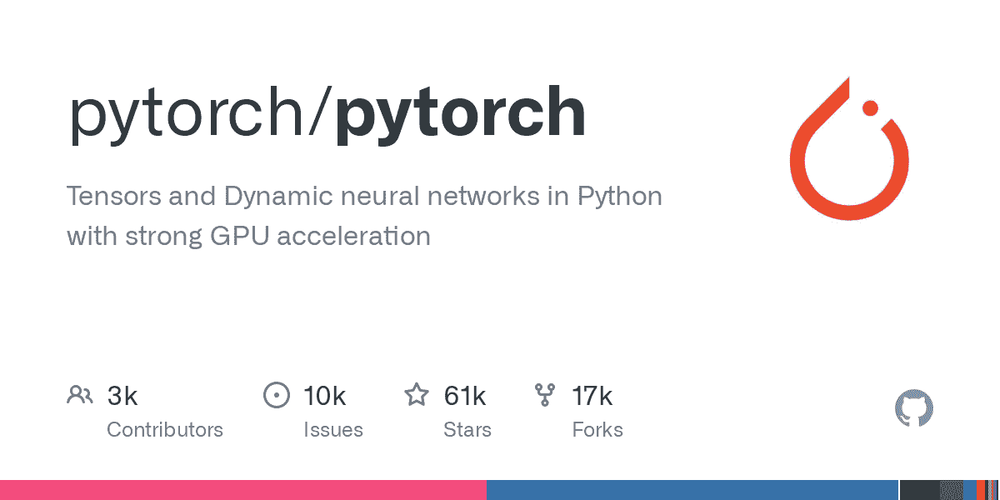
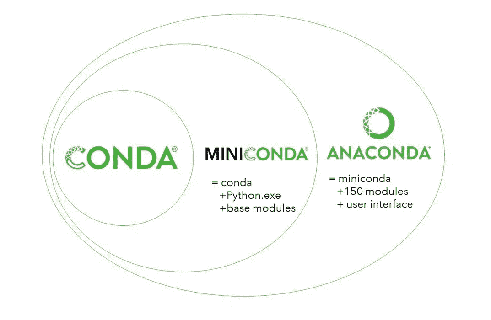
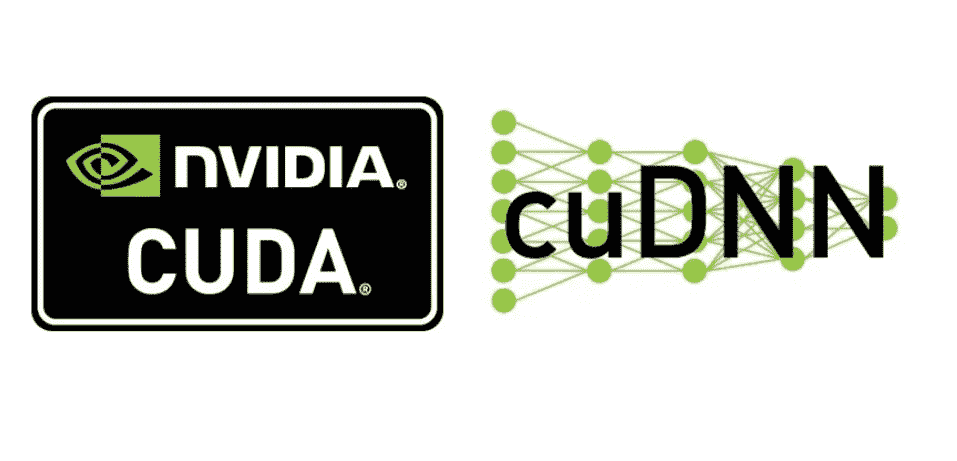
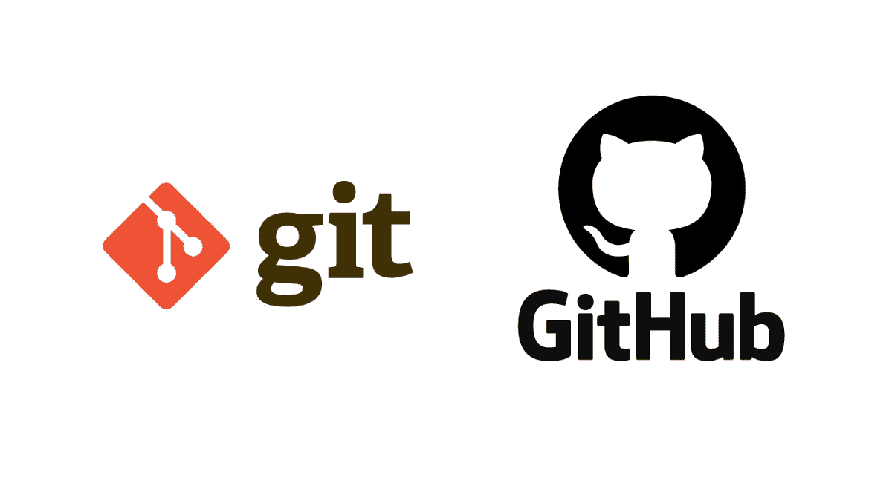
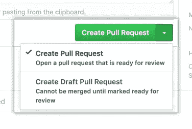

# PyTorch 投稿入门:设置您的开发环境

> 原文：<https://blog.devgenius.io/getting-started-with-pytorch-contributing-setting-up-your-development-environment-8eed44aaa40f?source=collection_archive---------8----------------------->



PyTorch 是一个流行的开源深度学习框架，由脸书的人工智能研究小组开发，被数据科学家、工程师和研究人员用来开发和训练深度学习模型。它提供了一套全面的工具来构建、训练和部署 AI 应用程序。PyTorch 凭借其强大而直观的 API，让开发者可以轻松创建定制的深度学习模型。

注意:我写这篇文章没有得到任何报酬。请考虑用此链接 *通过* [*成为中等会员来支持我和其他人的写作。*](https://medium.com/@c-nemri/membership)

PyTorch 社区正在成长，该项目被个人和组织广泛采用。向 PyTorch 投稿是了解更多深度学习和参与社区的绝佳方式。在本文中，我们将带您完成为 PyTorch 贡献设置开发环境的步骤。

# PyTorch 是什么？

PyTorch 是 Python 的开源机器学习库。它通过提供一个动态的计算图和有效的张量运算来实现快速开发和实验。PyTorch 还支持分布式训练，允许多台机器合作训练深度学习模型。PyTorch 还提供了一组丰富的 API 来与其他软件库集成。PyTorch 为开发深度学习模型和应用提供了一个灵活的平台。数据科学家、工程师和研究人员使用它来开发和训练深度学习模型。PyTorch 库因其易用性、灵活性和可伸缩性而广受欢迎。

# 向 PyTorch 捐款的好处

为 PyTorch 做贡献是学习和更多参与开源社区的好方法。通过向 PyTorch 投稿，你可以获得软件工程和深度学习方面的经验。您还可以通过改进现有功能或添加新功能来帮助改进项目。此外，您可以公开您的贡献，并获得社区的认可。

向 PyTorch 捐款还提供了回报社区的机会，并有助于使深度学习更容易获得。通过参与该项目，您可以帮助开发人员和所有技能水平的用户更容易获得深度学习。

# 设置您的开发环境


参与 PyTorch 的第一步是设置您的开发环境。这包括安装必要的软件、配置您的系统以及设置 Git 和 GitHub。

在我的例子中，我使用的是装有 Ubuntu 20.04.5 LTS 的亚马逊 EC2 机器(g4dn.xlarge，配有 NVIDIA GPU)。

# 安装 Anaconda



PyTorch 团队强烈推荐安装一个 [Anaconda](https://www.anaconda.com/distribution/#download-section) 环境。通过这样做，您将获得一个高质量的 BLAS 库(MKL ),并且无论您的 Linux 发行版如何，您都可以获得受控的依赖版本。

Anaconda 是一个强大的包管理器，允许您轻松地安装和管理包，包括 PyTorch。要安装 Anaconda，请从 Anaconda 网站下载安装程序，并按照说明进行操作。

```
# download Anaconda installation file
wget https://repo.anaconda.com/archive/Anaconda3-2022.10-Linux-x86_64.sh
# modify Anaconda version if you wish

# make it executable
chmod +x Anaconda3-2022.10-Linux-x86_64.sh

# execute it and follow instructions
./Anaconda3-2022.10-Linux-x86_64.sh
```

一旦安装了 Anaconda，为 PyTorch 项目创建一个虚拟环境是非常重要的。这将确保您的所有依赖项都与其他项目隔离开来，并且您使用的是每个包的正确版本。要创建虚拟环境，请打开 Anaconda 提示符并运行以下命令:

```
conda create -n pytorch-dev-env python=3.7.6 # recommended by pytorch team
```

# GPU 先决条件，安装 Cuda 工具包和 CudNN



如果您想使用 CUDA 支持进行编译，请安装以下软件

*   [NVIDIA CUDA 工具包](https://developer.nvidia.com/cuda-downloads) 10.2 或更高版本
*   [NVIDIA cuDNN](https://developer.nvidia.com/cudnn) v7 以上
*   兼容 CUDA 的编译器

CUDA 工具包为使用 GPU 进行训练提供了必要的库。cuDNN 库为深度学习应用提供了优化的例程。

## 安装 Cuda 工具包

根据您的操作系统、架构、发行版、版本和所选的安装类型，您需要遵循的安装说明可能会略有不同。为了便于演示，我将安装适用于 Linux x86_64、Ubuntu 20.04 的 Cuda Toolkit 11.6，并且我将使用 deb(本地)安装方法:

```
wget https://developer.download.nvidia.com/compute/cuda/repos/ubuntu2004/x86_64/cuda-ubuntu2004.pin
sudo mv cuda-ubuntu2004.pin /etc/apt/preferences.d/cuda-repository-pin-600
wget https://developer.download.nvidia.com/compute/cuda/11.6.0/local_installers/cuda-repo-ubuntu2004-11-6-local_11.6.0-510.39.01-1_amd64.deb
sudo dpkg -i cuda-repo-ubuntu2004-11-6-local_11.6.0-510.39.01-1_amd64.deb
sudo apt-key add /var/cuda-repo-ubuntu2004-11-6-local/7fa2af80.pub
sudo apt-get update
sudo apt-get -y install cuda
```

## 安装 cuDNN

为了下载 cuDNN，您需要使用您的电子邮件并订阅一个 NVIDIA 开发人员帐户。你需要用你的浏览器下载相应的 cuDNN 库。

下载完成后，我必须使用我的密钥对将它 SCP 到我的 EC2 实例，如下所示:

```
scp -i pytorch-dev.pem cudnn-local-repo-ubuntu2004-8.7.0.84_1.0-1_amd64.deb ubuntu@<public-ip-address>
```

以下是我后来遵循的安装步骤:

```
# X.Y and 8.x.x.x are to be replaced by specific CUDA and cuDNN versions
# enabling local repository
sudo dpkg -i cudnn-local-repo-${OS}-8.x.x.x_1.0-1_amd64.deb

# importing CUDA GPG key
sudo cp /var/cudnn-local-repo-*/cudnn-local-*-keyring.gpg /usr/share/keyrings/

# Refreshing repository metadata
sudo apt-get update

# install runtime library
sudo apt-get install libcudnn8=8.x.x.x-1+cudaX.Y

# install developer library
sudo apt-get install libcudnn8-dev=8.x.x.x-1+cudaX.Y

# install code samples and cuDNN library documentation
sudo apt-get install libcudnn8-samples=8.x.x.x-1+cudaX.Y
```

## 安装附加依赖项

一旦安装了必要的驱动程序和库，您将需要安装附加的依赖项。这包括 PyTorch 的 Python 库，比如 NumPy。要安装这些库，可以使用 Anaconda 包管理器，如下所示

```
conda install astunparse numpy ninja pyyaml setuptools cmake cffi typing_extensions future six requests dataclassesTo install the packages, open the Anaconda prompt and activate your environment. Then, run the following command:
```

对于 Linux，您可以添加以下内容

```
conda install mkl mkl-include
```

在进入下一步之前，您需要将以下内容添加到您的` ~/.bashrc `并对其进行编译:即从源代码安装 pytorch。

```
export CMAKE_PREFIX_PATH=${CONDA_PREFIX:-"$(dirname $(which conda))/../"}
export CUDACXX=/usr/local/cuda-11.6/bin/nvcc
```

# 获取 PyTorch 源

下一步是获取 PyTorch 的源代码。这可以通过从 GitHub 克隆 PyTorch 库来实现。为此，您需要创建一个 GitHub 帐户并派生 PyTorch 存储库。

一旦您分叉了存储库，您将需要把它克隆到您的本地机器上。为此，请在终端中运行以下命令:

`git clone [https://github.com/YOUR-USERNAME/pytorch.git](https://github.com/YOUR-USERNAME/pytorch.git)`

# 使用 Git 和 GitHub



一旦您克隆了存储库，您将需要熟悉 Git 和 GitHub。Git 是一个版本控制系统，允许开发人员在项目上进行协作。GitHub 是一个托管 Git 仓库的平台。

GitHub 提供了一个 web 界面来查看和管理您的存储库。您还可以使用 Git 命令来管理您的项目。要了解更多关于 Git 和 GitHub 的知识，您可以阅读官方文档或参加在线课程。

# 编写并提交您的更改

下一步是开始对项目进行修改。为此，您需要创建一个新的分支，并在该分支中进行更改。

一旦您做出了更改，您就可以将它们提交到分支。为此，您需要使用 Git 命令。例如，要提交对分支的更改，可以运行以下命令:

`git commit -m "My changes"`

## 从上游库获取更新并从源安装 PyTorch

您可能需要从 pytorch 主报告中获取更新，因为社区正在积极添加新功能和修复错误。

为了做到这一点，请遵循以下步骤

```
# set up pytorch official repo as upstream
git remote add upstream https://github.com/pytorch/pytorch

# pull upstream repo
git pull upstream --rebase # this combines your modifications with the most up-to-date version of the repo

# updating submodules
git submodule sync --recursive
git submodule update --init --recursive --jobs 0
```

在从源代码安装 pytorch 之前，删除当前的安装(如果有的话)。

```
conda uninstall pytorch -y
yes | pip uninstall torch
```

为了安装 pytorch 进行开发，请使用以下代码:

```
python setup.py develop
```

# 测试您的代码

一旦提交了您的更改，您将需要测试您的代码。这是确保代码按预期运行的重要一步。您可以通过运行 PyTorch 提供的单元测试来测试您的代码。

单元测试是测试单个函数或类的小程序。要运行单元测试，您需要使用 PyTorch 测试框架。要了解 PyTorch 测试框架的更多信息，您可以阅读官方文档。

# 提交您的拉动式请求



一旦您测试了您的代码，您可以提交您的更改作为一个拉请求。拉请求是将您的更改合并到主存储库中的请求。一旦您的更改被推送，您就可以打开一个拉取请求。这将让项目的维护者知道您正在请求合并您的变更。维护人员将会检查你的代码，并决定是否接受它。

# 结论

为 PyTorch 做贡献是学习和更多参与开源社区的好方法。通过设置您的开发环境并遵循本文中概述的步骤，您可以开始使用 PyTorch 贡献。

如果您对 PyTorch 感兴趣，您应该熟悉这个项目及其开发过程。此外，您应该阅读官方文档并加入 PyTorch 社区以了解项目的最新进展。通过一点努力和奉献，你可以成为 PyTorch 的一名有价值的贡献者。

# 关于我

有我做导师或者 T2，让我们在 LinkedIn 上交流吧。我是 AWS(亚马逊网络服务)的机器学习和数据分析解决方案架构师。我对云、数据& AI 充满热情，我拥有🇺🇸佐治亚理工学院和 and inp 图卢兹教育学院的工程和 MS 学位


我指导残疾人在科技领域谋得一份职业:请在此预订您的位置👉【https://calendly.com/nemri/disability 

我在这里写数据、云和人工智能👉[https://c-nemri.medium.com/](https://c-nemri.medium.com/)