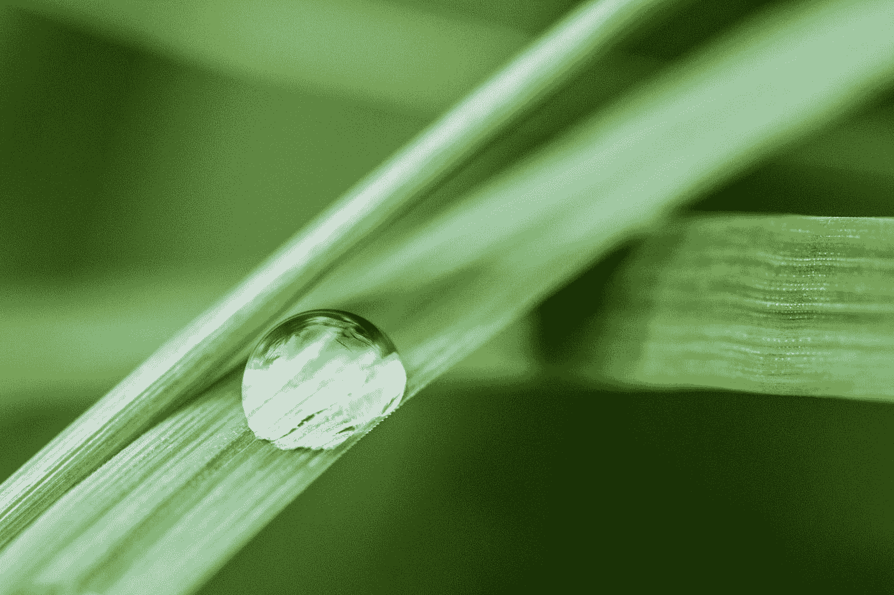

# 使用 React 套件库开始 React 开发—高级下拉菜单

> 原文：<https://blog.devgenius.io/getting-started-with-react-development-with-the-react-suite-library-advanced-dropdowns-4416af4c1a2e?source=collection_archive---------4----------------------->



由 [Lukas Bato](https://unsplash.com/@lks_bt?utm_source=medium&utm_medium=referral) 在 [Unsplash](https://unsplash.com?utm_source=medium&utm_medium=referral) 上拍摄的照片

React Suite 是一个有用的 UI 库，让我们可以轻松地将许多组件添加到 React 应用程序中。

在本文中，我们将了解如何使用它向 React 应用程序添加组件。

# 下拉隔断和面板

我们可以使用`divider`道具在下拉菜单中添加分隔线:

```
import React from "react";
import { Dropdown } from "rsuite";
import "rsuite/dist/styles/rsuite-default.css";export default function App() {
  return (
    <div className="App">
      <Dropdown title="Fruit">
        <Dropdown.Item>Apple</Dropdown.Item>
        <Dropdown.Item>Orange</Dropdown.Item>
        <Dropdown.Item divider />
        <Dropdown.Item>Grape</Dropdown.Item>
      </Dropdown>
    </div>
  );
}
```

我们可以用`panel`道具在下拉列表中添加一个面板:

```
import React from "react";
import { Dropdown } from "rsuite";
import "rsuite/dist/styles/rsuite-default.css";export default function App() {
  return (
    <div className="App">
      <Dropdown title="Fruit">
        <Dropdown.Item panel style={{ padding: 10, width: 160 }}>
          <strong>Select a fruit</strong>
        </Dropdown.Item>
        <Dropdown.Item>Apple</Dropdown.Item>
        <Dropdown.Item>Orange</Dropdown.Item>
        <Dropdown.Item>Grape</Dropdown.Item>
      </Dropdown>
    </div>
  );
}
```

我们可以用`placement`道具改变下拉菜单的位置:

```
import React from "react";
import { Dropdown } from "rsuite";
import "rsuite/dist/styles/rsuite-default.css";export default function App() {
  return (
    <div className="App">
      <Dropdown title="Fruit" placement="rightStart">
        <Dropdown.Item>Apple</Dropdown.Item>
        <Dropdown.Item>Orange</Dropdown.Item>
        <Dropdown.Item>Grape</Dropdown.Item>
      </Dropdown>
    </div>
  );
}
```

其他值包括`leftStart`、`leftEnd`、`bottomStart`、`bottomEnd`、`rightEnd`、`topStart`和`topEnd`。

我们可以将下拉菜单嵌套在另一个下拉菜单中。

例如，我们可以写:

```
import React from "react";
import { Dropdown } from "rsuite";
import "rsuite/dist/styles/rsuite-default.css";export default function App() {
  return (
    <div className="App">
      <Dropdown title="Fruit">
        <Dropdown.Item>Apple</Dropdown.Item>
        <Dropdown.Item>Orange</Dropdown.Item>
        <Dropdown.Item>Grape</Dropdown.Item>
        <Dropdown.Menu title="Color">
          <Dropdown.Item>Green</Dropdown.Item>
          <Dropdown.Item>Red</Dropdown.Item>
        </Dropdown.Menu>
      </Dropdown>
    </div>
  );
}
```

我们将`Dropdown.Menu`放入`Dropdown`来添加一个嵌套菜单。

此外，我们可以在按钮内容中添加一个带有图标的菜单按钮。

比如说。我们可以写:

```
import React from "react";
import { Dropdown, IconButton, Icon } from "rsuite";
import "rsuite/dist/styles/rsuite-default.css";export default function App() {
  return (
    <div className="App">
      <Dropdown
        title="Fruit"
        renderTitle={() => {
          return (
            <IconButton icon={<Icon icon="plus" />} placement="left">
              Fruit
            </IconButton>
          );
        }}
      >
        <Dropdown.Item>Apple</Dropdown.Item>
        <Dropdown.Item>Orange</Dropdown.Item>
        <Dropdown.Item>Grape</Dropdown.Item>
      </Dropdown>
    </div>
  );
}
```

我们将`IconButton`添加到`renderTitle`道具中来渲染按钮。

此外，我们可以通过编写以下内容来使用 popovers 的下拉菜单:

```
import React from "react";
import { Dropdown, Popover, Whisper, Button } from "rsuite";
import "rsuite/dist/styles/rsuite-default.css";const MenuPopover = ({ onSelect, ...rest }) => {
  return (
    <Popover {...rest} full>
      <Dropdown.Menu onSelect={onSelect}>
        <Dropdown.Item>Apple</Dropdown.Item>
        <Dropdown.Item>Orange</Dropdown.Item>
        <Dropdown.Item>Grape</Dropdown.Item>
      </Dropdown.Menu>
    </Popover>
  );
};export default function App() {
  const triggerRef = React.createRef();
  const handleSelectMenu = (eventKey, event) => {
    console.log(eventKey);
    triggerRef.current.hide();
  }; return (
    <div className="App">
      <Whisper
        placement="bottomStart"
        trigger="click"
        triggerRef={triggerRef}
        speaker={<MenuPopover onSelect={handleSelectMenu} />}
      >
        <Button>Fruit</Button>
      </Whisper>
    </div>
  );
}
```

我们创建了接受道具的`MenuPopover`组件。

我们通过`onSelect`到`Dropdown.Menu`来让我们从按钮触发器控制菜单。

其余的道具被传递到`Popover`组件中。

为了添加 popover 触发器，我们添加了`Whisper`组件并在其中添加了一个`Button`以使`Button`成为 popover 触发器。

我们通过将`MenuPopover`传入`speaker`道具来打开菜单。

# 结论

我们可以使用 React Suite 的各种选项添加下拉菜单。