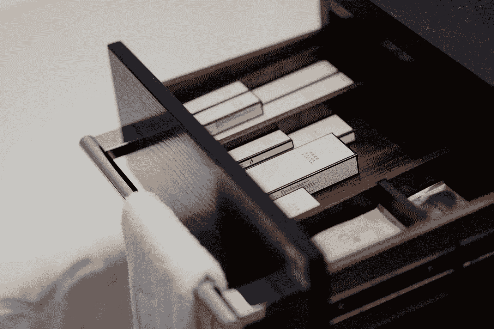

# 使用 React Suite 库 Drawer 开始 React 开发

> 原文：<https://blog.devgenius.io/getting-started-with-react-development-with-the-react-suite-library-drawer-7622a70a3d48?source=collection_archive---------4----------------------->



由[丘特尔 SNAP](https://unsplash.com/@chuttersnap?utm_source=medium&utm_medium=referral) 在 [Unsplash](https://unsplash.com?utm_source=medium&utm_medium=referral) 上拍照

React Suite 是一个有用的 UI 库，让我们可以轻松地将许多组件添加到 React 应用程序中。

在本文中，我们将了解如何使用它向 React 应用程序添加组件。

# 抽屉

我们可以用`Drawer`组件添加一个抽屉。

例如，我们可以写:

```
import React, { useState } from "react";
import { Drawer, ButtonToolbar, Button } from "rsuite";
import "rsuite/dist/styles/rsuite-default.css";export default function App() {
  const [show, setShow] = useState(); const toggleDrawer = () => {
    setShow((s) => !s);
  }; const close = () => {
    setShow(false);
  };
  return (
    <div>
      <ButtonToolbar>
        <Button onClick={toggleDrawer}>Open</Button>
      </ButtonToolbar>
      <Drawer show={show} onHide={close}>
        <Drawer.Header>
          <Drawer.Title>Drawer Title</Drawer.Title>
        </Drawer.Header>
        <Drawer.Body>hello</Drawer.Body>
        <Drawer.Footer>
          <Button onClick={close} appearance="primary">
            Confirm
          </Button>
          <Button onClick={close} appearance="subtle">
            Cancel
          </Button>
        </Drawer.Footer>
      </Drawer>
    </div>
  );
}
```

我们设置`show`道具来控制它何时显示。

通过将`show`设置为`false`，将`onHide`设置为`close`功能，隐藏抽屉。

2 个`Button`还具有设置为`onClick`道具值的`close`功能。

这让我们可以在单击它们时关闭模态。

我们可以将`backdrop`设置为`false`来禁用背景:

```
import React, { useState } from "react";
import { Drawer, ButtonToolbar, Button } from "rsuite";
import "rsuite/dist/styles/rsuite-default.css";export default function App() {
  const [show, setShow] = useState(); const toggleDrawer = () => {
    setShow((s) => !s);
  }; const close = () => {
    setShow(false);
  };
  return (
    <div>
      <ButtonToolbar>
        <Button onClick={toggleDrawer}>Open</Button>
      </ButtonToolbar>
      <Drawer show={show} onHide={close} backdrop={false}>
        <Drawer.Header>
          <Drawer.Title>Drawer Title</Drawer.Title>
        </Drawer.Header>
        <Drawer.Body>hello</Drawer.Body>
        <Drawer.Footer>
          <Button onClick={close} appearance="primary">
            Confirm
          </Button>
          <Button onClick={close} appearance="subtle">
            Cancel
          </Button>
        </Drawer.Footer>
      </Drawer>
    </div>
  );
}
```

此外，我们可以用`placement`道具改变位置:

```
import React, { useState } from "react";
import { Drawer, ButtonToolbar, Button } from "rsuite";
import "rsuite/dist/styles/rsuite-default.css";export default function App() {
  const [show, setShow] = useState(); const toggleDrawer = () => {
    setShow((s) => !s);
  }; const close = () => {
    setShow(false);
  };
  return (
    <div>
      <ButtonToolbar>
        <Button onClick={toggleDrawer}>Open</Button>
      </ButtonToolbar>
      <Drawer show={show} onHide={close} placement="left">
        <Drawer.Header>
          <Drawer.Title>Drawer Title</Drawer.Title>
        </Drawer.Header>
        <Drawer.Body>hello</Drawer.Body>
        <Drawer.Footer>
          <Button onClick={close} appearance="primary">
            Confirm
          </Button>
          <Button onClick={close} appearance="subtle">
            Cancel
          </Button>
        </Drawer.Footer>
      </Drawer>
    </div>
  );
}
```

它被设置为`'left'`，所以它被放置在屏幕的左侧。

我们也可以将其设置为`'right'`、`'top'`或`'bottom'`。

要设置抽屉的大小，我们可以设置`size`道具:

```
import React, { useState } from "react";
import { Drawer, ButtonToolbar, Button } from "rsuite";
import "rsuite/dist/styles/rsuite-default.css";export default function App() {
  const [show, setShow] = useState(); const toggleDrawer = () => {
    setShow((s) => !s);
  }; const close = () => {
    setShow(false);
  };
  return (
    <div>
      <ButtonToolbar>
        <Button onClick={toggleDrawer}>Open</Button>
      </ButtonToolbar>
      <Drawer show={show} onHide={close} size="xs">
        <Drawer.Header>
          <Drawer.Title>Drawer Title</Drawer.Title>
        </Drawer.Header>
        <Drawer.Body>hello</Drawer.Body>
        <Drawer.Footer>
          <Button onClick={close} appearance="primary">
            Confirm
          </Button>
          <Button onClick={close} appearance="subtle">
            Cancel
          </Button>
        </Drawer.Footer>
      </Drawer>
    </div>
  );
}
```

`xs`设置为超小。`sm`小。`md`中，`lg`大。

`full`道具让抽屉填满了大部分屏幕:

```
import React, { useState } from "react";
import { Drawer, ButtonToolbar, Button } from "rsuite";
import "rsuite/dist/styles/rsuite-default.css";export default function App() {
  const [show, setShow] = useState(); const toggleDrawer = () => {
    setShow((s) => !s);
  }; const close = () => {
    setShow(false);
  };
  return (
    <div>
      <ButtonToolbar>
        <Button onClick={toggleDrawer}>Open</Button>
      </ButtonToolbar>
      <Drawer show={show} onHide={close} full>
        <Drawer.Header>
          <Drawer.Title>Drawer Title</Drawer.Title>
        </Drawer.Header>
        <Drawer.Body>hello</Drawer.Body>
        <Drawer.Footer>
          <Button onClick={close} appearance="primary">
            Confirm
          </Button>
          <Button onClick={close} appearance="subtle">
            Cancel
          </Button>
        </Drawer.Footer>
      </Drawer>
    </div>
  );
}
```

# 结论

我们可以使用 React Suite 在 React 应用程序中添加一个抽屉。