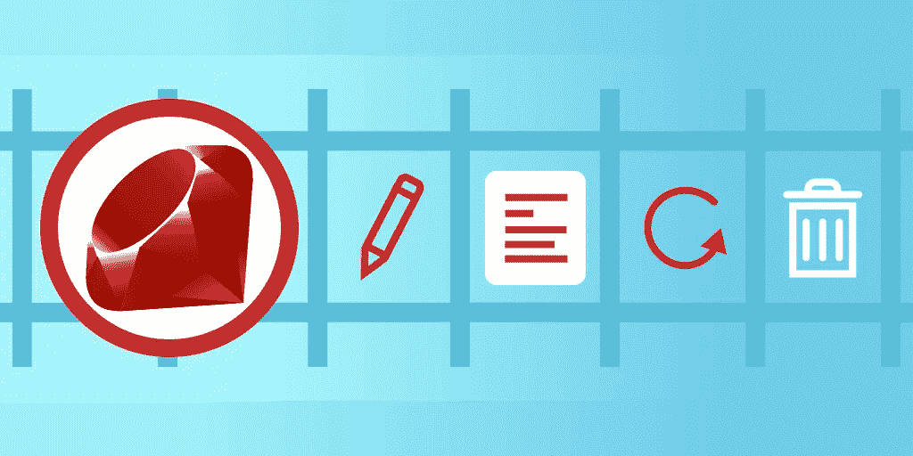

# Ruby on Rails 入门:用 Ruby 构建 web 应用程序

> 原文：<https://blog.devgenius.io/getting-started-with-ruby-on-rails-build-a-web-app-with-ruby-5696277bc39d?source=collection_archive---------3----------------------->

## Rails 是用 Ruby 编写的流行的 web 应用程序开发框架。请继续阅读，我们将介绍 Rails 并构建第一个 web 应用程序。



Ruby on Rails(通常称为 Rails)是一个开源的、 **web 应用开发框架**用 Ruby 编程语言编写。Rails 使 web 应用程序的编程变得有趣而简单:它允许您编写更少的代码，但完成比大多数框架更多的工作。

Rails 框架是固执己见的，所以它基于这样的假设运行，即有一种“最佳”的方式来制作东西。在本教程中，我们将向您介绍 Rails，并向您展示如何制作 web 应用程序。

> *要想获得最大的成功，你应该已经掌握了一些 Ruby、web 开发语言(HTML、CSS 和 JavaScript)和面向对象编程(OOP)的知识。*

**本教程一目了然:**

*   什么是 Rails？
*   铁轨的显著特征
*   Rails 项目剖析
*   如何创建您的第一个 Rails 应用程序
*   MVC 和 Rails: Hello World
*   模型和活动记录
*   你学习的下一步

# 什么是 Rails？

Rails 是一个强大的、非常固执己见的、全栈的 web 应用框架**构建在后端 Ruby 编程语言之上。由于其创新的功能，如表迁移和支架，它被用来快速构建强大的 web 应用程序。**

Rails 提供了一个**默认结构来组织你的代码**并使工作流程更简单。使用 Rails 的程序员说这使得软件开发变得更加有趣和简单。


Rails 开发基于模型-视图-控制器(MVC)架构来组织应用程序编程，并遵循软件开发的不重复(DRY)原则。

Rails 在 web 应用程序开发领域仍然很受欢迎。Rails 是一个非常成熟的框架，有大量活跃的支持。许多公司都在寻找有才华的 Rails 开发人员，因为这个框架最大限度地减少了应用程序的制作时间。

一些使用 Rails 的大公司包括 AirBnB、GitHub、Basecamp、Shopify、Soundcloud 和 Goodreads。由于速度快，它在许多初创公司中也很受欢迎。

> ***事实:****Rails 开发人员的平均基本工资是 116，437 美元*

# 铁轨的显著特征

任何人都可以学习 Rails，即使你对 Ruby 代码的经验有限。Rails 是全栈的，提供了许多集成工具来快速创建动态应用程序。以下是让 Rails 如此强大的一些**显著特性**:

*   **自动化测试:** Rails 提供了内置测试，所以测试用例更容易编写和执行。
*   **搭建:**这允许你轻松地创建管理数据的模型、支持用户数据交互的视图，以及管理模型-视图通信的控制器。
*   **活动记录:** Rails 的运行基于这样一个假设，即您应该确保数据访问逻辑作为对象的一部分，以教育用户如何读写数据库。对象携带持久数据和对该数据进行操作的行为。
*   Rails 社区: Rails 有一个非常活跃的社区，它会定期修复和更新。
*   **约定胜于配置:** Rails 认为约定比配置更重要。该框架实际上为您做出决策以提高生产率。

# Rails 项目剖析

为了在构建我们自己的应用程序之前更加熟悉 Rails，让我们来看一下任何 Rails 应用程序的标准文件和目录结构的概要。

*   `app/`:包含核心应用程序代码(控制器、模型、视图、助手、邮件程序、通道、作业和资产)
*   `bin/`:包含启动、更新、部署或运行 Rails 应用程序的二进制可执行文件(脚本)
*   `config/`:包含应用程序、路由、数据库等的配置文件。
*   `db/`:包含数据库文件、数据库模式和数据库迁移
*   `lib/`:包含扩展库模块
*   `log/`:包含应用程序日志文件
*   `public/`:包含可通过浏览器访问的数据(静态文件、编译资产、错误页面等)。)
*   `storage/`:包含活动存储文件
*   `test/`:包含应用单元测试、夹具和各种其他测试设备
*   `tmp/`:包含临时文件(如缓存和 pid 文件)
*   `vendor/`:包含任何第三方代码
*   `Gemfile`:包含应用程序的 gem 需求，Ruby 需要它来运行应用程序
*   `Gemfile.lock`:包含 gem 列表，以确保应用程序的所有副本使用相同的版本
*   `Rakefile`:允许命令行定位并运行`rake`任务(一个在 Ruby 中实现的用于任务自动化的 Make-like 构建工具)
*   `config.ru`:包含用于启动应用程序的基于机架中间件的服务器的配置
*   `package.json`:允许你为你的 Rails 应用指定`npm`依赖关系

# 如何创建您的第一个 Rails 应用程序

如果你还没有，你需要安装 Rails。首先检查您的系统是否具备以下先决条件:

*   红宝石
*   SQLite3
*   节点. js
*   一旦你准备好了，使用 RubyGems 提供的`gem install`命令安装 Rails。

```
$ gem install rails
```

然后，通过运行以下命令，验证所有安装是否正确:

```
$ rails --version
```

它应该显示类似“Rails 6.0.0”这样的内容。现在你可以创建一个项目了。

## `New`发电机

Rails 自带名为**生成器**的内置脚本，可以自动创建启动新项目所需的一切。要创建一个新的应用程序，您需要调用`new`生成器。

请将此视为整个项目的基础。`new`生成器在`my_project directory`中建立一个带有应用程序结构的项目。

要使用`new`生成器，我们运行以下命令:

```
rails new my_project
```

现在你应该有一个应用程序。我们现在使用 Rails 脚本来运行 Puma web 服务器，它将部署我们的 Rails 应用程序。我们`cd`进入项目文件夹并运行以下命令:

```
rails server
```

您还可以使用附加参数运行服务器。

# MVC 和 Rails: Hello World

让我们和 Rail 打个招呼。为此，我们需要创建一个视图、路由和带有动作的控制器。Routes 会将请求映射到我们的控制器动作。控制器动作处理请求并为我们的视图准备数据。视图只是以我们想要的格式显示我们的数据。

这些特性是 Rails MVC 设计模式的一部分。

MVC 是一种将程序逻辑分成三个元素的设计模式:模型、视图和控制器。这将应用程序数据和代码分开。Rails 将几乎整个模型、视图和控制器逻辑放在服务器端。

> ***语法:*** *路由是用 Ruby DSL(特定领域语言)编写的规则。控制器本质上只是 Ruby 类。任何公共方法都是操作。视图是 HTML 和 Ruby 中的模板。*

首先，我们创建一个客户控制器和一个视图。为了创建一个新的控制器，我们在`my_project/:`的项目根目录下运行控制器生成器脚本。

```
rails generate controller Hello index
```

这创建了一个名为`Hello`的控制器和一个名为`index`的动作。

> *我们的控制器位于这里:* `*app/controllers/hello_controller.rb*` *我们的视图位于这里* `*app/views/welcome/index.html.erb*` *。*

## 嵌入式 Ruby

上面的`.erb`扩展名意味着文件是用*嵌入式 Ruby* 编写的，这是视图模板的默认设置。

在您的`html.erb`文件中，您可以使用标签将 Ruby 代码嵌入到 HTML 中。

*   `<% %>`:你可以在这些标签之间插入任何 Ruby 代码，结果不会插入到你的 HTML 中。这用于控制流语句。
*   `<%= %>`:这个标签之间的 Ruby 代码在它的位置被插入到 HTML 中。这用于从模型中检索数据。

# 配置视图和路线

在`index.html.erb`文件中，我们添加了一行:

```
<h1>Hello World on Rails!</h1>
```

这就是将在应用程序的根页面`/`上显示的内容。然而，如果我们现在运行应用程序，我们将进入旧页面，因为根目录当前被我们启动程序时创建的页面占用。

为了改变这一点，我们对我们的`config/routes.rb`文件进行了修改。本质上，我们必须告诉文件新主页的位置。

> *您的路由文件将把 URL 连接到我们的代码，并从您的代码创建路径。*

定义路由的一般语法如下:

```
HTTP_method 'controller_name/action_name'
```

出于我们的目的，`controller_name`是`hello`，我们的 action_name 是`index`。这是一个 GET 请求的例子。

```
get 'hello/index'
```

但是，我们正在定义 Rails 应用程序的根，所以我们的语法是不同的。

```
root 'hello#index'
```

> *浏览器使用 HTTP 方法(GET、PUT、POST、PATCH 和 DELETE)向 Rails 应用程序发出请求。这些 HTTP 方法中的每一个都请求对您的应用程序执行操作。*

所以，我们的`routes.rb`将如下:

```
Rails.application.routes.draw do
   get 'hello/index'
   root 'hello#index'
end
```

现在，当我们运行应用程序时，它将显示我们想要的`“Hello World on Rails!”`消息。

# 模型和活动记录

Rails Model 是一个 Ruby 类，用于添加数据库记录。通常，模型应该提供四个基本功能:

*   **创建:**向记录添加数据的能力
*   **读取:**找到已经存储在数据库中的某些特定数据的能力
*   **更新:**修改一些现有数据的能力
*   **删除:**删除数据的能力

> *这些功能代表缩写* CRUD *。*

Rails 还使用**活动记录框架**来创建和使用我们的模型。这是一个*对象关系映射(ORM)框架*，用于将应用程序的对象与关系数据库管理系统(RDBMS)中的表连接起来。

活动记录意味着我们不需要直接编写 SQL 语句，因此属性的存储和检索要容易得多。*把它想象成你的数据库表和 Ruby 代码之间的接口。*

## 活动记录的约定

活动记录的命名约定如下:

*   **型号/类别:**单数，每个单词的第一个字母大写(例如。销售项目)
*   **表格/模式:**用下划线分隔单词的复数(例如销售 _ 项目)

让我们将此应用到我们的应用程序中。假设您正在构建一个宠物店应用程序。我们需要存储每只宠物的详细信息(比如名字和年龄)。我们需要一个数据库和一个模型。

让我们创建一个新的`pet_store`应用程序来更好地理解 CRUD。

```
rails new pet_store
```

要创建新模型，语法如下:

```
rails generate model ModelName ColumnName:ColumnType ColumnName:ColumnType
```

现在，我们运行命令，在我们创建的项目文件夹中生成一个新模型:

```
rails generate model Pet name:string age:string
```

这会生成两个文件:

*   `db/migrate/<date_time>_create_pets.rb`:迁移文件
*   `app/models/pet.rb`:你的模型文件

# 你学习的下一步

恭喜你坚持到最后！现在，您应该已经具备了创建自己的 Ruby on Rails 应用程序的基础。还有很多东西要学。接下来的步骤是了解:

*   Rails 中的迁移
*   模型结构
*   注释结构
*   使用导轨进行测试

*快乐学习！*