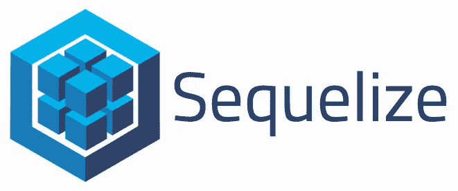
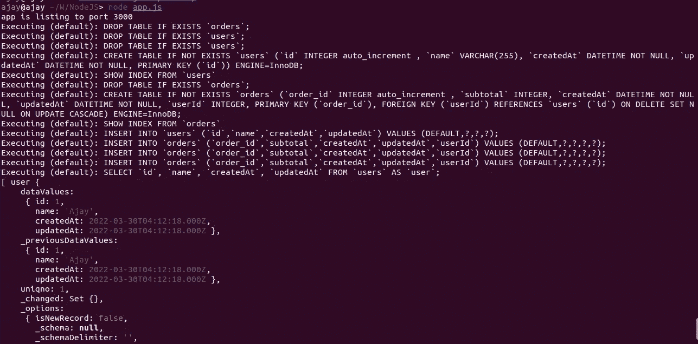

# NodeJS 中的 Sequelize 入门

> 原文：<https://blog.devgenius.io/getting-started-with-sequelize-in-nodejs-35aa874e2145?source=collection_archive---------4----------------------->



Pic Credit [胡祖六](https://medium.com/@zhhjoseph?source=post_page-----dd6045f366e6-----------------------------------) |中

**什么是序列式？**

这是 Sequelize 的官方定义

> Sequelize 是一个基于 promise 的 [Node.js](https://nodejs.org/en/about/) [ORM 工具](https://en.wikipedia.org/wiki/Object-relational_mapping)用于 [Postgres](https://en.wikipedia.org/wiki/PostgreSQL) 、 [MySQL](https://en.wikipedia.org/wiki/MySQL) 、 [MariaDB](https://en.wikipedia.org/wiki/MariaDB) 、 [SQLite](https://en.wikipedia.org/wiki/SQLite) 、[微软 SQL Server](https://en.wikipedia.org/wiki/Microsoft_SQL_Server) 、[亚马逊红移](https://docs.aws.amazon.com/redshift/index.html)、[雪花的数据云](https://docs.snowflake.com/en/user-guide/intro-key-concepts.html)、 [DB2](https://en.wikipedia.org/wiki/IBM_Db2_Family) 和 [IBM 它具有可靠的事务支持、关系、急切加载和延迟加载、读取复制等特性。](https://www.ibm.com/support/pages/db2-ibm-i)

我刚刚开始学习 NodeJS Sequelize，并有了一个在 Medium 上分享它的想法。所以我们开始吧

在这篇文章中，我将做以下一系列任务

1.  连接 NodeJS 应用程序和 MySQL 数据库
2.  创建模型
3.  在模型(表)之间建立关系
4.  添加虚拟数据
5.  获取数据

那么让我们开始吧！

这里我以电子商务应用程序中的客户和订单为例。一个客户可以有许多订单，这是我为 DB 表添加的一种关系。

首先，在你当前的项目中安装 Sequelize。请注意，我们将使用 MySQL 作为 Sequelize 的方言，所以我们也必须安装 mysql2 包。

```
npm install mysql2 sequelize  --save
```

这是我的这个应用程序的项目结构

```
app.js
db
  -index.jsmodels
  - index.js
  - user.model.js
  - order.model.js
package.json
```

1.  **连接 NodeJS 应用程序和 MySQL 数据库**

现在，在当前项目的 **db/index.js** 中创建一个文件

```
const sequelize = require('sequelize');

const ***Sequelize*** = new sequelize.Sequelize(
    "<DB Name>",
    "<DB User>",
    "<DB Password>",
    {
        host: '<DB Host>',
        dialect: "mysql"
    });

module.exports = ***Sequelize***;
```

**2。创建模型**

现在创建模型。因此，首先我们将在 **models/user.model.js** 中为用户创建一个模型

```
const ***sequelize*** = require('../db');
const Sequelize = require('sequelize');

const ***User*** = ***sequelize***.define('user', {
    id: {
        type: Sequelize.***INTEGER***,
        primaryKey: true,
        autoIncrement: true
    },
    name: {
        type: Sequelize.***STRING*** }
});

module.exports = ***User***;
```

在这里，我们已经获得了一个 Sequelize connection 实例，并使用 **define** 方法在该实例上创建了一个表。define 方法有两个参数，**第一个参数是表名**，第二个参数是**表实体**。这里我们创建了两列 A. **id** :整型、主键、自动增量和 B. **name** :这将是用户的名字。您可以根据需要添加任意多的列，但我会使这个表变得简单

现在在 **models/order.model.js** 中为订单创建另一个模型

```
const ***sequelize*** = require('../db');
const Sequelize = require('sequelize');

const ***Order*** = ***sequelize***.define('order', {
    order_id: {
        type: Sequelize.***INTEGER***,
        primaryKey: true,
        autoIncrement: true
    },
    subtotal: {
        type: Sequelize.***INTEGER*** }
});

module.exports = ***Order***;
```

**3。建立模型(表格)之间的关系&用承诺链添加虚拟/提取数据**

现在是时候建立模型之间的关系了。因此，我们将在另一个文件 **models/index.js** 中执行该操作

```
const ***sequelize*** = require('../db');
const Sequelize = require('sequelize');

const ***User*** = require('../models/user.model');
const ***Order*** = require('../models/order.model');

***User***.*hasMany*(***Order***);

***sequelize*** .sync({ force: true })
    .then(conn => {
        return ***User***.*create*({name: "Ajay"})
    })
    .then(user => {
        return ***Promise***.all([
            ***Order***.*create*({subtotal: 500, userId: user.id}),
            ***Order***.*create*({subtotal: 600, userId: user.id}),
            ***Order***.*create*({subtotal: 700, userId: user.id})
        ])
    })
    .then(order => {
        return ***User***.*findAll*();
    })
    .then(users => {
        ***console***.log(users)
    })
    .catch(err => {
        ***console***.log(err.toString())
    })
```

我们首先采用我们创建的两个模型，并在用户&订单表上构建**一对多关系**。

之后，我们在 DB 实例上使用了**同步方法**。它的工作是创建我们到目前为止定义的所有表。你也可以在同步方法中提供 **{force: true}** ，这将基本上在你每次运行你的应用程序时删除表格。请注意，在调用 sync 方法之前，我已经声明了所有的模型实例，这是必要的，所以告诉 Sequelize，这是我们的模型，请运行数据库查询。

最后，我将添加 app.js 和 package.json，以确保运行这个应用程序时不会遗漏任何东西

**app.js**

```
const ***express*** = require('express');
const db = require('./models');

const app = ***express***();

app.listen(***process***.env.PORT || 3000, function () {
    ***console***.log('app is listing to port 3000')
})
```

**package.json**

```
{
  "name": "nodejs-***sequelize***",
  "version": "1.0.0",
  "dependencies": {
    "express": "^4.17.3",
    "sequelize": "latest",
    "mysql2": "latest"
  }
}
```

现在从项目的根目录使用 **node app.js** 命令运行您的应用程序，但是要确保您已经首先运行了 **npm install** 以确保安装了包依赖项。

```
npm install && node app.js
```

现在检查您的数据库，它将有 2 个表，其中的列在 ***序列*** *模型中定义。您将获得以下输出*



现在检查你的数据库

```
 mysql> show tables;
+--------------------------+
| Tables_in_test_sequelize |
+--------------------------+
| orders                   |
| users                    |
+--------------------------+
2 rows in set (0.00 sec)
```

太好了！我们已经成功地创建了一个应用程序，使用 ***序列从数据库中创建/添加/获取数据。***

你喜欢这篇文章吗？如果是这样，通过 [**订阅解码获得更多类似内容，我们的 YouTube 频道**](https://www.youtube.com/channel/UCvEB7wXUEXGFE9lCx0USR3Q) **！**

感谢阅读。