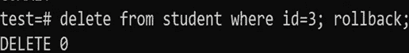

# SQL 命令入门

> 原文：<https://blog.devgenius.io/getting-started-with-sql-commands-79445bea6184?source=collection_archive---------12----------------------->

#入门指南

#DDL、DML、TCL(我将使用 PostgreSQL 来执行操作)

我们生活在一个数据驱动的世界里，人们通过搜索数据来发现洞察，从而为其他类别的战略、营销和运营提供信息。有许多公司使用关系数据库，这使得对 SQL 的透彻理解成为所有人的一项重要就业技能。

**结构化查询语言**

# 简介:

SQL 代表**结构化查询语言**。SQL 用于与 RDBMS(关系数据库管理系统)通信(存储数据/管理数据)。它用于在 RDBMS 上执行数据操作。

SQL 遵循不同的方法来操作数据。SQL 中的基本命令分为 3 个命令:

*   数据定义语言
*   DoctorofModernLanguages 现代语言博士
*   TCL 集团股份有限公司（TCL Corporation 的缩写）

# 1.DDL:数据定义语言

这种语言包含对数据库执行特定更改的 SQL 命令。它给出了数据库模式的描述，并用于在数据库中创建和修改数据库对象的结构。

**注意**:所有的 DDL 命令都是自动提交的。这意味着更改将永久保存在数据库中。

以下是 DDL 命令:

1.  **创建**:用于创建一个新的表或数据库。

创建数据库

在数据库测试下创建学生表:

创建表学生

**2。修改**:用于整个数据结构的修改。

在学生表中添加列:

向 student 表添加电子邮件列

**3。删除**:用于从数据库中删除数据/表格。

落桌学生

**4。Truncate** :用于删除一个表中的所有记录，包括删除所有为记录分配的空间。

截断学生表(假设表中已经存在数据):

截断学生表

**5。重命名**:用于重命名现有数据库中的一个表。

将列“名称”更改为“全名”

# 2.DML:数据操作语言

DML 命令用于操作存储在表中的数据，而不是表本身。DML 命令不会自动提交。这意味着对数据库的更改不是永久的，它们可以回滚。

以下是 DML 命令:

1.  **插入:**插入新的一行，即表格中的新记录/表格中的值。

要在学生表中插入值:

插入值

2.**更新:**该命令用于更新表格中的条目。

将学生姓名“Ben”更新为“Taylor”:

更新的表格

3.**删除**:Delete 语句用于删除表格中已有的记录。

现在删除名为 Prince 的记录:

# 3.TCL:事务控制语言

执行这些命令是为了检查其他命令及其对数据库的影响。这些命令通过将数据回滚到其原始状态来取消其他命令所做的更改。它还可以使任何暂时的变化永久化。

TCL 命令如下:

1.  **提交:**提交命令是用于保存由事务调用的对数据库的改变的事务命令。

要删除 id=3 的学生信息:

犯罪

**2。roll back**:roll back 命令是事务命令，用于撤销尚未保存到数据库的事务。此命令只能用于撤消事务，因为上一个提交或回滚命令有问题。

要删除 id=3 的学生信息，然后回滚数据库中的更改:

反转

**3。** **保存点**:保存点是事务中的一个点，此时您可以将事务回滚到某个点，而无需回滚整个事务。

在删除 id=2 和 1d=4 的学生之前创建保存点

保存点

我们完成了，谢谢你的阅读。

**参考** : [堆栈溢出](https://www.brentozar.com/learn-query-sql-server-stackoverflow-database/)

# 快乐编码:)