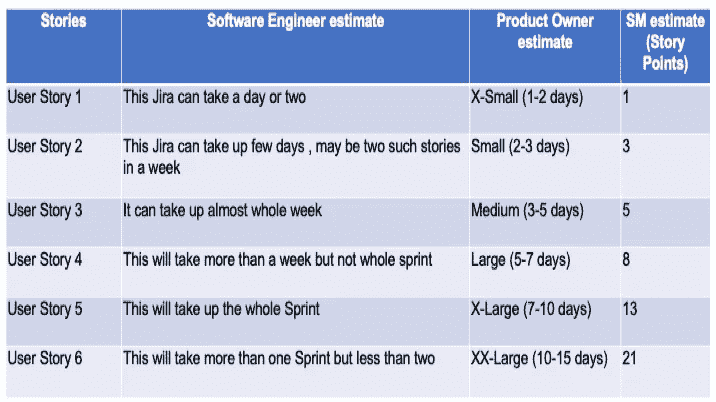

# 技术人员的故事点估算！

> 原文：<https://blog.devgenius.io/getting-started-with-story-point-estimation-ac58b4eac499?source=collection_archive---------0----------------------->

## 用非常规方法学习评估的开发人员指南。

图片由[皮克斯拜](https://pixabay.com/?utm_source=link-attribution&utm_medium=referral&utm_campaign=image&utm_content=2798560)的 Gerd Altmann 提供

故事点是敏捷开发中使用的一个度量标准，用来估计实现给定用户故事的相对复杂性或难度。这可以被认为是对相对复杂性的抽象度量。简单来说，一个故事点是一个数字，它告诉团队这个故事的难度，因为它与 backlog 中的其他故事相关。难度级别有助于团队评估团队在特定时间内可以完成的总体工作。当我们用故事点进行估算时，我们给每一项分配一个分值。我们赋予的原始值并不重要。重要的是相对值！

故事点代表了开发一个故事的努力，所以评估必须包括所有可能影响努力的活动。这可能包括:

*   任何事情&所有需要做的事情(例如，编码、测试、文档等。)
*   工作的难度或复杂性(如分析、研究等)。)
*   工作中的任何风险、依赖性或不确定性(如假设、依赖性等)。)

# 故事点练习

**先决条件:**

*   特征分解(峰值、任务、故事等。)
*   按优先顺序排列的故事列表
*   依赖性/风险
*   验收准则

**参与者:**

产品负责人/经理[PM/PO]，Scrum 团队

**流程:**

*   团队从优先级最高的故事开始，为评估过程挑选故事。
*   SME(PM/技术主管/PO)详细描述了这些要求。
*   团队讨论完成故事所需的工作，如编码工作、测试、文档等。等。(确定流程中的子任务)。
*   团队成员估计这个故事大约需要。天数或 t 恤尺寸(S、M、L、XL)。
*   如果评估之间存在巨大差异，团队将再次讨论以达成共识/多数决定。
*   Scrum 主管/产品负责人将大小映射到约定的故事点(例如斐波那契数列)
*   一旦团队对故事点感到满意，他们就可以直接通过故事点而不是 t 恤尺寸或天数进行估算。

**下表给出了使用斐波纳契数列映射到故事点的不同估算方法。**

# **当故事点流程被引入敏捷团队时，通常会出现一些问题。**

## **为什么我们需要评估？**

评估有助于度量团队的速度，换句话说，在迭代中完成用户故事的能力。Velocity 通过预测团队在特定时间内可以完成的工作量来帮助团队进行容量规划。这些信息在更广泛的层面上有助于为客户制定更大的计划。

## 为什么我们需要故事点评估？

使用故事点是最简单的估算方法之一，它可以让团队大致规划一个范围，而不是一个精确的数字。当您在更宽的范围内进行评估时，满足计划范围的机会更大，团队花在细节上的时间也更少。

## **故事点数是衡量团队表现还是个人表现的标准？**

故事点评估对于一个团队来说是非常具体的，不能用来比较任何两个团队的表现。这纯粹是衡量一个团队能完成的工作大小。这依赖于团队组成和工作类型不变的事实。

故事点与员工的表现无关。评估是一个团队练习，而速度是团队生产力的度量。最终，涉众希望团队实现目标的能力清晰可见。

## **你应该在哪个时间点做故事定点？**

故事点应该是 sprint 计划练习的一部分。团队应该按照故事的优先级顺序来估计故事，并以分配的故事点加起来达到团队速度(大约)的方式来计划故事。

## 完成一个故事的最短时间或最长时间的估算标准应该是什么？

估计应该是团队中的任何人完成故事所付出的努力——既不是最快的也不是最慢的。评估是一个团队练习，所以故事点或规模是通过团队的共识来完成的。团队中的每个人都提供了他们的工作评估，员工提供了最大偏差，并提供了获得团队同意的理由。

## **我们总是高估或者低估故事怎么办？**

故事指向过程是一个近似的过程，只要你一直这样做，你就不太可能高估或低估。

如果你总是高估，完成的故事会更少。速度是基于完成的工作，所以你的平均值将基于更少的故事，最终你将根据你的速度(更少的故事)开始计划。

如果你总是低估，你将总是在迭代中添加更多的故事。速度是基于已完成的工作，所以你的平均值将基于额外的故事，最终你将根据你的速度开始计划(用额外的故事)。

总的来说，每件事都达到了平均，为团队获得了正确的速度。

## 如何估计太大的故事？

如果您的团队正在进行两周的迭代，那么将故事的长度保持在 XL (~2 周)可能是个好主意。如果故事比较大，把它进一步分解成更小的故事或任务可能是个好主意。如果这是不可能的，确定故事的子任务，并估计子任务，最终增加估计故事的努力。

## **为什么是斐波那契数列？**

在斐波纳契数列中，两个连续数字之间的差异不是线性的，并且随着每个后续数字的增加，差距呈指数增长。类似地，随着用户故事变得越来越大，它们的复杂性和工作量估计也呈指数增长，可预测性变得很困难。

## **斐波那契数列是故事指向的唯一方式吗？**

不，斐波纳契数列是最流行的机制之一。一个团队应该试验他们自己的度量和编号单位。他们可能选择甚至不称之为故事点，而选择任何特定于团队的自定义名称。

## **故事点是否只用于用户故事或者其他任务？**

故事指向只是这种技术的名称。它可以用来估计用户故事、操作任务或任何其他占用团队能力的活动的工作量。

为了不受干扰地阅读，考虑加入 Medium，并通过使用我的[推荐链接](https://praveshbhargav.medium.com/membership)支持我。

 [## 构建敏捷团队:项目对产品

### 当建立敏捷团队时，组织可以选择是建立灵活的基于项目的团队还是固定的产品…

medium.com](https://medium.com/agileinsider/agile-teams-project-vs-product-4d125ecb6ae5)  [## 你如何管理平台/组件敏捷团队的待办事项

### 对一个团队来说，在多个产品上竞争优先权可能是一个挑战。以下是一些管理它们的方法…

praveshbhargav.medium.com](https://praveshbhargav.medium.com/managing-backlog-for-a-platform-component-agile-team-507c469a1253)