# Github CLI 入门

> 原文：<https://blog.devgenius.io/getting-started-with-the-github-cli-2a723585e368?source=collection_archive---------1----------------------->

## GitHub CLI 1.0 于 2020 年 9 月 17 日发布


汉娜·乔舒亚在 [Unsplash](https://unsplash.com?utm_source=medium&utm_medium=referral) 上拍摄的照片

> 受欢迎的 Git 提供商 GitHub 已经开发了一个命令行工具，允许用户不用离开终端就可以访问。

在这篇文章中，我将带你们完成在本地机器上设置 GitHub CLI 的过程。

所以，我们开始吧！

# 步骤 1 —安装 GitHub CLI

在开始使用 GitHub CLI 之前，您必须在本地机器上安装它。

> *在 Mac 上安装*

如果你用的是`macOS,`，你可以用[自制软件](https://formulae.brew.sh/formula/gh#default)来安装，就像这样:

```
brew install gh
```

这里有一张 gif 图，可以让你有更好的想法:

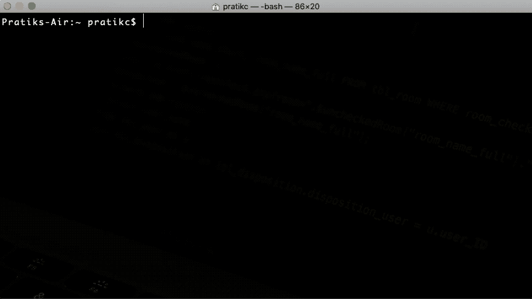

安装 GitHub CLI。图片来源:Pratik Chaudhari

> *在 Linux 上安装*

对于`Linux`的用户来说，[自制软件](https://formulae.brew.sh/formula/gh#default)应该也很好用。

尽管如此，如果你使用的是没有得到官方支持的 Linux 发行版，你将不得不依赖社区维护的 CLI 版本。

在这些发行版上安装 CLI 的说明可以在这里找到。

> *在 Windows 上安装*

如果你是一个`Windows`用户，你可以使用 [Chocolatey](https://chocolatey.org) 来安装命令行界面，就像这样:

```
choco install gh
```

安装后，您可以使用`gh`命令来访问它，就像这样:

```
gh
```

以下是上述命令将输出的内容:

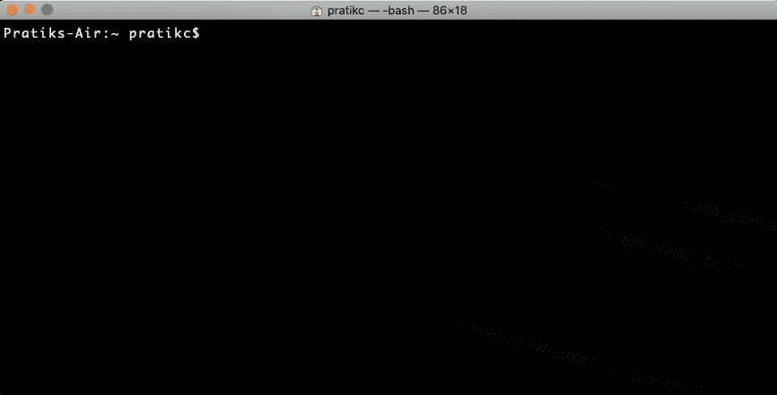

启动“gh”命令后的输出。图片来源:Pratik Chaudhari。

既然已经安装了 CLI，并且可以通过`Terminal`访问，让我们使用 CLI 做一些有趣的事情，比如查看一个 [GitHub 库](https://guides.github.com/activities/hello-world/):

```
gh repo view pratikgchaudhari/vue-3-projects
```

上面的命令应该显示由所有者`pratikgchaudhari`即我创建的`vue-3-projects` repo 的所有信息。

但是我们得到的是:

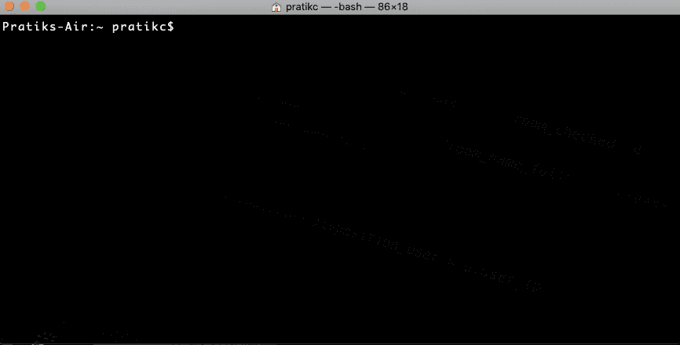

“GH repo view pratikgchaudhari/vue-3-projects”命令的输出。图片来源:Pratik Chaudhari。

`GitHub CLI`要求你在使用 GitHub 凭证做任何事情之前，先用它来验证你自己！

这就把我们带到了下一步！

# 步骤 2 —身份验证

要验证您的身份，请输入以下命令:

```
gh auth login
```

以下是您将看到的内容:

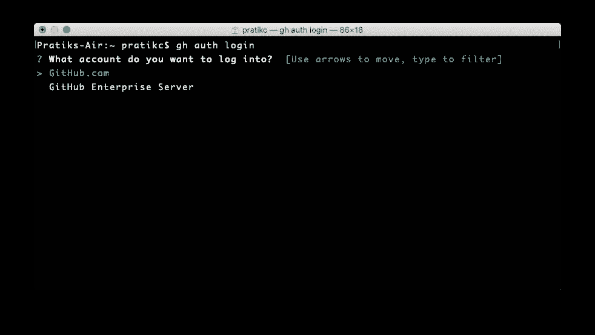

“gh 认证登录”命令的输出。图片来源:Pratik Chaudhari。

`GitHub CLI`询问你是否想使用对所有用户免费的[GitHub.com](https://github.com)上的账户登录，或者是否想使用 [GitHub Enterprise](https://github.com/enterprise) 账户(很可能是你的雇主所有，也可能只有你一个人)。

由于我没有企业帐户，我将继续使用我的`GitHub`帐户。

以下是我选择上述选项后看到的内容:

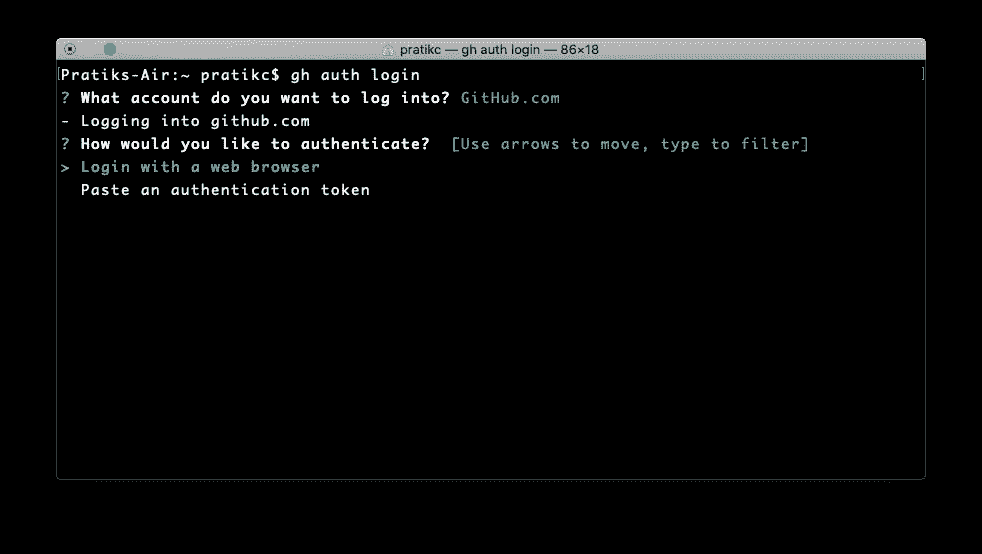

选择“GitHub.com”选项后的输出。图片来源:Pratik Chaudhari。

既然我还没有`authentication token`(还没有)，我就选`Login with a web browser`选项。

一旦我选择了上述选项，CLI 会向我提供一个`one-time`代码:

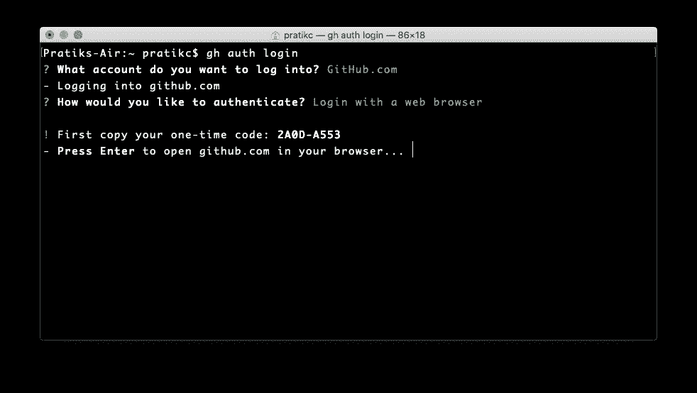

选择“使用 web 浏览器登录”选项后的输出。图片来源:Pratik Chaudhari。

我复制 CLI 提供的`one-time`代码，并按下`Enter/Return`键。

不出所料，一个浏览器窗口打开了，我需要粘贴刚刚复制的`one-time`代码:

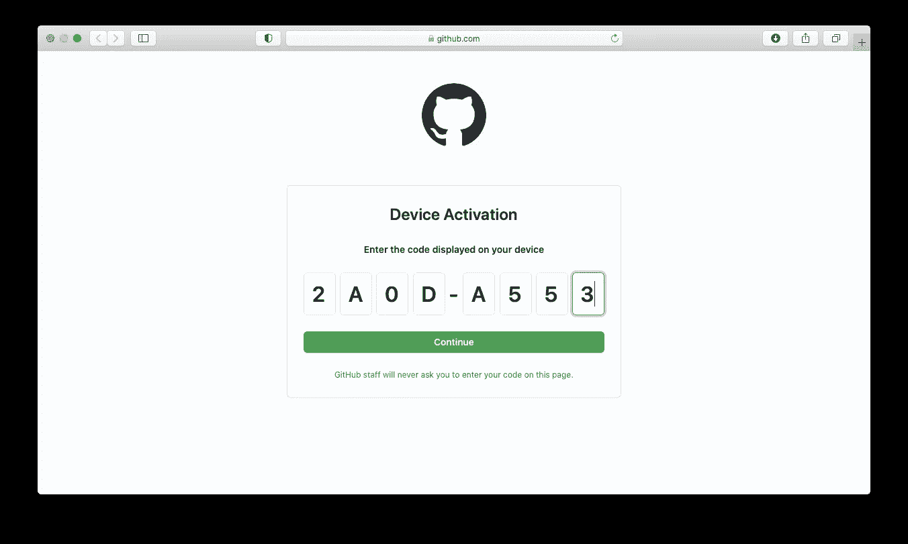

必须粘贴“一次性”代码的浏览器窗口。图片来源:Pratik Chaudhari。

点击`Continue`按钮后，我看到以下屏幕:

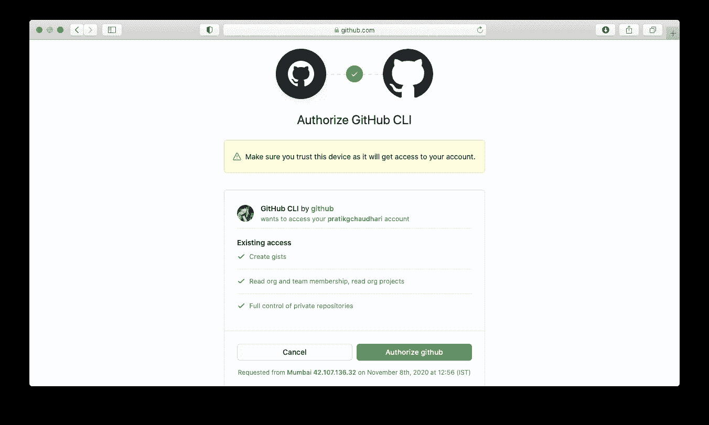

浏览器中“GitHub CLI”的 OAuth 授权接口。图片来源:Pratik Chaudhari。

基本上，我被提示授权`GitHub CLI`从我的 GitHub 账户访问各种资源。

因此，我将通过单击`Authorize github`按钮授予它所需的访问权限。这是我接下来看到的:

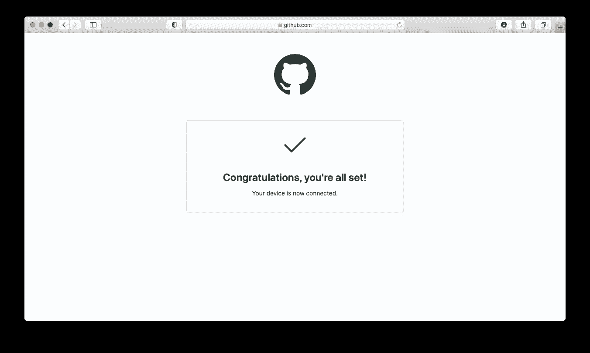

浏览器中的 OAuth 授权成功界面。图片来源:Pratik Chaudhari。

上面的屏幕告诉我认证过程完成了！

当我切换到我的`Terminal`并按下`Enter/Return`键时，CLI 要求我在与`GitHub`服务器通信时选择使用以下两种协议:

1.  HTTPS
2.  嘘

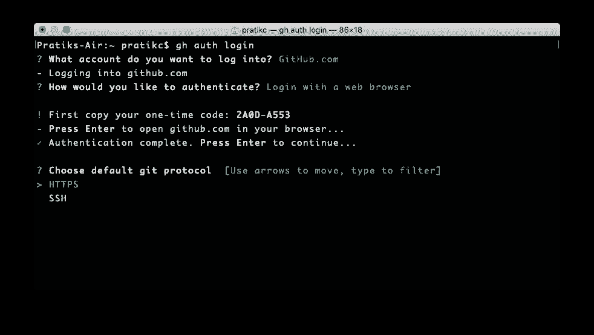

“终端”提示用户选择通信协议。图片来源:Pratik Chaudhari。

这里我将选择`SSH`协议，但是选择`HTTPS`协议也没有坏处:

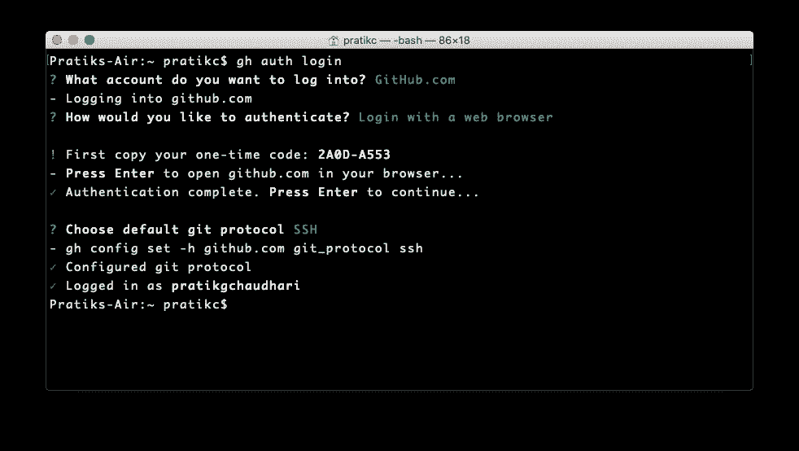

选择 SSH 协议后的输出。图片来源:Pratik Chaudhari。

完成了！

让我们再次执行下面的命令，看看会发生什么:

```
gh repo view pratikgchaudhari/vue-3-projects
```

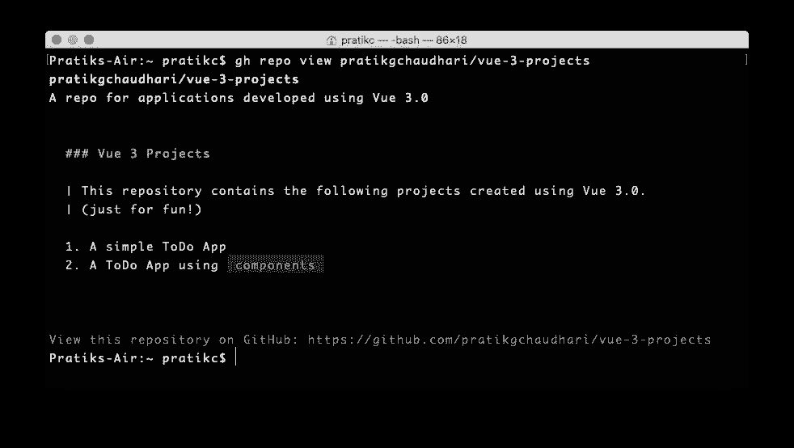

“GH repo view pratikgchaudhari/vue-3-projects”命令的输出。图片来源:Pratik Chaudhari。

正如您在上面的截图中所看到的，存储库的标题和它的`README`的内容一起显示在`Terminal`上。

`GitHub CLI`提供了更多的命令，我将在以后的另一篇文章中详细介绍。

现在，就是这样！

*最初发布于 2020 年 11 月 8 日*[*https://dev . to*](https://dev.to/pratikgchaudhari/getting-started-with-the-github-cli-d55)*。*