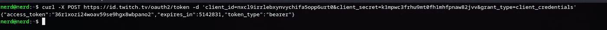

# Twitch API 入门

> 原文：<https://blog.devgenius.io/getting-started-with-the-twitch-api-855d481471b4?source=collection_archive---------4----------------------->

问候书呆子👋，我最近开始喜欢摆弄 Twitch API，我认为这值得与你们分享，这样你们就可以构建自己的下一个由 Twitch 驱动的项目


卡斯帕·卡米尔·鲁宾在 [Unsplash](https://unsplash.com?utm_source=medium&utm_medium=referral) 上拍摄的照片

**深度 TWITCH API**

Twitch 提供了各种 API 以及它们提供的特定服务，因此要更好地了解可用选项，请查看[此链接](https://dev.twitch.tv/docs/api/)，要跟随我，您需要参考[此链接](https://dev.twitch.tv/docs/api/reference)

**首先，让我们创建一个 TWITCH 应用程序**

为了使用这些 API，我们需要创建一个应用程序，这样我们就可以获得向它们的端点发出请求所需的凭证

这个过程很简单，所以让我们开始吧，不要再浪费时间了

*   前往 [Twitch 开发者门户](https://dev.twitch.tv/)，点击右上角的登录 Twitch
*   在同一位置点击“您的控制台”
*   找到并单击“注册您的应用程序”,您应该看到这个表单


对于 Oauth 重定向，它可以是任何链接，因为我们没有使用 twitch 特性实现任何登录，对于类别，您可以选择“聊天机器人”

*   现在，完成所有设置后，当您单击应用程序时，应该会看到您的客户端 id 和客户端密码，在下一部分中，我们将获取 oauth 令牌，这是身份验证过程的重要部分

***得到我们的 OAuth 令牌***

在这一部分之前，让我们设置我们的开发环境，这将是最小的，因为我们并不真正构建任何特定的东西

*   终端——废话
*   `curl`已安装
*   `jq`因为它将帮助我们将响应解析成格式优美的 json

现在我们可以启动我们的终端并开始输入一些命令😝

要获得 OAuth 令牌，我们需要向`https://id.twitch.tv/oauth2/token`发出 POST 请求，请求体中包含以下参数

1.  `client_id`您可以从 twitch dev 控制台获得
2.  `client_secret`同上
3.  `grant_type`应设置为`client_credentials`

现在用`curl`来表达这样的请求，应该是这样的



*当然，在我发布之前，我会删除这个应用程序，所以不要想；)*

现在我们有了自己的承载令牌/ OAuth 令牌和客户端 id，我们可以看看几个端点:)

***现在获得顶级游戏***

如果我们看一下 [API 参考](https://dev.twitch.tv/docs/api/reference)，我们可以搜索这么多的端点，每个端点都有非常详细的说明和示例，所以我们将选择两个端点，因为这个博客都是关于“入门”的部分，所以你可以自己尝试

为了获得目前的热门游戏，我们将提出以下请求

```
curl  [https://api.twitch.tv/helix/games/top](https://api.twitch.tv/helix/games/top) -H "Authorization:Bearer <your oauth token>" -H "Client-Id:<your client id>" | jq '.data[]'
```

因为所有的端点都在一个名为`data`的数组中返回一个 JSON 响应，我们把它传递给`jq`，现在让我们看看这个响应，看看如何使用`jq`访问内部属性


这是一个非常优雅的响应，非常容易解析，所以让我们以访问`name`属性为例

```
curl  [https://api.twitch.tv/helix/games/top](https://api.twitch.tv/helix/games/top) -H "Authorization:Bearer <your oauth token>" -H "Client-Id:<your client id>" | jq '.data[].name'
```

很简单，对吧？如果你做过 javascript 和解析 JSON，你会非常熟悉这个

***获取特定游戏的信息***

现在我们将请求这个端点``https://api.twitch.tv/helix/games`,并向它提供我们之前响应中的一个游戏的 ID，例如 Dota 2，看看我们得到了什么信息

```
curl [https://api.twitch.tv/helix/games?id=29595](https://api.twitch.tv/helix/games?id=29595) -H "Authorization: Bearer <oauth token here>" -H "Client-Id:<your client id>" | jq '.'
```

回应应该是这样的


这应该足以开始使用 Twitch API，因为认证和授权过程对于一些新手来说有点棘手，但是文档内容非常丰富，所以不要忽略它

感谢您对我的博客感兴趣，并花时间阅读本文，快乐编码