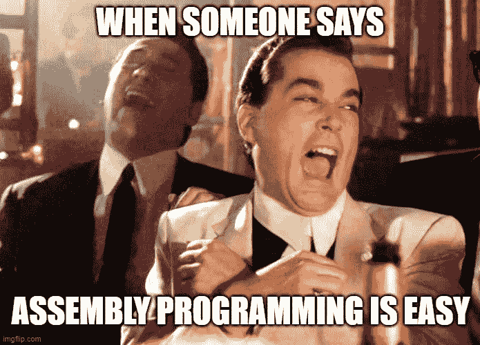
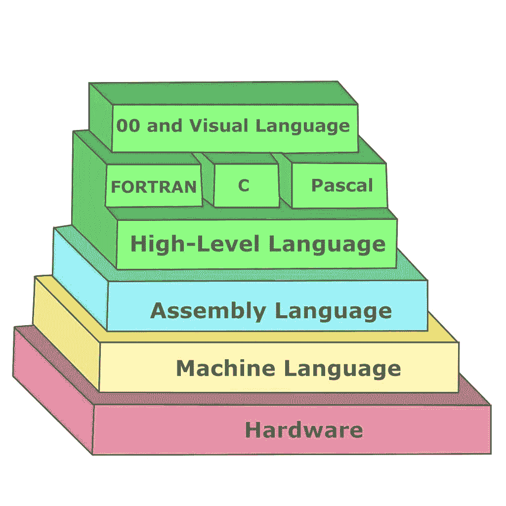
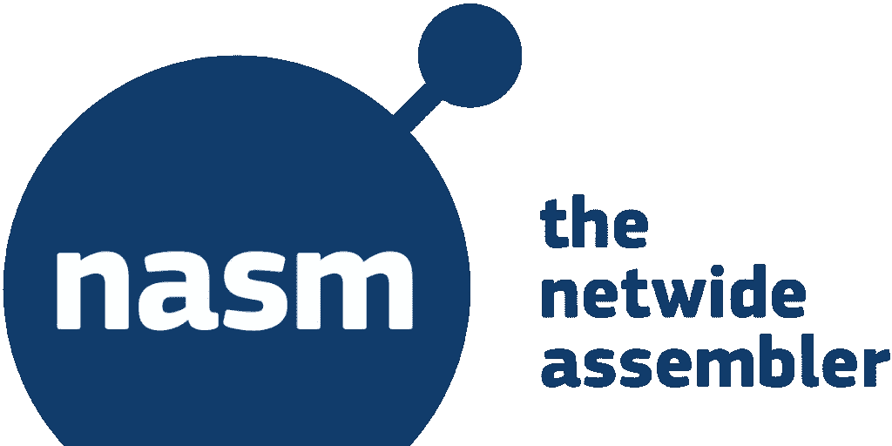

# 编写 X86–64 汇编语言程序

> 原文：<https://blog.devgenius.io/getting-started-writing-assembly-language-8ecc116f3627?source=collection_archive---------4----------------------->



## 第一部分:开始编写汇编语言

## 本指南是系列的第一部分

*   第二部分:[开始编写汇编语言](https://tony-oreglia.medium.com/finding-an-efficient-development-cycle-for-writing-assembly-language-be2092e6db6a)
*   第三部分:[打印命令行参数](https://medium.com/@tony.oreglia/writing-an-x86-64-assembly-language-program-648b6005e8e)
*   第四部分:[发送函数参数并接收返回值](https://medium.com/@tony.oreglia/writing-an-x86-64-assembly-language-program-function-arguments-and-result-dfff25970dee)
*   第五部分:[条件句，跳转，循环](https://tony-oreglia.medium.com/writing-an-x86-64-assembly-language-program-1aade03f3b9b)
*   第六部分:[如何确定字符串长度](https://tony-oreglia.medium.com/writing-an-x86-64-assembly-language-program-84e2432cf16b)
*   第七部分:[快速参考](https://tony-oreglia.medium.com/writing-an-x86-64-assembly-language-program-f847d4edf577)

这是一个建立低摩擦开发环境的指南，以简化汇编语言程序的编写和调试。

# 为什么要学习汇编语言

> 年轻时没黑过汇编语言的人是没有心的

学习汇编语言可以提高一个人对软件的基本理解。随着基础知识的提高，你可以更准确地判断即将到来的技术的效用，我认为这是一个非常重要的技能。对哪些技术将占据主导地位下正确的赌注意味着你可以更好地投资你的时间甚至金钱。例如，众所周知，那些对加密货币领域有基本了解的人立即理解了区块链的价值，几乎没有额外的努力就赚了数百万美元。

另外，汇编语言很接近硬件，这很有趣。



# 一些背景

为了运行汇编语言程序，首先，编译器创建一个目标代码文件(**)。obj** 。接下来，必须将目标代码文件链接到可执行文件中。链接可以通过编译器或单独的链接器进程来完成。

# 准备

准备编写汇编语言可能有点令人困惑。有许多工具可以编译和链接汇编。哪些工具在给定的操作系统上工作可能并不明显，该操作系统支持编译成与给定处理器兼容并且与调试软件兼容的机器二进制代码。在找到一个运行良好的解决方案之前，我尝试了许多关于编译、链接和调试的选项。我试验的一些工具是

*   GNU 编译器集合 (GCC):几种主要编程语言的编译器的集成发行版。
*   [g++](https://linux.die.net/man/1/g++) : GNU project C 和 C++编译器
*   全网汇编器 (NASM):为可移植性和模块化而设计的汇编器。支持 [80x86](https://en.wikipedia.org/wiki/X86) 和[x86–64](https://en.wikipedia.org/wiki/X86-64)(支持特定指令集的处理器系列)
*   [yasm](http://yasm.tortall.net/releases/Release1.3.0.html) :设计用于支持多种汇编语法的汇编程序。
*   [ld](https://ftp.gnu.org/old-gnu/Manuals/ld-2.9.1/html_node/ld_3.html) :合并多个目标文件和档案文件，重新定位它们的数据并绑定符号引用。通常，编译程序的最后一步是运行 ld。
*   GNU 项目调试器 (gdb):允许你看到另一个程序执行时“内部”发生了什么
*   [铿锵](https://clang.llvm.org/get_started.html):兼容 GCC 的编译器驱动程序



我从 clang 开始，但是很难运行链接的可执行文件。

接下来，我尝试了用`NASM`编译和`ld`链接目标文件的组合。举个例子，

```
$ nasm -f macho64 -o hello_world.o hello_world.asm
$ ld hello_world.o -o hw
$ ./hw
```

这在 Mac 上运行良好，直到你需要调试。`gdb`无法浏览从 macho64 目标文件链接的文件。这篇博客详细描述了一个类似的经历。不幸的是，`NASM`还不支持所需的 macho 调试格式。

上面链接的博客建议使用虚拟机来运行 Linux，其支持的汇编语言格式支持通过`NASM.`进行调试。然而，运行虚拟机是相当繁重的，一个简单的 docker 容器应该可以完成这项工作。

# TLDR；如何在 Docker 容器中使用 GDB

该 [Dockerfile](https://github.com/tonyOreglia/unique-word-counter/blob/master/Dockerfile) 支持使用`NASM`编译 x86–64 汇编代码，与`gcc`(或`ld`链接，用`gdb.`调试

Docker 容器必须使用选项`--cap-add=SYS_PTRACE`和`--security-opt seccomp=unconfined`运行，以便`gdb`完全发挥作用:

```
$ docker run --rm -it --cap-add=SYS_PTRACE --security-opt seccomp=unconfined -v "$(current_dir)":/app -w /app <DOCKER-IMAGE-NAME>
```


# 获取上面的命令

我最初决定在 Linux docker 容器中编译、链接和调试汇编代码程序，以启用 Mac OS 上不支持的调试选项。

然而，尽管得到了所有这些设置，`gdb`仍然无法在执行过程中中断。它报告了以下错误:

```
warning: Error disabling address space randomization: Operation not permitted
```

听起来像是`gdb`需要控制寻址空间，但是 Docker 不允许这种控制。

# 如何解决这个问题

在[堆栈溢出](https://stackoverflow.com/questions/35860527/warning-error-disabling-address-space-randomization-operation-not-permitted)中发现的建议是使用以下选项运行 Docker:

```
docker run --cap-add=SYS_PTRACE --security-opt seccomp=unconfined
```

果然，包括这些选项似乎都整理出来了`gdb`。使用这些命令运行 Docker 容器外壳，然后使用`gdb`使`gdb breakpoints`工作:

```
(gdb) disass _start
Dump of assembler code for function _start:
   0x00000000004000b0 <+0>:     mov    $0x1,%eax
   0x00000000004000b5 <+5>:     mov    $0x1,%edi
   0x00000000004000ba <+10>:    movabs $0x6000d8,%rsi
   0x00000000004000c4 <+20>:    mov    $0xe,%edx
   0x00000000004000c9 <+25>:    syscall
   0x00000000004000cb <+27>:    mov    $0x3c,%eax
   0x00000000004000d0 <+32>:    xor    %rdi,%rdi
   0x00000000004000d3 <+35>:    syscall
End of assembler dump.
(gdb) break *0x4000b0
Breakpoint 1 at 0x4000b0: file hellow.asm, line 8.
(gdb) run
Starting program: /app/hw
Breakpoint 1, _start () at hellow.asm:8
8         mov rax, 1
(gdb)
```

不幸的是，似乎还有一个问题。当我试图单步执行一个程序时，我得到了奇怪的行为:

```
Breakpoint 1, 0x0000000000400110 in _start ()
(gdb) s
Single stepping until exit from function _start,
which has no line number information.
```

我无法单步执行函数 start。

经过一番挖掘，我找到了这种奇怪行为的原因。这里说[这里说](https://docs.docker.com/engine/security/seccomp/)的`seccomp`配置文件需要`seccomp 2.2.1`，这在 Ubuntu 14.04、Debian Wheezy 或 Debian Jessie 上都没有。因为最初使用的 Docker 基础映像是 [Debian Jessie](https://github.com/tonyOreglia/unique-word-counter/blob/master/Dockerfile#L1) ，所以`seccomp`选项没有效果。

为了解决这个问题，[基础映像](https://github.com/tonyOreglia/unique-word-counter/blob/master/Dockerfile)被切换到支持 seccomp 2.2.1 的 Alpine Linux。这很有效。关于如何在这种 Docker 容器中构建、运行和调试，参见 Makefile [这里的](https://github.com/tonyOreglia/unique-word-counter/blob/master/Makefile)。

# 让我们深入挖掘

## 论点解释

```
docker run --cap-add=SYS_PTRACE --security-opt seccomp=unconfined
```

……实际上`cap-add`和`security-opt`在做什么？

# cap-add

从 [Docker 参考](https://docs.docker.com/engine/reference/run/#operator-exclusive-options)，`--cap-add`选项允许用户添加 Linux 功能。选项`SYS_PTRACE`支持使用 ptrace(2)跟踪任意进程。

最后，从 ptrace 的 [Linux 手册页:](https://www.systutorials.com/docs/linux/man/2-ptrace/)

```
The ptrace() system call provides a means by which one process (the "tracer") may observe and control the execution of another process (the "tracee"), and examine and change the tracee's memory and registers. It is primarily used to implement breakpoint debugging and system call tracing.
```

好的。这是有道理的。GDB 需要使用 ptrace 来设置断点，但是默认情况下，Docker 不允许该功能。

# 安全性-opt seccomp=unconfined

关于另一个推荐选项(`--security-opt seccomp=unconfined`)，经过一番挖掘，我发现可以通过指定`--security-opt`标志来覆盖每个容器的默认标签方案。见[此处](https://docs.docker.com/engine/reference/run/#security-configuration)

Docker 中的标签方案是什么？

Docker 标签是一种将元数据应用于 Docker 对象的机制，包括:

*   形象
*   容器
*   本地守护程序
*   卷
*   网络
*   群集节点
*   群体服务

有关使用 GDB 调试汇编代码的更多信息，请参见此处的[和此处的](http://web.cecs.pdx.edu/~apt/cs491/gdb.pdf)和。这里还有[的](https://www.cs.umb.edu/~cheungr/cs341/Using_gdb_for_Assembly.pdf)

# 使用 Docker 编译、链接、运行和调试汇编语言代码

关于在 Docker 容器上编译、链接、运行和调试汇编代码的命令，参见 [Makefile](https://github.com/tonyOreglia/unique-word-counter/blob/master/Makefile) 。为方便起见，复制如下:

**构建和链接装配**

`docker run --rm -v $(current_dir):/app -w /app linux-assembly sh -c "nasm -f elf64 -F dwarf -g $(asm).asm && ld -m elf_x86_64 $(asm).o"`

**运行可执行文件**

`docker run --rm -v "$(current_dir)":/app -w /app linux-assembly sh -c "./a.out"`

**调试**

`docker run --rm -it --cap-add=SYS_PTRACE --security-opt seccomp=unconfined -v "$(current_dir)":/app -w /app linux-assembly sh -c "gdb a.out"`

# 找出有效的开发周期

既然我已经想出了如何让 GDB 在 Docker 中正常工作，下一步就是找到一个高效的开发周期。

当连接到 Docker 容器时，我更喜欢使用 [VS 代码](https://code.visualstudio.com/)而不是类似`vim`的东西进行开发。问题是如何在 VS 代码上进行本地开发，然后快速编译、链接和运行(在调试模式下)现在设置好的 docker 容器上的代码？

点击这里查看下一篇帖子，了解如何准确设置这个工作流[。](https://medium.com/@tony.oreglia/finding-an-efficient-development-cycle-for-writing-assembly-language-be2092e6db6a)