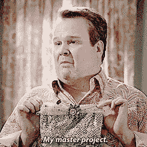
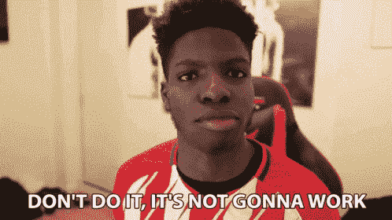

# 完成你的第一个训练营项目

> 原文：<https://blog.devgenius.io/getting-through-your-first-bootcamp-project-c12efe63312d?source=collection_archive---------49----------------------->

我叫 Eve，我参加了三周前开始的 Flatirons 软件工程训练营。本周是第一个模块的结束，也是我第一个项目周的结束。以下是我学到的东西:

## 1.对你的缺点和优点要真正诚实

坦率地说出自己的优势和劣势，对你和团队都有好处。这是一个合作项目，我们花了 10 分钟讨论我们擅长什么以及我们正在努力解决什么问题。一开始，利用额外的时间，在一周的晚些时候，知道如何更有效地分担工作，可以节省时间。这也为下一点做好了准备。

## 2.现实一点，在规定的时间内你能做什么

仔细研究项目需求。26.2 英里可以拿及格分数，为什么还要跑 30 英里？我和我的搭档坐下来，看看他们想要什么，看看我们拥有的时间。由于 7 月 4 日，我们只有三天时间来做这个项目，而其他学生通常会有一整周的时间。我们写了一个主题图，并确保我们达到了所有的需求，并且我们有知识来实现这些需求。更聪明而不是更努力地工作。

## 3.有目标、延伸目标和终极梦想

在我们最初的计划会议中，我们谈到了我们想从第一个项目中得到什么。我们谈到了希望拥有最少的代码和看起来干净的代码。我们也希望有一个看起来不错的用户友好的应用程序。这些都是基本目标。然后，我们制定了应用程序中额外功能的延伸目标。最终的梦想目标是为应用程序添加一个前端。在项目结束时，我们能够添加所有的延伸目标。

## 4.知道什么时候该走开

周四晚上，我们完成了我们的项目。我们有一些可以添加到项目中的建议，但它们不是必需的。我们讨论过了，我们的代码没有错误，我们达到了所有的目标。我们决定停下来，离开它。我们需要休息一个晚上，不希望开始打乱我们的计划，因为这很有效。作为一个团队，我们计划在程序的后期走到一起，将我们的前端添加到应用程序中。

## 最后

你已经在编码训练营呆了几个星期了。你的第一个项目可能不会成为你简历中的亮点。熬过来可能就够好了。平衡生活和训练营是困难的，抓住一点点机会获得额外的时间在道德上可能是一个巨大的差异。我和我的搭档觉得我们的目标应该是合理的，不要试图用我们不熟悉的材料来工作，那样太有伤风化了。将来会有更大更好的东西，但我仍然为我们的小应用程序感到自豪。向前一步，离终点线就更近一步。

如果有人对我们的成果感到好奇，请查看我的 github[https://github . com/everechmann/ruby-project-guidelines-chi01-seng-ft-062220 . git](https://github.com/evereichmann/ruby-project-guidelines-chi01-seng-ft-062220.git)