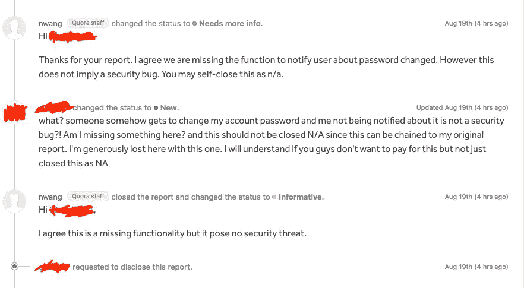
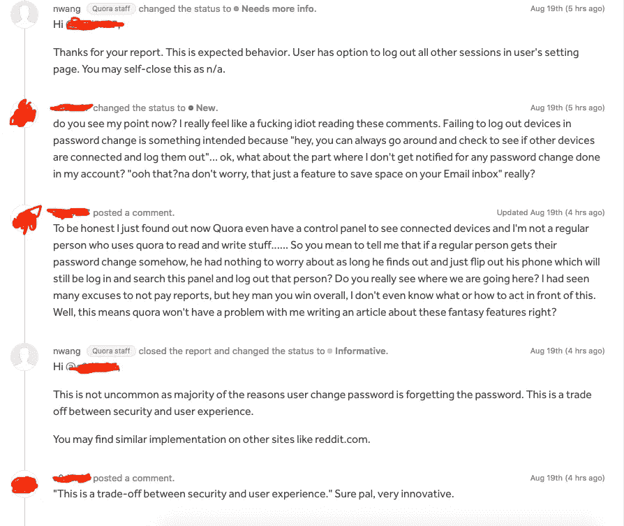

# 让你的账户被黑只是 Quora.com 的一个特色

> 原文：<https://blog.devgenius.io/getting-your-account-hacked-is-just-a-feature-on-quora-com-6a7c7d0d6cd0?source=collection_archive---------2----------------------->

## 我知道，这是一个新的和创新的东西…

照片由[飞:D 拍摄🔶艺术摄影师](https://unsplash.com/@flyd2069?utm_source=medium&utm_medium=referral)在 [Unsplash](https://unsplash.com?utm_source=medium&utm_medium=referral)

## 第 1 部分简介:

试图用我的浏览器登录 Quora，我意识到我不记得我的密码了。我在多个地方登录了这个帐户。其中一个地方是我的手机。在使用 web 应用程序成功更改密码后，我打开 android 应用程序，使用新密码重新登录(因为它应该可以工作)。嗯，我的帐户仍然使用旧密码登录。出于某种原因， **Quora 从未让我退出**。

# 复制步骤:

1.  使用同一个帐户登录 Android 和 Web 应用程序
2.  在 Web 应用程序中，询问密码重置链接
3.  将重置链接复制并粘贴到您的浏览器中，并更改密码。
4.  打开你的 android 应用程序，通过浏览来测试它，像往常一样做一些常规的事情
5.  它仍将按预期工作

> 注意:这是使用 Google 登录选项完成的。我不能保证使用你自己的电子邮件创建的普通帐户也能做到这一点。

## 第 2 部分简介:

更改密码后，我注意到**Quora.com**从未给我发电子邮件告诉我我的账户密码被更改了。其实不甘心 **HackerOne** 帮我了解了这部分 bug。怎么会？每当你要向 **Quora** 发送报告时，都会要求你设置 2FA，我做到了。完成后，你会收到一封来自 **HackerOne** 的电子邮件，告诉你正在进行的新更改。

## 报告 1:

正如你已经知道的，bug bounty 社区中的这个问题将被视为两个不同的漏洞，一个是“**无法通知密码更改**”和“**会话无法在密码更改**时注销”。

在上面的截屏中，我们可以看到对“ ***未能通知密码更改*** ”的响应，我甚至没有想到会有这样的响应。

## 报告二:

我真正没有预料到的是对第二份报告的反应。事实上，这份报告的目的是复制。

通过阅读我的回复，我们都同意我真的对他们的回复很生气。老实说，我并不生气，因为我不会因为这篇报道获得奖励，而是因为他们对 web 应用程序(如 quora)缺乏安全性做出了神奇的回应。就在一周前，他们开始为我们的内容付费。

## 摘要

很多时候，我们甚至在做日常工作时也会发现漏洞。我们也试图解决或/和利用这一点。正如你从结果中看到的，这不是我的情况。永远要注意自己的安全，因为有时公司就是不按他们应该的方式去做。