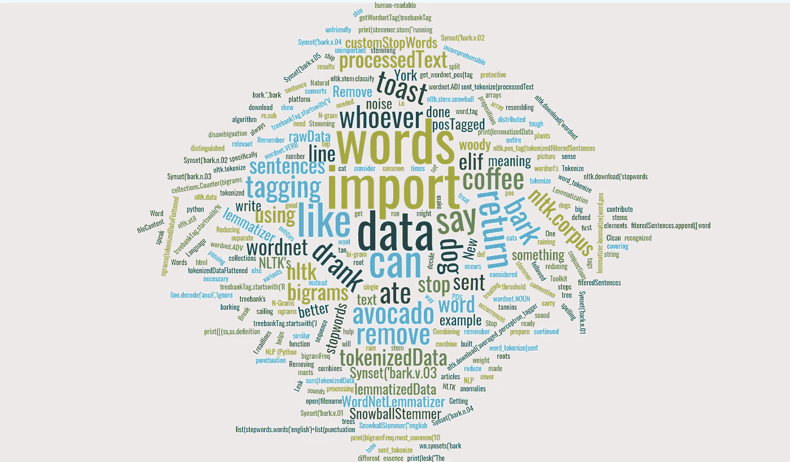

# 为 NLP 准备好文本(Python)

> 原文：<https://blog.devgenius.io/getting-your-text-ready-for-nlp-python-e1262e675c29?source=collection_archive---------20----------------------->



以下是为 NLP 准备数据时可以执行的 7 个步骤。没有必要所有的 7 件事都必须做，或者都与你的大局相关。

1.  **清理数据。**删除所有异常和不可理解的数据。你可以这样写:

```
#fileContent = "<li>Who drank my coffee?😡</li><li>I would say whoever ate your avocado toast😜</li>"import re
processedText = ""
with open(filename, “rb”) as f:
    rawData = f.readlines()
    for line in rawData:
    line = line.decode('ascii','ignore')
    processedText = re.sub("<.*?>","",line) #remove html tags#processedText = "Who drank my coffee? I would say whoever ate your avocado toast"
```

**2。将数据标记化。**将整个文本分成一系列句子。此外，每个句子应该分成一个单词数组。您可以使用[自然语言工具包(NLTK)](https://www.nltk.org/) 来实现这一点，这是一个专门为处理 python 中人类可读数据而构建的平台。

```
import nltk.data
from nltk.tokenize import word_tokenize, sent_tokenize
sentences = sent_tokenize(processedText)
tokenizedData = [word_tokenize(sent) for sent in sentences]
#tokenizedData = [['Who', 'drank', 'my', 'coffee', '?'], ['I', "would", 'say', 'whoever', 'ate', 'your', 'avocado', 'toast']]
```

**3。删除停用词。**停用词就像数据中的噪音。他们歪曲了你的结果。删除它们有助于减少分布在不重要元素上的权重，如“the”、“is”、“are”等对本质没有贡献的词。

```
import nltk
nltk.download('stopwords') #download stopwords recognized by nltk
from nltk.corpus import stopwords
from string import punctuation
customStopWords = list(stopwords.words('english')+list(punctuation))
fiteredSentences = []
for sent in tokenizedData:
    fiteredSentences.append([word for word in sent if word not in customStopWords])
#filteredSentences = [['Who', 'drank', 'coffee'], ['I', 'would', 'say', 'whoever', 'ate', 'avocado', 'toast']]
```

**4。词义消歧。需要区分拼写相同但意思不同的单词。这可以使用 Lesk 算法来完成。**

```
nltk.download(‘wordnet’) 
from nltk.corpus import wordnet as wn
print(lesk("The dog continued to bark.",'bark'))
# Synset('bark.v.03')
print([(ss,ss.definition()) for ss in wn.synsets('bark')])
# [(Synset('bark.n.01'), 'tough protective covering of the woody stems and roots of trees and other woody plants'), (Synset('bark.n.02'), 'a noise resembling the bark of a dog'), (Synset('bark.n.03'), 'a sailing ship with 3 (or more) masts'), (Synset('bark.n.04'), 'the sound made by a dog'), (Synset('bark.v.01'), 'speak in an unfriendly tone'), (Synset('bark.v.02'), 'cover with bark'), (Synset('bark.v.03'), 'remove the bark of a tree'), (Synset('bark.v.04'), 'make barking sounds'), (Synset('bark.v.05'), 'tan (a skin) with bark tannins')]
```

**5。堵塞。将所有单词缩减到它们的词干。这将有助于将一个单词的所有变体结合到它的词根，而不是将它们视为单独的单词。一种方法是使用 NLTK 的雪球茎干仪。**

```
from nltk.stem.snowball import SnowballStemmer
stemmer = SnowballStemmer("english")
print(stemmer.stem("running"))
#run
```

**6。组合**[**N-Grams**](https://en.wikipedia.org/wiki/N-gram)**。**我们可以为需要将其分类为 N 元语法的单词序列的出现次数设置一个阈值。例如，如果“New”后跟“York”在数据中出现的次数超过 6 次，则可以认为它是一个双字母“New York ”,您可能需要考虑它。您可以编写类似这样的东西来获取数据中最常见的二元模型，并决定是否愿意将它们作为单个实体来处理。

```
import collections
from nltk.util import ngrams
tokenizedDataFlattened = sum(tokenizedData, [])
bigrams = ngrams(tokenizedDataFlattened, 2)
bigramFreq = collections.Counter(bigrams)
print(bigramFreq.most_common(10))# top 10 bigrams
```

7。词汇化。胜过炮泥。它把意思相似的单词组合在一起。比如把好的减少到好的。我们可以通过首先进行词性标注并将其传递给 NLTK 的 lemmatizer 来做到这一点。下面的函数将 treebank 的标签转换为 wordnet 的标签约定。记住删除停用词，如介词、连词、冠词，因为它们在 wordnet 中没有定义。

```
import nltk
from nltk.stem import WordNetLemmatizer
from nltk.corpus import wordnet
nltk.download('averaged_perceptron_tagger') #for POS taggingdef getWordnetTag(treebankTag):
 if treebankTag.startswith(‘J’):
 return wordnet.ADJ
 elif treebankTag.startswith(‘V’):
 return wordnet.VERB
 elif treebankTag.startswith(‘N’):
 return wordnet.NOUN
 elif treebankTag.startswith(‘R’):
 return wordnet.ADV
 else:
 return ‘’#remember to tokenize the data and remove stop words. 
#tokenized = [‘raining’, ‘cats’, ‘dogs’]
posTagged = nltk.pos_tag(tokenized)
lemmatizer = WordNetLemmatizer() 
lemmatizedData = [lemmatizer.lemmatize(word,pos = get_wordnet_pos(tag)) for word,tag in posTagged]
print(lemmatizedData)
#lemmatizedData = ['rain', 'cat', 'dog']
```