# GGplot2 速成班:条形图

> 原文：<https://blog.devgenius.io/ggplot2-crash-course-bar-chart-8a268e3ab35d?source=collection_archive---------4----------------------->

# **等等……不是直方图吗？**

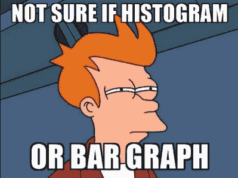

我们已经讨论了如何制作一个 [*直方图*](https://medium.com/@arthur.he/ggplot2-crash-course-histogram-ccacf51870f9) ，今天我们将继续揭开一些制作一个令人惊叹的条形图的秘密成分。

正如我们之前讨论的，直方图应该在可视化连续变量时使用，而条形图只适用于分类变量…

> 抱歉打断一下…但是我不得不说，我仍然对连续变量和分类变量之间的区别有点困惑。能详细说说吗？

当然可以！让我展示两者的一些例子！

***连续变量*** :表示可测的量(区间内的任意值)。这些值可以以自然的方式排序。定量变量的例子有:

1:人体高度

2:房价

3:温度

4:人体重量等。

***分类变量*** :代表一组可能的
类别的一组值，这些类别不能以自然的方式排序，例如:

1:眼睛颜色

2:国籍

3:性别

4:流派等。

> 这就说得通了！

太好了！现在开始我们的教程吧！

# **数据导入**

本教程将使用的数据是包`mosaicData`中的`Marriage`。如果你的 R 里没有安装，也不要慌！只需运行这一行命令，一切就都准备好了:

`install.packages('mosaicData')`

婚姻数据集包含阿拉巴马州莫比尔县 98 个人的婚姻记录。我们将通过`race`显示婚礼参与者的分布来练习制作条形图。

# 条形图

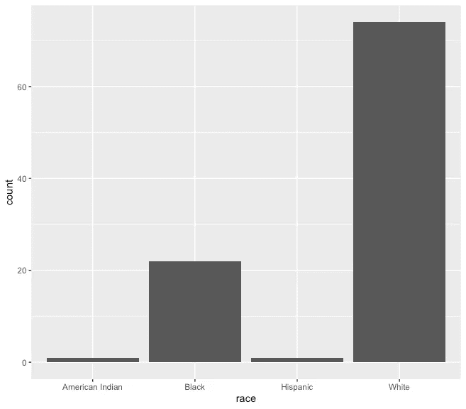

太好了！现在我们有了第一个柱状图！首先，传递数据参数，并为`aes()`函数指定分类变量。

> 够直观了，但是我如何为图表添加标题、更改颜色和切换到不同的主题呢？

别担心！您可以通过向`geom_bar`和`labs` 功能添加选项来修改`fill`中的条形填充和边框颜色`color`，编辑绘图标签，以及输入标题。如果你想定制主题，你可以使用`ggthemes`包。点击查看可用主题选项[。](https://yutannihilation.github.io/allYourFigureAreBelongToUs/ggthemes/)

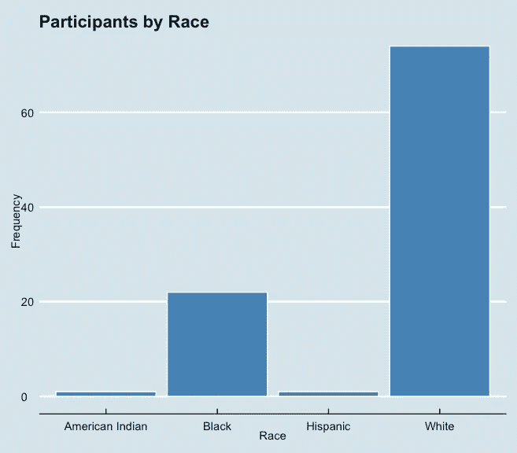

> 看起来不错！但是如果我想显示百分比而不是**计数呢？**

好问题！一如既往的可行！对于条形图，代码`aes(x=race)`实际上是`aes(x = race, y = ..count..)`的快捷方式，其中`..count..`是另一个代表每个类别中绝对频率的变量。您可以通过设置`y = ..count.. / **sum**(..count..)`来计算百分比。

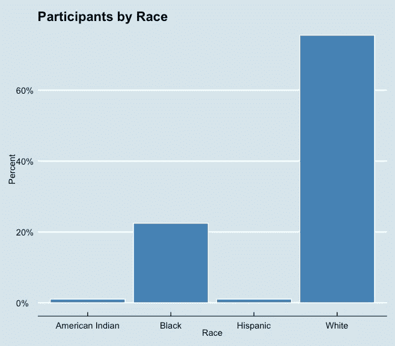

> 哇，真好！但是如果类别按升序或降序排序会不会很好？

确实！按频率对条形进行排序通常能提供直观的信息。为了实现这一点，我们将创建一个新的数据集`sort_dat`来计算每个比赛类别中的参与者数量，然后我们使用`reorder`函数来按频率对类别进行排序。选项`stat="identity"`通知绘图功能不要计算计数，因为它们是直接指定的。

注意:

1.  `reorder(race, -n)`按降序排序
2.  `reorder(race, n)`按升序排序

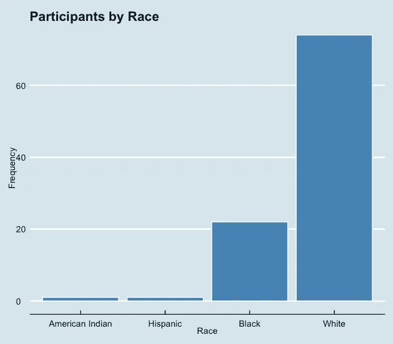

# 堆积条形图、分组条形图和水平条形图

对于教程的这一部分，我们将使用另一个分类变量`officialTitle`。首先，我们来看看如何制作水平条形图

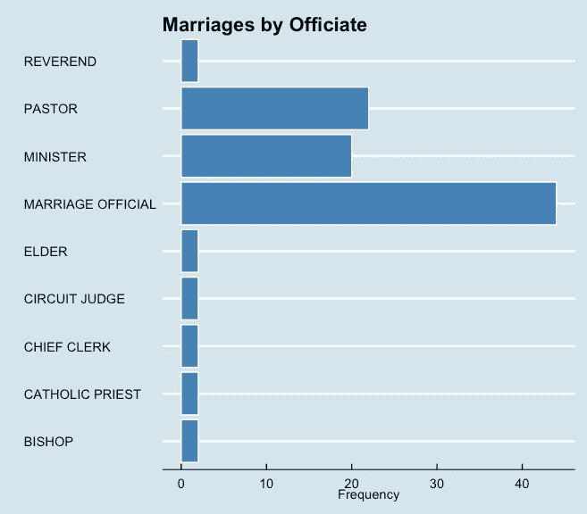

> 太棒了。我能不能也在这个横条图中加入种族类别？

当然啦！我认为看到各种主持人的种族分布会很有帮助。

*实现这一点的两种方式*:

## 堆积条形图

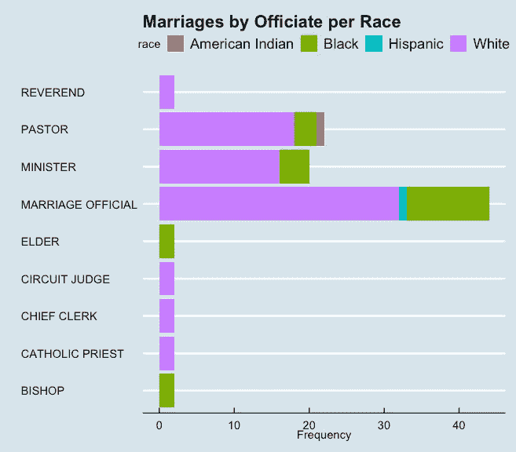

## 分组条形图

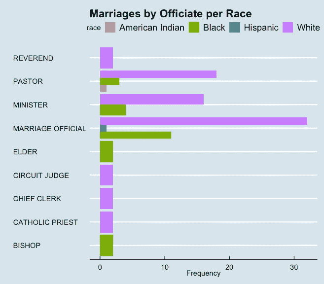

> 可爱！但是我不太喜欢这种配色方案，另外，我喜欢用精确的数字值来标记每个条形…

嗯，这可能涉及一些技术上的调整。实际上，我不会对每个术语讨论太多(这不是本课程的目标)，我们还需要为它构建一个新的数据集。

# 配色方案和数字标签

## 数据过滤

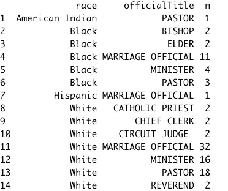

## 堆积条形图

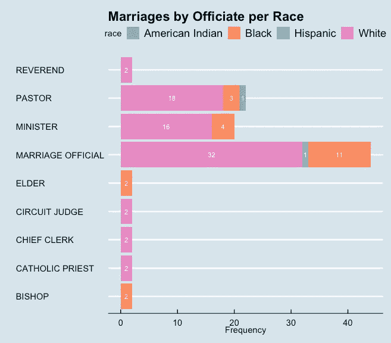

有许多调色板可以从中选择[，我在这个图中使用了`colorbrewer`调色板。](https://www.datanovia.com/en/blog/ggplot-colors-best-tricks-you-will-love/)

对于`colorbrewer`，请记住:

*   `scale_fill_brewer()`用于箱形图、条形图、小提琴图、点状图等
*   线和点的`scale_color_brewer()`或`scale_colour_brewer()`

## 分组条形图

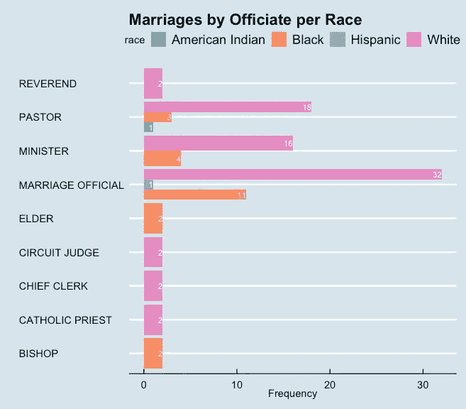

现在利用你在自己的数据分析中学到的东西！敬请期待！