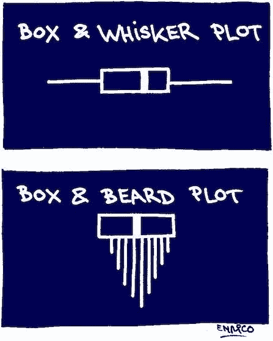
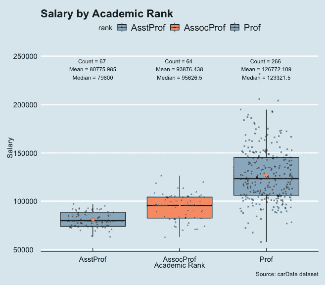

# GGplot2 速成班:箱线图

> 原文：<https://blog.devgenius.io/ggplot2-crash-course-boxplot-481d700058ca?source=collection_archive---------10----------------------->

# 快速概述

[https://visualizationcheatsheets . github . io/pdf/box plot _ anatomy . pdf](https://visualizationcheatsheets.github.io/pdfs/boxplot_anatomy.pdf)

箱线图展示了分布的第 25 百分位*、中值(第 50 百分位)和第 75 百分位 ***、Q3*** 。胡须占据了大约 99%的分布。超出该范围的观察值将被表示为异常值。有一个很好的异常值检测公式，您只需通过执行 Q3- Q1 来计算*四分位间距(IQR)，高于上四分位 Q3 或低于下四分位 Q1 的 IQR 的 1.5 倍将被视为异常值(Q1- 1.5* IQR 或 Q3 + 1.5* IQR)**

> **哇，这是一个如此强大的五数总结技术！它可以告诉你分布是正态分布，还是左/右偏态分布。但是使用 boxplot 有什么注意事项吗？**

**尽管它在统计中捕捉五个数字的汇总是多么强大，但它有一个主要的弱点— **boxplot 不能检测分布的凸起(模式)**。所以一定要灵活运用你的可视化武器库！**

# **你好，方块图**

**在本教程中，我们将使用包`carData`中的数据集`Salaries`。如果你没有安装它，只需运行这行代码`install.packages("carData")`，你就可以跟着做了！**

## **数据导入**

****

**下面是数据的简要概述`Salaries`描述:**

> **美国一所大学的助理教授、副教授和教授 2008 年至 2009 年为期 9 个月的学术工资。收集这些数据是该大学行政部门持续努力监测男女教职员工工资差异的一部分。— carData 包**

**我们将使用带有`rank`和`salary`的箱线图来探索这个数据集。让我们来了解一下按排名的薪资分布吧！**

## **第一个简单箱线图**

**首先，在`ggplot`函数中传递数据集，在`aes`层中，传递 x 轴的分类变量`rank`和 y 轴的连续变量`salary`。然后通过`geom`层`geom_boxplot()`**

****

> **我可以横向制作剧情吗？**

**你当然可以！你只需要增加一个管道层`coord_flip()`。**

****

> **如果我想在箱线图上显示每个数据点，该怎么办？**

**没问题！这里我想简单介绍一下抖动点的概念。它给每个点的位置增加了少量的随机变化。如果一个人的数据集足够大，这是操纵过度绘制的一种简单方法。**

**由于抖动点是随机分布的，我们需要锚定抖动位置，以保持图和层的一致性。我们将使用`posn_j = position_jitter(0.3, seed = 123)`来实现这一点。**

**同样在实践中，最好用`outliers.shape = NA`移除盒图的异常值，因为抖动会再次将它们添加回去。**

****

# **让它变得时尚！**

## **主题和颜色**

**现在我们已经完成了第一个分组的箱线图，我们可以通过自定义填充颜色和主题来进一步美化它！([颜色](https://www.datanovia.com/en/blog/ggplot-colors-best-tricks-you-will-love/)和[主题](https://yutannihilation.github.io/allYourFigureAreBelongToUs/ggthemes/)选项)**

****

> **看起来棒极了！但是在绘图中显示统计摘要、标题和轴标签会更好吗？**

**好极了。这肯定有助于读者了解你想表达什么。**

**为了显示统计信息摘要，我们将创建一个函数来将统计信息映射到图表。技术细节我就省略了，下次你想复制，直接复制粘贴就行了。但是请确保相应地提供您的连续变量！**

**一旦你准备好了函数，把它传递给`stat_summary()`层。同样为了区分平均值和中值，我们也可以在`stat_summary()`层中将平均值标记为红色。**

**对于标题和轴标签，你可以在`labs()`层编辑它们。**

****

# **最后，让我们装箱！**

**现在我们可以把目前所学的所有方面结合起来了！**

****

**现在，将您学到的知识应用到您自己的数据集中！编码快乐！**