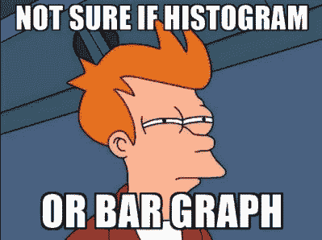

# GGplot2 速成班:直方图

> 原文：<https://blog.devgenius.io/ggplot2-crash-course-histogram-ccacf51870f9?source=collection_archive---------10----------------------->

# 嗯……直方图到底是什么？

通常，许多经常与条形图和直方图混淆；—事实是，条形图和直方图并不是精确的可视化工具。条形图用于可视化名义或顺序变量的类别，而直方图用于描述连续变量的分布。如果类间隔大小相等，直方图的解释可以简化，这是因为直方图矩形的高度与绝对或相对频率成比例。话虽如此，我们还是来看看编码部分吧！

# 数据导入

我们将通过`gapminder`数据集练习使用直方图。我们将使用过滤后的数据集`gap_america`探索美洲大陆的预期寿命`lifeExp`。

# 简单来说，直方图

简单直方图

你首先传递数据参数`gapamerica`，在`aes()`函数中选择目标变量`lifeExp`，用`geom_histogram`做基本直方图。现在我们有了第一个直方图！

> “我可以调整垃圾箱的大小吗？太窄了，如果能弄平一点就太好了”。

解决方法很简单:如果你只想要 10 个箱子，你可以使用`geom_histogram(bins = 10)`简单地调整箱子的大小。

binsize = 10 的平滑直方图

> "但是我真的不喜欢默认颜色，我能做什么？"

没问题！方法是相似的:您只需通过`geom_histogram()`中的`fill = "#desired color"`

*注意:一般情况下，* `*fill*` *定义* `*geom*` *填充的颜色，而* `*color*` *定义* `*geom*` *勾勒的颜色*

彩色直方图

# 让它变得非凡

到目前为止，我们可以从柱状图中看到美洲大陆的预期寿命是向左倾斜的。但是，如果我们可以在图上用平均值、中值、范围(最小和最大)和一个标准差来注释它，那会很好吗？让我们来了解一下！

首先，我们将制作一个包含所有统计数据的注记数据框。

接下来，我们将使用不同颜色的垂直虚线标记平均值、中间值和一个标准差。

看起来已经很棒了！为了让它在视觉上更吸引人，我们还可以改变主题！

有一个包叫`ggthemes`。更多信息请点击[此处](https://yutannihilation.github.io/allYourFigureAreBelongToUs/ggthemes/)

> O h，这真好！但是我想添加一个标题，作者，并重新命名标签！

没问题！你可以简单地在`labs()`层调整它们。

现在，将您学到的这些技能应用到您自己的数据集中！编码快乐！