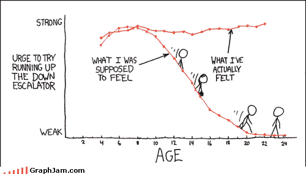
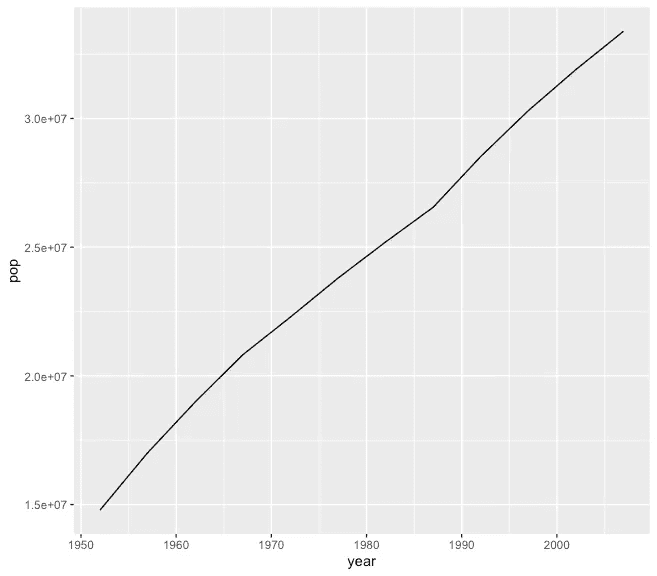
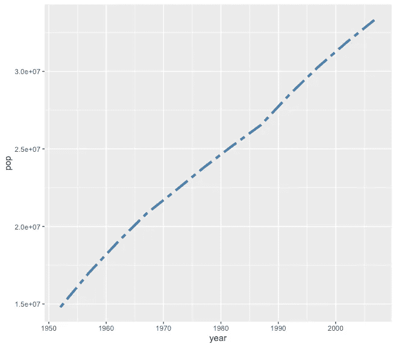
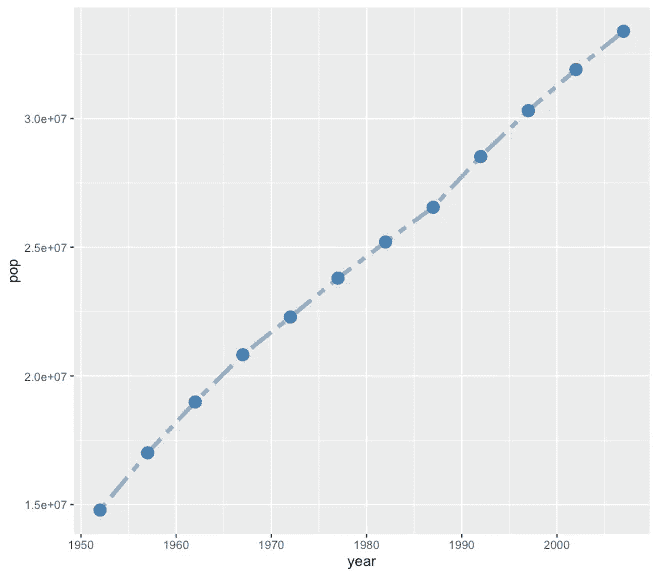
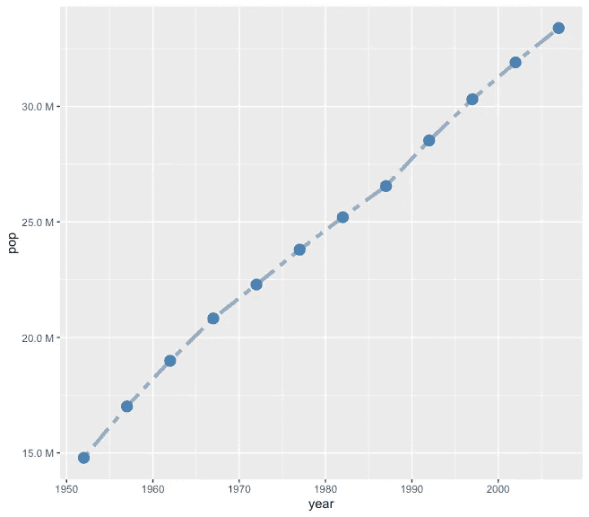
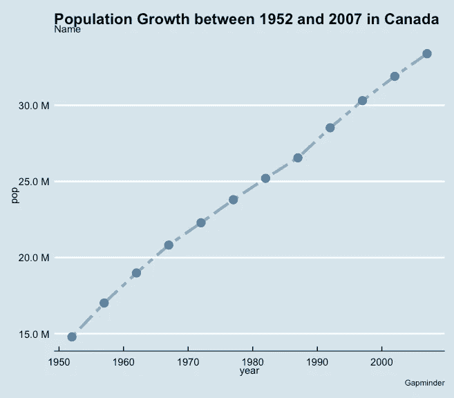
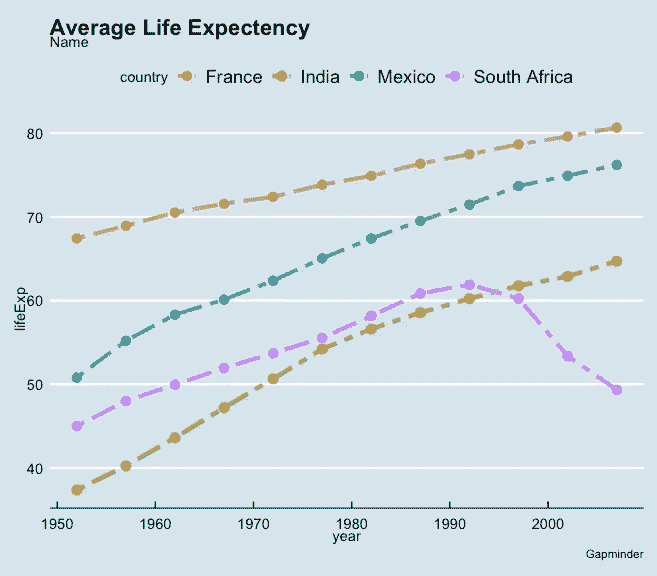
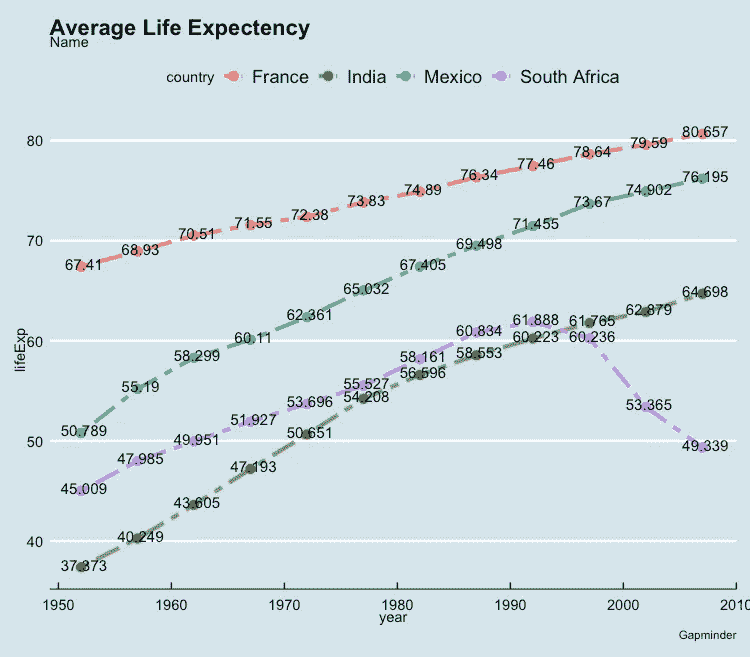
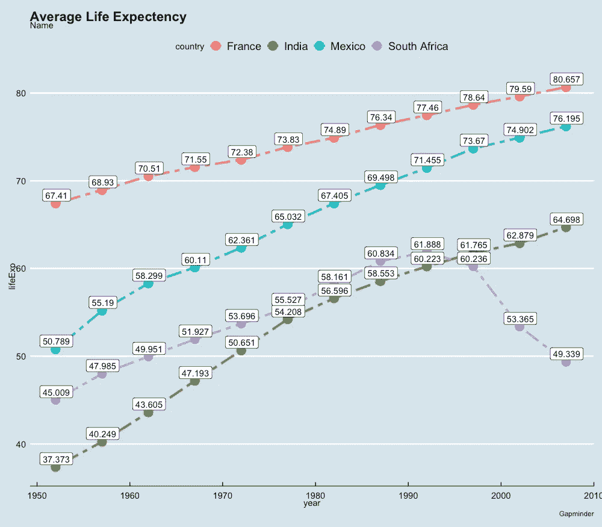

# GGplot2 速成班:线图

> 原文：<https://blog.devgenius.io/ggplot2-crash-course-linegraph-36fadf5c7991?source=collection_archive---------6----------------------->


# 我应该使用线条图吗？

只要记住这一点:

*当 x 轴上的变量遵循连续的自然顺序(例如:小时、天、周、年等)时，折线图展示了两个连续变量之间的关系。)*



# 数据和库导入

## 加载库

让我们通过再次探索`gapminder`数据集来开始我们的教程。首先，我们需要导入以下库。如果您没有安装它们，请在您的 R 中尝试这个命令，您就可以开始了！

```
install.packages("***#your not yet installed library name***")
```

## 数据探索和简单线图

一旦导入了所有列出的库，`gapminder`数据集就应该加载到环境中了。您可以使用`glimpse()`开始您的初始数据探索。让我们通过探索加拿大人口随时间的变化来制作我们的第一个线图



> 嗯，有意思…但是这还没完成，有什么方法可以改进吗？

绝对的！我们还可以编辑线型，添加更多的点，改变颜色，并重写 y 轴上的单位！

# 更改颜色、线型和轴单位

## 选择颜色和线型

您可以通过`color`参数在`geom_line()`中选择您想要的颜色。您也可以使用`linetype`参数自由选择不同的线型。此处提供了更多选项[。你可以通过改变`size`来改变线条的粗细。总而言之:](http://www.sthda.com/english/wiki/ggplot2-line-types-how-to-change-line-types-of-a-graph-in-r-software)

`color`:线条颜色

`linetype`:不同类型的线

`size`:线宽



## 添加点

有时最好将线图与数据点结合起来。要实现这一点，只需通过`geom_point()`就可以了。您也可以更改数据点的颜色和大小。



## 更改轴标签

在一个情节上阅读科学符号肯定是困难的。幸运的是，有一种方法可以改变这一点。我们可以使用百万米作为我们的 y 轴单位，使其更具可读性。



# 添加标题、副标题、题注和主题

现在我们已经为我们的线图打下了良好的基础。下一步是进一步修饰我们的图表。让我们为它添加一个标题、副标题、题注和一个视觉上令人愉悦的主题！



> 太棒了。但是如果我想在同一个地块上展示多条线呢，可行吗？

当然可以！让我们在下一部分直接进入这个话题吧！

# 同一地块上的多条线

要在同一个图上显示多条线，可以使用数据`aes()`层中的`group`参数。让我们转换话题，比较一下*南非*、*墨西哥*、*法国*和*印度*的预期寿命。



> 哇，太迷人了！但是我们能把数字值(这里是预期寿命)加到线图上吗？

我们当然可以！有两种方法可以做到！我们可以添加文本或标签。让我给你们俩看看！

## 添加文本

你可以简单地添加 `gemo_text()`层。这里不讨论细节(不是本教程的目标)，但是可以随意调整并自己探索！



## 添加标签

添加`geom_label()`层，并根据你的意愿调整所有属性！



现在，将您所学到的知识应用到您自己的数据分析中！编码快乐！