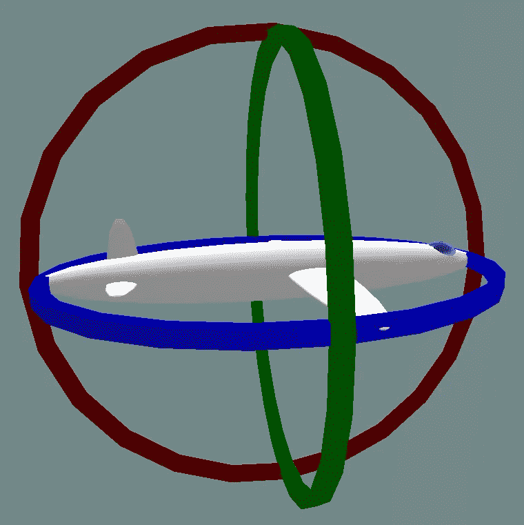
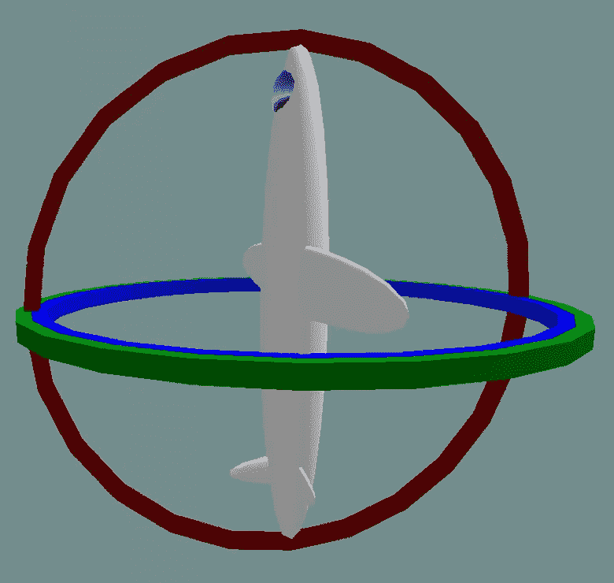
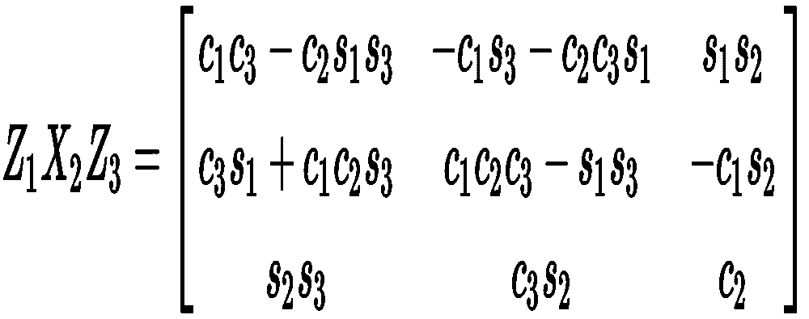

# 万向节锁说明以及如何使用它

> 原文：<https://blog.devgenius.io/gimbal-lock-explanation-and-how-to-work-with-it-3b61c0bac024?source=collection_archive---------2----------------------->

在过去的两周里，我一直在用 JavaScript 开发一个增强现实项目，来制作一个手机上的 WebAR 应用程序。

当谈到增强现实时，3D 模型的呈现和与它们的交互同样重要。想起最具标志性的 AR 游戏之一——pokémon GO 及其玩法。

在这篇文章中，我将展示我如何将 3D 模型与从设备硬件中检索的传感器数据相结合，以及我遇到的障碍，并最终展示我是如何解决它们的。

我们开始吧，好吗？

# **先把工具磨好**

以下是我的工作工具:

1.  iOS 版本 14.8.1 的 iPhone 12 Pro。
2.  在我的 iPhone 上安装最新版本的 Safari 和 Chrome 应用程序。
3.  THREE.js r139，这是撰写本文时 THREE.js 的最新版本。
4.  带有 HTTPS 的 Node.js 服务器。

第四点是必不可少的，我稍后会解释。如果您没有 SSL 服务器，您仍然可以在本地设置一个自签名服务器。

版本并不重要。让一切保持最新，在这样的环境中发展总是很棒的。

# **坚持计划**

我不打算讨论我项目中的所有细节。假设我已经加载了一个 3D 模型，现在我想让它在我的设备移动时以某种方式移动。

我想实现的一个交互是，例如，在纵向模式下，当我的 iPhone 向左旋转时，我应该能够看到我的模型的右侧，反之亦然。这是 AR 项目中的基本交互之一。

就像神奇宝贝 Go 一样。在 AR 模式下，当你遇到皮卡丘时，你可以通过旋转相机来查看它的全身。如下图 gif 所示。

妮可·阮/ BuzzFeed 新闻

# 设备方向数据

AR 交互的概念很简单:在我的设备上获取传感器数据，并用这些数据旋转/平移/缩放我的模型。问题中的传感器是— **陀螺仪。**

有许多关于陀螺仪的信息资源。请记住, **alpha、beta 和 gamma** 值正是我想要的。

至于现代 web APIs，我选择了`window.DeviceOrientationEvent`来获取这些数据。

记得我提到过 SSL 服务器是必要的吗？这是因为 Chrome 等浏览器出于安全考虑只通过 HTTPS 提供`window.DeviceOrientationEvent`。

[这里](https://web.dev/native-hardware-device-orientation/)是关于设备定向及其 Web API 的快速解释。有趣的一点是，在人像模式下，alpha，beta，gamma 分别默认为 0，90，0。

# 万向节锁问题

在我们进入下一步之前，让我们先谈谈万向节锁。

根据维基百科:

> 万向节锁是在三维空间中失去一个自由度，…

简单地说，当某些轴发生旋转时，一个轴可能会与另一个轴重叠。因此导致一维损失。如下图所示。

正常的三万向节组

当两个万向节在同一平面上时，就会发生万向节锁。因此，失去了一个维度

# 为什么万向节锁很重要？

为什么从陀螺仪中检索数据很重要？

答案是——陀螺仪的设计将通过改变一个可能与旋转框架重叠的框架上的值来防止框架锁定的发生。

以上面的万向锁图示为例。绿色和蓝色平面重叠并导致锁定。实际上，当旋转绿色平面时，**陀螺仪会将蓝色平面偏移一个特定的值，或者将平面改变到相反的方向，**例如立刻从 90 度到-90 度。

所以这很重要。第一种情况意味着当我从左向右旋转我的设备时，我的模型也可能从上到下旋转，即使我没有以这种方式旋转我的设备。

至于第二个，它表明我的模型将突然旋转到一个完全相反的方向。

这些都不是理想的情况。

# **还有更多关于陀螺仪的数据**

到目前为止，我们了解陀螺仪如何处理万向节锁。但是关于它的数据还有一件事。

阿尔法，贝塔，伽马值是**而不是我们沿着特定轴旋转的角度。相反，它是相对于任意角度的角度变化，取决于默认的方向。**

以下声明引自 W3C，完整链接在最后一节提供。

> deviceorientation 事件仅基于加速度计和陀螺仪，尝试提供三个角度的相对值(相对于某个任意方向)。

例如，我的 gamma 值默认为 0，因为我的设备处于纵向模式。当我沿着它的轴旋转时，gamma 值随着我旋转的角度而增加。然而，这样的 **delta 是相对于 0 度的，而不是我实际上沿着轴旋转了多少。**

上面的例子听起来晦涩难懂。让我们想到万向节锁。我提到过，为了防止这种情况发生，陀螺仪会相应地将一个轴改变到相反的方向。

因此，当我旋转伽马轴时，为了防止万向锁定，β值可能会突然从 90°变到-90°，并且因为β值相对于开始方向是**，所以从 90°变到-90°被认为是一个完整的旋转，并且我的模型突然以顺时针运动旋转。**

简单地说:当我从上到下旋转我的设备时，我的模型将同时从左向右旋转。当 gamma 值达到极限时，突然，我的模型从右向左旋转，并停在它开始旋转的位置。

# 我如何使用陀螺仪

我想分两部分讨论如何使用陀螺仪。

1.  如何正确解读α、β、γ值？
2.  如何抵消陀螺仪给静态平面带来的变化？

# 旋转矩阵

第一部分需要一些基本的数学知识——我使用旋转矩阵来描述α、β和γ值。潜在的数学解释是最后一节的第四个环节。旋转矩阵如下所示:

来自维基百科的旋转矩阵图像

旋转矩阵描述了在给定的坐标系中旋转是如何沿着轴发生的。除此之外，借助三角函数，我们可以很容易地获得每个轴的角度。

第二部分需要从第一部分获得的角度。例如，假设旋转β角为 X，γ角为 y，现在我们知道陀螺仪会改变静态平面，导致意外的角度变化。

因此，当我获得 Y 角度时，陀螺仪对β贡献了 X '角度。所以我必须根据方向，加上或减去 X 的值，以使β旋转正常。

# 结论

我最初项目的目标是创建一个 WebAR 应用程序。但事实证明这比我想象的要复杂得多。

从启用传感器许可、收集和分析来自传感器的数据到将这些数据与我的 3D 模型集成。这个想法很简单，但是这些步骤都不容易实现。

例如，我一开始使用 beta 值来模拟从左到右的旋转，但由于万向节锁防止机制和对设备定向事件的误解，我的模型变得疯狂。

希望这篇文章可以帮助那些想开发类似项目的人。

# **参考**

1.  https://web.dev/native-hardware-device-orientation/
2.  【https://en.wikipedia.org/wiki/Gimbal_lock 
3.  [https://W3C . github . io/device orientation/# ref-for-DOM-deviceorientionevent-beta % E2 % 91% A1](https://w3c.github.io/deviceorientation/#ref-for-dom-deviceorientationevent-beta%E2%91%A1)
4.  [https://stack overflow . com/questions/36639182/html 5-get-device-orientation-rotation-in-relative-coordinate](https://stackoverflow.com/questions/36639182/html5-get-device-orientation-rotation-in-relative-coordinate)
5.  [https://flavio copes . com/express-https-自签名-证书/](https://flaviocopes.com/express-https-self-signed-certificate/)