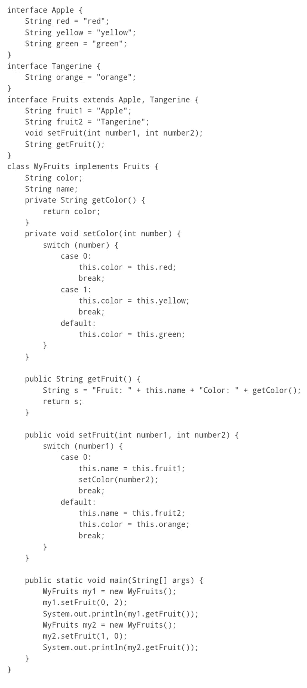
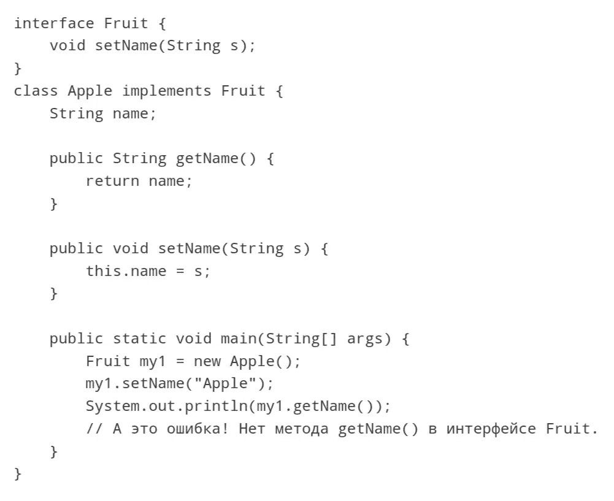

# Java 中的接口

> 原文：<https://blog.devgenius.io/ginterfaces-in-java-6c65b8360dd9?source=collection_archive---------18----------------------->

Java 接口被设计成在运行时支持方法的动态选择(解析)。接口类似于类，但与后者不同，接口没有变量表示，也没有方法声明中的实现。一个类可以有任意数量的接口。所有需要做的就是实现类中所有接口的全套方法。此类方法的签名必须与该类中实现的接口的方法签名完全匹配。接口有自己的层次结构，不与类继承层次结构重叠。这允许您在与类继承层次结构没有任何关系的不同类中实现相同的接口。这就是接口的主要功能所在。

你介意喝杯咖啡吗？

接口是一种数据结构，可以包含表示为命名常数的字段(这里通常省略 final 关键字，因为字段总是命名常数)和方法声明。一个接口可以被许多类扩展。一个接口本身可以被多个接口扩展。注意，一个接口可以被几个类同时使用，彼此独立。

一个接口可以有以下修饰符:

公共(如果它是公共的，那么该接口可以从任何地方访问，如果不是，那么它只能在这个包中访问)。

抽象(因为接口总是抽象的，所以修饰符通常被省略)。

strictfp——所有后来实现的方法都必须在所有 Java 机器上类似地处理浮点数。

清单 1.0。简单接口和继承它的类的例子

您可以声明一个数据类型为接口名称的变量。它可以引用实现接口的类的对象，并且可以调用在接口中声明但在类中实现的方法。要进行这样的引用，有必要将接口名称指定为引用的数据类型，并在关键字 new 之后指定类构造函数的名称(清单 1.1。).

清单 1.1。
声明一个数据类型为接口名的变量

局部变量是在块中声明的变量(同样，块是两个花括号之间的区域；块可以是方法体、初始化块等。).局部变量一直存在，直到块结束。一旦块结束，局部变量就不存在了。