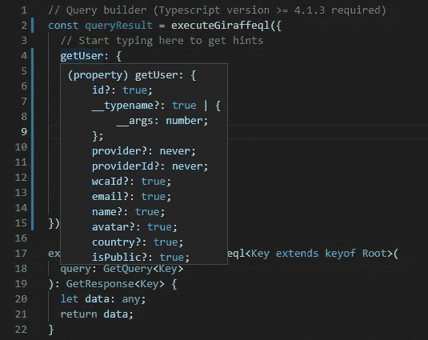

# 长颈鹿

> 原文：<https://blog.devgenius.io/giraffeql-260d5f63a249?source=collection_archive---------12----------------------->

我试图以一种更加 JSON 友好的格式复制 GraphQL 特性


来源:https://unsplash.com/photos/yB4U2crh-mU

**背景**几年前，我在学习 web 开发时，偶然发现了 GraphQL。我认为与 REST APIss 相比，这是一种非常好的高效的 API 查询方式，REST API 会一次返回所有字段，甚至是您并不特别需要的字段。

随着我开始熟悉 GraphQL，我开始意识到它在许多方面与 JSON 相似。然而，GraphQL 请求的格式肯定不是 JSON——它是作为字符串发送的，然后由服务器解析。作为一个初学者，这对我来说是一个挫折。我想使用原始的 JSON 来提交我的查询，看起来 GraphQL 差不多是 JSON，但又不完全是。

```
{
  hero {
    name
    friends {
      name
    }
  }
}
```

作为一名相对较新的开发人员，我想尝试提出自己的解决方案，并在此过程中学习一些东西。多年来，在我的编码冒险中，我一次又一次地实现解决方案。每次我重新实现它，我都试图改进我以前的尝试。

这就把我们带到了长颈鹿。

关于 GiraffeQL
GiraffeQL 的主要思想是本质上成为一种发送 GraphQL 式查询的 JSON 友好方式。对于那些从事 JavaScript/TypeScript 工作的人来说，我相信这提供了更好的开发体验，因为 JSON 在这些语言以及许多其他语言中都得到了本地支持。

GiraffeQL 是一个开源项目，到目前为止都是我一个人开发和维护的。我在我的个人项目中相当广泛地使用了它，但是我认为它已经发展到了可以向公众公开的程度。希望其他开发人员会发现它很有用，并有助于这个项目，并进一步开发它以适应他们的用例。

**核心功能**

*   以更加 JSON 友好的格式向服务器发送查询
*   仅返回您请求的字段
*   可作为 NPM 包。
*   构建在 Express.js 框架之上
*   无需太多额外工作即可公开 REST API 的能力
*   为查询生成类型脚本定义文件的能力

**示例**
使用 JSON 主体发送以下 POST 请求:

```
POST [https://api.cubepb.com/giraffeql](https://api.cubepb.com/giraffeql)
{
  "getUser": {
    "id": true,
    "name": true,
    "createdBy": {
      "id": true,
      "name": true
    },
    "__args": {
      "id": 9
    }
  }
}
```

将得到以下响应:

```
{
  "data": {
    "id": 9,
    "name": "John Doe",
    "createdBy": {
      "id": 9,
      "name": "John Doe"
    }
  }
}
```

对于 TypeScript 用户，您可以通过转到 [schema.ts](https://api.cubepb.com/schema.ts) 文件来获取查询的类型定义，然后您可以获得定义文件。



生成的 schema.ts 文件如何帮助您填充 GiraffeQL 查询的示例

**路线图和贡献**
GiraffeQL 是一个相对较新的项目，它正在积极寻找贡献者来帮助它做得更好。请随时提供反馈、提出拉动请求或以其他方式参与进来。查看 [Github 库](https://github.com/big213/giraffeql)了解详情。也请随时加入[不和谐频道](https://discord.gg/CpSWfub9y6)。

**使用 GiraffeQL 的项目**
这些开源项目是我自己开发的，但是可以随时查看并参与进来:

*   [CubePB.com](https://cubepb.com)——开源网站，用于追踪速度竞赛相关项目的个人最佳成绩
*   [OSRSRecords.com](https://osrsrecords.com)—开源网站，用于追踪老学校 Runescape 社区中的 speedrun 记录。目前处于测试阶段，还没有上线。

**有用链接**

*   Github 库:[https://github.com/big213/giraffeql](https://github.com/big213/giraffeql)
*   不和频道:[https://discord.gg/CpSWfub9y6](https://discord.gg/CpSWfub9y6)
*   你好世界举例:[https://github.com/big213/giraffeql/wiki/Getting-Started](https://github.com/big213/giraffeql/wiki/Getting-Started)

*更多内容请看*[*blog . dev genius . io*](http://blog.devgenius.io)*。*