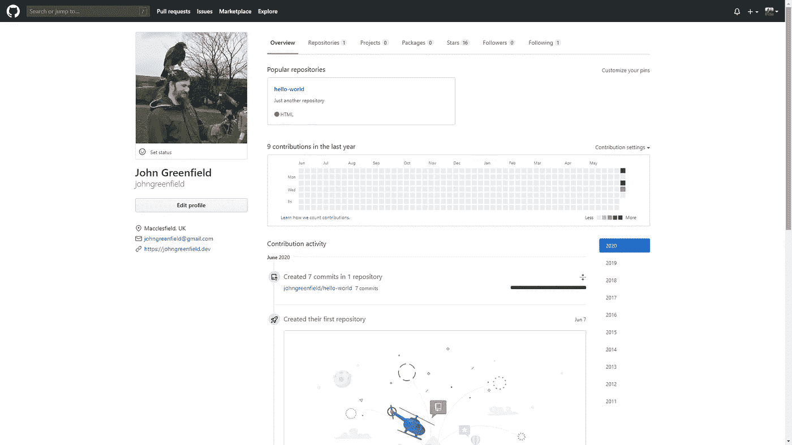
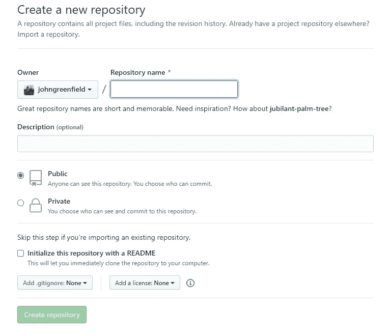
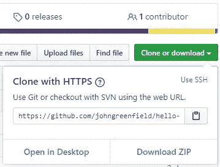
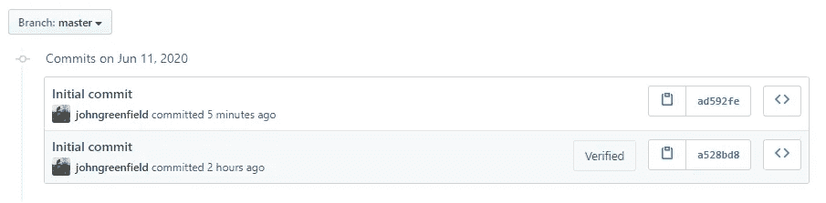
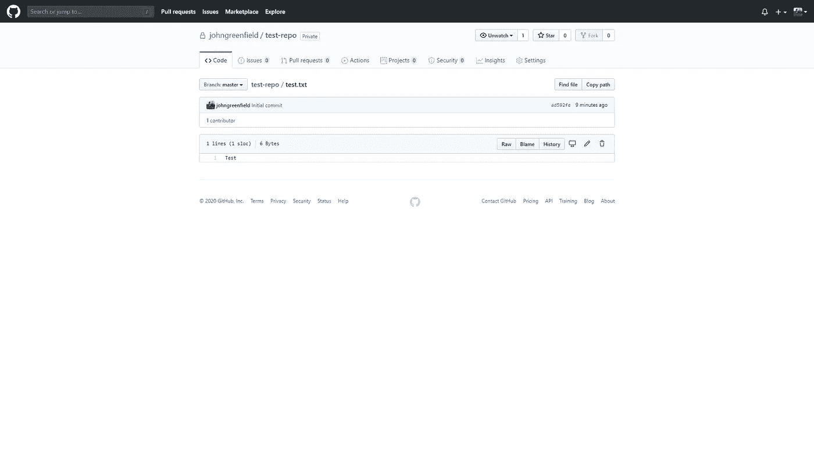

# Git 101:开始版本控制所需要知道的一切

> 原文：<https://blog.devgenius.io/git-101-everything-you-need-to-know-to-get-started-with-version-control-327e2a47af7b?source=collection_archive---------8----------------------->

无论您是作为一名开发人员起步，还是只是想在您的工具包中添加一些额外的技能，您迟早都需要学习 Git 和版本控制。Git 并不是唯一的版本控制系统，但它是许多人事实上的选择，也是最广泛使用和流行的选择。

本文将介绍 Git 到底是什么，使用 Git 的一些可用平台，最后我们将学习如何使用网站本身和命令行工具在 GitHub 上设置我们自己的项目。它的目标是初学者，但也将作为您开始 web 开发之旅的参考资料。


照片由[扬西·敏](https://unsplash.com/@yancymin?utm_source=medium&utm_medium=referral)在 [Unsplash](https://unsplash.com?utm_source=medium&utm_medium=referral) 上拍摄

# Git 是什么？

正如我们已经简要提到的，Git 是当今最流行和最广泛使用的版本控制系统，仅使用 Git 就托管了数百万个存储库。它是开源的，至今仍有一个非常活跃的大型社区在维护这个项目。它最初是由 Linux 操作系统内核的创造者 Linus Torvalds 在 2005 年开发的，自 2010 年以来，它的受欢迎程度有增无减。

如果您正在更新代码库或作为团队的一部分工作，版本控制(或有时称为源代码控制，尽管它们实际上彼此略有不同)是至关重要的。在这些情况下，能够回滚更改并使同事和协作者能够访问存储库是至关重要的。

Git 与大多数操作系统和开发环境兼容，从小型的个人项目到拥有更复杂团队的大型企业项目都可以使用它。这很大程度上是由于系统巨大的灵活性，允许非线性的工作流程和对项目变更的更好的跟踪。

与一些旧系统相比，使用 Git 的好处之一是它是一个分布式版本控制系统(DVCS)。这意味着不仅仅只有一个存储项目的地方，每个开发人员都拥有代码的单独副本，还可以作为一个完整的存储库，包含所有变更的历史。

# 代码库


到目前为止，代码托管最流行的选择是 GitHub，您可能以前听说过它。自 2018 年以来，它在以令人垂涎的 75 亿美元被收购后，一直归微软所有。GitHub 建立在 Git 的坚实基础之上，并添加了一些自己的额外特性。

这是我们今天的教程将使用的平台，然而还有很多替代平台，包括 Atlassian 的 Bitbucket(支持 Git 和 Mercurial VCS，但不支持 SVN)和 Gitlab。我们非常欢迎你向这些提供商注册一个免费账户，你应该仍然能够没有太大困难地跟上进度。事不宜迟，让我们创建一个存储库。

# 在 GitHub 上创建一个资源库

**在 GitHub 上设置免费账户**

我们想做的第一件事是希望到 [GitHub](https://github.com) 注册一个免费账户，如果你还没有的话。一旦你注册并登录，花些时间四处看看，探索一些东西。



我的 GitHub 主页

**创建一个知识库**

现在您已经有了一个帐户，是时候创建您的第一个存储库了。您可能会问自己，*但是什么是存储库呢？*简单地说，这是一个存储和组织单个项目的地方，其中可以包括图像、文本文档和 HTML 文件、数据集等文件。


右上角菜单

我们现在知道了什么是存储库，所以让我们开始创建一个存储库。查看页面的右上角，您应该会看到三个图标；通知铃声、加号和您的个人资料图像。单击加号，这将打开一个小菜单，并选择 *New repository* 。



创建新的存储库表单

您现在应该会看到一个类似于上图的页面。在这里，我们可以通过填写名称、描述和设置隐私设置来创建我们的第一个存储库。就像所有好的第一个项目一样，让我们称这个库为 *hello-world* 。接下来，键入几个词来描述这个项目，例如“我的第一个 GitHub 项目”。现在将 privacy 设置为 Private，然后勾选“使用自述文件初始化该存储库”框。这将完全按照 tin 上所说的那样做，并确保我们在存储库中已经有一个文件，这允许我们将它直接克隆到我们的计算机上。

如果你以前浏览过 GitHub 项目，你会注意到它们都有一个自述文件，概述了项目是什么，如何使用它，有时还有故障排除建议。

一旦你填写了所有的信息，只需点击页面底部的创建库按钮，我们就有了我们的第一个项目！恭喜你。

您现在应该看到存储库页面，新生成的自述文件显示在页面的下半部分。现在还没有太多，但我建议您学习 GitHub 自己的 Hello World 教程，它将带您了解 web 界面的基础知识，并教您如何管理新分支、对文件进行更改并将它们作为提交推送到 GitHub，以及如何通过编辑 README 文件打开和合并 pull 请求。你可以找到下面的链接，一旦你完成了，我们将进入下一部分，那就是把 Git 安装到你的计算机上。

[](https://guides.github.com/activities/hello-world/) [## 你好世界

### Hello World 项目是计算机编程中一个由来已久的传统。这是一个简单的练习，让你…

guides.github.com](https://guides.github.com/activities/hello-world/) 

# 安装 Git

我不会包括 Mac OS X 的说明，因为通常 Git 会预装 XCode，而且我对环境本身也不熟悉。如果你不确定，就搜索“Mac OS X Git 安装”这样的内容。

**窗户**

对于 Windows，下载最新的 [Git for Windows installer](https://git-for-windows.github.io/) 。下载完成后，打开安装程序，按照提示进行操作，暂时保留默认选项。完成后，单击 finish 并打开命令提示符(Win 键+ r，然后输入 cmd 并按 enter)。我们将快速设置您的用户名和电子邮件，这将与您所做的任何提交相关联。在命令提示符中输入以下两个命令，替换您自己的名称和电子邮件。

```
$ git config --global user.name “John Greenfield”
$ git config --global user.email “john@johngreenfield.dev”
```

如果这是成功的，您应该不会看到任何对按 enter 键的响应。还有最后一步，那就是在 Windows 上安装 Git 凭证助手。这个由微软创建的小应用程序将存储您登录 GitHub 的凭证(以及 Bitbucket 和其他支持 HTTP 推/拉的平台)。

下载 [Git 凭证管理器](https://github.com/Microsoft/Git-Credential-Manager-for-Windows)，按照提示操作，一旦完成，我们就可以进入下一部分了。我们走吧！

**Debian/Ubuntu**

如果你使用的是 Ubuntu 或者其他基于 Debian 的操作系统，那么安装 Git 的步骤真的很简单。输入以下命令来安装 Git。

```
$ sudo apt update
$ sudo apt install git
```

完成后，输入下面的命令获取当前安装的 Git 版本，如果它返回一个类似于我的例子的值，就可以开始了。

```
$ git --version
git version 2.27.0
```

完成设置配置的最后一步是将您的用户名和电子邮件地址输入到全局设置中，这将与您所做的任何提交相关联。

```
$ git config --global user.name “John Greenfield”
$ git config --global user.email “john@johngreenfield.dev”
```

# 复制您的存储库

很好，现在您应该有一个托管在 GitHub 上的 hello-world 存储库(希望有一个 README 文件)，并且在您的机器上安装了 Git，这样我们就可以开始对我们的项目进行更改了。

为了对您的存储库进行更改，您需要一种方法将它复制或“克隆”到您的系统上。克隆一个存储库会在 GitHub 服务器(称为 Origin)和您的本地系统之间创建一个连接。

在开始之前，让我们为接收文件准备好本地系统。如果您还不在主目录中，请导航到该目录。对于 Windows 用户，您应该已经在那里了，您的终端看起来应该是这样的:

```
C:\Users\John>
```

对于 Ubuntu/Debian 用户，只需输入下面的命令就可以进入你的主目录。

```
cd ~
```

作为一名开发人员，您可能会在多个存储库中工作，因此我们将创建一个新文件夹来存储我们所有的存储库。输入以下命令:

```
mkdir repos
```

现在，通过输入以下内容导航到该文件夹:

```
cd repos
```

所以现在我们在主目录中有了一个名为 repos 的新目录，准备接收我们克隆的项目。下一步是在浏览器中打开我们的 GitHub 帐户，导航到我们的 hello-world 存储库，点击绿色的“克隆或下载”按钮，如下图所示。你会看到一个弹出窗口，说“用 HTTPS 克隆”，并确保复制给定的网址。



再次跳转到终端，输入以下命令，其中 URL 是从 GitHub 上的弹出窗口中复制的:

```
$ git clone [https://github.com/johngreenfield/hello-world.git](https://github.com/johngreenfield/hello-world.git)
```

如果您安装了 Git 凭证管理器，现在应该会弹出一个窗口，询问您的 GitHub 登录信息。输入它们，终端应该说它正在将您的存储库克隆到一个名为 hello-world 的文件夹中。您可以通过导航到新文件夹来检查这一点。确保你在 repos 文件夹中，然后为 Windows 用户输入 *dir* ，或者为 Ubuntu 用户输入 *ls* 。新文件夹应该在那里，所以让我们用下面的命令输入它:

```
$ cd hello-world
```

克隆到此为止，你成功了！现在让我们继续下一部分，尝试向我们的存储库添加一个新文件。

# 将文件添加到存储库中

接下来，我们将快速地把 GitHub 这个名字放入一个名为 platforms 的文本文件中，并检查我们的库的状态。在 hello-world 文件夹中，在终端窗口中输入以下内容:

```
$ echo GitHub >> platforms.txt
```

如果输入该命令后没有返回任何内容，那么这意味着您的操作是正确的。下一步是使用 *git status* 命令获取本地存储库的状态。这将告诉你，与你的 GitHub 库相比，你的项目进展如何。在终端窗口中输入 *git status* ，您应该会看到如下所示的内容:

```
$ git status
On branch master
Your branch is up to date with 'origin/master'.
Untracked files:
(use “git add <file>…” to include in what will be committed)
platforms.txt
nothing added to commit but untracked files present (use “git add” to track)
```

让我们来看一下这是什么意思。第一行，branch master，意味着我们正在处理 master 分支(通常您不会这样做，但是我们将在后面详细介绍)。第二行是声明您的分支与 GitHub 上的 origin/master 分支保持一致的消息。之后，它列出了当前未跟踪的文件，并给我们一些相当有用的信息。我们希望添加该文件，以便将其包含在提交中。让我们来试试:

```
$ git add platforms.txt
```

这将工作目录中的更改转移到了 Git 暂存区。在将所有的变更提交到项目的正式历史记录之前，临时区域是所有变更被收集的地方。

让我们再检查一下状态，看看现在显示的是什么。

```
$ git status
On branch master
Initial commit
Changes to be made:
new file: platforms.txt
```

很好，现在您可以看到文件已经准备好提交给存储库了。现在我们想发出 commit 命令，这样我们拍摄的变更快照就可以添加到项目历史记录中。commit 和 add 这两个命令的组合本质上是所有贡献者的基本工作流。使用-m 选项输入以下代码，并在引号之间输入一条消息。

```
$ git commit -m "Initial commit"
```

现在，我们需要使用最后一个命令来将我们的更改“推”到“origin”上的主分支，如果您还记得的话，这是我们在 GitHub 上托管的代码库。输入命令 git push origin master，输出应该如下所示:

```
$ git push origin master
Enumerating objects: 4, done.
Counting objects: 100% (4/4), done.
Delta compression using up to 8 threads
Compressing objects: 100% (2/2), done.
Writing objects: 100% (3/3), 284 bytes | 284.00 KiB/s, done.
Total 3 (delta 0), reused 0 (delta 0), pack-reused 0
To [https://github.com/johngreenfield/hello-world.git](https://github.com/johngreenfield/test-repo.git)
   a528bd8..ad592fe  master -> master
```

很好，您的提交现在在“源”或远程存储库上，您可以通过在 web 浏览器中访问您的存储库并单击 commits 选项卡来检查这一点。



# 从存储库中提取变更

我们的下一个挑战是在网站界面上编辑 platforms.txt 文件，以便我们可以练习将更新文件“拉”到我们的本地系统。在 web 浏览器中打开您的存储库，并单击 test.txt 文件。它应该在一个类似下图的窗口中打开。



点击灰色框中的铅笔图标编辑这个文件，然后在文件中再输入两个版本控制平台如“Bitbucket”或“Gitlab”作为列表。向下滚动到可以看到提交更改的地方，并在第一个文本框中输入一条简短消息和一个可选的扩展描述。确保选择了“直接提交到主分支”,然后单击绿色的“提交更改”按钮。

就是这样！现在您已经直接在主分支上更新了一个文件，所以现在我们要做的下一件事是将更新的文件拉至我们的本地存储库。如果有帮助的话，就把“拉”想象成和“推”相反的过程。git pull 命令通过一个快速命令将存储在“原始”存储库中的文件合并到您的本地存储库中。

在您的终端窗口中，确保您仍然在 repositories 文件夹中(看起来像 C:/Users/John/repos/hello-world 或~/repos/hello-world ),并输入 git pull - all 命令。您应该会看到如下所示的内容:

```
$ git pull --all 
Fetching origin 
remote: Counting objects: 3, done. 
remote: Compressing objects: 100% (3/3), done. 
remote: Total 3 (delta 0), reused 0 (delta 0) 
Unpacking objects: 100% (3/3), done. 
From [https://g](https://github.com/johngreenfield/hello-world.git)ithub.com/johngreenfield/hello-world fe5a280..fcbeeb0 master -> origin/master 
Updating a528bd8..ad592fe 
Fast-forward platforms.txt | 2 ++++++++++++++ 
1 file changed, 2 insertions(+)
```

现在只需在终端中导航到您的本地存储库文件夹，或者您可以使用文件资源管理器，打开文本文件。您应该会看到我们在本文中讨论的三个 Git 平台的列表。

我想这就是我们今天要做的，这无疑是一个坚实的基础。作为一点功课，尝试创建一个 git“分支”,并以这种方式编辑文件。这将涉及 git 命令 branch、checkout 和 merge 以及我们在本文中已经讨论过的命令。

如果你有任何疑问，问题或议题，请随时留下评论，我会尽我所能帮助你。我希望您发现这很有用，并祝您在 web 开发之旅中好运！