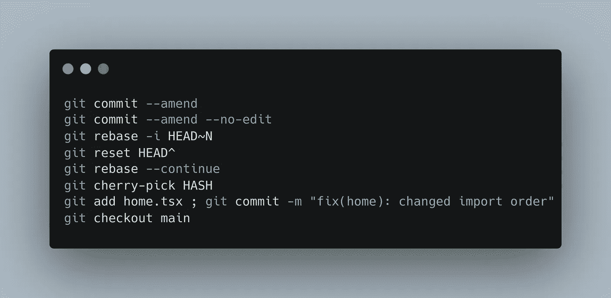

# Git 高级主题第一部分

> 原文：<https://blog.devgenius.io/git-advanced-topics-part-one-5443ff7c9f1b?source=collection_archive---------4----------------------->



Git 是一个在开发世界中使用的令人惊奇的工具，我可以说这是最重要的一个。我开始使用 git 已经一年了，我想教你一些我的高级 git 技术。

我分成两篇文章来详细介绍每个步骤，第一部分将介绍重命名提交、将提交连接在一起、拆分提交、删除提交、排序提交以及如何使用精选工具。

# Git 修正

什么是 git amend？Git amend 不是像 push 那样的命令，但它是 commit 命令的一个选项。Git amend 将打开文本编辑器来编辑最后一条提交消息。

记住，git amend 只重命名最后一次提交，如果你想重命名一个旧的提交，你需要使用 git rebase，我们将在本文后面讨论。

基本用法:

```
➜ git commit --amend
```

使用此命令，您可以编辑最后一条提交消息。

但是，假设您只想将您的更改添加到最后一次提交，而不更改提交消息:

```
➜ git commit --amend --no-edit
```

# Git Rebase 交互式

重命名最后一次提交或任何提交消息的另一种方法是使用 git-rebase。

什么是 git rebase？Git rebase 是一个用于重写提交历史的强大命令，您可以编辑、改写(重命名)、挤压(将两个或多个提交连接在一起)、删除(删除提交)等等。

Git rebases 命令剖析:

```
➜ git rebase -i HEAD~N
```

*   **i** :代表互动。
*   **HEAD~N** :定义要变价的提交，本例为 **HEAD** 直到 **N** 。

对于本文中的大多数情况，我们将使用 git rebase 来执行操作。

# 重命名旧的提交消息

```
➜ git log
* 2fa2e12 (HEAD -> main) feat(Header): added media queries to prevent breaks
* 55a4327 SAVEPOINT
* ad9db4e feat(Header): implemented user menu
* e361835 feat(Header): implemented header menu
* c01e7f5 Initial commit
```

我们如何改变 **55a4327** 提交消息？

```
➜ git rebase -i HEAD~3
```

当你运行这个命令时，它会打开你默认的 git 文本编辑器，对我来说是 **vim** 。

```
pick ad9db4e feat(Header): implemented user menu                                
pick 55a4327 SAVEPOINT                                                          
pick 2fa2e12 feat(Header): added media queries to prevent breaks                

# Rebase e361835..2fa2e12 onto e361835 (3 commands)
```

因此，要重命名 **55a4327** 提交，我们需要将 **"pick"** 改为 **"reword"** 。像这样:

```
pick ad9db4e feat(Header): implemented user menu                                
reword 55a4327 SAVEPOINT                                                          
pick 2fa2e12 feat(Header): added media queries to prevent breaks                

# Rebase e361835..2fa2e12 onto e361835 (3 commands)
```

现在保存，因为 **vim** 是`ESC, :WQ, ENTER`。它将提示另一个带有提交消息的屏幕进行编辑。

```
# VIM, VS CODE, etc:# BEFORESAVEPOINT# AFTERfeat(Header): changed background-color
```

编辑完刚才的**后保存**。

```
➜ git log
* b1e4f9a (HEAD -> main) feat(Header): added media queries to prevent breaks
* 7550cea feat(Header): changed background-color
* ad9db4e feat(Header): implemented user menu
* e361835 feat(Header): implemented header menu
* c01e7f5 Initial commit
```

现在，您已经重命名了一个旧的提交消息。你可以做的一件事是设置**【reword】**一次提交和编辑一行中的多个。

# 使用 squash 连接多个提交

Squash 是 git rebase 交互式命令中的一项功能，它允许您在一个新提交中加入多个提交。在此过程中，您可以更改或保留相同的提交消息。当您要将一个有大量提交的分支合并到另一个分支中，或者只是在推送到原点之前组织本地更改时，这个功能非常方便。

```
➜ git log
* f628ba1 (HEAD -> main) fix(footer): added css property for small screens
* 745571a feat(footer): implemented social links
* e52620f feat(footer): implemented side links
* a5742bf feat(footer): implemented site map
* 7691b5d Initial commit
```

正如您所注意到的，关于页脚组件有四个提交，只是出于教程的目的，我们如何将这四个提交连接在一起呢？

首先:

```
➜ git rebase -i HEAD~4
```

当你按回车键时，它会提示你的 git 默认文本编辑器。

```
# VIM
pick a5742bf feat(footer): implemented site map                                 
pick e52620f feat(footer): implemented side links                               
pick 745571a feat(footer): implemented social links                             
pick f628ba1 fix(footer): added css property for small screens
```

将 **f628ba1、745571a、**和 **e52620f** 提交中的 **"pick"** 重命名为 **"squash"** 。然后**保存**。

```
# VIM
pick a5742bf feat(footer): implemented site map                                 
squash e52620f feat(footer): implemented side links                               
squash 745571a feat(footer): implemented social links                             
squash f628ba1 fix(footer): added css property for small screens
```

壁球做的就是把从 **f628ba1** 、 **745571a** 、 **e52620f** 到 **a5742bf** 的提交连接起来。如果您想挤压更多的提交，只需从`**git rebase**`命令中增加`**HEAD~N**`中的`**N**`，并将**“选择”**更改为**“挤压”**。

保存后，它将提示另一个文本编辑器编辑提交消息。

```
# git commit message #1
feat(footer): implemented site map                                 
# git commit message #2
feat(footer): implemented side links                               
# git commit message #3
feat(footer): implemented social links                             
# git commit message #4
fix(footer): added css property for small screens
```

在您的文本编辑器中，只需提交旧的提交消息，并在文件顶部写入新的提交消息。

```
feat(footer): implementation
# git commit message #1
#feat(footer): implemented site map                                 
# git commit message #2
#feat(footer): implemented side links                               
# git commit message #3
#feat(footer): implemented social links                             
# git commit message #4
#fix(footer): added css property for small screens
```

然后**保存**文件。

现在您只有两个提交:

```
➜ git log
* d832720 (HEAD -> main) feat(footer): implementation
* 7691b5d Initial commit
```

# 使用编辑将一个提交分成两个

分割是从一个提交创建两个提交的动作。为此，我们将使用 git rebase-interactive。

```
➜ git log
* 4639a71 (HEAD -> main) feat(about): implementation
* d832720 feat(footer): implementation
* 7691b5d Initial commit
```

假设在提交 **4639a71** 中有与提交消息不匹配的更改，那么我们如何将这个提交分成两个新的提交呢？

首先:

```
➜ git rebase -i HEAD~2
pick d832720 feat(footer): implementation                                       
pick 4639a71 feat(about): implementation
```

然后标记提交 **4639a71** 从**“拾取”**到**“编辑”**，然后保存。

```
pick d832720 feat(footer): implementation                                       
edit 4639a71 feat(about): implementation
```

之后，git 会将您放在一个特殊的分支中以编辑提交，但是首先，让我们从这个特定的提交中分离提交的更改:

```
➜ git reset HEAD^
```

使用这些命令，提交更改将被取消，现在您可以再次 git add 和 git commit，但是使用不同的提交。

```
➜ git status
?? about.scss
?? about.tsx
?? home.tsx
```

我想将`**home.tsx**`放在不同的提交消息中，然后将`**about.tsx**`和`**about.scss**`添加到另一个提交消息中。

首先，让我们将`**home.tsx**`添加到一个新提交中:

```
➜ git add home.tsx ; git commit -m "fix(home): changed import order"
```

为了完成这个过程，让我们将`**about.tsx**`和`**about.scss**`添加到一个新的提交中。

```
➜ git add about.scss about.tsx; git commit -m "feat(about): implementation"
```

在这两步之后，让我们继续`**git rebase**`来完成拆分过程。

```
➜ git rebase --continue
```

既然我们已经拆分了提交，让我们看看 git 日志是什么样子的。

```
➜ git log
* 7232127 (HEAD -> main) feat(about): implementation
* ba17d58 fix(home): changed import order
* d832720 feat(footer): implementation
* 7691b5d Initial commit
```

# 使用 drop 删除提交更改

假设您确实提交了更改，但现在您不想再做这些更改了，在这种情况下，有一种方法可以用 git rebase 来修复它，这就是我们将要讨论的主题。

```
➜ git log
* 3a736bd (HEAD -> main) feat(sideBar): implementation
* 0631d2b feat(Delete Page): implemented delete page
* 7232127 feat(about): implementation
* ba17d58 fix(home): changed import order
* d832720 feat(footer): implementation
* 7691b5d Initial commit
```

工作一段时间后，我注意到 commit **0631d2b** 不再有用了，最好将它从 git 历史中删除，并从项目中移除它的更改。

首先:

```
➜ git rebase -i HEAD~2
pick 0631d2b feat(Delete Page): implemented delete page                         
pick 3a736bd feat(sideBar): implementation
```

现在将 **0631d2b** 提交中的**“pick”**修改为**“drop”**并保存。

```
drop 0631d2b feat(Delete Page): implemented delete page                         
pick 3a736bd feat(sideBar): implementation
```

这将自动从项目中删除提交更改和提交消息。

```
➜ git log
* 7aa3777 (HEAD -> main) feat(sideBar): implementation
* 7232127 feat(about): implementation
* ba17d58 fix(home): changed import order
* d832720 feat(footer): implementation
* 7691b5d Initial commit
```

一个非常简单的过程，可以帮助你提高你的 git 技能。

# 更改提交顺序

要更改提交顺序，我们还需要使用 git rebase 工具，执行这个操作非常简单。

```
➜ git log
* 7aa3777 (HEAD -> main) feat(sideBar): implementation
* 7232127 feat(about): implementation
* ba17d58 fix(home): changed import order
* d832720 feat(footer): implementation
* 7691b5d Initial commit
```

如何用 **7232127:** 改变 **7aa3777** 的顺序

```
➜ git rebase -i HEAD~2
pick 7232127 feat(about): implementation                                        
pick 7aa3777 feat(sideBar): implementation
```

要改变提交的顺序，只需将 **7aa3777** 放在第二行:

```
pick 7aa3777 feat(sideBar): implementation
pick 7232127 feat(about): implementation
```

然后**保存。**

```
➜ git log
* 3e7106a (HEAD -> main) feat(about): implementation
* d2e0fcd feat(sideBar): implementation
* ba17d58 fix(home): changed import order
* d832720 feat(footer): implementation
* 7691b5d Initial commit
```

需要注意的一点是，仅仅改变提交的顺序就会改变提交散列。

# Git 精选

那么，樱桃采摘做什么？Cherry-pick 是一个 git 命令，它将一个特定提交的更改带到您的工作分支。

假设你有一个名为`**feat-front-page**`的分支，这个分支来自于`**main**`分支。现在您在`**feat-front-page**`中有一个提交，您希望在`**main**`分支中有一个提交，合并不是一个好主意，所以在这种情况下，`**cherry-pick**`将是一个理想的选择。

在`**feat-front-page**`中:

```
➜ git log
* 6c97140 (HEAD -> feat-front-page) feat(login): implementation
* 3252f26 feat(front page): implementation
* 3e7106a (main) feat(about): implementation
* d2e0fcd feat(sideBar): implementation
* ba17d58 fix(home): changed import order
* d832720 feat(footer): implementation
* 7691b5d Initial commit
```

所以我想在`**main**`分支中提交 **6c97140** ，但是我不想在主分支中提交 **3252f26** ，在这种情况下，我们必须:

```
➜ git checkout main
➜ git cherry-pick 6c97140
```

运行 git cherry-pick 之后，您可能会在`**main**`分支中看到您的更改。

```
➜ git log
* f654da1 (HEAD -> main) feat(login): implementation
* 3e7106a feat(about): implementation
* d2e0fcd feat(sideBar): implementation
* ba17d58 fix(home): changed import order
* d832720 feat(footer): implementation
* 7691b5d Initial commit
```

请注意，git-cherry 选择确实带来了提交消息，如果您不希望带来提交消息，而只希望带来更改:

```
➜ git cherry-pick -n 6c97140
```

我希望在这一点上，你能够对你的项目进行修改、改写、拆分等操作。

如果你觉得这篇文章很有用，请与你的朋友分享，保存起来以备后用，并给出一个👏。

如果你喜欢关于 Git、Linux、生产力技巧、Typescript 和 Python 的内容，请关注我。

现在就这样，在 Git 高级主题的第二部分再见。😉

如果您正在寻找更多关于 git 的帖子，请查看我最新的 git 文章:

[](/productivity-with-git-aliases-4829a118eb2) [## 使用 Git 别名提高工作效率

### 从我开始实际工作到现在已经一年了，这是我第一次需要使用 git…

blog.devgenius.io](/productivity-with-git-aliases-4829a118eb2) 

…

要了解更多信息:

*   https://git-scm.com/docs/git-cherry-pick
*   【https://git-scm.com/docs/git-commit 
*   [https://git-scm.com/docs/git-rebase](https://git-scm.com/docs/git-rebase)
*   [https://git-scm.com/docs/git-cherry-pick](https://git-scm.com/docs/git-cherry-pick)
*   [https://git-scm.com/doc](https://git-scm.com/doc)