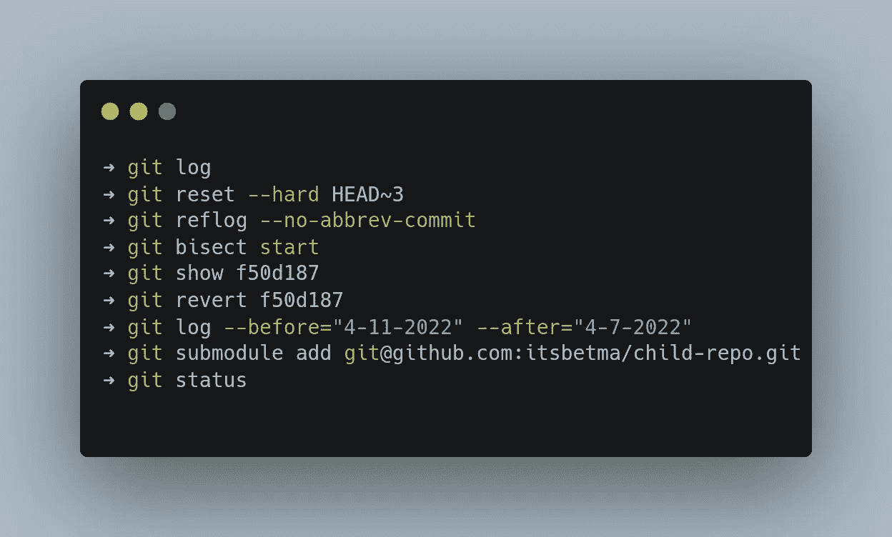
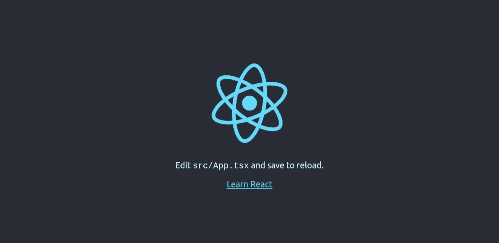

# Git 高级主题第二部分

> 原文：<https://blog.devgenius.io/git-advanced-topics-part-two-1833a5f690bf?source=collection_archive---------8----------------------->



如果你没有读过这个系列的第一部分，请点击这里查看第一部分。

继续高级主题，我们将讨论 reflog、二分法、search、find，最后是 git 子模块。

# 参考日志

换句话说，git ref log 是一个可视化 git 历史的工具。它在 git 历史中是什么？基本上，你在 git 中所做的一切，例如，签出、推送、合并等等。

通过 git reflog，我将教你如何使用它来检索删除的提交或分支，并学习 git ref log 的基础知识。

为了教授 git reflog 如何工作，我创建了一个带有虚拟提交的 git 存储库。像这样:

```
➜ git log
* 5c742b2 (HEAD -> main) Commit E
* d569890 Commit D
* 7a42f58 Commit C
* fb7cf42 Commit B
* f251a31 Commit A
* 5f7cfbc Initial Commit
```

要删除**提交 C、D** 和 **E** ，我们可以使用:

```
➜ git reset --hard HEAD~3
```

或者我们可以使用提交哈希直接重置到目标提交:

```
➜ git reset --hard fb7cf42
```

两种方式结果都一样，就选你比较熟悉的那种吧。

运行 **git reset** 命令后，您的 git 存储库应该如下所示:

```
➜ git log
* fb7cf42 (HEAD, main) Commit B
* f251a31 Commit A
* 5f7cfbc Initial Commit
```

我们所做的是从主分支中删除 3 个提交。现在我们可以使用 **git reflog** 来查找提交，然后使用 **git reset** 来检索它们。

首先我们要找到**“提交 E”**的提交 **HASH** ，因为**“提交 E”**有从**“提交 C”**、**“提交 D”**、**“提交 E”**的变化。

```
➜ git reflog --no-abbrev-commit OR git reflog
fb7cf42 (HEAD -> main) HEAD@{5}: reset: moving to HEAD~3
5c742b2 HEAD@{6}: commit: Commit E
d569890 HEAD@{7}: commit: Commit D
7a42f58 HEAD@{8}: commit: Commit C
fb7cf42 (HEAD -> main) HEAD@{9}: commit: Commit B
f251a31 HEAD@{10}: commit: Commit A
5f7cfbc HEAD@{11}: commit (initial): Initial Commit
```

因此，提交哈希 **5c742b2** 是丢失所有更改的提交，为了检索，我们必须使用 **git reset** 命令，如下所示:

```
➜ git reset --hard 5c742b2
```

运行此命令后，您应该已经恢复了更改。

```
➜ git reflog
5c742b2 (HEAD -> main) HEAD@{5}: checkout: moving from main to 5c742b2
fb7cf42 HEAD@{6}: reset: moving to HEAD~3
5c742b2 (HEAD -> main) HEAD@{7}: commit: Commit E
d569890 HEAD@{8}: commit: Commit D
7a42f58 HEAD@{9}: commit: Commit C
fb7cf42 HEAD@{10}: commit: Commit B
f251a31 HEAD@{11}: commit: Commit A
5f7cfbc HEAD@{12}: commit (initial): Initial Commit
```

您的 **git 日志**应该是这样的:

```
➜ git log
* 5c742b2 (HEAD -> main) Commit E
* d569890 Commit D
* 7a42f58 Commit C
* fb7cf42 Commit B
* f251a31 Commit A
* 5f7cfbc Initial Commit
```

# 把…分为两个部分

Git 二等分是一个很好的工具，可以发现提交之间的错误，二等分所做的是从一个坏的和好的提交开始，这些提交由用户定义，然后二等分工具会抛出一系列介于坏的和好的提交之间的提交，对于每一轮或每一次更改的提交，您可以定义当前提交是好的还是坏的。

这个 ReactJS 应用程序有一个 BUG，logo 比正常的要大。我想找到引入错误的提交。


正常情况下的徽标应该是这样的。



我们能解决这个问题吗…

如您所见，我们有 6 次提交，但我们不知道哪一次提交引入了 bug。

```
➜ git log
* 3f9168f (HEAD -> master) Commit 6
* f50d187 Commit 5
* 4223b3b Commit 4
* 736ca80 Commit 3
* 07eac97 Commit 2
* 7cc97ba Commit 1
```

我知道提交 1 没有这个错误，所以让我们使用二分法从提交 2 转到提交 6，并找到导致不需要的行为的提交。

```
➜ git bisect start
```

开始等分后，我们必须定义**坏**和**好**提交。现在我在提交 6，这是一个错误的提交，所以:

```
➜ git bisect bad
```

并定义好的提交，即**提交 1** :

```
➜ git bisect good 7cc97ba
Bisecting: 2 revisions left to test after this (roughly 1 step)
[736ca805144488ff1d2be31ded932d4ca17fffa8] Commit 3
```

我们所做的是将提交 **7cc97ba(提交 1)** 定义为一个好的提交。现在我们处于提交 3，徽标仍然是好的，因此我们必须将此提交定义为好的。


```
➜ git bisect good
Bisecting: 0 revisions left to test after this (roughly 1 step)
[f50d187a6263b8c7c360e787c210ee2e5e9f5a31] Commit 5
```

当我去浏览器查看是否有变化时，我注意到徽标变大了。


考虑到这一点，我将当前的**提交(提交 5)** 定义为**错误的**提交:

```
➜ git bisect bad
Bisecting: 0 revisions left to test after this (roughly 0 steps)
[4223b3bddc89c31f4ec27d2d353a0e9dd3018aa9] Commit 4
```

现在我们处于**提交 4** 阶段，这是一个**良好的**提交，因为徽标是正常的。

```
➜ git bisect good
f50d187a6263b8c7c360e787c210ee2e5e9f5a31 is the first bad commit
commit f50d187a6263b8c7c360e787c210ee2e5e9f5a31
Author: Marco Antonio Bet <example@example.com>
Date:   Fri Apr 8 19:07:44 2022 -0300 **Commit 5** src/App.tsx | 2 +-
 1 file changed, 1 insertion(+), 1 deletion(-)
```

**提交 5** 是有 BUG 的一个，所以要完成平分工具，我们需要运行:

```
➜ git bisect reset
Previous HEAD position was 4223b3b Commit 4
Switched to branch 'master'
```

现在我们在 master，我们需要看看在 Commit 5 中做了哪些破坏 UI 的更改。你可以使用像 Git 北海巨妖和 Git Tower 这样的工具，或者使用命令行。我将向您展示如何使用命令行来查看由 commit 5 插入的更改。

```
➜ git show f50d187
commit f50d187a6263b8c7c360e787c210ee2e5e9f5a31
Author: Marco Antonio Bet <example@example.com>
Date:   Fri Apr 8 19:07:44 2022 -0300

    Commit 5

diff --git a/src/App.tsx b/src/App.tsx
index a53698a..7c6bcf4 100644
--- a/src/App.tsx
+++ b/src/App.tsx
@@ -6,7 +6,7 @@ function App() {
   return (
     <div className="App">
       <header className="App-header">
**-        
+        **
         <p>
           Edit <code>src/App.tsx</code> and save to reload.
         </p>
```

既然你已经知道了一个 bug 的提交，你可以用 **git revert** 来恢复这个提交，用 **git rebase -i** 来编辑，或者只是在所有提交之上添加一个修复提交。

如果你想了解更多关于 git rebase 的知识，你可以看看我写的关于它的文章。

[](/git-advanced-topics-part-one-5443ff7c9f1b) [## Git 高级主题第一部分

### 我开始使用 git 已经一年了，在这篇文章中，我想教一些我的高级 git 技术。

blog.devgenius.io](/git-advanced-topics-part-one-5443ff7c9f1b) 

但是，如果您想要恢复提交，只需运行以下命令:

```
➜ git revert f50d187
Revert "Commit 5"

This reverts commit f50d187a6263b8c7c360e787c210ee2e5e9f5a31.

# Please enter the commit message for your changes. Lines starting
# with '#' will be ignored, and an empty message aborts the commit.
#
# On branch master
# Changes to be committed:
#       modified:   src/App.tsx
#
```

在 vim 中，可以先用`**ESC**`再用`**:wq**`保存。最后，日志被固定。


你可能注意到，当使用 **git 平分**时，我们从提交 3 开始，然后到提交 5，然后回到提交 4。这是因为 **git 二等分**使用**二分搜索法**来定位正在被搜索的提交。

# 搜索和查找

搜索和查找不是一个合适的 git 工具，而是 git 日志工具中的一项功能。

对于这个例子，我克隆了 ReactJS 库，让我们从`--before`和`--after`开始。“之前”和“之后”是日期过滤器，您可以使用它们来查找或过滤 **git 日志**中的内容。

```
➜ git log # main branch ReactJS repository
commit fea6f8da6ab669469f2fa3f18bd3a831f00ab284 (HEAD -> main, origin/main, origin/HEAD)
Author: Luna Ruan <lunaris.ruan@gmail.com>
Date:   Mon Apr 11 16:56:20 2022 -0500 [Transition Tracing] Add transition to OffscreenState and pendingSuspenseBoundaries to RootState (#24340)

    In this PR we:

    Add transitions boilerplate to the OffscreenState. The transitions field will be null on initiation. During the commit phase, if there are any new transitions, we will add any new transitions (either as a result of a transition occurring or a parent suspense boundary completing) to the transitions field. Once the suspense boundary resolves, we no longer need to store the transitions on the boundary, so we can put this field on the Offscreen memoized state
    Add pendingSuspenseBoundaries boilerplate to the RootState. This field starts as null. During the commit phase, if a suspense boundary has either gone from fallback to resolved or from resolved to fallback, we will create a new Map if there isn't one, and if there is, we will add (if the boundary is a fallback) or remove the suspense boundary (if the boundary has resolved) from the map.
    Add an optional name field to the Suspense boundarycommit 8e2f9b086e7abc7a92951d264a6a5d048defd914
Author: Luna Ruan <lunaris.ruan@gmail.com>
Date:   Mon Apr 11 16:54:57 2022 -0500 move passive flag (#24339)
```

假设我们希望从 4 月 7 日到 4 月 11 日提交:

```
➜ git log --before="4-11-2022" --after="4-7-2022"
```

您还可以添加作者标志，如:

```
➜ git log --before="4-11-2022" --after="4-7-2022" --author="dan"
```

另外，另一个用途是从特定文件中搜索日志，为此:

```
➜ git log -- README.md
```

可以添加更多过滤器，如:

```
➜ git log --before="4-1-2022" -- README.md
```

文件名前的破折号用于 **git 日志**搜索具有该名称的文件，而不是具有该名称的分支。

最后，您可以使用`--grep`在提交消息中搜索术语:

```
➜ git log --grep="refactor"
commit ea7b2ec2898c615f648aec30fcbcf73aed156583
Author: Andrew Clark <git@andrewclark.io>
Date:   Wed Apr 6 23:01:07 2022 -0400

    Remove wrong return pointer warning

    I'm about to refactor part of the commit phase to use recursion instead
    of iteration. As part of that change, we will no longer assign the
    `return` pointer when traversing into a subtree. So I'm disabling
    the internal warning that fires if the return pointer is not consistent
    with the parent during the commit phase.

    I had originally added this warning to help prevent mistakes when
    traversing the tree iteratively, but since we're intentionally switching
    to recursion instead, we don't need it.

commit 2e0d86d22192ff0b13b71b4ad68fea46bf523ef6
Author: Andrew Clark <git@andrewclark.io>
Date:   Sun Mar 20 16:18:51 2022 -0400

    Allow updating dehydrated root at lower priority without forcing client render (#24082)

    * Pass children to hydration root constructor
```

Grep 也接受正则表达式，所以没有借口找到你想要提交。

# 子模块

有时你正在做的项目需要来自另一个地方或库的代码，在库的情况下你可以使用像 cargo 和 npm 这样的包管理器，但是如果你想改变代码，这将是很困难的，你会弄得一团糟。Git sobmodules 允许您在另一个 Git 项目中拥有一个 git 项目，这个子库拥有父库拥有的 git 的所有功能，但是上游是不同的，所以在子库中所做的更改将会传递到子库，并且子库可以随着子库来源的更改而更新，但是父库不会。

出于教学目的，我创建了两个存储库，一个称为 parent-repo，另一个称为 child-repo。父回购将需要来自子回购的代码，我们将使用 git 子模块将子回购项目导入到我们的父回购存储库中

**母回购**

```
➜ la
total 8,0K
drwxrwxr-x 8 mvisia mvisia 4,0K abr 12 21:57 .git
-rw-rw-r-- 1 mvisia mvisia   32 abr 12 21:57 index.js
➜ cat index.js
console.log("Parent project")
```

**儿童回购**

```
➜ la
total 12K
-rw-rw-r-- 1 mvisia mvisia   44 abr 12 21:54 app.js
drwxrwxr-x 8 mvisia mvisia 4,0K abr 12 21:55 .git
-rw-rw-r-- 1 mvisia mvisia   87 abr 12 21:53 index.js
➜ cat app.js
const pack = require("./index.js")pack()
➜ cat index.js
const package = () => {
        console.log("I am full git repo")
}module.exports = package
```

假设我想从子回购导入 index.js 中的包函数，我可以做的是使用 git 子模块从子回购引入代码，并将 git 功能引入父回购子模块。

```
➜ git submodule add git@github.com:itsbetma/child-repo.git
Cloning into...
➜ la
total 16K
drwxrwxr-x 2 mvisia mvisia 4,0K abr 19 20:16 child-repo
drwxrwxr-x 9 mvisia mvisia 4,0K abr 19 20:16 .git
-rw-rw-r-- 1 mvisia mvisia   90 abr 19 20:16 .gitmodules
-rw-rw-r-- 1 mvisia mvisia   32 abr 12 21:57 index.js
```

现在我们在父回购中有了子回购的内容。

```
➜ git status 
On branch main
Changes to be committed:
  (use "git restore --staged <file>..." to unstage)
	new file:   .gitmodules
	new file:   child-repo
```

请注意，子回购未登台，让我们提交并推送。

现在，您可以在父回购中使用子回购函数。

我在 child-repo 中做了一些更改，现在我想将它们带到 parent-repo 中，我该如何做？

首先:

```
➜ cd child-repo # inside parent-repo
➜ git status
On branch main
Your branch is up to date with 'origin/main'.nothing to commit, working tree clean
➜ git fetch
remote: Counting objects: 100% (5/5), done.
remote: Compressing objects: 100% (3/3), done.
remote: Total 3 (delta 0), reused 3 (delta 0), pack-reused 0
Unpacking objects: 100% (3/3), 355 bytes | 355.00 KiB/s, done.
From github.com:itsbetma/child-repo
   bdaa0b1..5fd4dcf  main       -> origin/main
➜ git status
On branch main
Your branch is behind 'origin/main' by 1 commit, and can be fast-forwarded.
  (use "git pull" to update your local branch)nothing to commit, working tree clean
```

请注意，在 git 获取之后，我们在主分支中有了新的提交，但在本地子回购主分支中没有，为了解决这个问题并带来我们必须从原点获取的更新。

```
➜ git pull
Updating bdaa0b1..5fd4dcf
Fast-forward
 index.js | 1 +
 1 file changed, 1 insertion(+)
➜ git log
* 5fd4dcf (HEAD -> main, origin/main, origin/HEAD) changes for parent repo
* bdaa0b1 First commit child
```

一切都是最新的，工作顺利。

这只是你可以用 git 子模块做的一件简单的事情，git 子模块中有很多你可以使用的功能。

一个是 foreach 命令:

```
➜ git submodule foreach 'git checkout main ; git pull'
```

我们可以在具有多个子模块的项目中使用 foreach 命令，我们需要在每个模块中运行相同的命令。像 git 拉进所有子模块。

如果您到达了这里，那么恭喜您，现在您又有了四种 git 技术来改进您的工作流程。

更多 git 教程。

[](/git-advanced-topics-part-one-5443ff7c9f1b) [## Git 高级主题第一部分

### 我开始使用 git 已经一年了，在这篇文章中，我想教一些我的高级 git 技术。

blog.devgenius.io](/git-advanced-topics-part-one-5443ff7c9f1b) [](/productivity-with-git-aliases-4829a118eb2) [## 使用 Git 别名提高工作效率

### 从我开始实际工作到现在已经一年了，这是我第一次需要使用 git…

blog.devgenius.io](/productivity-with-git-aliases-4829a118eb2) 

如果你觉得这篇文章很有用，请与你的朋友分享，保存起来以备后用，并给出一个👏。

如果你喜欢关于 Git、Linux、生产率技巧、Typescript 和 Python 的内容，请关注我 [Marco Antonio Bet](https://medium.com/u/d708e403f9f9?source=post_page-----4829a118eb2-----------------------------------) 。

…

要了解更多信息:

*   [https://git-scm.com/docs/git-reflog](https://git-scm.com/docs/git-reflog)
*   https://git-scm.com/docs/git-reset
*   【https://git-scm.com/docs/git-log 
*   [https://git-scm.com/docs/git-bisect](https://git-scm.com/docs/git-bisect)
*   [https://git-scm.com/docs/git-submodule](https://git-scm.com/docs/git-submodule)