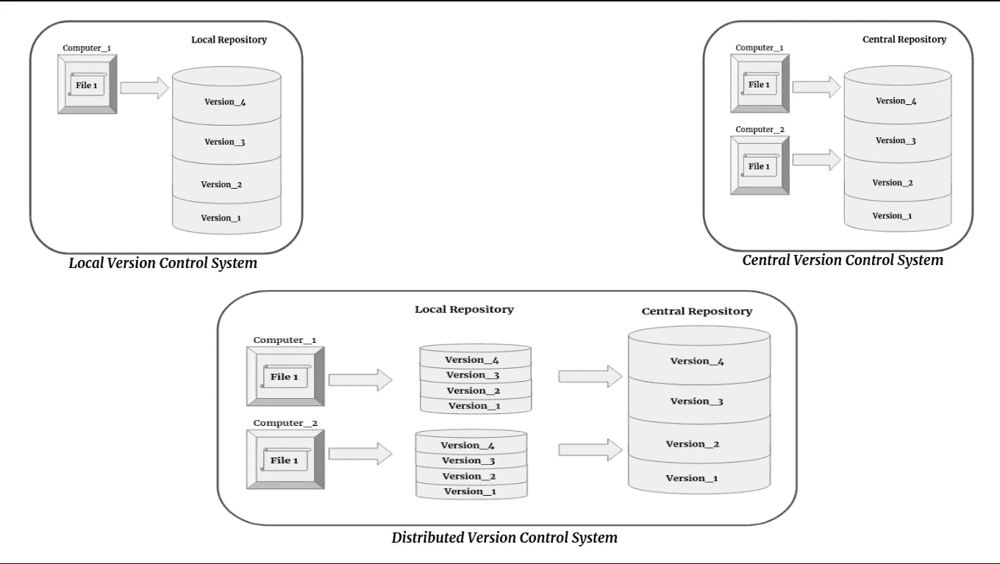

# 面向有抱负的数据科学家的 Git 和 GitHub

> 原文：<https://blog.devgenius.io/git-and-github-for-aspiring-data-scientist-ec68fca94e9b?source=collection_archive---------4----------------------->

**Git** 是一个*分布式版本控制系统*，用于在软件开发过程中跟踪源代码的变化。

*版本控制系统*是记录文件(代码)变更的软件。

有 3 种类型的版本控制系统:

1.  本地版本控制系统(Local Version Control System)——开发人员在他们计算机上的数据库中跟踪他们的代码。
2.  **集中式版本控制系统**——开发人员在云中的数据库中跟踪他们的代码。

*   CVCS 只有一个存储库。
*   在 CVCS，用户必须从服务器获得一个副本，进行修改并提交给主存储库。
*   在 CVCS 做早午餐很难。
*   没有离线访问。
*   CVCS 比较慢。

**3 分布式版本控制系统**——开发人员在他们的计算机和云上的数据库中跟踪他们的代码。

*   DVCS 可以有许多仓库。
*   在 DVCS，每个用户都有自己的本地存储库和服务器上的存储库。
*   在 DVCS 做早午餐更容易。
*   可以在本地存储库中脱机访问。
*   DVCS 更快。

DVCS 是为协调程序员之间的工作而设计的，但它也可以用来跟踪任何一组文件中的变化。其目标包括速度、数据完整性和对分布式非线性工作流的支持。

> Git 是由 Linus Torvalds 创建的。

**GitHub，Inc.** 是一家美国跨国公司，使用 Git 为软件开发和版本控制提供托管服务。它提供了 Git 的分布式版本控制和源代码管理(SCM)功能，以及它自己的特性。它为每个项目提供了访问控制和几个协作特性，比如 bug 跟踪、特性请求、任务管理和 wikis。
Github 的一些替代品有 Bitbucket、Source Forge、Gogs、AWS CodeCommit 等等。

> Git 是免费的开源软件。

## **使用 Git 的步骤**

第一步。安装 git。

第二步。创建一个目录，这是一个文件夹，我们将保持所有的代码，这个目录将被转换成本地回购，其中将包含三个部分。

*   *工作目录*或工作区是我们编写代码的地方。
*   *暂存区*是完成后我们保存代码的地方。
*   一个*本地存储库*是我们保存代码快照的地方。假设将来我们想看到代码，我们可以用自动创建的提交 id 来检索它。

第三步。git init- *。git* 文件夹将被创建。

让我们通过一个例子来理解这一点。假设我们有两个开发者，约翰·塞纳和岩石，他们都在同一个项目上工作。约翰上早班，罗克上晚班。因此，早上 John 来了，处理项目，然后将其推送到中央报告，当 Rock 晚上来时，他将提取代码(这将创建一个工作目录、本地报告和暂存区)，然后他可以从 John 离开的地方开始工作。一旦 Rock 完成了他的工作，他将把代码推送到中央报告，这样，当 John 早上来时，他可以从 Rock 离开的地方继续工作。在每次提交时，都会创建一个提交 ID，在这个 ID 的帮助下，他们可以跟踪在什么时候由谁做了什么更改。

> GIT 只保存快照(即，只保存新文件中的更改，而不是整个文件)。

我们必须在我们的系统中安装 Git，并在 Github 中创建一个帐户。

## GIT 命令

*   ***git init*** 【创建本地存储库】
*   ***git 状态*** 【给出工作目录和暂存区的状态】
*   ***git 添加。*** 【将所有文件添加到暂存区】
*   ***【git commit-m " message】***【保存本地回购中的变更快照】
*   ***git 日志*** 【给出所有提交的历史】
*   ***git show<commit _ id>***【显示给定提交 id 中所做的更改】
*   ***git 远程添加原点<URL _ of _ github _ repo>***【添加本地回购到中央回购的连接】
*   ***git push-u origin master***【将所有文件连同提交 id 发送至中央回购主分支】
*   ***git pull-u origin master***【合并中央回购的所有文件】
*   ***git log -1*** 【仅显示最后一次提交】
*   ***git log-n<limit>***【限制提交的显示】

*   *****git log-p****【显示每次提交的补丁以及它们的全部区别】***
*   ******git log—author = " name "***【查找指定作者的提交】***
*   ******git log—grep = " message "***【使用提交消息搜索提交】***

***当我们想要添加一个新的特性或者在我们的项目中测试一些特性而不影响我们的主要代码时，我们创建我们的存储库的一个分支。每个任务可以有一个单独的分支，我们可以创建任意数量的分支。如果我们完成了分支中的代码，那么我们可以将它合并到主分支中。默认分支是主分支。***

*   ******git 分支*** 【显示我们所在的分支以及回购中的分支列表】***
*   ******git 分支 newbranch*** 【创建新的分支名 newbranch】***
*   ******git check out newbranch***【切换到分支名称 new branch】***
*   ******git branch-d newbranch***【删除分支名称 new branch】***
*   ******git 合并 newbranch*** 【将当前分支合并到 newbranch】***

***合并分支后，数据不会从分支中删除，而是复制粘贴到给定/主分支中。***

***为了临时存储我们的文件，我们使用 stash store。我们将这些文件存储在 stash 中，因为这些文件还没有准备好提交，我们希望清理我们的工作区域。***

*   ******git stash*** 【将文件放入 stash】***
*   ******git 存储列表*** 【给出存储内存中的文件列表】***
*   ******git stash pop*** 【将文件从 stash 拉至工作 repo】***
*   ******git stash apply stach { 0 }***【将文件从 stash 拉到工作 repo】***
*   ******git stash drop*** 【清空我们的 stash memory】***
*   ******git stash clear***【清除我们的 stash 内存】***
*   ******git 重置< commit_id >*** 【在暂存区重置】***
*   ******git revert<commit _ id>***【回滚到之前的提交】***

***我们在提交之前使用 git reset，如果我们提交了更改，那么我们使用 revert。Revert 命令将使用以前的状态创建新的提交 id。***

*   ******git tag-a " tagname "-m ' message ' HEAD***[将标记赋予当前头]***
*   ******git tag-a " tagname "-m ' message '<commit _ id>***【将标记赋予给定的提交 id】***
*   ******git tag -l*** 【显示标签列表】***
*   ******git 显示“标记名”*** 【显示特定标记】***
*   ******git 标签-d*** ***【标记名】*** 【删除给定标签】***
*   ******git 克隆*** ***< git 项目 URL >*** 【使用 URL 将 repo 克隆到本地目录】***
*   ******git 克隆< SSH >*** 【使用 SSH 将回购克隆到本地目录】***
*   ******git clean -n*** 【显示所有将要删除的未跟踪文件，但不删除】***
*   ******git clean -f*** 【删除所有未跟踪的文件，文件夹和包含的文件除外。gitignore ]***
*   ******git clean -xm*** 【显示所有未跟踪的文件，包括。git 忽略将要删除的内容，但不要删除它们]***
*   ******git clean -xf*** 【删除所有未被跟踪的文件以及包含在。gitignore ]***
*   *****。gitignore** 是一个隐藏文件，它包含所有我们不想提交的文件名。***

***我希望你对如何 git 有一些基本的概念。如果这篇文章对你有所帮助，请考虑给👏🏼并分享出来激励我。***

*** [## 机器学习中的混淆矩阵

### 在这篇博客中，我将试着解释混淆矩阵的所有基本术语以及如何计算它们，用…

medium.com](https://medium.com/swlh/confusion-matrix-in-machine-learning-920eda3d2cb6)  [## MongoDB 中的设置和 CRUD 操作

### 在这篇文章中，我们将看到如何在 MongoDB 云服务中建立一个帐户，并使用 Pymongo 进行 CRUD 操作。

medium.com](https://medium.com/analytics-vidhya/setup-and-crud-operations-in-mongodb-dd821c4621a) 

参考—> git-scm.com—>维基百科***