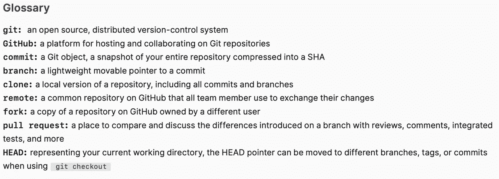
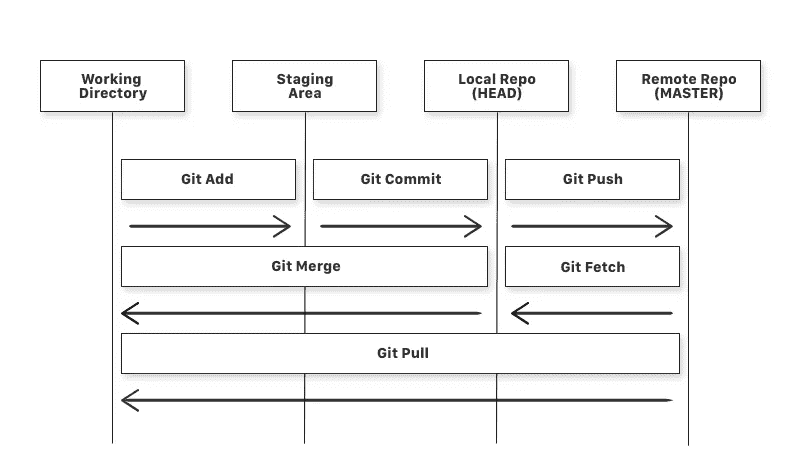

# 给初学者的 Git

> 原文：<https://blog.devgenius.io/git-bash-commands-d636bbc4282f?source=collection_archive---------5----------------------->

## 编程；编排

## 最方便的 git 命令。


罗曼·辛克维奇在 [Unsplash](https://unsplash.com/?utm_source=medium&utm_medium=referral) 上拍摄的照片

G 它是一个分布式图论树模型。

迷茫？是的，如果你是这方面的新手，这可能会有点混乱，甚至当我第一次学习 git 时，我也很难理解这一点。

但是相信我，我会值得你的困惑和愤怒。

简而言之，git 就像你的个人日志/日记，你可以在里面写下对你来说重要的事情。

git 也是一样，每当你在 git 启动的文件夹中写一段代码时，它会通过给它“版本 1，版本 2”来保存你的工作，你会给它一个迷你标题“将表单按钮从蓝色改为红色”，这样下次你看到从**版本 1 →版本 2** 的变化时，你就可以很快知道这里发生了什么。

git 是一种“时间旅行”，你可以回到过去，看到你在几周前的代码中所做的改变，并很容易地恢复到那个状态。

或者，如果你希望保持相同的基本代码，但使用相同的基本代码，并在同一个文件夹中处理两个不同的项目，也可以通过创建单独的“分支”来实现。

很酷不是吗？

最后一件事，添加到 git 是一个两步的过程。

首先，你写一些代码，然后开始 git(就像在三明治上涂花生酱)，

然后，

**第一步:**你将你的文件夹添加到 git，是的，你必须先添加它，git 不会自动获取你文件夹中的所有内容。
【git add-filename . file extension】

**步骤 2:** 一旦成功添加了文件，您将需要向其中添加一条描述性消息(类似于写日记，但主要是一行程序)，描述您到那时为止所做的事情。

如果这是你第一次提交，写“第一次提交，添加 xyz”，否则写“冰淇淋是热的”:)

对 git 的分支系统感到困惑或好奇？那只能说明你是人类。

> *注:****git****是一款开源的版本控制工具，由在 Linux 操作系统上工作的开发者于 2005 年创建；* ***GitHub****是一家成立于 2008 年的公司，制作与 git 集成的工具。* [*替代品？*](https://faun.pub/less-known-github-alternatives-49f9c9eff4bb)

这将足以让你开始，如果你需要更多的帮助，评论或联系我。



下面是我日常使用的 git 命令。

一些你必须知道的基本终端命令。

```
**mkdir Git_Demo**
-> 'mkdir' means make directory, it creates a new folder and names it 'Git_Demo'**cd Git_Demo**
-> 'cd' means change directory, it will help you to inside your newly created folder 'Git_Demo'**pwd**
-> 'pwd' means print working directory, it will show you the current location where you are.
Ex- /c/users/priyansh/documents/Git_Demo/**touch demo.txt** OR **notepad demo.txt** OR **nano demo.txt** this creates a file named demo.txt and opens it in a text editorwhen within a directory, type**ls**
-> stands for list files, shows all files and folders**ls -a** 
-> shows all the folders as well as hidden itemsreplace 'ls' with 'dir' if you are using Windows. **echo "Earth's Moon" >> locations.txt** > add some content to a text file named location.txt
```

一些 git 先决条件

```
**git --version**
-> to check the version you are using, if git installed successfully, yes you'll have to install git.
```



简单 Git 工作流程图| [学分](https://www.freecodecamp.org/news/learn-the-basics-of-git-in-under-10-minutes-da548267cc91/)

## 使用 GitHub 永久保存您的密码

在`home/<username>`中制作一个文件`.netrc`，添加以下内容，然后保存。

```
machine github.com
login <login_github>
password <password_github>
```

或者最好用 [SSH key 方法](https://www.geeksforgeeks.org/using-github-with-ssh-secure-shell/)，或者[这个](https://docs.github.com/en/authentication/connecting-to-github-with-ssh)，第一次设置起来很难但是很值得。

## 打开一个文件(如 js 或。html 文件，对于 linux 和 macOS 使用“nano ”)

```
**notepad fileName.fileExtension**
```

如果你在 Windows 上，使用这个

```
$ get a mac:)
```

## 克隆

一个**库**又名**回购**只不过是源代码的集合，有点像你所说的“主项目文件夹”。

```
**git clone <url> <folder path where to clone it>****git clone --shallow**
->  if the repository is very big, this command avoids downloading commits made earlier in that project, thus reducing overall size of download.
```

## 设置名称和电子邮件的配置，

```
**git config**
-> to show all things which can be done using this command
-> configure .gitconfig file to make it behave your way, search internet**git config --global user.name "Priyansh Khodiyar"****git config --global user.email "khodiyarpriyansh@gmail.com"****git config --gloabl --list** -> shows our name and email.
-> now, a text file is created automatically that contain these details**cat ~/.gitconfig** -> here it will show the name and email
```

## 基本命令

```
**git init** 
-> cd(change directory) into the project folder you want to connect with git and type this. init stand for initialize**git init git-demo** -> git gets initialised only in git-demo folder if you have many folders at the same place**clear**
-> to clear the clutter from command prompt/terminal.
```

**注意:**当您执行“git init”时，将会创建一个名为“git init”的隐藏文件夹。git "确保不要触摸或篡改它。

## 同时添加和提交

```
**git add <fileName.fileExtension>** -> to add single files to git**git add .** -> to add every file and folder to git**git commit -m "type your git msg"** -> every git commit must have a message to provide a little detail of what was changed, emojis can also be used.**git commit -am "type your commit message here"** -> a stands for ADD and m for MSG
-> add and commit in one single step can be done for MODIFIED files only, not for the newly created files. You need to add new files to use this command.**git status** -> to check which all files that you added or committed are ready to be pushed to github or other project hosting sites.**git add -p <filename>** -> suppose you made 2 changes to a file and you want to add only one of them
-> this will show [ y/n ] to add/ not add the changes made for every single changes**git diff --catched** -> shows which changes are staged for commit**git checkout <filename>** -> to throw out the unwanted changes which should not be added in a file.
```

## 回复原状

在我们修改了一个文件并将其添加到提交阶段之后，如果我们想要恢复，

```
**git reset HEAD~1** -> Remove the most recent commit
-> You can commit again!OR**git reset HEAD <fileName>.** -> now it's again in the modified stage, if we further want to revert those changes that we did in a file, do **git checkout -- <fileName.fileExtension>** -> this is make the file like how it was before modifying it.**git checkout .**
-> back to last commit 
```

## 日志

```
**git log** -> all commits shown here, but this much info may be too much, so type **git help log** -> to get options to log **git log --oneline --graph --decorate --color --oneline** -> gives a compact and beautiful view of logs.
```

## 删除文件

```
**git rm <fileName>** -> to remove a file, but still removal needs to be committed, so do a final commit to remove files.
```

## 另一种方式(操作系统级别) :

```
**rm <fileName.ext>** -> removes file without git's info and it's there in the commit zone, but can't be commited as it can't be added back.**git add -u** -> to stage it for commit and then commit.
```

## 移动文件(在文件夹之间)

```
**git mv <fileName.ext> <folderName>** -> moving from a file in master to a folder in master. Commit these at last
```

## 忽略文件(就像你喜欢的人忽略你一样)

如果你不想用力。日志文件(或任何其他文件或扩展名)，忽略它们，制作一个. gitignore 文件(没有扩展名，. gitignore.txt 不是有效文件)使用，

```
**notepad .gitignore***.log
-> and inside this file type this, this prevents any .log extension files to get added or committed to git.
```

## SSH 密钥认证

```
**cd ~** -> to get back to home/ root directory now type **cd ..** -> to go one step back, works like <- button of explorer.**cd .ssh** -> to see if the .ssh key exist or not, if not then**mkdir .ssh 
cd .ssh/
ssh-keygen -t rsa -C "<yourRegisteredEmail>"** -> makes a .ssh folder-> then it will generate id_rsa and id_rsa.pub, we'll use .pub file with github.
-> SSH keys are tied to the computer. Copy the contents of .pub file and paste it in github settings at SSH settings.After successful authentication, type
**ssh -T git@github.com** -> to get a success msg.
-> return to home directory cd ~
```

## 添加一个遥控器(用 Github 存储库连接你的本地文件夹)

在 GitHub 中创建一个新的资源库，将所有内容设置为默认值。

**注意:**您必须在 git 启动的文件夹中执行下面的代码。

```
**git remote add origin git@github.com <username>/<repoName.git>**OR**git remote add origin <Repository URL>** -> to add the a new URL(remote) of your local repository so that you can push and pull changes. **git remote set-url origin git@github.com:User/UserRepo.git** -> below is used to change the url of an existing remote repository**git remote -v** -> to check which remote URL was added by you **git remote add origin git@github.com:User/UserRepo.git** -> below is used to a add a new remote:**git push -u origin main** ->will push your code to the master branch of the remote repository defined with origin and -u let you point your current local branch to the remote master branch.-> -u is done for the first time use to make a "uplink"
-> now our local folder repo is pushed to Github, check your Github repository, the pushed codes just found a new place to live happily ever after.
```

> **“注意:**在进行推送之前，总是先从 Github 库中提取变更。”

现在，我们可以在本地修改文件，添加和提交，然后如果我们检查状态，就会显示哪个分支在提交之前，因为我们正在与 Github 同步(使用 SSH)

```
**git remote remove origin** 
-> to remove set remotes
```

**注意:**在创建一个新的 repo 时，我们在存储库中添加/创建任何文件(比如 readme.md 文件),这将导致问题，我们将不得不执行一些额外的命令来将您的更改推送到 Github。我们需要首先从我们的存储库中提取，然后推送。

为了确保没有人对我在 Github 上的远程 repo 作出贡献/修改，首先

```
**git pull origin main**OR**git pull** 
-> if there is only 1 branch
-> to make sure its the same as before (best practices) and then push the changes that you did to the files of the project, to Github by **git push origin main**
```

**另一种方式:**代替写作

```
**git push origin main**
```

每次都从本地机器推送到 Github。

做，

```
**git branch --set-upstream-to=origin/main****git branch -vv**
-> to see which all branches i have access tonow **git push** 
-> will push the changes you made, to Github**git fetch <Repo URL>**
-> to make your local repo uptodate. **git fetch upstream**
-> if you already have set the upstream**git merge upstream/master**
-> to get you local repo up to date with their repo.
```

用最简单的话来说，`git fetch`后面跟着一个`git merge` 等于一个`git pull`。

## 将您的项目文件夹与已经创建的空 Github 存储库连接起来

```
**echo "# New_Repository" >> README.md
git init
git add README.md
git commit -m "first commit"
git remote add origin <URL>
git push -u origin master**Note: Here URL means your Github repository link where your project will be uploaded/pushed to
```

## 更新和 GIT 目录路径

```
**which git** 
-> to get the path of git used
```

## 如何仅从哈希代码转到文件的内容，

这是在提交后提供的。(7 位缩写代码)取 7 位哈希代码

```
**git cat-file -p 7G7DF61**
```

然后把生成的长代码复制一遍

```
**git cat-file -p XXXXXXXXXXXXXXXXXXXXXXXXXXXXXXXXXXX**
```

再次创建一个长散列，重复直到你得到提交文件中的代码。

## GIT 中的时间旅行(yeahhhhhhhhhh)

```
**git checkout XXXXXXXX** 
-> it will take you to that state of commit
-> XXXXXXXX is the commit hashcode, kind of an ID of that commit**git checkout master**
-> to go back again to latest position of working, if you went back in time to see initial state of your git project**git checkout <filename.ext>** -> to discard the changes made recently which are not added and revert the state to HEAD position
```

## 显示更改

```
**git diff index.txt**
-> shows the changes occurred in file**git diff <hash code(8 digit)> <filename.ext>** -> to show the additions occurred right from that commit**git diff <hash code(8 digit)> HEAD <filename.ext>** -> to show the additions occurred right from that commit to the position where head is present (not master)
```

## 分支(或引用)

**注:**由于 BLM，Github 改变了它的符号后，Master 等于 Main。(删除主从引用)

```
**git branch** -> to show  the number of branches currently**git branch --v** -> to also show some extra info.**git branch cat** -> makes a new branch 'cat'**git checkout cat** -> switched  to branch cat
-> now HEAD points to cat and main points to wherever it was pointing earlier,
-> now if we commit something then master will be behind our 'cat' branch and HEAD will be the 'cat'.
```

## 更多分支

现在我们有了一个“猫”分支，让我们创建一个狗分支

```
**git branch dog; git checkout dog**    
-> commands to go to dog from main branch  
-> ';' is shortcut that runs 2 commands at a time**git checkout -b dog**
-> now HEAD ->  dog, main  Also HEAD is no longer at 'cat'.                					                                                  cat.
By doing this we have 2 branches from -->  main / 
				                \ 
				                 dog.EXAMPLE :-initially: only index file with "hello word" text
cat branch :- append "added cat functionality" to text file
dog branch :- append "added dog functionality" to text file-> now checkout master
**git checkout master**
```

现在，我们希望一个接一个地或者一次两个地与主分支合并。

```
**git merge cat** -> what this does is it makes HEAD to move to 'cat' along with main to incorporate 'cat' functionality text. 
-> and now HEAD ->  cat, main.**git merge dog**
-> now there may be merge conflicts, so we have to manually resolve this. **git mergetool** 
-> this tool helps to resolve issues but you need to config that first in your git project**git merge --abort**
-> to abort making changes
```

假设发生合并冲突，则打开索引文件，

```
**>>>>>** means here you were**=====** means this is what you are trying to add. now resolve the issue, save the file (delete these >>>>> and ===== symbols before saving the file)**git merge --continue**
-> add the file and give a commit message
```

现在猫狗分支合并了主和头->主

## 责备

```
**git blame <filename>** -> to checkout who made changes to particular lines and the commit associated with it
-> To the right, the contents of the file will be present
-> To the left, the name and date of commits and commit id XXXXXXX**git show XXXXXXXX**
-> to see what all was changed and what was replaced. **git stash**
-> reverts back me to the time when the last commit was made and ignore all the changes that I recently made, committed changes are not deleted. **git stash pop**
-> to view themand then,**git diff <filename>**
-> shows the changes that were made**git bisect**
-> now you're long into the project and now some unit test is no longer passing which used to pass a few weeks back, this command will check going back one - one commit to see where in point of time was this test case passing, it does a binary search into your history-> We can even give it a string of test case to look for when this case was passed in the code in which point of time. Advanced stuff.
```

## 书

1.  进展。

参考文献—

[https://www . freecodecamp . org/news/learn-the-basics-of-git-under-10 minutes-da 548267 cc 91/](https://www.freecodecamp.org/news/learn-the-basics-of-git-in-under-10-minutes-da548267cc91/)

我希望你明白了这篇文章的意思。

我很想听听你对此的想法，所以请随时在 [LinkedIn](https://www.linkedin.com/in/zriyansh/) 或 [Twitter](https://twitter.com/priyanskhodiyar) 上联系我，在下面的评论中回复，那太好了。

—如果这篇文章对你有所帮助，考虑把它分享给你关心的两个朋友。

*直到那时保持活力。*

= =结束