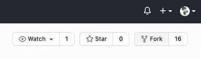
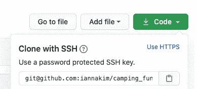

# 让我们开始 Git:Git 基本命令

> 原文：<https://blog.devgenius.io/git-basics-1ddae5ea2a84?source=collection_archive---------10----------------------->

## 还在困惑 Git vs. Github？这里有一个简单的解释，可以帮助你有一个好的开始。


资料来源:Unsplash.com

# 你并不孤单

当我在熨斗学校开始我的训练营前期工作时，我不知道 Github 或 Git 是什么。令一些人震惊的是，我刚刚开始学习如何在我的第一台 MacBook 上导航😱(是的，我❤ Windows)并且仍然熟悉简单的 CLI 命令。


打开新 Mac 后的我。来源:https://gifer.com/en/Qd39

当我们的导师告诉我们，在接下来的 19 周里，我们将每天使用 Git 和 Github，**我知道我必须快速学习这些概念**。但是我有点不好意思承认这一点，对于一个完全没有计算机背景的人来说，即使是像“回购”、“克隆”、“提交”、“日志”、“远程”或“本地”这样简单的术语都显得如此混乱和断章取义。😕(*土菜馆？本地什么？*)我是那种在视觉效果*和那些**解释——你会给一个五岁的孩子**中学习得最好的人，直到这个概念在我脑海中固化。*

*由于已经有无数令人敬畏的博客和解释，我试图为那些为同样的概念而奋斗的新手程序员们提供一些清晰和方便的访问。所以事不宜迟，我们开始吧。😉*

## *Git 是什么？*

*Git 是一种软件，是一种版本控制系统，你可以通过 Github 这样的 git 服务器来记录变化，与其他程序员合作和分享你的工作。git***与 Github***没有任何关系🙅除了他们有相似的名字。*

*(**记住:** Github 是服务器，Git 是我们用来在 Github 上上传分享东西的工具)*

**

## *Git 的优势*

*随着您对 Git 越来越精通，它有很多很酷的地方，但是到目前为止，我已经注意到了 Git 的以下主要优点:*

*   *您可以创建一个到远程 repo(即 Github)的路径，并与其他程序员共享您的工作*
*   *如果你犯了错误，你可以恢复你以前的作品*
*   *它记录了你在一次会话中所做的所有更改，包括一条描述所做更改的消息(你将写 lol)*
*   *您和您的合作者可以在不影响原始版本的情况下，在代码中进行更多的更改和试验！*

## *基本 Git 命令*

*我缩小了帮助初学者了解和熟悉的 Git 术语和命令的列表:*

## ***叉子***

*“fork”的意思是复制别人的存储库。分叉允许您在不实际影响原始项目本身的情况下处理项目。*

**

*点击 Github 回购协议上的“fork ”(您不能派生自己的回购协议)*

## ***克隆***

*一旦你派生出一个回购协议，你就必须把它“克隆”到你的电脑上。克隆将自动在您的本地 repo 和 Github 之间创建一个远程(路由),这样您就可以将更改推送到 Github(众多服务器中的一个)。*

*   *点击标有“代码”的绿色按钮。它将显示您可以复制的 SSH 地址*

**

*点击“代码”,将显示 SSH 地址。复制 SSH 地址。*

*   *去你的终端。CD 放入您想要保存该文件夹的目录。一旦你到了那里，插入这个命令并按回车键。*

```
*git clone ssh_address_you_copied name_for_folder(optional)*
```

*   *瞧啊。您已经成功地将一个回购分支并克隆到您的计算机中。现在你终于可以开始工作了！*

## *保存您的工作*

*你已经写了一段时间的代码，现在你想在一切都结束之前保存你所做的宝贵的修改，对吗？仅仅因为你的文本编辑器有一个“自动保存”选项，并不意味着你的修改会保存到你的电脑以外的服务器上。让我们将以下 3 个 git 命令铭记于心(*我这么说是因为你会一直使用这些命令*)。*

## ***"git add"***

*此强制命令允许您选择要提交更改的内容。默认情况下，我通常只做:*

```
*git add .*
```

*这意味着当我在下一步提交我的更改时，选择我正在工作的文件夹 a 中的所有文件。*

*但是，提交更改后，您可以选择并保存单个项目(在本例中为文本文件):*

```
*git add file.txt*
```

**

*来源:[https://giphy.com/gifs/90s-clueless-fashion-5FyJHOI62Bwu4](https://giphy.com/gifs/90s-clueless-fashion-5FyJHOI62Bwu4)*

## ***“git 提交”***

> *“锁定您的更改”*🔒**

*在添加了要保存的文件后，下一步是像视频游戏中的“保存点”一样记录这些更改。为此，您将使用 commit 命令，但还需要添加一条日志消息，描述您对该“保存”所做的更改。(如果没有 ***-m【描述】*** ，提交将不会通过)*

```
*git commit -m "description of the work you just did"*
```

*换句话说，请经常提交您的工作！！！！！！一个好的经验法则是根据你编码的速度，每 3-4 分钟提交一次。我当然希望你不要像这个人一样:*

**

*来源:[https://www.pinterest.com/pin/362399101249960434/](https://www.pinterest.com/pin/362399101249960434/)*

## ***“git 推送”***

*push 命令将本地存储库内容上传到服务器。基本上，Git push 会将你对 Github repo 所做的所有提交(更改)转移到。如果没有推送，您或您的合作者将不会在服务器端看到任何新内容。*

```
*git push*
```

***在这里，你可能需要处理一些合并冲突，但是我们将在以后讨论这个问题。***

## ***“git 拉”***

*pull 命令用于从您的远程存储库(一个类似 Github 的服务器)获取内容并下载到您的本地 repo。关于 pull 命令需要记住的**最重要的事情是，它会立即**将您的本地回购内容更新**到远程回购的最新提交版本。***

```
*git pull origin master*
```

****这样想:*** 🗯*

*   *您将代码变更提交并推送到远程存储库。*
*   *然后，您的合作者从同一个远程存储库中提取您的代码变更，并且现在拥有该存储库的最新工作副本*
*   *您的合作者进行了一些更改，并推回到远程回购*
*   *您现在提取那些变更，并且工作副本的最新版本被保存在您的计算机上(注意:*除非您明确地提交和推送了在这之间所做的任何变更，否则当您提取您的合作者的最后提交时，您将丢失任何未保存的变更。很棘手，我知道。你最终会学会一直承诺！**

# *⚡️ **总结【TL；博士！】***

*   ***fork:** 把别人的回购复制到你的远程回购。*
*   ***克隆:**将该回购的副本下载到您的本地回购(您的计算机)*
*   ***添加:**选择您想要保存更改的文件*
*   ***提交:**确认您正在进行更改并创建日志*
*   ***推送:**将您的回购内容传输回远程回购*
*   ***拉取:**用远程回购上的最新变化更新或覆盖本地回购。*

# *资源:*

*   *[https://www.atlassian.com/git/tutorials/syncing](https://www.atlassian.com/git/tutorials/syncing)*
*   *[https://learn.co/lessons/github-basics](https://learn.co/lessons/github-basics)*