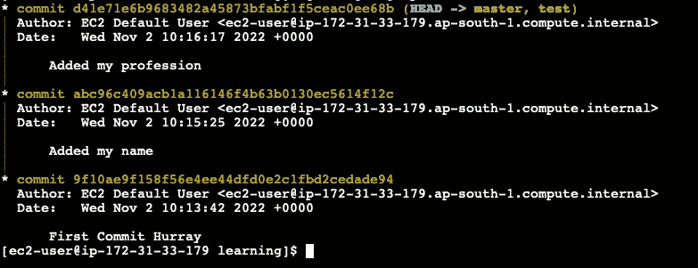

# Git 基础-分支

> 原文：<https://blog.devgenius.io/git-basics-branching-dc95caf27ca9?source=collection_archive---------8----------------------->


本系列的前一篇文章可以通过访问

[](https://medium.com/@mriganksingh1/learning-git-basics-6df1a4134f93) [## 学习 Git 基础知识

### Git 是什么？

medium.com](https://medium.com/@mriganksingh1/learning-git-basics-6df1a4134f93) 

# Git 中的分支

因此，在所有个人项目和组织项目中，大多数情况下，我们不会在主要分支上工作。相反，我们将从主分支创建一个副工作分支。该工作分支将具有该分支被剪切的节点的代码以及所有父节点的代码。git 中的分支是非常轻量级的，所以在两者之间切换非常容易。

让我们先看看我们现有的提交图，然后我们将创建一个名为 test 的新分支。


我们当前的项目结构

创建分支的命令是:

```
git branch <branch_name>
```

在我们的例子中，branch_name 将是 test。



创建新分支后

正如您在顶部的图像中看到的，有两个分支——主设备、测试设备和当前处于主设备状态的磁头。

让我们进入测试分支，在那里创建一个提交。这些步骤的命令将是:

```
git checkout test
```

然后是您想要做的所有更改，后面是提交更改的命令。

之后的项目结构看起来会像这样:


万岁！！新分支的第一次提交

# Git 合并

所以现在我们有两个工作分支(主，测试)。想象一个场景(我们将在示例中尝试)，有 2 个工作分支，在测试分支中完成开发后，我们希望将其合并到主分支，因为它将是每个人都会引用的分支。所以你将如何结合工作，并再次来到硕士分支。git 合并的魔力来了。

让我们用一些技术术语来说，虽然每个阅读它的人都能够理解它，我很确定:)

到目前为止，我们有一个测试分支，它比主分支超前一个提交。所以我们将切换回主分支。然后我们将使用 git merge 将测试分支的工作合并到主分支。


合并的更改

所以让我们在这里完成这篇文章。

希望你喜欢这篇文章。请鼓掌并订阅更多关于软件工程的信息性文章。